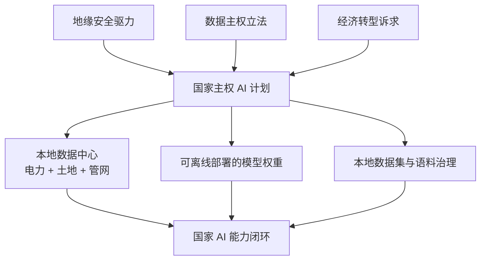
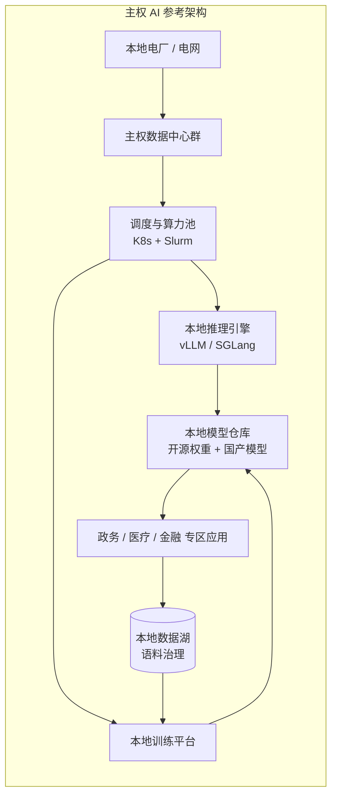

# 主权 AI 2026 (Sovereign AI)

> 中文简称：主权 AI

> **一句话理解**：主权 AI 就是国家自建"AI 发电厂"——过去各国争石油，现在争的是算力，谁也不想把国家的"大脑"托管在别人家的服务器上。

---

## 1. 什么是主权 AI

**主权 AI**（Sovereign AI）指国家或地区**自主掌控 AI 三要素——算力、模型、数据**的基础设施战略：本地数据中心、可离线部署的模型权重、数据不出境，由政府或主权基金主导投资。黄仁勋在 GTC 2026 反复推动这一叙事："每个国家都想拥有自己的 AI"（every country wants to own its AI），并将其定义为继云之后的"第二波基础设施浪潮"。

> **关联**: 算力侧的工厂化逻辑见 [[12_架构基建/02_架构概览/11_Token_工厂_2026|Token 工厂 2026]]；主权 AI 采购如何成为 AI 基建泡沫辩论的需求侧证据，见 [[18_行业应用/01_行业概览/10_AI_泡沫与基建辩论_2026|AI 泡沫与基建辩论 2026]]。

### 三重驱动

| **驱动力** | **逻辑** | **典型表现** |
|--------|------|---------|
| **地缘安全** | 先进 AI 是战略能力，出口管制让"买不到"成为现实约束 | 芯片管制、算力出口许可 |
| **数据主权** | 医疗、政务、金融数据依法必须境内处理 | 数据驻留法、GDPR 类立法扩散 |
| **经济乘数** | AI 被视为下一代"电力"，国家要拿到产业分配权 | 主权基金直接下场投资算力 |

图示三要素必须同时落地：只有数据中心没有可私有化部署的模型，或只有模型没有算力，都构成不了主权能力闭环。

---

## 2. 2026 全球项目地图（硬数据）

| **国家/地区** | **项目** | **规模** | **关键数字** |
|-----------|------|------|---------|
| **沙特** | HUMAIN（PIF 主权基金） | ~$100B | 2.2GW 电力、11 座数据中心 |
| **阿联酋** | Stargate UAE | 1GW 总规划 | 200MW 一期 2026 年投运 |
| **欧盟** | AI Gigafactories | ~€20B | 13 座超级工厂规划 |
| **印度** | IndiaAI Mission | 国家级超算 | 8 exaflops 目标算力 |
| **日本/韩国** | 主权云 + 本地 LLM | 十亿美元级 | 与英伟达/云厂联合建设 |
| **中国** | 国产算力 + 模型体系 | 全球最大内需 | 算力自给 + 开源模型出口（见下节） |

> **提示**：数字为 2026-05 前后披露口径，取自 Presenc AI 主权 AI 基础设施追踪与 GTC 2026 报道；各国项目普遍以"公告规模 > 落地规模"为特征，跟踪时看**通电容量（GW）而非签约额**。

### 需求量级

主权 AI 的采购主体是**国家资产负债表**而非企业 IT 预算——这是基建论认为"需求真实"的核心论据：企业 CapEx 会因经济周期收缩，但国家战略投资的决策函数完全不同。

---

## 3. 与公有云不同的技术架构特征

主权 AI 项目在工程上不是"又一个云厂商"，而是一类**新的部署形态**：

| **维度** | **公有云 AI** | **主权 AI 基础设施** |
|------|-----------|-----------------|
| 网络拓扑 | 全球骨干互联 | 常要求**物理或逻辑隔离**（air-gapped 专区） |
| 模型来源 | 托管 API 为主 | **本地权重部署** + 微调/蒸馏本地化 |
| 数据合规 | 数据跨境协商 | 数据强制驻留，训练语料本地治理 |
| 弹性模型 | 按需弹性伸缩 | 容量按**峰值战略需求**规划，利用率让位于可控性 |
| 软件栈 | 厂商托管（托管训练/推理平台） | 自建栈：调度、推理引擎、可观测性全套自持 |
| 能源绑定 | 电费是成本项 | 电厂与数据中心**共址**（沙特 2.2GW 即为此逻辑） |

工程实践上，离线专区部署有一套成熟打法（断网环境下的镜像分发、模型与依赖打包、时间同步等），见 [[12_架构基建/02_架构概览/04_Airgapped_离线_部署_2026|Airgapped 离线部署 2026]]；底层容量与选址逻辑见 [[12_架构基建/02_架构概览/02_AI_基础设施_2026|AI 基础设施 2026]]。

参考架构的核心是"模型仓库—数据湖"的本地闭环：训练与推理都不出边境，外部仅输入开源权重与工具链。

---

## 4. 中国坐标：从内需到出口

中国的主权 AI 路径与海湾国家不同：**不是"买算力"，而是"全栈自给 + 输出标准"**。

- **算力侧**：国产 GPU/ASIC 体系 + 全国一体化算力网络（东数西算），详见 [[12_架构基建/06_云厂商/Alibaba_Cloud/专有云/01_阿里云_AI技术栈_深入分析|阿里云 AI 技术栈深入分析]]。
- **模型侧**：开源权重成为出口载体——2026 年 5 月中国开源模型已占 OpenRouter 份额 **61%**，DeepSeek 对闭源旗舰形成 **12×** 价差（详见 [[05_大模型/14_中国LLM生态/26_中国模型出海_2026|中国模型出海 2026]]）。
- **组合拳**："开源模型 + 本地部署服务 + 主权数据中心咨询"正在成为中国科技企业承接他国主权 AI 项目的标准打包方式，与美系"芯片 + 云"方案直接竞争。

---

## 5. 风险与争议

1. **利用率风险**：按战略峰值规划的容量，日常利用率可能远低于商业数据中心——主权 AI 是"为可控性付费"，但付费能力依赖油价/财政周期。
2. **技术锁定**：今天签的芯片与软件栈，5 年后可能已被禁运或淘汰；合同中的技术升级条款比价格更关键。
3. **人才瓶颈**：海湾项目普遍缺本地运维团队，"重建设轻运营"是中东研究里被反复点名的风险。
4. **泡沫接口**：主权 AI 需求真实但**一次性**（建设期集中采购），基建完成后需求能否接续取决于本地应用生态——这是它区别于企业持续订阅的结构性弱点，也是 [[18_行业应用/01_行业概览/10_AI_泡沫与基建辩论_2026|泡沫辩论]] 中"国家采购算不算真实需求"的分歧点。

---

## 6. 对工程团队的启示

1. **新市场新岗位**：主权 AI 项目需要"可迁移部署"工程能力——离线部署、多租户隔离、数据驻留合规设计，这套技能全球紧缺。
2. **架构预留主权开关**：给企业产品设计"数据不出境 + 模型可替换"能力，今天就该是默认架构约束，而不是政府客户来了再补。
3. **看 GW 不看签约额**：评估主权 AI 项目的真实进度，盯通电容量、上线机房数与招聘节奏，而非新闻稿金额。
4. **开源权重是硬通货**：可私有化部署的开源模型（Qwen、DeepSeek、Llama 系）是主权 AI 的模型层默认选项，闭源 API 在这一市场结构性缺位。

---

## 7. 语料来源（2026-03 ~ 2026-05 Talks & 研报）

| **#** | **来源** | **核心贡献** | **时间** |
|---|------|---------|------|
| 1 | Presenc AI：Sovereign AI Infrastructure Tracker 2026 | 各国项目规模硬数据汇总 | 2026-05 |
| 2 | Global Data Center Hub：GTC 2026 十九条要点 | 英伟达主权 AI 叙事与商务进展 | 2026-03 |
| 3 | Middle East Institute：AI, the Gulf, and the US Primer | 海湾国家与美国 AI 合作的结构分析 | 2026 |
| 4 | Vision2030.ai：HUMAIN 分析 | 沙特 $100B 项目的组织与电力规划 | 2026 |
| 5 | AI Data Insider：中东主权 AI 手册 | 建设模式与运营风险 | 2026 |

> ⚠️ **时效提示**：主权 AI 项目公告与落地之间存在巨大落差，本页数字为 2026-05 快照，跟踪请以通电容量为准。

---

## Related

- [[12_架构基建/02_架构概览/11_Token_工厂_2026|Token 工厂 2026]] — AI 工厂商业模型与 Tokens-per-watt
- [[12_架构基建/02_架构概览/02_AI_基础设施_2026|AI 基础设施 2026]] — 数据中心/电力/网络的工程底座
- [[12_架构基建/02_架构概览/04_Airgapped_离线_部署_2026|Airgapped 离线部署 2026]] — 主权专区的工程打法
- [[05_大模型/14_中国LLM生态/26_中国模型出海_2026|中国模型出海 2026]] — 开源权重如何成为主权 AI 的模型层
- [[18_行业应用/01_行业概览/10_AI_泡沫与基建辩论_2026|AI 泡沫与基建辩论 2026]] — 国家采购是真实需求还是泡沫接口
- [[18_行业应用/01_行业概览/09_Token_Economics_2026|Token 经济学与 AI 经济学 2026]] — 算力作为国家资产的经济学
- [[19_业界观点/12_Jensen_Huang_黄仁勋/02_GTC_2026_Keynote_深入分析|GTC 2026 Keynote 深入分析]] — 主权 AI 叙事的源头演讲

---

*Last updated: 2026-09-07*
