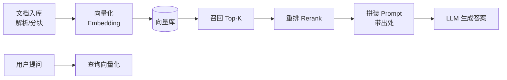

# RAG in a Nutshell

> 中文简称：RAG 速览

> **一句话理解**: RAG 就是开卷考试——先让模型去资料库里查出相关段落，再让它照着资料回答，而不是凭记忆硬编。

---

## RAG 是什么、为什么需要

大模型有两个先天缺陷：**知识截止**（训练之后的事不知道）和**幻觉**（不知道时一本正经地编）。RAG（Retrieval-Augmented Generation，检索增强生成）的解法是：回答前先从外部知识库**检索**最相关的片段，把它塞进上下文，让模型**基于资料作答**并标注出处。

| 方案 | 知识更新 | 可溯源 | 成本 |
|------|---------|--------|------|
| 直接问大模型 | 依赖训练截止 | ❌ | 低 |
| 微调注入知识 | 需重新训练 | ❌ | 高 |
| **RAG** | **改资料库即生效** | **✅** | 中 |

---

## 标准流水线

五个环节，每个都有独立的技术选型：

1. **分块（Chunking）**：按 300～800 token 切，保留标题层级与语义完整；切太碎丢上下文，切太大稀释相关性。
2. **向量化（Embedding）**：把文本块映射为向量；选型看语言与领域匹配度，入库与查询必须用同一模型。
3. **检索（Retrieval）**：向量相似度召回 Top-K；生产上通常叠加 BM25 关键词检索做**混合检索**，专有名词召回明显更稳。
4. **重排（Rerank）**：用交叉编码器对召回结果精排，取前 3～5 名进 Prompt——这一步是「性价比最高的质量提升」。
5. **生成（Generation）**：Prompt 里要求「仅根据资料回答，并标注引用编号」，压制幻觉。

---

## 什么时候不该用 RAG

- **问答集合小且固定**（<100 条）：直接放进系统提示词更简单；
- **需要深度推理而非知识检索**（如数学证明）：RAG 帮不上忙；
- **超长上下文模型能直接装下全部文档**（几十页以内）：现代长上下文模型正在挤压「小文档 RAG」的生存空间，见 [[14_RAG系统/04_高级RAG/09_Long_上下文_vs_RAG_2026|Long 上下文 vs RAG 2026]]。

---

## 五大常见翻车点

| 翻车点 | 症状 | 首选处置 |
|--------|------|---------|
| 分块破坏语义 | 召回的片段答非所问 | 按标题层级分块，块间留 overlap |
| 嵌入模型不匹配 | 中文/术语召回差 | 换领域适配模型，重建索引 |
| 只用向量检索 | 专有名词查不到 | 混合检索（向量 + BM25） |
| 召回多但不精 | 正确片段被淹没 | 加 Rerank 层 |
| 无引用约束 | 模型脱离资料自由发挥 | Prompt 强制引用 + 无据拒答 |

排查思路与工具见 [[14_RAG系统/04_高级RAG/13_RAG_调试_Cheat_Sheet|RAG 调试速查表]]；检索延迟优化见 [[14_RAG系统/04_高级RAG/14_RAG_检索_延迟_优化|RAG 检索延迟优化]]。

---

## 下一步学习

- 系统学习：[[14_RAG系统/README|14_RAG系统章节]]（基础 RAG → 高级 RAG → 评估 → 生产）
- 生产化视角：RAG 服务的部署与可观测，见 [[10_部署推理/README|部署推理章节]]

---

## 关联

- [[14_RAG系统/README|14_RAG系统]] — 领域知识地图
- [[14_RAG系统/04_高级RAG/13_RAG_调试_Cheat_Sheet|RAG 调试速查表]] — 翻车现场急救
- [[14_RAG系统/04_高级RAG/09_Long_上下文_vs_RAG_2026|Long 上下文 vs RAG 2026]] — 技术路线之争

---

*Last updated: 2026-09-04*
