# Agent工程方法论体系完全指南 2026

> 中文简称：Agent工程方法论体系

> **一句话理解**: Agent 工程不是单一技术，而是一套分层协同的方法论体系——Harness 工程是总纲，Loop 与 Graph 是执行骨架，Prompt/Context 工程决定模型"看到什么"，工具、记忆、规划、协作四大能力方法论决定"能做什么"，安全、运维、评估三大保障方法论决定"能否放心交付生产"。

Related: [[15_智能体/04_Agent脚手架/05_脚手架_工程_完整_指南|Harness Engineering Complete Guide]] | [[15_智能体/03_Agent工作流/05_LangGraph_深入分析|LangGraph Deep Dive]] | [[05_大模型/07_提示工程/01_Context_工程_指南|Context Engineering Guide]] | [[15_智能体/03_Agent工作流/03_AgentOps_生产_指南|AgentOps Production Guide]]

---

## TL;DR

- **演进主线**：Prompt Engineering（写什么指令）→ Context Engineering（模型看到什么）→ Harness Engineering（如何安全可靠执行），三者是逐层包含的演进关系
- **核心公式**：`Agent = LLM + Harness`。模型决定思维上限，Harness 决定工程下限
- **八大方法论**：架构设计、工具集成、记忆管理、规划推理、多Agent协作、生产运维、安全合规、评估测试
- **关键洞察**：模型准确率达 85% 后，投入系统工程的 ROI 高于继续优化模型；排行榜上 <3pp 的差距很可能是 Harness 配置差异而非模型能力差异
- **保障闭环**：安全（事前约束）+ 可观测性（事中追踪）+ 评估（事后验证）→ 渐进信任提升，构成生产可靠性飞轮

---

## 1. 总论：方法论体系全景

### 1.1 三代工程范式的演进

Agent 工程方法论并非凭空出现，而是随着 LLM 应用形态从"单轮问答"到"长期自主执行"逐步演化：

| 范式 | 关注点 | 交互形态 | 关键能力 | 局限 |
|------|--------|----------|----------|------|
| **Prompt Engineering** | 写什么指令 | 单轮交互，无持久化 | 指令设计、少样本学习、CoT | 静态、孤立、可扩展性差 |
| **Context Engineering** | 模型看到什么 | 多轮对话 + RAG/记忆 | 信息环境的设计与动态管理 | 只管输入，不管执行 |
| **Harness Engineering** | 模型如何安全可靠执行 | 长期自主执行 | 系统级执行控制与验证 | 工程复杂度高 |

> Anthropic 明确指出：**提示词工程是上下文工程的子集**；而上下文工程又是 Harness 工程中"上下文动态管理"这一支柱。三者不是替代关系，而是能力范围逐层扩大的包含关系。

### 1.2 方法论体系分层地图

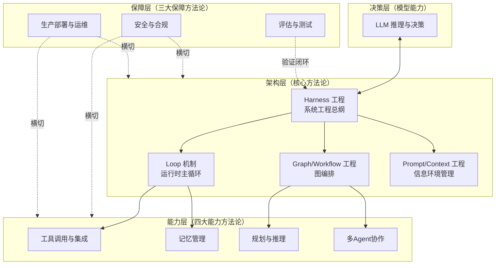

**图表说明**：Harness 工程处于架构层的中枢地位，向上对接 LLM 决策能力，向下通过 Loop 机制和 Graph 编排驱动四大能力方法论；安全与运维作为横切关注点渗透所有层级；评估测试形成从生产回到架构的验证闭环。

### 1.3 八大方法论总览：定义、场景与核心价值

| # | 方法论 | 一句话定义 | 典型适用场景 | 核心价值 | 起步阶段 |
|---|--------|-----------|--------------|----------|----------|
| ① | 核心架构设计（Harness/Loop/Graph/Context） | 构建 LLM 与执行环境之间的系统工程框架 | 一切需要 LLM 执行真实操作的系统 | 决定工程下限与可靠性天花板 | P0 |
| ② | 工具调用与集成 | 以标准化生命周期管理 Agent 与外部世界的交互 | 代码执行、API 集成、企业系统对接 | 能力半径的直接决定因素 | P0 |
| ③ | 记忆管理 | 用三层记忆突破上下文窗口限制实现跨会话学习 | 长期任务、个性化助手、项目级 Agent | 从"一次性工具"到"可成长伙伴" | P3 |
| ④ | 规划与推理 | 定义任务分解、思考-行动交替与自我改进策略 | 多步复杂任务、质量敏感产出 | 决定复杂任务的可完成性 | P1 |
| ⑤ | 多Agent协作 | 通过拓扑设计与标准协议协调多个 Agent 分工 | 跨域复合任务、跨组织协作 | 突破单 Agent 上下文与专业域上限 | P3 |
| ⑥ | 生产部署与运维 | 以可观测性与故障工程保障非确定性系统稳定运行 | 一切生产环境 Agent | 从 Demo 到可交付的分水岭 | P2 |
| ⑦ | 安全与合规 | 假设 Agent 可能犯错，用分层防御控制风险 | 有真实世界副作用的任何操作 | 生产准入的前提条件 | P1 |
| ⑧ | 评估与测试 | 用分层评估量化非确定性系统的质量 | 每次 Prompt/工具/Harness 变更 | 迭代决策与信任升降级的依据 | P1 |

八大方法论的依赖关系如下：

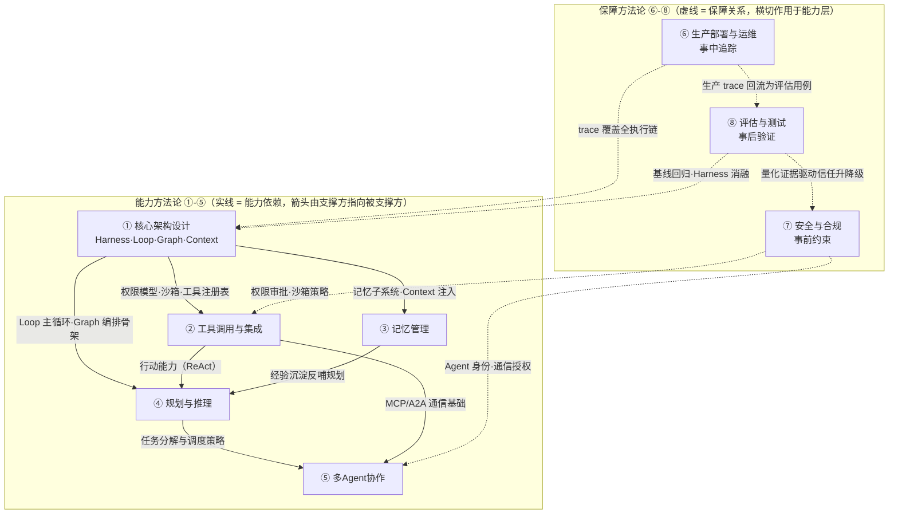

**图表说明**：图中区分两类关系，编号与 [[#10.2 方法论交叉依赖速查]] 一一对应。

- **实线（能力依赖）**：① 是全部能力的基座——为 ② 提供权限模型/沙箱/工具注册表，为 ③ 提供记忆子系统与 Context 注入通道，为 ④ 提供 Loop 主循环与 Graph 编排骨架；② 为 ④ 提供 ReAct 范式所需的行动能力；③ 将历史经验沉淀反哺 ④ 的规划质量；④ 的任务分解与 ② 的通信基础共同支撑 ⑤——因此 ⑤ 处于依赖链末端，应最后落地
- **虚线（保障关系）**：⑦ 在能力开放前施加事前约束（对 ② 的权限审批与沙箱策略、对 ⑤ 的 Agent 身份与通信授权）；⑥ 对 ① 驱动的全执行链做事中 trace 追踪；⑧ 对 ① 做事后基线回归与 Harness 消融验证
- **双闭环**：⑥ 的生产 trace 回流为 ⑧ 的评估用例（数据飞轮），⑧ 的量化证据驱动 ⑦ 的信任等级升降（信任飞轮）——两个闭环共同构成 [[#10.1 全景协同关系]] 中的"生产可靠性飞轮"

### 1.4 协同关系与实施优先级

三条主线贯穿八大方法论：

1. **能力线**（① → ② → ④ → ③ → ⑤）：先有可靠的执行骨架，再扩展工具能力，然后升级推理策略，随后引入记忆实现成长，最后按需走向多 Agent
2. **保障线**（⑦ → ⑥ → ⑧）：安全约束先于能力开放，可观测性先于规模化，评估基线先于快速迭代
3. **反馈线**（⑧ → ⑦ / ⑥ → ⑧）：评估结果驱动信任等级升降，生产数据回流为评估资产

**实施优先级原则**：架构先行（没有 Harness 骨架的能力叠加是沙上建塔）、保障与能力同步（每开放一分能力，配套一分约束与观测）、协作最后（多 Agent 是最后手段而非默认选项）。分阶段落地路线详见 [[#10.3 分阶段实施路线图]]。

### 1.5 为什么系统工程比模型更重要

**数学论证**：设任务有 N 个步骤，每步 LLM 成功率为 p，整体成功率为 p^N。

- 无系统工程：N=100、目标可靠性 95% 时，要求单步 p ≥ 99.95%——没有任何模型能稳定达到
- 有系统工程：原始 p=90%，引入验证 + 最多 3 次重试后，有效 p' = 1-(1-0.9)^4 = 99.99%，整体成功率 0.9999^100 ≈ 99%

**行业实证**：

| 案例 | 干预手段 | 效果 |
|------|----------|------|
| OpenAI Codex | 引入语法验证 + 类型检查 + 结果验证 | 准确率 +30~40pp（模型不变） |
| Bölük 实验 | 编辑工具接口改为行级哈希引用（Hashline） | Grok Code Fast 1 从 6.7% → 68.3%（约 10 倍） |
| LangChain Deep Agents | 纯 Harness 层级改进 | Terminal Bench 2.0 从 52.8% → 66.5% |
| Anthropic 反向验证 | 固定模型只改基础设施配置 | 成功率漂移 +6pp |

> **核心结论**：即使使用较弱的模型，通过系统工程干预也能实现高可靠性。"中等能力模型 + 完善 Harness" 优于 "最强模型 + 简单系统"。

---

## 2. 核心架构设计方法论

### 2.1 Harness 工程（Harness Engineering）

#### 定义

**Harness** 是在大语言模型与真实执行环境之间构建的一套系统工程框架。它通过标准化的消息协议、分层的权限管理、多维的执行可见性和完善的错误处理机制，使 LLM 能够在受控约束下安全、可靠地感知环境、执行任务、学习反馈。

```
模型决定了智能体的思维上限，
Harness 决定了智能体的工程下限。
```

Harness 的职责边界清晰：

- **做的事**：工具集成、权限授权、执行跟踪验证、状态管理、可观测性和审计
- **不做的事**：推理和决策（LLM 职责）、工具的实际执行（工具自身职责）、模型训练、业务逻辑定义

#### 参考架构

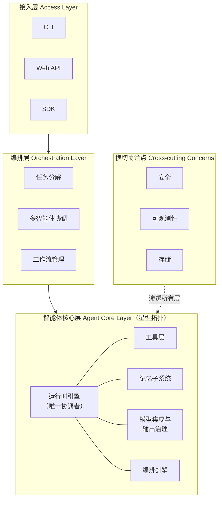

**图表说明**：三层架构 + 横切关注点。核心层内部为星型拓扑——运行时引擎是唯一协调者，其他子系统不直接互相调用。关键架构事实：模型调用、工具执行、记忆更新不是独立的层级，而是在运行时引擎的**同一个循环中交替发生**。

#### 五大设计原则

| 原则 | 核心思想 | 关键实现 |
|------|----------|----------|
| **约束优先** (Constraint-First) | 先定义"不能做什么"，再在约束内赋能 | 权限/操作/时间/数据四维约束；白名单 → 黑名单 → 规则引擎 |
| **可验证性** (Verifiability) | 每个行为可观察、可审计、可重放 | 操作日志 → 执行追踪（树形 trace）→ 可重放执行 |
| **渐进信任** (Progressive Trust) | 信任等级基于量化证据逐步提升 | 6 级信任等级（Manual Only → Full Trust）+ 降级机制 |
| **故障假设** (Design-for-Failure) | 假设每步都可能失败，提前设计方案 | 重试/降级/分舱隔离/断路器 + 检查点恢复 |
| **智能体工学** (Agent Ergonomics) | 为 Agent 而非人类设计系统 | 最小化使用摩擦、最大化信息密度、风险基约束 |

#### 应用场景

- 编码 Agent（Codex、Claude Code 类产品）的运行时框架
- 企业自动化 Agent 需要审计合规的场景
- 任何"LLM 需要执行真实世界操作"的系统

#### 实施步骤

1. **定义约束模型**：先建立权限模型（Permission Model），明确四维约束边界
2. **搭建运行时引擎**：实现状态机（Initializing → Executing → Completed → Stopped）与主循环
3. **接入工具层**：工具注册表 + 参数验证 + 权限检查 + 执行隔离
4. **建立可观测性**：结构化 JSON 日志 + trace ID 全链路关联
5. **配置故障处理**：指数退避重试（max_retries=3）+ 断路器 + 检查点
6. **渐进放权**：从 Level 0 人工批准开始，基于量化证据（操作数、成功率、持续天数、无严重错误）逐级提升

#### 注意事项

- 不要过度优化模型：准确率达 85% 以上后，重点转向系统工程
- 投入优先级：**工具层 → 结果验证 → 重试策略 → 可观测性**
- 一次严重错误、短时间多次错误、安全事件均应触发信任降级
- 避免用"人类工作流约束"束缚 Agent——应使用基于风险的约束

### 2.2 Loop 机制（Agent Loop）

#### 定义

Agent Loop 是运行时引擎维护的核心执行循环，驱动"**感知 → 推理 → 决策 → 执行 → 学习 → 判断**"的反复迭代，直到任务完成、预算耗尽或被外部终止。它是将 LLM 从**无状态函数**转变为**有状态持续执行引擎**的根本机制。

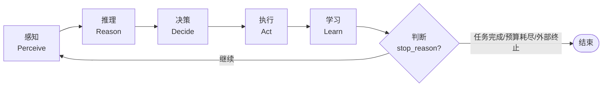

**图表说明**：最小实现是一个 `while True` 循环，每轮迭代通过 `stop_reason` 判断是否继续。模型调用、工具执行、记忆更新在同一循环中交替发生。

#### 两种实现模式

| 模式 | 代表 | 特点 | 适用场景 |
|------|------|------|----------|
| **异步生成器模式** | Claude Code | 事件驱动、低延迟高并发、流式输出 | 交互式 Agent |
| **线性流水线模式** | OpenClaw | 单线程阶段化、确定性、可追踪 | 自驱型/后台 Agent |

#### 实施要点

1. 循环内每步必须有超时中断机制，防止无限等待
2. 设置最大迭代次数（如 iteration ≥ 10 强制收敛），防止无限循环
3. 每轮迭代记录完整事件（timestamp, level, source, message, context）
4. 通过事件/回调向上反馈，而非异常传播

### 2.3 Prompt 工程与 Context 工程

#### 定义

- **Prompt 工程**：设计和优化输入指令以引导 LLM 生成预期输出的实践，关注单次指令的措辞和格式
- **Context 工程**：系统性工程学科，研究如何设计、组织、优化和管理 LLM 所需的**全部信息环境**——系统指令、用户输入、对话历史、外部知识、工具定义、Few-shot 示例——确保模型在正确时间获得正确信息

> 核心命题：**如何在正确的时间，将正确的信息，以正确的格式，提供给模型？**

#### Prompt 工程核心技术

提示词六大核心要素：**角色/身份、任务指令、上下文、输入数据、输出格式、示例**。

指令设计原则：清晰明确、具体细致（量化要求）、行动导向语言（动词开头）、正向表述、结构化分隔、迭代优化、边界防护。

#### Context 工程核心概念

| 概念 | 说明 | 工程含义 |
|------|------|----------|
| **注意力预算** (Attention Budget) | 上下文越长，关键信息越容易被噪声干扰 | 上下文必须作为有限资源管理 |
| **上下文腐烂** (Context Rot) | Token 增加导致关键信息提取稳定性下降（"Lost in the Middle"） | 关键证据的位置与顺序需要设计 |
| **最小高信号 Token 集** | 找到实现期望结果的最小充分信息集 | 反对 Context Stuffing（过度填充） |

#### 应用场景与分工

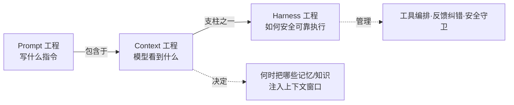

**图表说明**：三者是包含关系而非并列关系。Context 工程负责 Harness 中"上下文动态管理"支柱——决定在什么时间节点、把哪些记忆和背景信息注入模型上下文窗口。

#### 实施步骤

1. **静态基线**：用六要素模板写出结构完整的系统提示词
2. **动态注入**：接入 RAG/记忆检索，按相关性排序注入上下文
3. **窗口管理**：设定 Token 预算分配（系统指令/历史/检索知识/工具定义各占比）
4. **压缩策略**：历史对话摘要化、工具结果截断、低信号内容剔除
5. **持续测量**：A/B 对比不同上下文策略的任务成功率与 Token 成本

#### 注意事项

- 冗余信息不是"多多益善"——噪声会干扰模型判断并推高成本
- Markdown 的信息密度约为 HTML 的 5 倍（相同信息仅需约 20% 字符），Agent 面向的内容优先用 Markdown
- 上下文策略必须可测试、可量化，避免退回"技巧驱动、经验依赖"

---

## 3. 工具调用与集成方法论

### 3.1 定义

工具调用（Tool Use / Function Calling）是 Agent 与真实世界的连接点，涵盖工具的定义、注册、发现、选择、调用、隔离执行、结果标准化的完整生命周期，以及 MCP 等标准化集成协议。

### 3.2 工具生命周期

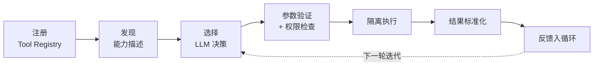

**图表说明**：验证与权限检查发生在执行之前（约束优先原则）；隔离执行的强度按风险递进：异常捕获 → 进程隔离 → 容器隔离 → 系统级沙箱。

### 3.3 标准化协议：MCP

**MCP（Model Context Protocol）** 是 Anthropic 提出的 Agent ↔ 工具/数据 连接标准：

| 维度 | MCP |
|------|-----|
| 连接对象 | Agent ↔ 工具/数据源 |
| 核心能力 | 工具调用、资源访问、提示模板 |
| 通信模式 | 请求-响应（JSON-RPC） |
| 状态管理 | 无状态 |

**协议演进（2025-2026 关键更新）**：

| 演进点 | 说明 | 工程影响 |
|--------|------|----------|
| Streamable HTTP 传输 | 取代 HTTP+SSE 双端点，单端点支持流式 | 远程 MCP 服务器部署大幅简化 |
| OAuth 2.1 授权框架 | 资源服务器/授权服务器职责分离 | 企业级远程工具接入合规化 |
| Elicitation 机制 | 服务器可在执行中向用户补充询问 | 支持交互式确认类工具 |
| 官方 MCP Registry | 服务器注册与发现的统一目录 | 工具生态从"手工配置"走向"可发现" |

> **安全提醒**：MCP 生态引入了**工具投毒（Tool Poisoning）**新攻击面——恶意服务器可在工具描述中植入隐藏指令。接入第三方 MCP 服务器前必须审查工具描述全文，并对其返回结果按不可信输入处理（见 [[#8.6 前沿安全创新实践]]）。

### 3.4 接口设计的量级影响

工具接口设计对 Agent 可靠性的影响可达一个数量级：Bölük 实验将"完整文本编辑"改为"行级内容哈希引用"（Hashline 技法）后，16 个模型一致提升，最大提升约 10 倍，同时输出 Token 下降约 20%。

**工具接口设计准则**：

1. 描述精确：工具描述是给 LLM 看的"API 文档"，含糊描述直接导致误选误用
2. 参数强类型 + Schema 验证：拒绝在执行后才发现参数错误
3. 错误信息可行动：返回"哪里错了 + 怎么修"而非裸异常
4. 幂等设计：允许安全重试
5. 结果结构化：统一的成功/失败/部分成功格式

### 3.5 技能工程（Agent Skills）

技能是比单个工具更高层的能力封装——将"何时用、怎么用、注意什么"的知识与工具组合打包为可复用、可分发、可版本化的模块。

**实施要点**：技能需包含触发条件描述、使用流程、注意事项；建立版本管理与迁移策略（如 v1 → v2）；通过技能目录（Ecosystem Catalog）实现发现与复用。

### 3.6 应用场景与注意事项

- **应用场景**：代码执行、文件操作、API 集成、浏览器自动化、企业系统对接
- **注意事项**：
  - 工具数量不是越多越好——过多工具会稀释 LLM 的选择准确率，应按任务域裁剪
  - 高危工具（删除、支付、外发）必须走审批流（Ask-first / Approve-once）
  - 工具执行结果进入上下文前需截断与压缩，防止污染注意力预算

---

## 4. 记忆管理系统方法论

### 4.1 定义

记忆管理是让 Agent 能够跨会话学习和改进的基础设施，解决 LLM 上下文窗口有限与任务长期性之间的矛盾。

### 4.2 三层记忆架构

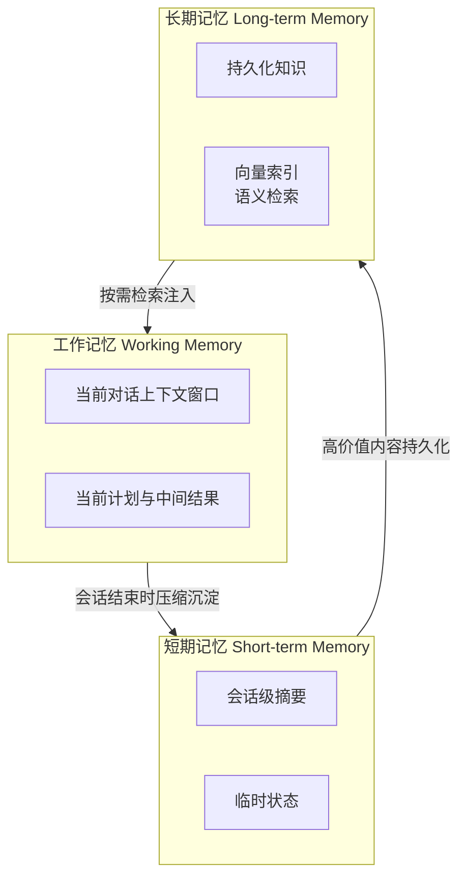

**图表说明**：三层架构对应不同时间跨度——工作记忆受上下文长度限制（当前会话）；短期记忆保留数小时到数周；长期记忆通过向量索引支持数月到数年的语义检索。检索注入环节即 Context 工程的职责交界。

### 4.3 生产实现模式对比

| 系统 | 记忆方案 | 特点 |
|------|----------|------|
| OpenAI Codex | SQLite + AGENTS.md | 结构化存储 + 项目级声明文件 |
| Claude Code | 系统提示词缓存 | 低成本、依赖 prompt caching |
| OpenClaw | MEMORY.md + 每日文件 | 纯文本、可读可审计 |

### 4.4 实施步骤

1. **分层设计**：明确三层记忆的存储介质、生命周期与容量上限
2. **写入策略**：定义什么值得记（用户偏好、项目事实、经验教训），拒绝记录噪声
3. **检索策略**：语义检索 + 关键词过滤 + 时效性加权
4. **压缩与遗忘**：会话摘要化、过期清理、冲突合并（同主题保留最完整一条）
5. **与 RAG 融合**：长期记忆本质是私有 RAG，可复用 Embedding/向量数据库/重排序基础设施

### 4.5 注意事项

- 记忆不是缓存：错误记忆会持续误导后续任务，需要验证与纠错机制
- 记忆检索结果注入上下文时同样受注意力预算约束——宁缺毋滥
- 敏感信息（凭证、密钥）绝不入库，即使被要求记住

---

## 5. 规划与推理方法论

### 5.1 定义

规划与推理方法论定义了 Agent 完成复杂任务的思考与执行策略——如何分解任务、如何交替思考与行动、如何自我改进，以及如何用图结构精确编排这些策略。

### 5.2 四大推理范式

| 范式 | 机制 | 适用场景 | 局限 |
|------|------|----------|------|
| **CoT / ToT** | 思维链逐步推理 / 思维树多路径探索 | 数学、逻辑、单轮复杂推理 | 无外部交互 |
| **ReAct** | Reasoning + Acting 交替循环 | 需要工具交互的通用任务 | 长任务易迷失方向 |
| **Plan-and-Execute** | 先生成完整计划，再逐步执行 | 复杂多步骤任务 | 计划僵化需支持重规划 |
| **Reflection** | 执行后自我评估并改进 | 质量敏感任务（代码、写作） | 增加成本与延迟 |

### 5.3 Graph/Workflow 工程：图编排

以 LangGraph 为代表的图编排方法论，把 Agent 工作流从"面条式调用"变成**有状态的图**：

- **状态 (State)**：强类型的共享数据结构，在节点间传递与更新（支持追加/覆盖等归约语义）
- **节点 (Node)**：接收状态、返回状态部分更新的函数（一个步骤）
- **边 (Edge)**：定义流转逻辑，条件边实现动态路由，回边实现循环

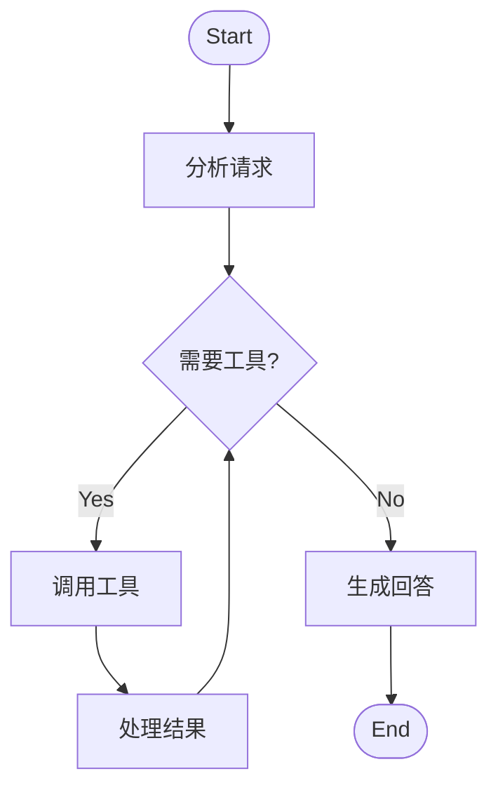

**图表说明**：最典型的 ReAct 图结构——"分析 → 判断 → 工具 → 回到分析"构成循环，条件边在"继续调用工具"与"生成最终回答"之间路由，并以迭代上限防止无限循环。

**生产特性**：

| 特性 | 作用 |
|------|------|
| Checkpointing | 状态持久化，支持中断恢复与会话续接（thread_id 追踪） |
| Human-in-the-Loop | 在高危节点前暂停（interrupt_before），等待人工确认后继续 |
| Streaming | 逐节点/逐 Token 流式输出，改善交互体验 |

### 5.4 实施步骤

1. **选择范式**：简单任务用 ReAct；步骤明确的复杂任务用 Plan-and-Execute；质量敏感任务叠加 Reflection
2. **定义状态 Schema**：明确哪些字段追加、哪些覆盖，为循环计数预留字段
3. **绘制图结构**：节点单一职责，条件路由显式化，所有循环设上限
4. **接入持久化**：生产环境必须配置 Checkpointer
5. **标注人工卡点**：对不可逆操作（发邮件、支付、删除）设置 interrupt

### 5.5 注意事项

- 规划不是一次性的：执行中发现计划失效时应触发重规划（Re-planning）而非硬执行
- 图结构应可视化并纳入评审——它就是 Agent 的"业务流程图"
- Reflection 轮次需设上限，防止"自我改进"变成无限打磨

### 5.6 前沿实践：Workflow 优先与推理模型

**Anthropic《Building Effective Agents》的核心区分**——生产系统应优先使用**工作流（Workflow，预定义代码路径编排 LLM）**，仅在路径无法预知时才用**智能体（Agent，LLM 自主决定路径）**。五种经过生产验证的工作流模式：

| 模式 | 机制 | 适用场景 |
|------|------|----------|
| Prompt Chaining | 任务串联，前一步输出为后一步输入 | 可清晰分解的固定流程 |
| Routing | 分类器将输入路由到专门处理链 | 输入类型异质的场景 |
| Parallelization | 分片并行 / 多次采样投票 | 可分治或需置信度的任务 |
| Orchestrator-Workers | 编排者动态分解，工作者执行 | 子任务不可预知的复杂任务 |
| Evaluator-Optimizer | 生成-评估双循环迭代改进 | 有明确评价标准的质量敏感任务 |

**推理模型的影响**：原生推理模型（o 系列、R1 类）将部分显式规划内化为模型能力，实践共识正在收敛为——简单任务省去显式规划脚手架；复杂任务保留 Plan-and-Execute，但用**推理模型做规划器、快速模型做执行器**（规划/执行分级路由），兼顾质量与成本。

**AGENTS.md 约定**：以项目根目录的声明式文件向编码 Agent 传达构建命令、代码规范与边界约束，已成为跨工具（Codex、Cursor 等）的事实标准——本质是"面向 Agent 的 README"，属于 Context 工程在项目层的固化。

---

## 6. 多Agent协作方法论

### 6.1 定义

多 Agent 协作方法论解决"多个 Agent 如何分工、通信、协调完成单 Agent 无法胜任的复杂任务"，包括协作拓扑设计与标准化通信协议（A2A）。

### 6.2 协作拓扑模式

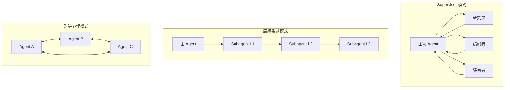

**图表说明**：Supervisor 模式由主管 Agent 根据共享状态动态调度专家 Agent（LangGraph 典型实现）；层级委派适合任务逐层分解（Codex 支持 3+ 层深度）；对等模式适合辩论、评审等对称协作，需 A2A 类协议支撑。

| 模式 | 适用场景 | 代表框架 |
|------|----------|----------|
| Supervisor 调度 | 专家分工明确的复合任务 | LangGraph |
| 层级委派 | 可递归分解的大任务 | OpenAI Codex Subagent |
| 对话协作 | 辩论、评审、头脑风暴 | AutoGen |
| 角色分工 | 模拟团队工作流 | CrewAI |

### 6.3 A2A 协议

Google 提出的 Agent-to-Agent 开放标准，与 MCP 互补——**MCP 连接 Agent 与工具，A2A 连接 Agent 与 Agent**：

| 核心概念 | 说明 |
|----------|------|
| **Agent Card** | JSON 能力描述文件（名称、能力、端点、认证方式），解决能力发现 |
| **任务生命周期** | submitted → working → completed/failed（含 input-required、canceled 分支） |
| **消息格式** | JSON-RPC 2.0，支持同步/异步/流式（SSE） |
| **安全机制** | 内置认证与授权 |

**协议生态全景（2026）**：A2A 已捐赠给 Linux 基金会中立治理，与 MCP 形成开放标准双支柱。更广的 Agent 互操作协议族：

| 协议 | 主导方 | 定位 | 与 A2A/MCP 的关系 |
|------|--------|------|-------------------|
| MCP | Anthropic | Agent ↔ 工具/数据 | 纵向集成标准 |
| A2A | Google → Linux 基金会 | Agent ↔ Agent 任务协作 | 横向协作标准 |
| ACP | IBM/BeeAI（Linux 基金会） | REST 风格 Agent 通信 | 与 A2A 竞合，生态收敛中 |
| ANP | 开源社区 | 去中心化 Agent 网络（DID 身份） | 面向开放互联网场景 |
| AP2 | Google 及支付伙伴 | Agent 支付协议（授权凭证 Mandate） | A2A 的支付场景扩展 |

**选型建议**：组织内部用框架原生机制即可；跨团队标准化选 A2A；涉及交易授权关注 AP2；不要过早绑定尚未收敛的协议——用适配层隔离协议依赖。

### 6.4 实施步骤

1. **先单后多**：确认单 Agent 确实无法胜任（上下文超限、专业域冲突）再引入多 Agent
2. **选择拓扑**：默认从 Supervisor 模式起步，复杂度可控
3. **定义共享状态**：明确各 Agent 的读写边界，避免状态竞争
4. **标准化通信**：跨团队/跨组织协作采用 A2A；组织内部可用框架原生机制
5. **聚合与仲裁**：设计结果聚合策略与冲突仲裁规则（投票、主管裁决、置信度加权）

### 6.5 注意事项

- 多 Agent 系统的失败模式呈组合爆炸——每增加一个 Agent，可观测性与评估投入需同步增加
- 避免"为多而多"：多数场景下一个带好工具的单 Agent 优于协调不良的多 Agent
- Agent 间消息也是上下文——需应用同样的信息密度与截断策略

---

## 7. 生产部署与运维方法论（AgentOps）

### 7.1 定义

AgentOps 是 Agent 系统在生产环境的部署、监控、故障处理、成本控制的工程实践总和，是 MLOps/LLMOps 在 Agent 形态下的延伸——其特殊性在于 Agent 行为的**非确定性**与**长执行链路**。

### 7.2 可观测性三支柱

| 维度 | 内容 | 标准/实践 |
|------|------|-----------|
| **日志 (Logs)** | 详细事件序列 | 结构化 JSON、支持全文搜索 |
| **追踪 (Traces)** | 单请求完整执行路径 | OpenTelemetry 标准、trace ID 全链路关联、树形 step 结构 |
| **指标 (Metrics)** | 系统级性能指标 | 吞吐量、延迟、错误率、Token 成本、任务成功率 |

### 7.3 故障工程

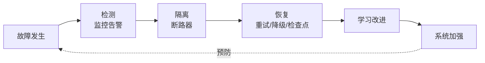

**图表说明**：完整故障恢复闭环。四种故障类型对应四种策略——临时故障→指数退避重试（含随机抖动）；永久故障→降级/回退方案链；部分故障→Bulkhead 分舱隔离；级联故障→断路器（Closed/Open/Half-Open 三态，failure_threshold=5）。

### 7.4 实施步骤

1. **部署前**：建立评估基线（见第 9 节），配置特性门控（Feature Gate）支持灰度
2. **接入可观测性**：三支柱全量接入，trace 覆盖每次模型调用与工具执行
3. **配置故障策略**：每类工具明确重试/降级/断路参数
4. **检查点机制**：长任务每步前后保存检查点（CheckpointedExecution），支持中间恢复
5. **成本治理**：Token 预算告警、模型分级路由（简单任务用小模型）、缓存策略
6. **持续回归**：生产 trace 回流为评估用例，定期重放验证一致性

### 7.5 生产验证的工程模式与反模式

**有效模式**（生产环境反复验证）：

| 模式 | 要点 |
|------|------|
| Workflow 优先 | 能用确定性工作流解决的不要交给自主 Agent（详见 [[#5.6 前沿实践：Workflow 优先与推理模型|§5.6]]） |
| 12-Factor Agents | 掌控提示词、掌控上下文窗口、工具即结构化输出、无状态可暂停恢复、小而聚焦的 Agent |
| 检查点 + 断点续跑 | 长任务按步保存状态，故障从中间恢复而非全量重跑 |
| 模型分级路由 | 规划/复杂推理用强模型，执行/格式化用快模型 |
| 结果验证优于过程干预 | 用编译/测试/Schema 校验等客观信号验证产出 |
| 人工卡点前移 | 不可逆操作在计划阶段就标注审批点，而非执行时才拦截 |

**典型反模式**（高频翻车点）：

| 反模式 | 后果 | 纠正 |
|--------|------|------|
| 全自主大循环 | 无预算约束的 while True 烧钱且不可控 | 迭代上限 + Token 预算 + stop_reason |
| 工具过载 | 数十个工具稀释选择准确率 | 按任务域裁剪，分层暴露 |
| Context Stuffing | 塞满窗口导致 Context Rot | 最小高信号 Token 集 |
| 过早多 Agent | 协调成本吞噬收益，失败模式组合爆炸 | 先榨干单 Agent + 好工具 |
| 无限反思 | Reflection 无上限变成自我打磨死循环 | 轮次上限 + 收益判停 |
| Demo 直上生产 | 无评估基线、无回归能力 | 评估先行（见第 9 节） |

### 7.6 注意事项

- Agent 的"错误"不总是异常——语义性失败（做了但做错了）需要结果验证而非仅靠异常捕获
- 多供应商故障转移（模型选择）应在模型集成层实现，业务层无感知
- 用户可读的执行摘要与工程 trace 同等重要——它是建立用户信任的界面

---

## 8. 安全与合规方法论

### 8.1 定义

Agent 安全方法论假设"Agent 决策可能包含错误、偏差甚至不当意图"（这是 Harness 与传统中间件的本质区别），通过分层防御将风险控制在可接受范围。

### 8.2 分层防御体系

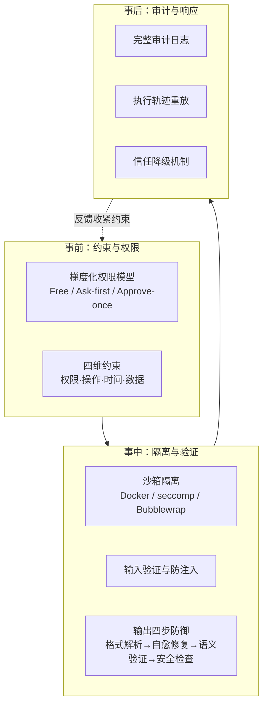

**图表说明**：事前约束（最小权限）、事中隔离验证（纵深防御）、事后审计响应（可追责）构成闭环；事后发现的问题反馈为更严格的事前约束。

### 8.3 渐进信任等级

| Level | 名称 | 实现 |
|-------|------|------|
| 0 | Manual Only | 每步人工批准 |
| 1 | Approve Always | 每个操作事前批准 |
| 2 | Approve Once | 任务开始时批准一次 |
| 3 | Ask First | 关键操作事前询问 |
| 4 | Auto + Notification | 自动执行并通知 |
| 5 | Full Trust | 完全自主 |

**提升标准**基于量化证据：最小操作数、最小成功率、最短观察天数、无严重错误。**降级触发**：一次严重错误、短时间多次错误、安全事件、用户投诉。

### 8.4 生产安全实例

| 系统 | 安全方案 |
|------|----------|
| OpenAI Codex | execpolicy 策略引擎 + 平台沙箱双层防护 |
| Claude Code | 权限模式 + protected files 保护清单 |
| OpenClaw | SOUL.md 行为宪法 + 三级权限 |

### 8.5 实施步骤与注意事项

1. 默认拒绝：从白名单模式起步，成熟后才考虑规则引擎
2. 高危操作清单化：删除、外发、支付、凭证访问必须人工卡点
3. 提示注入防御：外部内容（网页、文件、工具结果）视为不可信输入
4. 审计日志不可篡改：独立存储、结构化、含完整输入输出
5. **好的约束不限制能力**：约束减少歧义、缩小搜索空间，反而提高成功率与执行速度

### 8.6 前沿安全创新实践

**威胁建模标准化**：OWASP 已将提示注入列为 LLM 应用十大风险之首，并发布 Agentic AI 威胁清单（记忆投毒、工具滥用、权限劫持、级联幻觉等）——安全设计应从"逐案防御"升级为"对照威胁清单逐项建防"。

**提示注入的结构性防御**（超越关键词过滤的新一代方案）：

| 方案 | 机制 | 特点 |
|------|------|------|
| 控制流/数据流分离（CaMeL 思路） | 特权 LLM 生成程序骨架，不可信数据只作为值流转、永不进入决策提示 | 提供可证明的安全属性 |
| Dual-LLM 模式 | 特权 LLM 规划决策，隔离 LLM 处理不可信内容且无工具权限 | 工程实现简单 |
| Spotlighting | 对不可信内容显式编码/定界标记 | 轻量，可与其他方案叠加 |

**Agent 身份与最小授权**：Agent 正在成为独立的"工作负载身份"——为每个 Agent 颁发独立凭证（而非复用人类账号），按任务签发短时效、窄范围的 Scoped Token，工具调用走 OAuth 2.1 授权链路，实现"每次行动可追责到 Agent 实例 + 委托人"。

**合规映射**：高风险场景需对照 EU AI Act 义务（透明度、人类监督、日志留存）与 NIST AI RMF 的治理-映射-测量-管理四职能建立合规证据链——本文 §8.2 的审计日志与第 9 节的评估报告正是证据链的核心材料。

---

## 9. 评估与测试方法论

### 9.1 定义

Agent 评估方法论解决"如何量化一个非确定性系统的质量"，涵盖能力基准测试、执行轨迹评估、红队对抗测试与持续回归。

### 9.2 评估体系四层结构

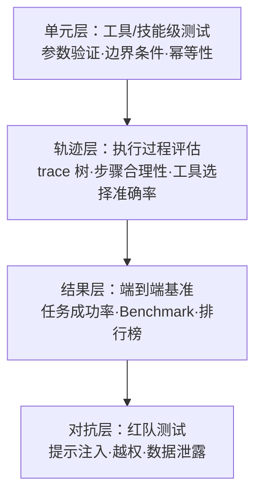

**图表说明**：自下而上分层评估——单元层验证组件正确性；轨迹层评估"过程是否合理"（Agent 特有）；结果层用基准与指标矩阵量化端到端能力；对抗层验证安全边界。

### 9.3 核心方法

| 方法 | 说明 |
|------|------|
| **指标矩阵** | 多维能力评分（如 K8s 能力 15 维矩阵），雷达图呈现 |
| **Rubrics 评分标准** | 定义每个维度的评分锚点，支持 LLM-as-Judge 自动评分 |
| **Test Bank 用例库** | 分级题库（基础/进阶/对抗），支持回归 |
| **可重放性验证** | 给定相同输入重现执行（simulation 模式），对抗"暗码"（Dark Code） |
| **红队测试** | 系统化对抗测试：注入、越权、绕过审批 |
| **排行榜** | 跨 Agent/跨模型横向对比（Leaderboard） |

### 9.4 关键洞察

> Anthropic 建议：**排行榜上低于 3pp 的差距很可能反映的是 Harness 配置差异而非模型能力差异。** 因此评估必须固定 Harness 配置做对照，并将"Harness 消融实验"纳入评估设计。

### 9.5 实施步骤

1. **定义指标体系**：任务成功率 + 效率（步数/Token/延迟）+ 安全性三大类
2. **建设用例库**：从真实生产 trace 提炼 + 人工设计边界用例
3. **自动化评分**：客观指标程序化判定；主观质量用 Rubrics + LLM-as-Judge（需人工抽检校准）
4. **接入 CI**：每次 Prompt/工具/Harness 变更触发回归评估
5. **定期红队**：至少每个大版本执行一轮对抗测试

### 9.6 注意事项

- 非确定性系统的评估必须多次采样取分布，单次通过不代表稳定
- LLM-as-Judge 自身有偏差（位置偏好、冗长偏好），需要对抗校准
- 评估集必须与开发迭代隔离，防止"过拟合评估集"

### 9.7 评估方法论前沿进展

**主流公开基准图谱**：

| 基准 | 评估对象 | 特点 |
|------|----------|------|
| SWE-bench Verified | 编码 Agent | 真实 GitHub Issue 修复，人工校验子集 |
| Terminal Bench | 终端操作 Agent | 对 Harness 差异敏感，适合消融实验 |
| τ-bench / τ²-bench | 对话式工具 Agent | 引入用户模拟器与策略遵从性，τ² 增加双向交互 |
| GAIA | 通用助手 | 人类易、模型难的多步现实问题 |
| OSWorld / WebArena | 计算机/网页操作 | 真实环境端到端任务 |

**评估范式创新**：

1. **Agent-as-a-Judge**：用配备工具与轨迹访问能力的评估 Agent 替代单轮 LLM-as-Judge，可对中间步骤逐步给出反馈，评估质量接近人工而成本大幅降低
2. **pass^k 稳定性指标**：从 pass@k（k 次中至少一次成功）转向 pass^k（k 次全部成功），直接度量非确定性系统的**可靠性**而非能力上限
3. **在线评估闭环**：灰度发布 + 影子模式（Shadow Mode）让新版 Agent 并行执行但不生效，对比轨迹后再放量；生产不满意信号（用户改写、任务放弃）自动转化为回归用例
4. **成本-性能联合排名**：先进排行榜将 Token 成本纳入坐标，暴露"高分但不经济"的配置——生产选型应看帕累托前沿而非单一分数

---

## 10. 方法论协同关系与实施路线图

### 10.1 全景协同关系

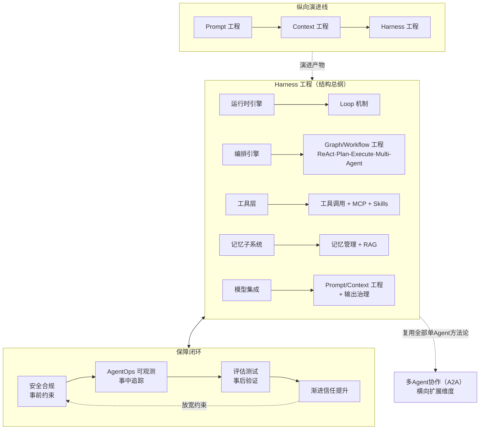

**图表说明**：三条核心关系线——① **纵向演进**：Prompt → Context → Harness 是能力范围逐层扩大的包含关系；② **结构包含**：Loop（执行机制）和 Graph（编排形态）不是与 Harness 平行的方法论，而是其"运行时引擎"和"编排引擎"子系统的具体实现；③ **保障闭环**：安全 + 可观测性 + 评估构成生产可靠性飞轮，评估结果驱动信任等级升降。多 Agent 协作是横向扩展维度，复用上述全部单 Agent 方法论。

### 10.2 方法论交叉依赖速查

编号与 [[#1.3 八大方法论总览：定义、场景与核心价值]] 的依赖关系图一致：

| 方法论 | 依赖（上游） | 被依赖（下游） |
|--------|------|--------|
| ① 核心架构设计（Harness/Loop/Graph/Context） | LLM 模型能力；Prompt/Context 工程为其内部支柱 | ②③④ 全部能力层；⑥⑧ 的保障对象 |
| ② 工具调用与集成 | ① 的权限模型、沙箱与工具注册表；⑦ 的事前约束 | ④ 规划推理（ReAct 行动能力）、⑤ 多Agent（MCP/A2A 通信基础）、技能工程 |
| ③ 记忆管理 | ① 的记忆子系统与 Context 注入；RAG 基础设施 | ④ 规划推理（经验沉淀反哺）、长期任务与个性化 |
| ④ 规划与推理 | ① 的 Loop/Graph 骨架、② 的行动能力、③ 的经验沉淀 | ⑤ 多Agent 的任务分解与调度 |
| ⑤ 多Agent协作 | ④ 的分解调度、② 的通信基础、A2A/MCP 协议、⑦ 的身份授权 | 复杂业务流程（依赖链末端） |
| ⑥ 生产部署与运维 | 可观测性三支柱、故障工程 | ⑧ 评估（生产 trace 回流）、① 的事中追踪保障 |
| ⑦ 安全与合规 | 约束优先原则、渐进信任、⑧ 的量化证据 | ②⑤ 的事前约束、生产准入 |
| ⑧ 评估与测试 | Test Bank、Rubrics、可重放性、⑥ 的生产 trace | 迭代决策、⑦ 的信任升降级、① 的基线回归 |

### 10.3 分阶段实施路线图

| 阶段 | 目标 | 落地内容 |
|------|------|----------|
| **P0 原型期** | 跑通任务 | Prompt 工程六要素 + 最小 ReAct 主循环（① 的 Loop 机制）+ 3~5 个核心工具（含参数验证） |
| **P1 工程期** | 可靠执行 | Harness 骨架（权限模型 + 结果验证 + 重试）+ Context 工程 + Graph 编排 + 规划范式升级（Plan-and-Execute / Reflection）+ 轻量评估基线（固定用例集） |
| **P2 生产期** | 可放心交付 | 可观测性三支柱 + 故障工程 + 分层安全防御 + 评估接入 CI（轨迹评估 + 回归） |
| **P3 规模期** | 持续进化 | 记忆系统 + 多 Agent 协作 + 红队测试 + 渐进信任放权 + 成本治理 |

**投入优先级**（来自生产实证）：工具层 → 结果验证 → 重试策略 → 可观测性。把模型的"最后一英里"交给 Harness——投入强大的 Harness 设计往往比投入更强模型更有 ROI。

### 10.4 关键成功因素（KSF）

| 成功因素 | 判断标准 | 对应方法论 |
|----------|----------|-----------|
| 架构先行 | 任何能力叠加前已有权限模型与主循环骨架 | ①核心架构 |
| 接口质量重于工具数量 | 每个工具描述精确、错误可行动、幂等可重试 | ②工具集成 |
| 上下文即资源 | 有明确的 Token 预算分配与压缩策略 | ①Context 工程 |
| Workflow 优先 | 自主 Agent 仅用于路径不可预知的场景 | ④规划推理 |
| 评估先于迭代 | 每次变更有基线对比，评估集与开发隔离 | ⑧评估测试 |
| 保障与能力同步 | 每开放一分能力配套一分约束与观测 | ⑥⑦运维安全 |
| 渐进信任有据可依 | 信任升降级基于量化证据而非主观感觉 | ⑦安全合规 |
| 数据飞轮闭环 | 生产 trace 持续回流为评估用例与记忆资产 | ③⑥⑧ |

### 10.5 落地检查清单

进入下一阶段前的准入检查（每项均验证上一阶段交付物，且应可出示证据）：

- [ ] **P0→P1**：核心任务在固定用例上成功率 ≥ 80%；工具均有参数验证；循环有迭代与预算上限
- [ ] **P1→P2**：权限模型覆盖全部工具；结果验证与重试策略生效；轻量评估基线建立且可对比变更前后
- [ ] **P2→P3**：trace 覆盖每次模型/工具调用；故障恢复经演练验证；评估接入 CI 且回归通过；信任等级 ≥ Level 3 且有量化证据
- [ ] **持续运营**：pass^k 稳定性达标；红队测试按大版本执行；生产反馈闭环运转；成本单位经济性达标；审计日志满足合规留存要求

> **一句话总结**：Agent 工程的本质是**在非确定性的模型之上构建确定性的工程保障**——八大方法论分别回答"如何构建（①）、能做什么（②③④⑤）、能否放心（⑥⑦⑧）"三个问题，其成熟度共同决定一个 Agent 系统能走多远。

---

## See also

- [[15_智能体/04_Agent脚手架/05_脚手架_工程_完整_指南|Harness Engineering Complete Guide]] - Harness 定义、五大子系统与五大设计原则
- [[15_智能体/04_Agent脚手架/02_脚手架_核心_Subsystems|Harness Core Subsystems]] - 运行时引擎、工具层、记忆子系统深度实现
- [[15_智能体/04_Agent脚手架/07_脚手架_生产_安全|Harness Production Security]] - 生产加固与安全体系
- [[15_智能体/03_Agent工作流/05_LangGraph_深入分析|LangGraph Deep Dive]] - 图编排核心概念与设计模式
- [[15_智能体/03_Agent工作流/03_AgentOps_生产_指南|AgentOps Production Guide]] - Agent 运维与生产部署
- [[05_大模型/07_提示工程/13_Prompt工程_完整_指南|Prompt Engineering Complete Guide]] - 提示词工程核心技术
- [[05_大模型/07_提示工程/01_Context_工程_指南|Context Engineering Guide]] - 上下文工程权威指南
- [[15_智能体/06_记忆基础设施/01_Agent_Memory_系统_2026|Agent Memory Systems 2026]] - 记忆系统架构
- [[概念/Agent/a2a-protocol|A2A Protocol Deep Dive]] - 多 Agent 通信标准
- [[15_智能体/01_Agent基础/13_Agentic_设计_模式_AndrewNg|Agentic Design Patterns]] - Reflection/Tool Use/Planning/Multi-agent 四大模式
- [[15_智能体/05_Agent技能/14_工具调用_最佳实践|Tool Calling Best Practices]] - 工具调用最佳实践
- [[15_智能体/07_Agent评估/08_Agent_红队测试_2026|Agent Red Teaming 2026]] - 红队测试方法
