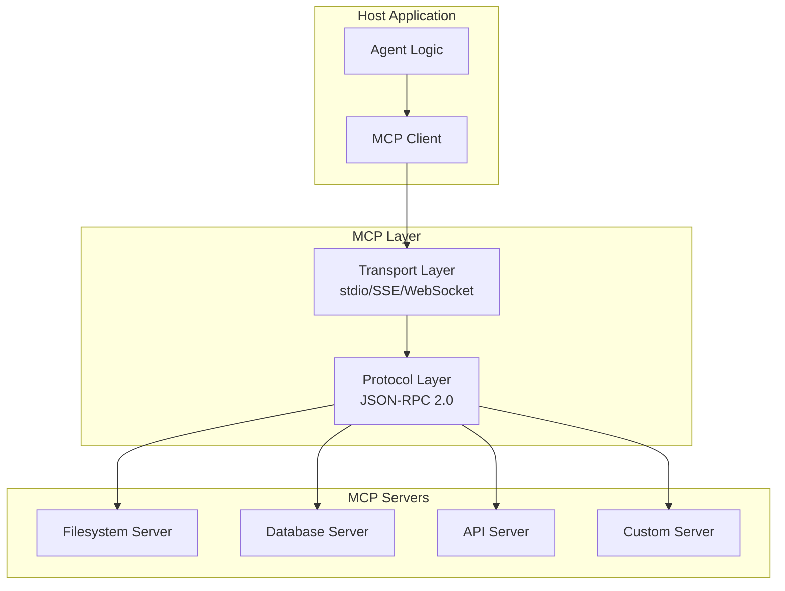

> [!warning] 生产安全提示 · Production Safety
> 本文档含可执行命令/操作步骤。执行前请核对风险等级（🟢低/🔶中/🔴高），高危命令必须 dry-run 并确认回滚方案。完整策略见 [生产安全策略](治理/Production_Safety_Policy.md)。
<!-- op-safety-banner v1 -->
# MCP 协议实现指南 (MCP Implementation Guide)

> 中文简称：MCP 协议实现指南

> **一句话理解**: MCP 是 AI Agent 的"USB 接口"——让任何 Agent 都能即插即用地调用任何工具，无需为每个工具单独开发集成代码。

---

## 1. MCP 协议概述

### 1.1 什么是 MCP？

**Model Context Protocol (MCP)** 是由 Anthropic 在 2024 年推出的开放标准，旨在解决 AI Agent 与外部工具/数据源之间的连接问题。

```
传统方式: 每个 Agent + 每个工具 = 单独集成
┌─────────┐    ┌─────────┐
│ Agent A │───►│ Tool 1  │ (集成代码 A1)
└─────────┘    └─────────┘
┌─────────┐    ┌─────────┐
│ Agent A │───►│ Tool 2  │ (集成代码 A2)
└─────────┘    └─────────┘
┌─────────┐    ┌─────────┐
│ Agent B │───►│ Tool 1  │ (集成代码 B1) ← 重复工作
└─────────┘    └─────────┘

MCP 方式: 统一协议，一次开发，处处可用
┌─────────┐              ┌─────────┐
│ Agent A │──┐     ┌───►│ Tool 1  │
└─────────┘  │     │    └─────────┘
             ▼     │
        ┌─────────┐│    ┌─────────┐
        │   MCP   │├───►│ Tool 2  │
        │  协议层  ││    └─────────┘
        └─────────┘│
             ▲     │    ┌─────────┐
┌─────────┐  │     └───►│ Tool 3  │
│ Agent B │──┘          └─────────┘
└─────────┘
```

### 1.2 核心概念

| 概念 | 说明 | 类比 |
|-----|------|------|
| **MCP Server** | 暴露工具/资源的服务端 | USB 设备 |
| **MCP Client** | 连接 Server 的客户端 | USB 主机 |
| **Tool** | 可调用的函数 | 驱动方法 |
| **Resource** | 可读取的数据源 | 文件系统 |
| **Prompt** | 预定义的提示模板 | 快捷方式 |

### 1.3 协议架构



---

## 2. 快速开始

### 2.1 环境准备

```bash
# Python SDK
pip install mcp

# TypeScript SDK
npm install @modelcontextprotocol/sdk

# 验证安装
python -c "import mcp; print(mcp.__version__)"
```

### 2.2 最简 MCP Server (Python)

```python
"""
最简单的 MCP Server 示例
提供两个工具：echo 和 add
"""

from mcp.server import Server
from mcp.server.stdio import stdio_server
from mcp.types import Tool, TextContent
import asyncio

# 创建服务器实例
server = Server("example-server")

@server.list_tools()
async def list_tools() -> list[Tool]:
    """声明服务器提供的工具"""
    return [
        Tool(
            name="echo",
            description="回显输入的文本",
            inputSchema={
                "type": "object",
                "properties": {
                    "message": {
                        "type": "string",
                        "description": "要回显的消息"
                    }
                },
                "required": ["message"]
            }
        ),
        Tool(
            name="add",
            description="计算两个数的和",
            inputSchema={
                "type": "object",
                "properties": {
                    "a": {"type": "number", "description": "第一个数"},
                    "b": {"type": "number", "description": "第二个数"}
                },
                "required": ["a", "b"]
            }
        )
    ]

@server.call_tool()
async def call_tool(name: str, arguments: dict) -> list[TextContent]:
    """处理工具调用"""
    if name == "echo":
        message = arguments.get("message", "")
        return [TextContent(type="text", text=f"Echo: {message}")]
    
    elif name == "add":
        a = arguments.get("a", 0)
        b = arguments.get("b", 0)
        result = a + b
        return [TextContent(type="text", text=f"{a} + {b} = {result}")]
    
    else:
        raise ValueError(f"Unknown tool: {name}")

async def main():
    """启动服务器"""
    async with stdio_server() as (read_stream, write_stream):
        await server.run(
            read_stream,
            write_stream,
            server.create_initialization_options()
        )

if __name__ == "__main__":
    asyncio.run(main())
```

### 2.3 最简 MCP Client (Python)

```python
"""
MCP Client 示例
连接 Server 并调用工具
"""

from mcp import ClientSession
from mcp.client.stdio import stdio_client
from contextlib import AsyncExitStack
import asyncio

class MCPClient:
    def __init__(self):
        self.session: ClientSession = None
        self.exit_stack = AsyncExitStack()
    
    async def connect(self, server_command: list[str]):
        """连接到 MCP Server"""
        server_params = {
            "command": server_command[0],
            "args": server_command[1:] if len(server_command) > 1 else []
        }
        
        stdio_transport = await self.exit_stack.enter_async_context(
            stdio_client(server_params)
        )
        self.read, self.write = stdio_transport
        
        self.session = await self.exit_stack.enter_async_context(
            ClientSession(self.read, self.write)
        )
        
        await self.session.initialize()
    
    async def list_tools(self):
        """列出可用工具"""
        result = await self.session.list_tools()
        return result.tools
    
    async def call_tool(self, name: str, arguments: dict):
        """调用工具"""
        result = await self.session.call_tool(name, arguments)
        return result.content
    
    async def close(self):
        """关闭连接"""
        await self.exit_stack.aclose()

async def main():
    client = MCPClient()
    
    try:
        # 连接到 server
        await client.connect(["python", "my_server.py"])
        
        # 列出工具
        tools = await client.list_tools()
        print("Available tools:")
        for tool in tools:
            print(f"  - {tool.name}: {tool.description}")
        
        # 调用工具
        result = await client.call_tool("add", {"a": 5, "b": 3})
        print(f"Result: {result[0].text}")
        
    finally:
        await client.close()

if __name__ == "__main__":
    asyncio.run(main())
```

---

## 3. MCP Server 开发实战

### 3.1 文件系统 Server

```python
"""
文件系统 MCP Server
提供文件读写、目录列表等功能
"""

from mcp.server import Server
from mcp.server.stdio import stdio_server
from mcp.types import Tool, TextContent, Resource
from pathlib import Path
import asyncio
import json
import os

class FilesystemServer:
    def __init__(self, allowed_root: str = "."):
        self.server = Server("filesystem-server")
        self.allowed_root = Path(allowed_root).resolve()
        self._setup_handlers()
    
    def _setup_handlers(self):
        """设置所有处理器"""
        
        @self.server.list_tools()
        async def list_tools() -> list[Tool]:
            return [
                Tool(
                    name="read_file",
                    description="读取文件内容",
                    inputSchema={
                        "type": "object",
                        "properties": {
                            "path": {
                                "type": "string",
                                "description": "文件路径（相对于根目录）"
                            }
                        },
                        "required": ["path"]
                    }
                ),
                Tool(
                    name="write_file",
                    description="写入文件内容",
                    inputSchema={
                        "type": "object",
                        "properties": {
                            "path": {"type": "string"},
                            "content": {"type": "string"}
                        },
                        "required": ["path", "content"]
                    }
                ),
                Tool(
                    name="list_directory",
                    description="列出目录内容",
                    inputSchema={
                        "type": "object",
                        "properties": {
                            "path": {
                                "type": "string",
                                "description": "目录路径",
                                "default": "."
                            }
                        }
                    }
                ),
                Tool(
                    name="search_files",
                    description="搜索匹配的文件",
                    inputSchema={
                        "type": "object",
                        "properties": {
                            "pattern": {
                                "type": "string",
                                "description": "文件名模式（支持 glob）"
                            },
                            "path": {
                                "type": "string",
                                "default": "."
                            }
                        },
                        "required": ["pattern"]
                    }
                )
            ]
        
        @self.server.call_tool()
        async def call_tool(name: str, arguments: dict) -> list[TextContent]:
            # 安全检查：防止路径遍历攻击
            path = self._safe_path(arguments.get("path", "."))
            
            if name == "read_file":
                return await self._read_file(path)
            elif name == "write_file":
                return await self._write_file(path, arguments.get("content", ""))
            elif name == "list_directory":
                return await self._list_directory(path)
            elif name == "search_files":
                return await self._search_files(path, arguments.get("pattern", "*"))
            else:
                raise ValueError(f"Unknown tool: {name}")
        
        @self.server.list_resources()
        async def list_resources() -> list[Resource]:
            """列出可用的资源"""
            resources = []
            for file_path in self.allowed_root.rglob("*"):
                if file_path.is_file():
                    relative = file_path.relative_to(self.allowed_root)
                    resources.append(Resource(
                        uri=f"file://{relative}",
                        name=str(relative),
                        mimeType=self._get_mime_type(file_path)
                    ))
            return resources
    
    def _safe_path(self, path: str) -> Path:
        """安全路径处理"""
        full_path = (self.allowed_root / path).resolve()
        
        # 确保路径在允许的根目录内
        if not str(full_path).startswith(str(self.allowed_root)):
            raise PermissionError(f"Access denied: {path}")
        
        return full_path
    
    async def _read_file(self, path: Path) -> list[TextContent]:
        """读取文件"""
        if not path.exists():
            raise FileNotFoundError(f"File not found: {path}")
        
        content = path.read_text(encoding="utf-8")
        return [TextContent(type="text", text=content)]
    
    async def _write_file(self, path: Path, content: str) -> list[TextContent]:
        """写入文件"""
        path.parent.mkdir(parents=True, exist_ok=True)
        path.write_text(content, encoding="utf-8")
        return [TextContent(type="text", text=f"Written to {path}")]
    
    async def _list_directory(self, path: Path) -> list[TextContent]:
        """列出目录"""
        if not path.is_dir():
            raise NotADirectoryError(f"Not a directory: {path}")
        
        entries = []
        for entry in path.iterdir():
            entry_type = "📁" if entry.is_dir() else "📄"
            entries.append(f"{entry_type} {entry.name}")
        
        return [TextContent(type="text", text="\n".join(entries))]
    
    async def _search_files(self, path: Path, pattern: str) -> list[TextContent]:
        """搜索文件"""
        matches = list(path.glob(pattern))
        result = "\n".join(str(m.relative_to(self.allowed_root)) for m in matches)
        return [TextContent(type="text", text=result or "No matches found")]
    
    def _get_mime_type(self, path: Path) -> str:
        """获取 MIME 类型"""
        suffix = path.suffix.lower()
        mime_map = {
            ".txt": "text/plain",
            ".md": "text/markdown",
            ".json": "application/json",
            ".py": "text/x-python",
            ".js": "text/javascript",
            ".html": "text/html",
            ".css": "text/css"
        }
        return mime_map.get(suffix, "application/octet-stream")
    
    async def run(self):
        """运行服务器"""
        async with stdio_server() as (read_stream, write_stream):
            await self.server.run(
                read_stream,
                write_stream,
                self.server.create_initialization_options()
            )

# 启动入口
if __name__ == "__main__":
    import sys
    root = sys.argv[1] if len(sys.argv) > 1 else "."
    server = FilesystemServer(root)
    asyncio.run(server.run())
```

### 3.2 数据库 Server

```python
"""
数据库 MCP Server
支持 PostgreSQL, MySQL, SQLite
"""

from mcp.server import Server
from mcp.server.stdio import stdio_server
from mcp.types import Tool, TextContent
import asyncio
import asyncpg
import sqlite3
from typing import Optional
import json

class DatabaseServer:
    def __init__(self, db_url: str):
        self.server = Server("database-server")
        self.db_url = db_url
        self.pool: Optional[asyncpg.Pool] = None
        self._setup_handlers()
    
    def _setup_handlers(self):
        @self.server.list_tools()
        async def list_tools() -> list[Tool]:
            return [
                Tool(
                    name="query",
                    description="执行 SQL 查询（只读）",
                    inputSchema={
                        "type": "object",
                        "properties": {
                            "sql": {
                                "type": "string",
                                "description": "SELECT 查询语句"
                            },
                            "params": {
                                "type": "array",
                                "description": "查询参数"
                            }
                        },
                        "required": ["sql"]
                    }
                ),
                Tool(
                    name="execute",
                    description="执行 SQL 语句（INSERT/UPDATE/DELETE）",
                    inputSchema={
                        "type": "object",
                        "properties": {
                            "sql": {"type": "string"},
                            "params": {"type": "array"}
                        },
                        "required": ["sql"]
                    }
                ),
                Tool(
                    name="list_tables",
                    description="列出数据库中的表",
                    inputSchema={"type": "object", "properties": {}}
                ),
                Tool(
                    name="describe_table",
                    description="描述表结构",
                    inputSchema={
                        "type": "object",
                        "properties": {
                            "table": {"type": "string"}
                        },
                        "required": ["table"]
                    }
                )
            ]
        
        @self.server.call_tool()
        async def call_tool(name: str, arguments: dict) -> list[TextContent]:
            if name == "query":
                return await self._query(
                    arguments["sql"],
                    arguments.get("params", [])
                )
            elif name == "execute":
                return await self._execute(
                    arguments["sql"],
                    arguments.get("params", [])
                )
            elif name == "list_tables":
                return await self._list_tables()
            elif name == "describe_table":
                return await self._describe_table(arguments["table"])
            else:
                raise ValueError(f"Unknown tool: {name}")
    
    async def _query(self, sql: str, params: list) -> list[TextContent]:
        """执行查询"""
        # 安全检查：只允许 SELECT
        if not sql.strip().upper().startswith("SELECT"):
            raise PermissionError("Only SELECT queries are allowed")
        
        async with self.pool.acquire() as conn:
            rows = await conn.fetch(sql, *params)
            result = [dict(row) for row in rows]
            return [TextContent(
                type="text",
                text=json.dumps(result, indent=2, default=str)
            )]
    
    async def _execute(self, sql: str, params: list) -> list[TextContent]:
        """执行修改"""
        async with self.pool.acquire() as conn:
            result = await conn.execute(sql, *params)
            return [TextContent(type="text", text=f"Executed: {result}")]
    
    async def _list_tables(self) -> list[TextContent]:
        """列出表"""
        sql = """
        SELECT table_name 
        FROM information_schema.tables 
        WHERE table_schema = 'public'
        """
        async with self.pool.acquire() as conn:
            rows = await conn.fetch(sql)
            tables = [row["table_name"] for row in rows]
            return [TextContent(type="text", text="\n".join(tables))]
    
    async def _describe_table(self, table: str) -> list[TextContent]:
        """描述表结构"""
        sql = """
        SELECT column_name, data_type, is_nullable, column_default
        FROM information_schema.columns
        WHERE table_name = $1
        ORDER BY ordinal_position
        """
        async with self.pool.acquire() as conn:
            rows = await conn.fetch(sql, table)
            columns = [dict(row) for row in rows]
            return [TextContent(
                type="text",
                text=json.dumps(columns, indent=2)
            )]
    
    async def run(self):
        """运行服务器"""
        # 初始化连接池
        self.pool = await asyncpg.create_pool(self.db_url)
        
        try:
            async with stdio_server() as (read_stream, write_stream):
                await self.server.run(
                    read_stream,
                    write_stream,
                    self.server.create_initialization_options()
                )
        finally:
            await self.pool.close()

# 使用示例
if __name__ == "__main__":
    import os
    db_url = os.environ.get("DATABASE_URL", "postgresql://localhost/test")
    server = DatabaseServer(db_url)
    asyncio.run(server.run())
```

---

## 4. TypeScript SDK 实战

### 4.1 TypeScript Server

```typescript
/**
 * TypeScript MCP Server 示例
 * 提供天气查询功能
 */

import { Server } from "@modelcontextprotocol/sdk/server/index.js";
import { StdioServerTransport } from "@modelcontextprotocol/sdk/server/stdio.js";
import {
  CallToolRequestSchema,
  ListToolsRequestSchema,
} from "@modelcontextprotocol/sdk/types.js";

// 创建服务器
const server = new Server(
  {
    name: "weather-server",
    version: "1.0.0",
  },
  {
    capabilities: {
      tools: {},
    },
  }
);

// 定义工具
server.setRequestHandler(ListToolsRequestSchema, async () => {
  return {
    tools: [
      {
        name: "get_weather",
        description: "获取指定城市的天气信息",
        inputSchema: {
          type: "object",
          properties: {
            city: {
              type: "string",
              description: "城市名称",
            },
            unit: {
              type: "string",
              enum: ["celsius", "fahrenheit"],
              description: "温度单位",
              default: "celsius",
            },
          },
          required: ["city"],
        },
      },
      {
        name: "get_forecast",
        description: "获取未来几天的天气预报",
        inputSchema: {
          type: "object",
          properties: {
            city: { type: "string" },
            days: {
              type: "number",
              description: "预报天数",
              default: 3,
            },
          },
          required: ["city"],
        },
      },
    ],
  };
});

// 处理工具调用
server.setRequestHandler(CallToolRequestSchema, async (request) => {
  const { name, arguments: args } = request.params;

  if (name === "get_weather") {
    const weather = await fetchWeather(args.city, args.unit);
    return {
      content: [
        {
          type: "text",
          text: JSON.stringify(weather, null, 2),
        },
      ],
    };
  }

  if (name === "get_forecast") {
    const forecast = await fetchForecast(args.city, args.days);
    return {
      content: [
        {
          type: "text",
          text: JSON.stringify(forecast, null, 2),
        },
      ],
    };
  }

  throw new Error(`Unknown tool: ${name}`);
});

// 模拟天气 API
async function fetchWeather(
  city: string,
  unit: string = "celsius"
): Promise<object> {
  // 实际应用中调用真实 API
  const temp = Math.floor(Math.random() * 30) + 5;
  return {
    city,
    temperature: unit === "fahrenheit" ? temp * 1.8 + 32 : temp,
    unit,
    condition: ["sunny", "cloudy", "rainy"][Math.floor(Math.random() * 3)],
    humidity: Math.floor(Math.random() * 50) + 30,
    wind_speed: Math.floor(Math.random() * 20) + 5,
  };
}

async function fetchForecast(city: string, days: number): Promise<object[]> {
  const forecast = [];
  for (let i = 0; i < days; i++) {
    const date = new Date();
    date.setDate(date.getDate() + i);
    forecast.push({
      date: date.toISOString().split("T")[0],
      ...(await fetchWeather(city)),
    });
  }
  return forecast;
}

// 启动服务器
async function main() {
  const transport = new StdioServerTransport();
  await server.connect(transport);
  console.error("Weather MCP Server running on stdio");
}

main().catch(console.error);
```

### 4.2 TypeScript Client

```typescript
/**
 * TypeScript MCP Client 示例
 */

import { Client } from "@modelcontextprotocol/sdk/client/index.js";
import { StdioClientTransport } from "@modelcontextprotocol/sdk/client/stdio.js";

async function main() {
  // 创建客户端
  const client = new Client(
    {
      name: "example-client",
      version: "1.0.0",
    },
    {
      capabilities: {},
    }
  );

  // 连接到服务器
  const transport = new StdioClientTransport({
    command: "node",
    args: ["weather-server.js"],
  });

  await client.connect(transport);

  // 列出可用工具
  const tools = await client.request(
    { method: "tools/list" },
    { method: "tools/list" }
  );
  console.log("Available tools:", tools);

  // 调用工具
  const result = await client.request(
    {
      method: "tools/call",
      params: {
        name: "get_weather",
        arguments: {
          city: "北京",
          unit: "celsius",
        },
      },
    },
    { method: "tools/call" }
  );
  console.log("Weather result:", result);

  await client.close();
}

main().catch(console.error);
```

---

## 5. 高级特性

### 5.1 资源 (Resources)

```python
"""
MCP Resources 示例
暴露数据源供客户端读取
"""

from mcp.server import Server
from mcp.types import Resource, ResourceTemplate
from pathlib import Path

server = Server("resource-server")

@server.list_resources()
async def list_resources() -> list[Resource]:
    """列出所有可用资源"""
    return [
        Resource(
            uri="config://app",
            name="Application Config",
            mimeType="application/json"
        ),
        Resource(
            uri="data://users",
            name="User Database",
            mimeType="application/json"
        )
    ]

@server.list_resource_templates()
async def list_templates() -> list[ResourceTemplate]:
    """列出资源模板（支持参数化）"""
    return [
        ResourceTemplate(
            uriTemplate="file://{path}",
            name="File by Path",
            mimeType="text/plain"
        ),
        ResourceTemplate(
            uriTemplate="user://{id}",
            name="User by ID",
            mimeType="application/json"
        )
    ]

@server.read_resource()
async def read_resource(uri: str) -> str:
    """读取资源内容"""
    if uri == "config://app":
        return json.dumps({"app_name": "My App", "version": "1.0"})
    elif uri == "data://users":
        return json.dumps([{"id": 1, "name": "Alice"}])
    elif uri.startswith("user://"):
        user_id = uri.replace("user://", "")
        return json.dumps({"id": user_id, "name": f"User {user_id}"})
    else:
        raise ValueError(f"Unknown resource: {uri}")
```

### 5.2 提示词模板 (Prompts)

```python
"""
MCP Prompts 示例
提供预定义的提示词模板
"""

from mcp.server import Server
from mcp.types import Prompt, PromptArgument

server = Server("prompt-server")

@server.list_prompts()
async def list_prompts() -> list[Prompt]:
    """列出可用提示词"""
    return [
        Prompt(
            name="code_review",
            description="代码审查提示词",
            arguments=[
                PromptArgument(
                    name="language",
                    description="编程语言",
                    required=True
                ),
                PromptArgument(
                    name="code",
                    description="要审查的代码",
                    required=True
                )
            ]
        ),
        Prompt(
            name="explain",
            description="解释概念",
            arguments=[
                PromptArgument(
                    name="topic",
                    description="要解释的主题",
                    required=True
                ),
                PromptArgument(
                    name="level",
                    description="解释深度（简单/详细）",
                    required=False
                )
            ]
        )
    ]

@server.get_prompt()
async def get_prompt(name: str, arguments: dict) -> str:
    """获取具体提示词"""
    if name == "code_review":
        language = arguments["language"]
        code = arguments["code"]
        return f"""请审查以下 {language} 代码：

```
{code}
```

请从以下方面进行审查：
1. 代码质量和可读性
2. 潜在的 Bug 或安全漏洞
3. 性能优化建议
4. 最佳实践建议

请给出详细的审查意见和改进建议。"""

    elif name == "explain":
        topic = arguments["topic"]
        level = arguments.get("level", "详细")
        detail = "简单易懂地" if level == "简单" else "详细深入地"
        return f"请{detail}解释：{topic}"

    raise ValueError(f"Unknown prompt: {name}")
```

### 5.3 传输层配置

```python
"""
不同传输层配置
"""

# 1. stdio 传输（标准输入输出）
from mcp.server.stdio import stdio_server

async def run_stdio():
    async with stdio_server() as (read, write):
        await server.run(read, write, options)


# 2. SSE 传输（Server-Sent Events）
from mcp.server.sse import SseServerTransport
from starlette.applications import Starlette

async def run_sse():
    app = Starlette()
    sse = SseServerTransport("/messages")
    
    @app.route("/sse", methods=["GET"])
    async def handle_sse(request):
        async with sse.connect_sse(request) as streams:
            await server.run(streams[0], streams[1], options)
    
    return app


# 3. WebSocket 传输
import websockets

async def run_websocket(port: int = 8080):
    async def handler(websocket):
        async for message in websocket:
            # 处理消息
            response = await process_message(message)
            await websocket.send(response)
    
    async with websockets.serve(handler, "localhost", port):
        await asyncio.Future()  # 永久运行
```

---

## 6. 错误处理与重试策略

### 6.1 错误处理最佳实践

```python
"""
MCP 错误处理示例
"""

from mcp.types import McpError
from mcp.server import Server

server = Server("error-handling-server")

@server.call_tool()
async def call_tool(name: str, arguments: dict):
    try:
        # 业务逻辑
        result = await perform_operation(arguments)
        return result
        
    except ValueError as e:
        # 参数错误 - 客户端应修正参数
        raise McpError(
            code="INVALID_PARAMS",
            message=f"Invalid parameters: {e}"
        )
    
    except PermissionError as e:
        # 权限错误 - 客户端无权限执行此操作
        raise McpError(
            code="PERMISSION_DENIED",
            message=str(e)
        )
    
    except TimeoutError as e:
        # 超时错误 - 客户端可重试
        raise McpError(
            code="TIMEOUT",
            message="Operation timed out",
            data={"retryable": True}
        )
    
    except Exception as e:
        # 未知错误 - 记录日志，返回友好消息
        logger.exception(f"Unexpected error in {name}")
        raise McpError(
            code="INTERNAL_ERROR",
            message="An unexpected error occurred"
        )
```

### 6.2 客户端重试策略

```python
"""
MCP Client 重试策略
"""

import asyncio
from typing import TypeVar, Callable
from functools import wraps

T = TypeVar("T")

class RetryPolicy:
    def __init__(
        self,
        max_retries: int = 3,
        base_delay: float = 1.0,
        max_delay: float = 30.0,
        exponential_base: float = 2.0
    ):
        self.max_retries = max_retries
        self.base_delay = base_delay
        self.max_delay = max_delay
        self.exponential_base = exponential_base
    
    def get_delay(self, attempt: int) -> float:
        """计算重试延迟（指数退避）"""
        delay = self.base_delay * (self.exponential_base ** attempt)
        return min(delay, self.max_delay)

def with_retry(policy: RetryPolicy = None):
    """重试装饰器"""
    policy = policy or RetryPolicy()
    
    def decorator(func: Callable[..., T]) -> Callable[..., T]:
        @wraps(func)
        async def wrapper(*args, **kwargs) -> T:
            last_error = None
            
            for attempt in range(policy.max_retries + 1):
                try:
                    return await func(*args, **kwargs)
                
                except McpError as e:
                    # 检查是否可重试
                    if not e.data.get("retryable", False):
                        raise
                    
                    last_error = e
                    
                    if attempt < policy.max_retries:
                        delay = policy.get_delay(attempt)
                        logger.warning(
                            f"Attempt {attempt + 1} failed, "
                            f"retrying in {delay}s: {e}"
                        )
                        await asyncio.sleep(delay)
            
            raise last_error
        
        return wrapper
    
    return decorator

# 使用示例
class ResilientMCPClient:
    def __init__(self, client: MCPClient):
        self.client = client
        self.retry_policy = RetryPolicy(
            max_retries=3,
            base_delay=1.0
        )
    
    @with_retry()
    async def call_tool(self, name: str, arguments: dict):
        return await self.client.call_tool(name, arguments)
```

---

## 7. 安全最佳实践

### 7.1 输入验证

```python
"""
输入验证示例
"""

from pydantic import BaseModel, validator
from typing import Optional

class QueryParams(BaseModel):
    """查询参数验证"""
    sql: str
    params: list = []
    
    @validator("sql")
    def validate_sql(cls, v):
        # 只允许 SELECT
        normalized = v.strip().upper()
        if not normalized.startswith("SELECT"):
            raise ValueError("Only SELECT queries are allowed")
        
        # 禁止危险操作
        forbidden = ["DROP", "DELETE", "TRUNCATE", "ALTER", "CREATE"]  # ⚠️ HIGH-RISK — 清空表数据，不可逆 [回滚：见文档/备份]
        for word in forbidden:
            if word in normalized:
                raise ValueError(f"Forbidden SQL keyword: {word}")
        
        return v

class FileParams(BaseModel):
    """文件参数验证"""
    path: str
    content: Optional[str] = None
    
    @validator("path")
    def validate_path(cls, v):
        # 禁止路径遍历
        if ".." in v or v.startswith("/"):
            raise ValueError("Invalid path: path traversal detected")
        return v
```

### 7.2 权限控制

```python
"""
权限控制示例
"""

from functools import wraps
from typing import Callable

def require_permission(permission: str):
    """权限装饰器"""
    def decorator(func: Callable):
        @wraps(func)
        async def wrapper(self, *args, **kwargs):
            # 检查权限
            user = self.get_current_user()
            if not user.has_permission(permission):
                raise McpError(
                    code="PERMISSION_DENIED",
                    message=f"Permission required: {permission}"
                )
            return await func(self, *args, **kwargs)
        return wrapper
    return decorator

class SecureServer:
    @server.call_tool()
    @require_permission("file:write")
    async def write_file(self, path: str, content: str):
        # 只有具有 file:write 权限的用户才能调用
        ...
```

---

## 8. 调试与监控

### 8.1 日志记录

```python
"""
MCP Server 日志配置
"""

import logging
import sys

def setup_logging():
    """配置日志"""
    handler = logging.StreamHandler(sys.stderr)
    handler.setFormatter(logging.Formatter(
        '%(asctime)s - %(name)s - %(levelname)s - %(message)s'
    ))
    
    logger = logging.getLogger("mcp")
    logger.addHandler(handler)
    logger.setLevel(logging.INFO)
    
    return logger

logger = setup_logging()

# 在工具调用中记录
@server.call_tool()
async def call_tool(name: str, arguments: dict):
    logger.info(f"Tool called: {name}", extra={
        "tool": name,
        "arguments": arguments
    })
    
    start_time = time.time()
    try:
        result = await perform_tool(name, arguments)
        logger.info(f"Tool completed: {name}", extra={
            "tool": name,
            "duration_ms": (time.time() - start_time) * 1000
        })
        return result
    except Exception as e:
        logger.error(f"Tool failed: {name}", extra={
            "tool": name,
            "error": str(e)
        })
        raise
```

---

## 9. FAQ

### Q1: MCP 和 Function Calling 有什么区别？

**A**:
| 维度 | MCP | Function Calling |
|-----|-----|-----------------|
| **标准化** | 开放协议，跨平台 | 各厂商私有实现 |
| **发现机制** | 动态列出工具 | 需预定义 |
| **传输层** | 多种支持 | 仅 API |
| **扩展性** | Server 可独立开发 | 需要集成到应用 |

### Q2: 如何处理大文件传输？

**A**: 使用分块传输：
```python
async def read_large_file(uri: str, chunk_size: int = 8192):
    """分块读取大文件"""
    with open(uri, "rb") as f:
        while chunk := f.read(chunk_size):
            yield chunk
```

### Q3: 如何实现 Server 之间的通信？

**A**: 通过 MCP Client 作为中间层：
```
Agent → MCP Client → Server A
                    → Server B
```

---

*文档版本: 1.0.0* 
*最后更新: 2026-04-13*

## 相关链接

- [[概念/Agent/agent-protocols|Agent 协议栈 2026]] — MCP 在协议栈中的位置
- [[概念/Agent/mcp|Model Context Protocol]] — MCP 概念卡片
- [[概念/Agent/tool-calling|工具调用]] — MCP 的工具调用机制
- [[概念/Agent/function-calling|Function Calling]] — MCP 底层机制
- [[15_智能体/05_Agent技能/14_工具调用_最佳实践|工具调用最佳实践]] — MCP 工具调用实践
- [[05_大模型/06_微调技术/Tool_Use_and_Agent_Fine_Tuning|Tool Use 与 Agent 微调]] — MCP 训练相关
