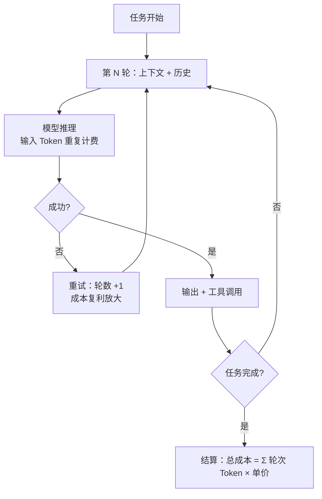
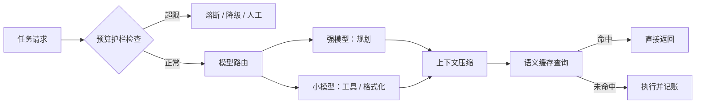

# Agent 经济学 2026 (Agent Economics)

> 中文简称：Agent 经济学

> **一句话理解**：聊天机器人像"问一次路付一次钱"，Agent 像"雇了个实习生满城跑腿"——每一步都要花 Token，不设预算上限的话，一天能烧掉你一个月的钱。

---

## 1. 为什么 Agent 的账单和聊天完全不同

传统聊天是一次请求一次回答，成本可预测；Agent 是**感知—规划—行动—反思**的循环，一次"任务"内部包含几十次模型调用。行业在 2026 年形成的基本共识：**Agent 单任务的 Token 消耗是对话场景的 5–30×**（Gartner 口径），且越复杂的编排模式倍数越高。

> **关联**: 宏观需求侧（Agent 如何接棒人类成为 Token 需求主力）见 [[18_行业应用/01_行业概览/09_Token_Economics_2026|Token 经济学与 AI 经济学 2026]]；本页聚焦工程侧的成本解剖与治理。

### 人类带宽 vs Agent 带宽

| **维度** | **人类** | **LLM Agent** |
|------|------|-----------|
| 认知输入带宽 | ~10 bits/s（有生理上限） | 每秒可处理数十万 Token |
| 工作节律 | 睡觉、摸鱼、开会 | 7×24 常驻轮询 |
| 边际成本 | 工资（固定） | Token（随任务线性增长） |
| 失败代价 | 返工一次 | 重试循环，成本指数放大 |

这意味着 **1000 个常驻 Agent 的推理需求约等于一个中等国家的消费量级**——Agent 化不是"多几个请求"，而是需求形态的相变。

---

## 2. Token 消耗解剖：5–30× 都花在哪了

| **消耗源** | **典型占比** | **说明** |
|--------|---------|------|
| **上下文重放** | 30–50% | 每轮都重发历史上下文；轮数越多，重复计费越夸张（Stanford 2026 研究：**输入 Token 是成本主导项**） |
| 规划与反思 | 15–25% | ReAct/Plan-and-Execute 的思考文本长且无法压缩 |
| 工具调用与结果 | 10–20% | 工具返回的 JSON/网页内容直接进上下文 |
| 失败与重试 | 5–30%（方差极大） | 参数错误、幻觉、超时——重试会把单任务成本翻倍 |
| 最终输出 | <10% | 唯一用户可见的部分，却不是成本大头 |



图中的关键泄漏点是"失败 → 重试 → 更长上下文 → 更贵一轮"的**复利放大环**：不做干预时，单任务成本的方差比均值更值得监控。

---

## 3. 单任务成本公式与真实案例

### 成本公式

```text
单任务成本 ≈ Σ(每轮输入 Token × 输入价 + 每轮输出 Token × 输出价)
           × (1 + 重试率 × 重试成本系数)
           + 工具调用外部成本（搜索 / API / 沙箱）
```

注意两个工程含义：**输入单价主导**（上下文重放）意味着压缩历史比精简输出更值钱；**重试率进入乘法项**意味着稳定性工程就是降本工程。

### 2026 年两个标志性案例

| **案例** | **事件** | **教训** |
|------|------|------|
| **Uber** | Agent 预算 4 个月内烧穿，被迫紧急降配 | 没有按 Agent / 按租户的预算护栏，成本与价值脱钩 |
| **GitHub Copilot 转计费** | 从订阅制转向用量计费（Premium Requests 模式），激进用户成本被显性化 | 订阅制补贴 Agent 用量不可持续，行业向计量制迁移 |
| **Tokenmaxxing 退潮** | 2025 年"无脑塞满上下文刷量"的玩法在计量计费普及后迅速退潮 | 计费机制直接改变用户行为，是比提示词更强的约束 |

> **关联**: 商业模式光谱（按量/订阅/按价值/期货）的完整分析见 [[18_行业应用/01_行业概览/09_Token_Economics_2026|Token 经济学 2026 第 6 节]]；计费机制设计见 [[12_架构基建/06_云厂商/Alibaba_Cloud/产品/09_Token经济与商业化|Token 经济与商业化]]。

---

## 4. 度量体系：从 cost-per-token 到 cost-per-successful-completion

Agent 时代的北极星指标不再是"每百万 Token 多少钱"，而是：

> **单次成功完成成本**（cost-per-successful-completion）：完成一个验收通过的任务，总消耗多少美元。

| **指标** | **定义** | **告警建议** |
|------|------|---------|
| 每任务成本 P50/P95 | 成功任务成本分布 | P95 > 预算单价 ×3 |
| 任务成功率 | 验收通过 / 总任务 | <70% 时成本有效性崩塌 |
| 平均轮数 | 每任务模型调用次数 | >15 轮提示编排失控 |
| 重试率 | 重试任务 / 总任务 | >20% 优先修稳定性而非降本 |
| 缓存命中率 | 前缀缓存命中占比 | <30% 说明上下文结构未优化 |
| 模型分布 | 各档位模型请求占比 | 强模型占比 >50% 通常意味着路由缺失 |

分析框架可参考 arXiv:2604.22750（对 Agent 花钱行为的分析与预测）：**大多数 Agent 的成本分布呈重尾**——少数"失控任务"贡献了大部分账单，治理重点应放在尾部而非均值。

---

## 5. 降本工具箱（按 ROI 排序）

1. **模型路由**（节省 60–85%）：规划用强模型、工具调用与格式化用小模型。路由器与网关实践见 [[12_架构基建/11_AI网关/index|AI 网关]]。
2. **上下文卫生**：滑动窗口 + 摘要压缩历史，替代"全量重放"。输入 Token 是成本主导项，这里省 40% 等于总账省 15–25%。
3. **语义缓存**：相同/相似子任务命中缓存直接返回，对高频固定流程（如 CI 修复、报表生成）命中率可达 60%+。
4. **预算护栏**：每 Agent / 每租户 / 每任务三级预算上限 + 熔断器（circuit breaker），超限自动降级为小模型或人工介入——Uber 案例的直接答案。
5. **批处理与异步**：非实时任务走 Batch API（典型 5 折），夜间跑批。
6. **工具返回瘦身**：工具结果只回传字段摘要，原始 payload 落对象存储按需引用。



降本流水线的顺序不可颠倒：**先护栏（不失控），再路由（单价降），后压缩（总量降）**——反过来做会在没有熔断的情况下放大重试损失。

---

## 6. 治理视角：FinOps for Agents

McKinsey 2026 把 Agent 经济学上升为"运营模式"问题：Agent 是否值得养，取决于**任务价值密度**是否持续高于单任务成本。组织层面三件事：

1. **成本归属**：Agent 成本必须记账到业务租户，禁止共享池模糊化（大模型 API 账单没有归属就等于没有治理）。
2. **价值审计**：每月按"任务类型 × 成功率 × 人工替代成本"审计 Agent ROI，砍掉价值密度低于电费的任务。
3. **可观测性**：Token 消耗、轮数、重试率进监控大盘，异常放大（如重试风暴）当 P1 事故处理——排障路径见 [[15_智能体/01_Agent基础/04_Agent_可观测性_2026|Agent 可观测性 2026]]。

> **提示**：Agent 编排层的故障（死循环、工具调用失败、上下文溢出）与成本失控通常同源，治理时一并设计。

---

## 7. 语料来源（2026-03 ~ 2026-05 Talks & 研报）

| **#** | **来源** | **核心贡献** | **时间** |
|---|------|---------|------|
| 1 | Spheron：Agentic AI Inference Cost 2026 | 5–30× 拆解、Uber 案例与输入主导证据 | 2026 |
| 2 | Cockroach Labs：Managing Agentic AI Costs at Scale | 规模化 Agent 成本治理实践 | 2026 |
| 3 | Zylos：Inference Economics — AI Agent Compute Markets | Agent 算力市场结构 | 2026-04 |
| 4 | arXiv:2604.22750 | Agent 消费行为分析与成本预测 | 2026-04 |
| 5 | McKinsey：Is that AI agent worth it? | 组织运营模式视角的 Agent ROI | 2026 |
| 6 | Goldman Sachs：AI Agents Boost Tech Cash Flow | Agent 化对云厂商现金流的量化 | 2026-04 |
| 7 | Cicoria：Token Economics for AI Agents | 工程师视角的 Token 成本框架 | 2026 |

> ⚠️ **时效提示**：5–30× 与模型路由节省比例为 2026 上半年口径，随模型降价与编排框架演进会持续变化。

---

## Related

- [[18_行业应用/01_行业概览/09_Token_Economics_2026|Token 经济学与 AI 经济学 2026]] — Agent 需求爆炸的宏观语境
- [[15_智能体/01_Agent基础/03_Agent_未来_路线图_2026_2030|Agent 未来路线图 2026-2030]] — 编排模式演进方向
- [[15_智能体/01_Agent基础/06_Agent_生产_部署_操作手册|Agent 生产部署操作手册]] — 落地时的工程 checklist
- [[15_智能体/01_Agent基础/04_Agent_可观测性_2026|Agent 可观测性 2026]] — 成本指标落入监控大盘
- [[10_部署推理/06_成本管理/01_LLM_成本优化|LLM 成本优化]] — 推理层降本的完整技术栈
- [[12_架构基建/02_架构概览/01_AI_成本优化_2026|AI 成本优化 2026]] — 架构层成本治理
- [[13_运维/02_SRE与可靠性/09_成本优化_AI_深入分析|成本优化 AI 深入分析]] — SRE 视角的成本与可靠性平衡

---

*Last updated: 2026-09-07*
