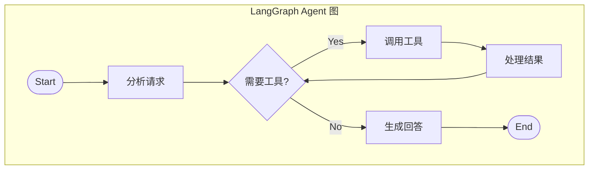

# LangGraph 深度解读

> 中文简称：LangGraph 深度解读

> **一句话理解**: LangGraph 把 Agent 工作流从"面条式调用"变成"有状态的图"——每个节点是一个步骤，边定义了流转逻辑，状态在节点间传递和更新，就像工厂的流水线。

---

## TL;DR

- **LangGraph = 有状态的图执行引擎**: 节点 (Node) + 边 (Edge) + 状态 (State) 构建 Agent 工作流
- **核心优势**: 循环支持、条件路由、持久化状态、人机协作、多 Agent 编排
- **vs LangChain Agent**: LangGraph 适合复杂、多步骤、需要精确控制流程的场景
- **生产特性**: Checkpointing、Streaming、Human-in-the-loop、LangGraph Platform
- **典型模式**: ReAct Agent、Plan-and-Execute、Multi-Agent、Hierarchical



---

## 1. 核心概念

### 1.1 状态 (State)

```python
from typing import TypedDict, Annotated
from langgraph.graph import StateGraph
import operator

# 定义图的状态结构
class AgentState(TypedDict):
    messages: Annotated[list, operator.add]  # 消息列表（追加模式）
    current_step: str                         # 当前步骤
    tool_results: dict                        # 工具执行结果
    iteration: int                            # 循环计数
    final_answer: str | None                  # 最终回答

# Annotated[list, operator.add] 的含义：
# 当多个节点更新 messages 时，新值会追加到列表中，而不是覆盖
```

### 1.2 节点 (Node)

```python
# 每个节点是一个函数：接收状态，返回状态的部分更新
def analyze_request(state: AgentState) -> dict:
    """分析用户请求，决定下一步"""
    messages = state["messages"]
    response = llm.invoke(messages)
    return {
        "messages": [response],
        "current_step": "analyzed"
    }

def call_tool(state: AgentState) -> dict:
    """执行工具调用"""
    last_message = state["messages"][-1]
    tool_call = last_message.tool_calls[0]
    
    result = tools[tool_call["name"]].invoke(tool_call["args"])
    
    return {
        "messages": [ToolMessage(content=result, tool_call_id=tool_call["id"])],
        "tool_results": {tool_call["name"]: result},
        "iteration": state["iteration"] + 1
    }

def generate_answer(state: AgentState) -> dict:
    """生成最终回答"""
    response = llm.invoke(state["messages"])
    return {
        "messages": [response],
        "final_answer": response.content
    }
```

### 1.3 边 (Edge) 与条件路由

```python
from langgraph.graph import StateGraph, START, END

# 构建图
graph = StateGraph(AgentState)

# 添加节点
graph.add_node("analyze", analyze_request)
graph.add_node("call_tool", call_tool)
graph.add_node("generate", generate_answer)

# 条件路由函数
def should_use_tool(state: AgentState) -> str:
    """根据 LLM 输出决定是否调用工具"""
    last_message = state["messages"][-1]
    
    if hasattr(last_message, "tool_calls") and last_message.tool_calls:
        if state["iteration"] >= 10:
            return "generate"  # 防止无限循环
        return "call_tool"
    return "generate"

# 添加边
graph.add_edge(START, "analyze")
graph.add_conditional_edges("analyze", should_use_tool, {
    "call_tool": "call_tool",
    "generate": "generate"
})
graph.add_edge("call_tool", "analyze")  # 工具结果返回分析节点（循环）
graph.add_edge("generate", END)

# 编译
app = graph.compile()
```

---

## 2. 常见设计模式

### 2.1 ReAct Agent

```python
# 最基本的 Agent 模式：Reasoning + Acting 循环
def create_react_agent(llm, tools):
    graph = StateGraph(AgentState)
    
    graph.add_node("agent", lambda state: {
        "messages": [llm.bind_tools(tools).invoke(state["messages"])]
    })
    
    graph.add_node("tools", lambda state: {
        "messages": [
            ToolMessage(
                content=tools[tc["name"]].invoke(tc["args"]),
                tool_call_id=tc["id"]
            )
            for tc in state["messages"][-1].tool_calls
        ]
    })
    
    graph.add_edge(START, "agent")
    graph.add_conditional_edges("agent", route_agent)
    graph.add_edge("tools", "agent")
    
    return graph.compile()

def route_agent(state):
    msg = state["messages"][-1]
    return "tools" if msg.tool_calls else END
```

### 2.2 Plan-and-Execute

```python
# 先规划再执行：适合复杂多步骤任务
class PlanExecuteState(TypedDict):
    input: str
    plan: list[str]           # 步骤列表
    current_step: int         # 当前步骤索引
    step_results: dict        # 每步结果
    final_answer: str

def planner(state):
    """生成执行计划"""
    plan = llm.invoke(f"""
    Break down this task into steps:
    {state['input']}
    Output as JSON list of steps.
    """)
    return {"plan": json.loads(plan.content), "current_step": 0}

def executor(state):
    """执行当前步骤"""
    step = state["plan"][state["current_step"]]
    result = agent.invoke(step)  # 用 ReAct Agent 执行单步
    return {
        "step_results": {step: result},
        "current_step": state["current_step"] + 1
    }

def should_continue(state):
    return "executor" if state["current_step"] < len(state["plan"]) else "synthesizer"
```

### 2.3 Multi-Agent 协作

```python
# 多 Agent 通过共享状态协作
class MultiAgentState(TypedDict):
    messages: Annotated[list, operator.add]
    active_agent: str         # 当前活跃的 Agent
    agent_outputs: dict       # 各 Agent 的输出

# Supervisor 模式：一个主管 Agent 调度多个专家
def supervisor(state):
    """决定哪个专家 Agent 接手"""
    response = llm.invoke(f"""
    Available agents: researcher, coder, reviewer
    Current state: {state['messages'][-5:]}
    Which agent should act next? (or FINISH)
    """)
    next_agent = response.content.strip().lower()
    return {"active_agent": next_agent}

def route_to_agent(state):
    agent = state["active_agent"]
    if agent == "finish":
        return "generate_final"
    return agent  # "researcher" / "coder" / "reviewer"
```

---

## 3. 生产特性

### 3.1 Checkpointing（状态持久化）

```python
from langgraph.checkpoint.sqlite import SqliteSaver

# 持久化 Agent 状态，支持中断恢复
checkpointer = SqliteSaver.from_conn_string("checkpoints.db")
app = graph.compile(checkpointer=checkpointer)

# 使用 thread_id 追踪会话
config = {"configurable": {"thread_id": "user-123-session-456"}}

# 第一次调用
result = app.invoke({"messages": [HumanMessage("Help me plan a trip")]}, config)

# 中断后恢复（状态从 checkpoint 加载）
result = app.invoke({"messages": [HumanMessage("I prefer beach destinations")]}, config)
```

### 3.2 Human-in-the-Loop

```python
from langgraph.checkpoint.memory import MemorySaver

# 在特定节点前暂停，等待人类确认
app = graph.compile(
    checkpointer=MemorySaver(),
    interrupt_before=["send_email", "make_payment"]  # 这些节点前暂停
)

# 第一次运行（会在 send_email 前暂停）
result = app.invoke(initial_state, config)

# 人类审核后继续
app.update_state(config, {"approved": True})
result = app.invoke(None, config)  # 从暂停处继续
```

### 3.3 Streaming

```python
# 流式输出（逐 token 或逐节点）
async for event in app.astream(
    {"messages": [HumanMessage("Analyze this data")]},
    config,
    stream_mode="updates"  # "values" | "updates" | "messages"
):
    # 每个节点完成后推送更新
    for node_name, node_output in event.items():
        print(f"[{node_name}]: {node_output}")
```

---

## 4. 调试与可观测性

### 4.1 LangSmith 集成

```python
import os
os.environ["LANGCHAIN_TRACING_V2"] = "true"
os.environ["LANGCHAIN_API_KEY"] = "..."
os.environ["LANGCHAIN_PROJECT"] = "my-agent"

# 自动追踪每次调用
# 可在 LangSmith UI 中查看：
# - 每个节点的输入/输出
# - 工具调用详情
# - Token 消耗
# - 延迟分布
```

### 4.2 图可视化

```python
# 导出图的可视化
from IPython.display import Image, display

display(Image(app.get_graph(xray=True).draw_mermaid_png()))
# xray=True: 显示子图细节
```

---

## 5. LangGraph vs 其他方案

| 特性 | LangGraph | LangChain Agent | AutoGen | CrewAI |
|------|-----------|-----------------|---------|--------|
| 循环支持 | 原生 | 有限 | 原生 | 原生 |
| 状态管理 | 强类型 | 隐式 | 对话历史 | 角色记忆 |
| 持久化 | Checkpointing | 无 | 无 | 无 |
| 人机协作 | interrupt | 无 | 有限 | 无 |
| 可视化 | 内置 | 无 | 无 | 无 |
| 生产部署 | LangGraph Platform | 自行部署 | 自行部署 | 自行部署 |

---

## 相关阅读

- [[15_智能体/03_Agent工作流/02_Agentic_工作流_设计_模式_2026]] — Agent 工作流设计模式
- [[15_智能体/03_Agent工作流/06_工作流_简明指南]] — 工作流速览
- [[15_智能体/05_Agent技能/14_工具调用_最佳实践]] — Tool Calling 最佳实践
- [[15_智能体/02_Agent框架/README]] — Agent 框架概览
- [[15_智能体/05_Agent技能/Agent_Skills_Practical_Guide]] — Agent Skills 实战
