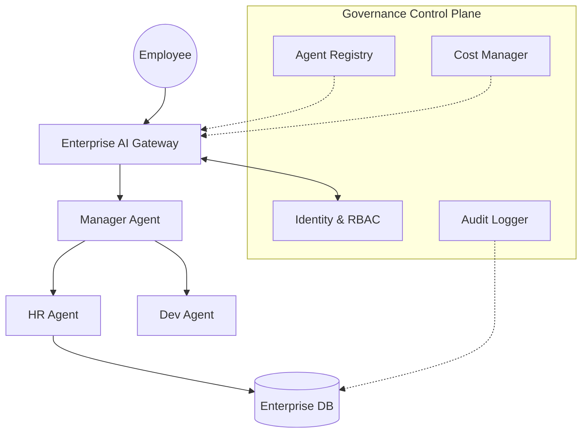

# Enterprise Agent Governance 2026: Managing Thousands of Agents

> 中文简称：企业智能体治理

> **一句话理解**: 企业智能体治理是确保公司内部成千上万个 AI Agent 在合规、安全、且成本可控的前提下运行的“交通指挥系统”。

---

## 目录

| 章节 | 内容 | 难度 |
|------|------|------|
| [智能体注册中心 (Registry)](#1-智能体注册中心-registry) | 发现能力、元数据管理、版本控制 | 进阶 |
| [Agent RBAC：基于角色的访问控制](#2-agent-rbac基于角色的访问控制) | 谁能调用什么工具？敏感数据保护 | 进阶 |
| [计费与配额管理 (Billing & Quotas)](#3-计费与配额管理-billing--quotas) | Token 归属、部门核算、自动熔断 | 进阶 |
| [全链路可观测性 (Observability)](#4-全链路可观测性-observability) | 追踪多级 Agent 调用、性能瓶颈分析 | 专业 |
| [安全与合规审计 (Audit)](#5-安全与合规审计-audit) | 记录所有工具调用、内容过滤规则 | 专业 |
| [治理架构图](#6-治理架构图) | 逻辑示意图 | 架构 |

---

## 1. 智能体注册中心 (Registry)

当企业拥有数百个部门开发的 Agent 时，“发现能力”成为核心痛点。

- **元数据规范**: 每个 Agent 必须登记其功能描述、所属部门、后端模型版本及所需的 MCP 权限。
- **能力发现 (Capability Discovery)**: 其他 Agent 可以通过语义搜索（而非硬编码 URL）在注册中心寻找合作伙伴。
- **状态监控**: 实时显示哪些 Agent 正在维护、哪些已过时（Deprecated）。

---

## 2. Agent RBAC：基于角色的访问控制

Agent 不再只是一个 API 密钥，它是一个“数字化员工”。

### 2.1 身份注入
通过 **Identity Injection**，将发起请求的人类员工的权限，动态下发给 Agent。
- *例子*: 如果 A 员工没有查看财务报表的权限，他指挥的 Agent 也会在尝试调用 `read_finance_db` 工具时被拒绝。

### 2.2 工具级权限
为每一个工具调用 (Tool Call) 设定最小权限原则。
- **只读模式**: 默认禁止 Agent 执行删除或修改操作。
- **敏感字段脱敏**: 自动对数据库返回的个人隐私数据（PII）进行掩码处理。

---

## 3. 计费与配额管理 (Billing & Quotas)

大模型调用极其昂贵，治理系统必须实现“财务透明”。

- **Token Attribution**: 利用 `trace_id` 追踪每一条请求的成本，将其归属到具体的业务项目或成本中心。
- **多层级配额**:
  - **L1 (部门级)**: 每月总预算。
  - **L2 (应用级)**: 每个 Agent 的 TPS 限制。
  - **L3 (用户级)**: 防刷机制，防止单个用户由于 Bug 造成 Token 爆炸。
- **自动熔断**: 当 Agent 出现“死循环”或“幻觉式过度调用”时，自动停止服务并报警。

---

## 4. 全链路可观测性 (Observability)

在多 Agent 协作（如 Orchestrator-Workers）模式下，传统的日志已失效。

- **Agent Trace**: 记录父 Agent 是如何把任务拆分给子 Agent 的全过程。
- **语义监控**: 监控 Agent 的“思考质量”分布。如果 20% 的请求都在“自我反思”中卡住，说明模型或 Prompt 需要升级。

---

## 5. 安全与合规审计 (Audit)

所有 Agent 对物理世界的影响必须可追溯。

- **不可篡改审计日志**: 利用区块链或安全存储记录所有 `tool_use` 行为及返回结果。
- **Shadow Monitoring**: 安全团队可以实时“监听”高风险 Agent 的所有输出。
- **法律遵从性扫描**: 自动检查 Agent 的输出是否符合 GDPR 或本地数据驻留要求。

---

## 6. 治理架构图

---

## Related

- [[12_架构基建/11_AI网关/01_AI网关_2026]] — 治理逻辑的物理落地层
- [[15_智能体/10_企业级Agent/03_Agent_生产_2026]] — 生产级部署
- [[17_伦理安全/03_AI治理/03_AI监管工程2026]] — 外部法律与内部治理的对接
- [[11_模型运维/01_MLOps基础/04_MLOps_Maturity_模型]] — 治理成熟度评估

---

*Last updated: 2026-06-04*

- [[15_智能体/README|Agent 生产部署 (Agent Production)]]

## 附录：核心概念速查

| 概念 | 说明 | 应用场景 |
|------|------|----------|
| Agent Loop | 感知-思考-行动循环 | 核心执行流程 |
| Tool Use | 调用外部工具/API | 扩展能力 |
| Memory | 短期/长期记忆 | 上下文维护 |
| Planning | 任务分解与排序 | 复杂任务 |
| Reflection | 自我评估改进 | 质量提升 |
| Multi-Agent | 多Agent协作 | 分布式任务 |

## 附录：技术栈对比

| 框架/工具 | 特点 | 适用场景 | 成熟度 |
|----------|------|----------|--------|
| LangChain | 链式调用 | 通用Agent | ★★★★☆ |
| LangGraph | 图结构编排 | 复杂流程 | ★★★★☆ |
| AutoGen | 多Agent对话 | 协作任务 | ★★★★☆ |
| CrewAI | 角色分工 | 团队模拟 | ★★★☆☆ |
| OpenAI SDK | 官方框架 | 快速原型 | ★★★★☆ |
| Semantic Kernel | 企业级 | .NET/Java | ★★★★☆ |

## 附录：学习路径

| 阶段 | 推荐内容 | 目标 |
|------|----------|------|
| 入门 | 基础概念文档 | 理解Agent |
| 进阶 | 本文档深度内容 | 掌握技术 |
| 实践 | 动手项目 | 构建应用 |
| 前沿 | 最新论文/产品 | 跟踪发展 |

## 附录：常见问题

| 问题 | 解答 |
|------|------|
| Agent和Chatbot的区别？ | Agent能自主决策+使用工具+持续执行 |
| 需要什么前置知识？ | LLM基础+编程+系统设计 |
| 如何评估Agent？ | 任务完成率+效率+安全性 |
| 2026年趋势？ | 多Agent协作/企业级/具身智能 |

## 附录：术语表

| 术语 | 英文 | 说明 |
|------|------|------|
| 智能体 | Agent | 自主决策AI系统 |
| 工具调用 | Tool Use | 使用外部工具 |
| 记忆 | Memory | 上下文/历史 |
| 规划 | Planning | 任务分解 |
| 反思 | Reflection | 自我评估 |
| 编排 | Orchestration | 流程管理 |
| 协议 | Protocol | 通信标准 |
| 护栏 | Guardrails | 安全约束 |

## 附录：检查清单

| 检查项 | 说明 | 状态 |
|--------|------|------|
| 理解核心概念 | Agent架构 | ☐ |
| 掌握工具调用 | MCP/Function Calling | ☐ |
| 了解记忆机制 | 短期/长期 | ☐ |
| 理解规划推理 | CoT/ReAct | ☐ |
| 动手实践 | 构建Agent | ☐ |
| 了解评估方法 | 质量度量 | ☐ |

> 💡 智能体是AI从"对话"走向"行动"的关键跨越。掌握Agent开发，是2026年AI工程师的核心竞争力。

---
*Last updated: 2026-07-21*

## 快速参考

| 维度 | 要点 | 备注 |
|------|------|------|
| 核心概念 | 理解基本原理和设计动机 | 理论基础 |
| 技术选型 | 根据场景选择合适方案 | 实践指导 |
| 最佳实践 | 遵循行业标准做法 | 质量保障 |
| 常见陷阱 | 避免已知问题和反模式 | 经验总结 |
| 发展趋势 | 关注技术演进方向 | 前瞻视野 |

## 延伸阅读

| 资源 | 类型 | 适用阶段 |
|------|------|----------|
| 官方文档 | 参考手册 | 全阶段 |
| 技术博客 | 深度分析 | 进阶 |
| 开源项目 | 代码实践 | 实战 |
| 学术论文 | 前沿研究 | 精通 |
| 社区讨论 | 经验交流 | 全阶段 |
