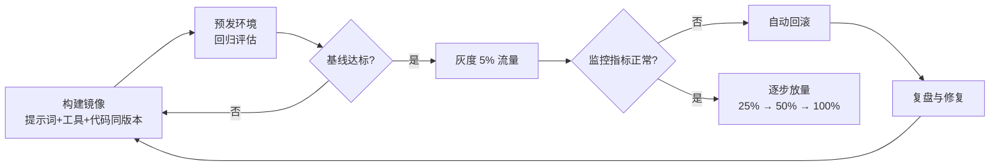

# Agent 生产部署 Runbook

> 中文简称：Agent 生产部署 Runbook

> **一句话理解**: 一份把 Agent 服务安全送上生产环境的操作清单——先检查、再灰度、可回滚、有监控。

---

## 适用场景

- Agent 服务（工具调用 / 多步推理 / 工作流编排）首次上线或大版本升级；
- 底层模型版本切换（如换用新版本模型）后的行为回归验证；
- 生产环境出现 Agent 异常循环、工具调用失败等事故时的处置入口。

Agent 与传统 API 服务的关键差异在于**行为不确定性**：同样的输入可能因模型版本、工具状态、上下文长度产生不同执行路径，因此本手册把「可回滚」与「可观测」置于流程核心。

---

## 上线前检查清单

| # | 检查项 | 通过标准 |
|---|--------|---------|
| 1 | 系统提示词与工具描述版本化 | 与代码同仓库、可回溯 |
| 2 | 工具调用最大步数限制 | 已设置（建议 ≤ 20 步） |
| 3 | 输出结构与工具返回格式校验 | Schema 校验通过，异常返回有兜底 |
| 4 | 离线评估基线 | 核心任务集通过率不低于上一版本 |
| 5 | 敏感操作权限收敛 | 高危工具需人工确认或白名单 |
| 6 | 成本上限 | 单会话 / 单任务 token 与调用费用限额生效 |
| 7 | 回滚方案 | 上一版本镜像与提示词可在 5 分钟内恢复 |

其中第 2、3 项直接对应 Agent 反复调用同一工具的典型事故模式；评估基线的建设方法见 [[08_模型评估/03_LLM评估/04_llm_system_evaluation|LLM 系统评估]]。

---

## 部署与发布流程

灰度期间重点对比新旧版本的任务完成率、平均步数、工具调用失败率三个指标，而不仅是延迟与错误率。发布顺序与依赖检查可参照 [[10_部署推理/README|部署推理章节]] 的通用上线流程。

---

## 回滚

回滚的单位是「版本三元组」：**模型版本 + 系统提示词版本 + 工具清单版本**。三者任一变更都可能改变行为，因此：

1. 三元组配置集中管理，禁止生产环境热修改提示词；
2. 回滚时三元组整体回退，避免「新提示词 + 旧模型」的未测试组合；
3. 保留最近 5 个可运行版本，回滚目标必须通过过预发评估。

---

## 监控告警基线

| 指标 | 建议告警阈值 | 说明 |
|------|-------------|------|
| 任务完成率 | 环比下降 > 5% | 行为回归的首要信号 |
| 平均执行步数 | 环比上升 > 30% | 可能出现循环或工具失败重试 |
| 工具调用失败率 | > 2% | 依赖服务或 Schema 变更 |
| 单任务成本 | 超过限额 80% | 防循环放大费用 |
| 端到端延迟 P99 | 超 SLO | 影响用户体验 |

指标采集与漂移检测的落地方法见 [[11_模型运维/08_可观测性/13_模型_监控_and_Drift_检测_2026|模型监控与漂移检测]]，工具调用的格式约束设计见 [[15_智能体/05_Agent技能/14_工具调用_最佳实践|工具调用最佳实践]]。

---

## 常见故障速查

| 现象 | 高概率原因 | 首选处置 |
|------|-----------|---------|
| 反复调用同一工具 | 返回格式不符、无终止条件 | 降低步数上限，校验工具返回 Schema |
| 任务中途静默失败 | 上下文超限被截断 | 缩短上下文，增加断点续跑 |
| 输出格式漂移 | 模型版本变更 | 回滚模型三元组，补结构化约束 |
| 工具超时拖垮整体 | 未设置工具级超时 | 每工具独立超时 + 降级路径 |
| 成本突增 | 循环重试或恶意输入 | 限额熔断，排查异常会话 |

---

## 关联

- [[15_智能体/README|15_智能体]] — Agent 领域知识总入口
- [[08_模型评估/03_LLM评估/04_llm_system_evaluation|LLM 系统评估]] — 上线前评估基线的方法论
- [[11_模型运维/08_可观测性/13_模型_监控_and_Drift_检测_2026|模型监控与漂移检测]] — 监控指标落地
- [[13_运维/02_SRE与可靠性/11_GPU_OOM_故障排查_指南|GPU OOM 故障排查指南]] — 底层资源故障处置
- [[10_部署推理/README|10_部署推理]] — 推理服务部署与优化

---

*Last updated: 2026-09-04*
