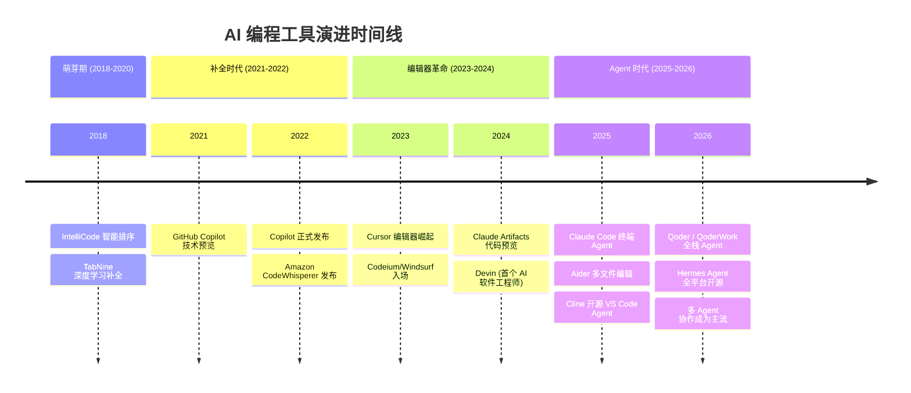
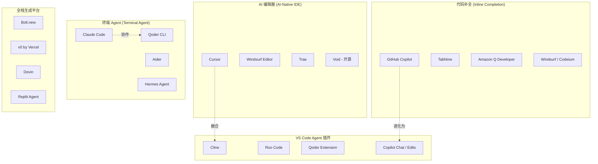
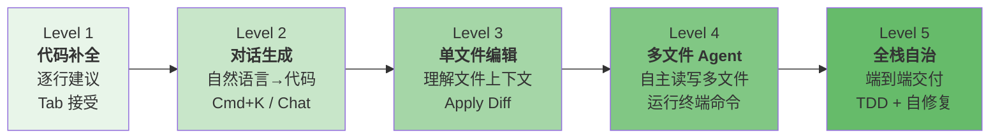
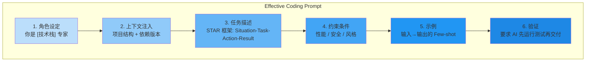
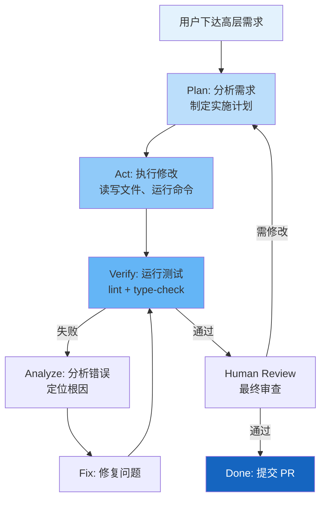
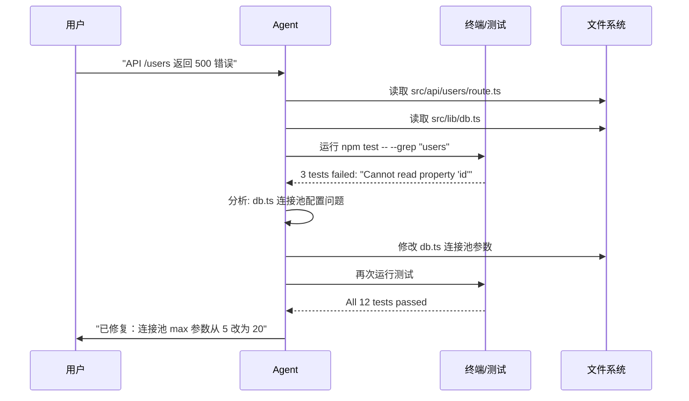
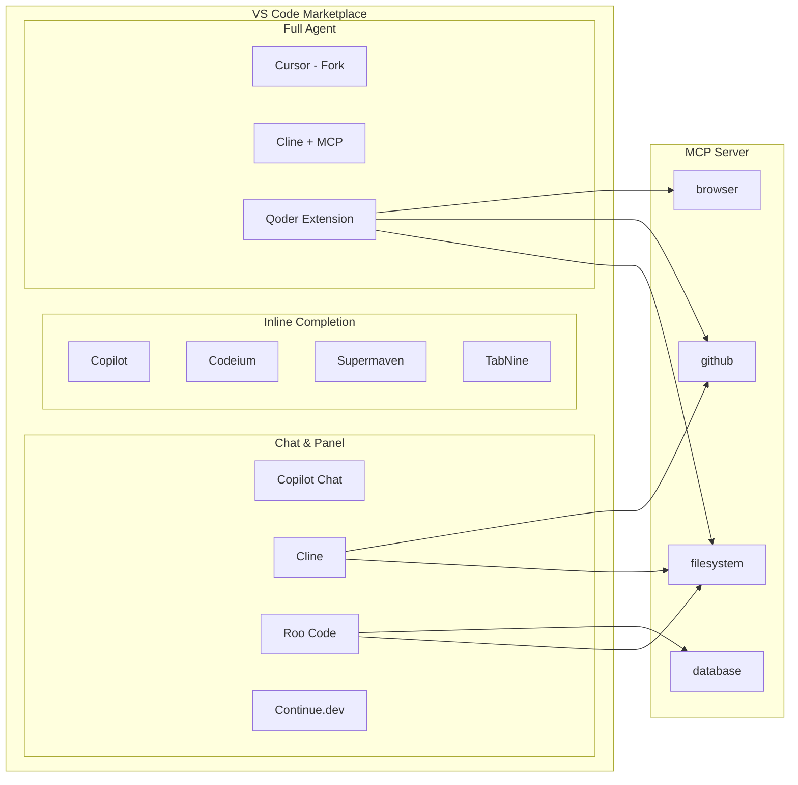
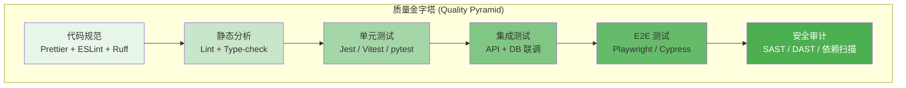
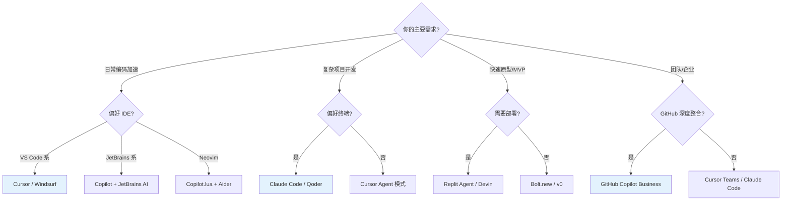

# AI 辅助编程速览 (AI-Assisted Coding in a Nutshell)

> 中文简称：AI 辅助编程速览

> **一句话理解**: AI 编程之于开发者，就像 GPS 之于司机——你仍然掌控方向盘，但 AI 帮你找路、避堵、甚至自动泊车。

---

## 目录

1. [AI 编程工具全景](#1-ai-编程工具全景)
2. [代码补全 vs 代码生成 vs Agent 编程](#2-代码补全-vs-代码生成-vs-agent-编程)
3. [Prompt Engineering for Code](#3-prompt-engineering-for-code)
4. [Agentic Coding 深度解析](#4-agentic-coding-深度解析)
5. [IDE 集成生态](#5-ide-集成生态)
6. [代码质量保障](#6-代码质量保障)
7. [工具功能/价格/模型/上下文对比表](#7-工具功能价格模型上下文对比表)
8. [关键术语](#8-关键术语)
9. [相关主题](#9-相关主题)

---

## 1. AI 编程工具全景

### 发展时间线 (Timeline)



### 工具分类全景图



---

## 2. 代码补全 vs 代码生成 vs Agent 编程

### 三大范式对比表

| 维度 | 代码补全 (Completion) | 代码生成 (Generation) | Agent 编程 (Agentic) |
|------|----------------------|----------------------|---------------------|
| **代表工具** | Copilot, TabNine | ChatGPT, Claude, Copilot Chat | Claude Code, Cursor Agent, Qoder |
| **交互方式** | 行内自动触发 | 对话式 / Prompt 驱动 | 目标驱动，自主规划执行 |
| **输入** | 当前光标上下文 | 自然语言描述 | 高层需求 + 项目上下文 |
| **输出** | 1-30 行代码片段 | 完整函数 / 文件 | 多文件修改 + 测试 + 提交 |
| **上下文窗口** | 局部 (当前文件) | 对话窗口 (8K-200K tokens) | 全项目 (工具读取任意文件) |
| **自主性** | 被动 (等待触发) | 半主动 (需确认) | 高主动 (自主循环执行) |
| **人工干预** | 频繁 (每行确认) | 中等 (复制粘贴) | 低 (审查最终结果) |
| **适用场景** | 日常编码加速 | 新功能开发、方案讨论 | 大规模重构、复杂调试 |
| **准确率** | 70-85% (补全接受率) | 60-80% (一次生成) | 85-95% (含自验证) |
| **风险** | 低 (影响范围小) | 中 (需人工审查) | 高 (批量修改需回滚能力) |

### 能力进化阶梯



---

## 3. Prompt Engineering for Code

### 核心三要素

| 要素 | 说明 | 示例 |
|------|------|------|
| **System Prompt** | 设定 AI 的角色、约束和输出格式 | "你是高级 Python 工程师，遵循 PEP8，只输出可运行代码" |
| **Context (上下文)** | 提供项目结构、依赖、已有代码 | 文件树 + requirements.txt + 相关模块代码 |
| **Few-shot Examples** | 用 1-3 个示例展示期望的输入输出 | 给出一个函数的输入/输出示例 |

### System Prompt 模板

```yaml
# .cursorrules / CLAUDE.md / system-prompt
role: "Senior TypeScript Engineer"
constraints:
  - "使用 strict mode，所有类型显式声明"
  - "遵循项目现有代码风格 (参考 .eslintrc)"
  - "错误处理使用 Result pattern，不使用 throw"
  - "测试覆盖率 > 80%"
output_format:
  - "先输出变更计划 (≤5 行)"
  - "然后输出代码 diff"
  - "最后输出测试代码"
```

### Prompt 工程最佳实践



### 场景化 Prompt 示例

#### 新功能开发

```text
[Role] 你是 React + TypeScript 高级工程师。
[Context] 项目使用 Next.js 14 App Router, Tailwind CSS, Prisma ORM。
[Task] 创建一个用户管理页面：
  - 展示用户列表 (分页，每页 20 条)
  - 支持搜索、排序、删除
  - 使用 Server Components + Client Components 混合模式
[Constraints]
  - 遵循现有 /app 目录结构
  - 使用 react-hook-form 处理表单
  - 所有 API 调用走 server actions
[Example] 参考 /app/products/page.tsx 的实现风格
```

#### Bug 修复

```text
[Bug] 用户反馈：点击"保存"后偶现数据丢失
[Stack] Next.js 14 + Prisma + PostgreSQL
[Repro] 快速连续点击保存按钮 → 第二次请求覆盖第一次
[Expected] 保存成功后禁用按钮，防止重复提交
[Files] 参考 src/app/users/[id]/edit/page.tsx
```

---

## 4. Agentic Coding 深度解析

### 核心循环

Agentic Coding 的核心是一个 **Plan → Act → Verify → Fix** 的自主循环。



### Multi-file Editing 工作流

```text
用户需求: "给项目添加国际化 (i18n) 支持"

Agent 执行计划:
  1. [读取] package.json → 确认框架版本
  2. [读取] 现有组件结构 → 了解需要修改的文件
  3. [安装] npm install next-intl
  4. [创建] i18n/config.ts, i18n/request.ts
  5. [修改] next.config.js → 添加 i18n 配置
  6. [修改] layout.tsx → 添加语言切换
  7. [修改] page.tsx → 抽取硬编码文本为 translation keys
  8. [创建] messages/en.json, messages/zh.json
  9. [运行] npm run lint && npm run type-check
  10.[运行] npm test
  11.[修复] 如果测试失败 → 分析并修复
```

### TDD 驱动的 Agent 循环

```text
Step 1: 用户描述需求 → Agent 先生成测试用例
Step 2: 运行测试 → 全部 RED (未实现)
Step 3: Agent 编写实现代码
Step 4: 运行测试 → GREEN
Step 5: Agent 重构代码
Step 6: 运行测试 → 仍然 GREEN
Step 7: 提交 → git commit -m "feat: add user management"
```

### Debugging Loop 详解



---

## 5. IDE 集成生态

### 主流 IDE 支持矩阵

| IDE / 环境 | 代码补全 | 对话 Chat | Agent 模式 | 终端 Agent |
|-----------|---------|----------|-----------|-----------|
| **VS Code** | Copilot, Codeium, Supermaven | Copilot Chat, Cline | Cursor, Cline, Roo Code | Claude Code, Aider, Qoder |
| **JetBrains** | Copilot, AI Assistant, Codeium | AI Assistant Chat | JetBrains AI Agent | Claude Code, Aider |
| **Neovim** | Copilot.lua, Codeium, Supermaven | Avante, Copilot Chat | -- | Claude Code, Aider, Hermes |
| **Terminal** | -- | -- | -- | Claude Code, Aider, Qoder, Hermes |
| **Xcode** | Copilot (有限) | -- | -- | Claude Code |
| **Web (Browser)** | -- | ChatGPT, Claude | Bolt.new, Replit | -- |

### VS Code 插件生态图



### 快捷键速查 (Cursor / VS Code)

```text
┌─────────────────────────────────────────────────┐
│  Cursor              │  VS Code + Copilot       │
├─────────────────────────────────────────────────┤
│  Tab        接受补全   │  Tab        接受补全     │
│  Cmd+K      AI 编辑   │  Cmd+I      Copilot Edits│
│  Cmd+L      AI 对话   │  Cmd+I      Inline Chat │
│  Cmd+I      Composer  │  Ctrl+Enter  打开建议面板 │
│  Cmd+Shift+I Agent模式│  Cmd+L      Copilot Chat │
│  @file      引用文件   │  #file      引用文件     │
│  @codebase  搜索项目   │  #workspace 搜索项目     │
│  @web       联网搜索   │  @workspace 搜索工作区   │
└─────────────────────────────────────────────────┘
```

---

## 6. 代码质量保障

### AI 编程中的质量金字塔



### AI 工作流中的质量检查点

| 检查点 | 时机 | 工具 | AI 参与度 |
|--------|------|------|----------|
| **Lint & Format** | 每次保存 | ESLint, Ruff, Prettier | 自动 (AI 遵循规则) |
| **Type Check** | 每次提交 | tsc, mypy | 自动 (AI 修复类型错误) |
| **Unit Test** | 每次修改 | Jest, pytest | AI 生成 + AI 修复 |
| **Security Scan** | PR 创建时 | Semgrep, Snyk, CodeQL | AI 辅助修复 |
| **Code Review** | PR 审查 | PR Comments, Copilot Review | AI 预审 + 人工终审 |
| **E2E Test** | 合并前 | Playwright, Cypress | AI 生成测试脚本 |

### 安全防护清单

```text
[ ] AI 生成的代码不包含硬编码密钥 (API keys, passwords)
[ ] SQL 查询使用参数化查询，防止注入
[ ] 用户输入经过验证和清洗 (XSS / CSRF)
[ ] 依赖项无已知漏洞 (npm audit / pip-audit)
[ ] AI 没有引入过度权限 (最小权限原则)
[ ] 敏感数据处理符合 GDPR / 隐私政策
[ ] AI 没有将内部代码发送到外部 API (数据泄露)
```

### 在 Cursor / Claude Code 中配置质量门禁

```bash
# .cursorrules 中的质量约束
- "每次代码修改后，必须运行 npm run lint 和 npm test"
- "如果 lint 失败，自动修复后重新验证"
- "不允许使用 any 类型，必须有完整的 TypeScript 类型"
- "所有公共函数必须有 JSDoc 注释"
- "安全敏感操作 (auth, payment) 必须有人工确认标记"
```

```bash
# CLAUDE.md 中的质量约束
## Quality Requirements
- Always run `npm run lint` after code changes
- Always run `npm test` and fix any failing tests
- Use `npx tsc --noEmit` to verify type safety
- Never use `eval()`, `Function()`, or dynamic imports with user input
- All HTTP endpoints must validate request bodies with Zod
```

---

## 7. 工具功能/价格/模型/上下文对比表

### 2026 年 AI 编程工具全面对比

| 工具 | 类型 | 价格 (月) | 底层模型 | 上下文窗口 | 多文件编辑 | Agent 模式 | 终端支持 |
|------|------|----------|---------|-----------|-----------|-----------|---------|
| **Cursor** | AI 编辑器 | 免费 / $20 Pro | Claude 4, GPT-4o, Gemini | 200K tokens | 原生支持 | Composer Agent | -- |
| **Claude Code** | 终端 Agent | $20 (Claude Pro) / API | Claude 4 Sonnet/Opus | 200K tokens | 原生支持 | 全自主 | 原生终端 |
| **Qoder** | 全栈 Agent | 免费 / $20 Pro | 多模型路由 | 200K tokens | 原生支持 | 全自主 | 原生终端 |
| **GitHub Copilot** | IDE 插件 | 免费 / $10 / $19 Biz | GPT-4o, Claude 3.5 | 128K tokens | Copilot Edits | Copilot Agent | -- |
| **Cline** | VS Code Agent | 免费 (自带 API) | 任意 (用户配置) | 模型依赖 | 通过 Diff | 全自主 | 集成终端 |
| **Aider** | 终端 Agent | 免费 (自带 API) | GPT-4o, Claude 等 | 128K-200K | Git 集成 | 半自主 | 原生终端 |
| **Windsurf** | AI 编辑器 | 免费 / $15 Pro | Cascade (自研) | 100K+ tokens | 原生支持 | Cascade Flow | -- |
| **Hermes Agent** | 终端 Agent | 免费 (开源) | 17+ Provider | 模型依赖 | 支持 | 全自主 | 原生终端 |
| **JetBrains AI** | IDE 插件 | 含 JetBrains 订阅 | 多模型 | 128K tokens | 支持 | AI Agent | -- |
| **Trae** | AI 编辑器 | 免费 | Claude, GPT-4o | 128K tokens | 原生支持 | Builder 模式 | -- |
| **Devin** | 全栈平台 | $500 / $2000 Team | 自研多模态 | 全项目 | 全自主 | 全自主 | 云终端 |
| **Replit Agent** | 云平台 | $25 Core | Claude, GPT-4o | 128K tokens | 全自主 | 全自主 | 云终端 |

### 选型决策树



### 性价比排名 (个人开发者视角)

| 排名 | 工具 | 月费 | 核心价值 | 推荐理由 |
|------|------|------|---------|---------|
| 1 | Cline + 自有 API | ~$5-15 | 全自主 Agent | 开源免费，自带 API key 成本最低 |
| 2 | Aider + 自有 API | ~$5-15 | Git 集成 Agent | 终端党的最佳选择，Git 工作流完美 |
| 3 | Cursor Pro | $20 | 全能 IDE | 体验最完整，72% 补全接受率 |
| 4 | Claude Code | $20 | 终端 Agent | Claude Pro 用户零成本，能力极强 |
| 5 | Copilot | $10 | 补全效率 | 最成熟的补全方案，企业首选 |
| 6 | Windsurf | $15 | 性价比 IDE | 比 Cursor 便宜，体验接近 |
| 7 | Trae | 免费 | 零成本入门 | 字节跳动出品，免费且功能完善 |
| 8 | Hermes Agent | 免费 | 全平台开源 | 17+ Provider，适合极客玩家 |

---

## 8. 关键术语

| 术语 | 英文 | 解释 |
|------|------|------|
| **Inline Completion** | 行内补全 | AI 在光标位置自动建议后续代码 |
| **Agentic Coding** | 代理式编程 | AI 自主规划、执行、验证的编程范式 |
| **Context Window** | 上下文窗口 | AI 一次能处理的最大 token 数 |
| **System Prompt** | 系统提示词 | 设定 AI 角色和约束的隐藏指令 |
| **Few-shot Prompting** | 少样本提示 | 提供 1-3 个示例引导 AI 输出风格 |
| **MCP** | Model Context Protocol | Anthropic 提出的模型上下文协议，标准化 AI 与外部工具的交互 |
| **Rules File** | 规则文件 | .cursorrules / CLAUDE.md 等，为 AI 提供项目级约束 |
| **Diff** | 差异 | 代码变更的格式，显示增删改的行 |
| **TDD** | Test-Driven Development | 测试驱动开发，先写测试再写实现 |
| **Vibe Coding** | 氛围编程 | 用自然语言描述需求，AI 完成实现，开发者"感受"结果 |
| **Multi-file Edit** | 多文件编辑 | Agent 同时修改多个文件的变更集 |
| **Tool Use** | 工具调用 | AI 调用外部工具 (终端、浏览器、数据库) 的能力 |
| **Self-healing** | 自修复 | Agent 检测到错误后自动分析并修复 |

---

## 9. 相关主题

| 主题 | 文档 | 说明 |
|------|------|------|
| AI 编程理论基础 | [01_AI_编程_理论.md](.././02_理论基础/01_AI_编程_理论.md) | 编程范式演进、LLM 与代码生成原理 |
| 工具全景对比 | [01_AI_编程_Assistants_2026.md](.././05_开发工具/01_AI_编程_Assistants_2026.md) | 完整工具评测与选型决策树 |
| Vibe Coding 入门 | [06_Vibe_Coding_快速入门.md](.././04_实践指南/06_Vibe_Coding_快速入门.md) | 5 分钟入门、4 步安全法 |
| 提示词模板库 | [07_Vibe_Coding_Prompt_模板.md](.././04_实践指南/07_Vibe_Coding_Prompt_模板.md) | STAR 框架、8 大场景模板 |
| Agentic Coding 方法论 | [01_Agent编程_方法论.md](.././03_方法论/01_Agent编程_方法论.md) | 多 Agent 协作架构与编排 |
| 生产实践 | [04_Vibe_Coding_生产_实践.md](.././03_方法论/04_Vibe_Coding_生产_实践.md) | 安全工程、质量监控、技术债管理 |
| Prompt Engineering 速览 | [05_大模型/07_提示工程/17_Prompt_工程_简明指南.md](05_大模型/07_提示工程/17_Prompt_工程_简明指南.md) | 通用提示工程方法论 |
| AI Agent 速览 | [../06_强化学习/AI_Agents/11_Agent_简明指南.md](../../15_智能体/01_Agent基础/11_Agent_简明指南.md) | Agent 架构与能力概述 |
| RAG 系统速览 | [../../14_RAG系统/01_RAG基础/08_RAG_简明指南.md](../../14_RAG系统/01_RAG基础/08_RAG_简明指南.md) | 检索增强生成，AI 编程中的文档检索基础 |
| Hermes Agent 指南 | [./Tools/14_Hermes_Agent_2026.md](.././05_开发工具/14_Hermes_Agent_2026.md) | 17+ Provider 全平台开源 Agent |
| Qoder 使用指南 | [./Tools/24_Qoder_指南.md](.././05_开发工具/24_Qoder_指南.md) | Qoder / QoderWork / QoderWake 详解 |

---

## 速查卡片 (Cheat Sheet)

### 场景 → 推荐工具

```text
┌────────────────────────────────────────────────────────┐
│  场景                    │  推荐工具 (2026)            │
├────────────────────────────────────────────────────────┤
│  日常编码加速             │  Cursor / Copilot          │
│  新功能开发               │  Cursor Agent / Claude Code│
│  大规模重构               │  Claude Code / Qoder       │
│  Bug 调试                │  Claude Code / Cursor Agent │
│  快速原型 / MVP           │  Bolt.new / Replit Agent   │
│  前端 UI 组件             │  v0 + Cursor               │
│  代码审查                 │  Copilot Review / Cline    │
│  学习新语言/框架           │  Claude / ChatGPT          │
│  团队协作                 │  Copilot Business          │
│  终端极客                 │  Aider / Hermes Agent      │
│  零成本入门               │  Trae / Cline + 自有 API   │
│  企业级全栈               │  Devin / Qoder Work        │
└────────────────────────────────────────────────────────┘
```

### AI 编程黄金法则

```text
 1. 永远审查 AI 生成的代码 — 你是最终责任人
 2. 一次只做一件事 — 小任务比大任务准确率高 3x
 3. 提供充足上下文 — 好的 Prompt = 好的输出
 4. 先写测试，再让 AI 实现 — TDD 是最好的安全网
 5. 用 Git 分支隔离 AI 变更 — 随时可以回滚
 6. 配置 Rules File — 项目级约束避免重复沟通
 7. 不要让 AI 接触生产环境 — 沙箱隔离是底线
 8. 定期更新工具 — AI 编程领域每月都有突破
 9. 建立团队规范 — 统一工具和 Prompt 模板
10. 保持学习心态 — 工具会变，编程思维不变
```

---

## 常见陷阱速查

| 陷阱 | 症状 | 预防 |
|------|------|------|
| **幻觉 API** | AI 调用了不存在的库方法 | 运行代码验证 + 查官方文档 |
| **版本穿越** | AI 用了已废弃的 API | 在 Prompt 中指定版本 |
| **过度工程** | 简单问题复杂化 | 明确要求 "简单实现" |
| **上下文丢失** | 长对话中 AI 忘记约束 | 定期重申关键规则 |
| **安全盲区** | AI 忽略输入验证 | 显式要求安全处理 |
| **风格不一致** | AI 代码与项目风格冲突 | 配置 Rules File + 提供示例代码 |
| **批量破坏** | Agent 模式误删/误改多文件 | Git 分支隔离 + diff 审查 |
| **数据泄露** | 代码/密钥发送到外部 API | 敏感信息过滤 + 本地模型 |

---

*Last updated: 2026-06-05*

## 相关链接

- [[16_编程/01_编程基础/01_AI编程2026指南|AI 编程 2026 指南]] — 详细指南
- [[16_编程/01_编程基础/01_AI编程2026指南|AI 编程 (小白版)]] — 零基础版本
- [[16_编程/index|编程索引]] — AI 编程主题导览
- [[16_编程/03_方法论/03_Vibe_Coding_方法论|Vibe Coding 方法论]] — AI 编程方法论
- [[15_智能体/08_Agent编程工具/Agentic_Coding_Tools_Overview|Agentic Coding 工具概览]] — 编程工具全景
- [[16_编程/05_开发工具/01_AI_编程_Assistants_2026|AI 编程助手 2026]] — 编程助手对比
