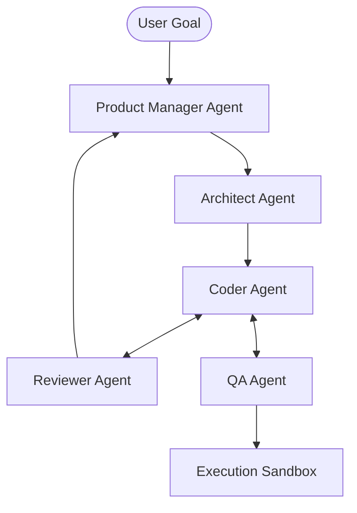

# Agentic Coding Methodology 2026: Multi-Agent Software Engineering

> 中文简称：智能体编程方法论

> **一句话理解**: Agentic Coding 是软件工程的范式转移——从“人编写代码”转变为“人指挥一个由多个 AI 专家组成的团队协作编写代码”。

---

## 目录

| 章节 | 内容 | 难度 |
|------|------|------|
| [从 Copilot 到 Agentic Team](#1-从-copilot-到-agentic-team) | 范式演进、自主性等级 | 入门 |
| [多智能体协作架构 (M-ASE)](#2-多智能体协作架构-m-ase) | 角色定义、通信协议、环境共享 | 进阶 |
| [核心协作模式](#3-核心协作模式) | 瀑布流、蜂群模式、评审循环 | 进阶 |
| [环境与工具：The Sandbox](#4-环境与工具the-sandbox) | 隔离执行环境、LSP 共享、实时调试 | 专业 |
| [质量保障：Agent-in-the-Loop](#5-质量保障agent-in-the-loop) | 自动测试、覆盖率驱动的迭代、漏洞自愈 | 进阶 |
| [2026 实战工作流案例](#6-2026-实战工作流案例) | 从需求文档到部署的 0 人工干预尝试 | 实战 |

---

## 1. 从 Copilot 到 Agentic Team

传统的 AI 编程（如 2023 年的 Copilot）是“指令式”的。Agentic Coding 则是“目标驱动”的。

### 1.1 自主性等级 (Autonomy Levels)
- **L1: 补全式**: 预测下一行代码。
- **L2: 聊天式**: 通过对话生成函数或文件。
- **L3: 任务级 Agent**: 给出一个明确任务（如“重构这个模块”），它能自主阅读文件并修改。
- **L4: 协作型 Team (Current 2026)**: 多个 Agent 扮演不同角色（设计、编码、测试），共同完成一个 Epic。

---

## 2. 多智能体协作架构 (Multi-Agent Software Engineering)

在 2026 年，一个典型的编程智能体团队由以下角色组成：

### 2.1 角色职责 (Role Definition)
- **Architect (架构师)**: 负责全局依赖分析、技术选型和接口定义。
- **Implementer (执行者)**: 负责编写具体逻辑，直接操作文件系统。
- **Tester (测试员)**: 编写单测、集成测试，并在沙箱中运行。
- **Reviewer (评审员)**: 负责代码风格检查、安全扫描和逻辑纠错。

---

## 3. 核心协作模式

### 3.1 瀑布流模式 (Sequential Chain)
最稳定的模式，上一个 Agent 的输出是下一个的输入。适用于需求明确的小型功能。

### 3.2 动态蜂群模式 (Dynamic Swarms)
Agent 根据实时运行结果（如编译错误）动态生成新的子任务。
- **特点**: 高自主性，适合处理复杂的存量代码重构。

### 3.3 竞争与共识 (Competitive Selection)
同时由两个不同的模型（如 Claude 4 和 GPT-5）生成方案，由第三个模型进行 Cross-check 并选择最优解。

---

## 4. 环境与工具：The Sandbox

Agentic Coding 的核心不是模型，而是**环境能力**。

- **隔离环境**: 所有代码修改和运行都在 Docker 容器或 WebContainer 中进行，防止污染宿主机。
- **LSP 深度集成**: Agent 不再只是看纯文本，它们通过 Language Server Protocol (LSP) 获取符号定义、类型提示和引用关系。
- **Tool-use 矩阵**: 
  - `edit_file`: 增量修改。
  - `run_command`: 执行 shell 命令。
  - `search_repo`: 语义化搜索代码库。
  - `browser_interact`: 运行前端并截图验证 UI。

---

## 5. 质量保障：Agent-in-the-Loop

### 5.1 覆盖率驱动的自我修正
1. Agent 编写功能代码。
2. Agent 编写测试用例。
3. 运行测试，发现覆盖率不足或报错。
4. Agent 自动分析报错日志，修改代码。
5. **循环直到 100% 通过**。

### 5.2 安全左移
Reviewer Agent 在合并代码前自动运行 SAST (静态分析工具) 和红队测试，拦截潜在的 SQL 注入或凭证泄露。

---

## 6. 2026 实战工作流案例

### 场景：从 Figma 图片到全栈功能
1. **Frontend Agent**: 读取 Figma 截图，生成 React 组件。
2. **Backend Agent**: 根据前端需求，定义 FastAPI 接口并模拟 Mock 数据。
3. **Database Agent**: 设计 SQL 迁移文件。
4. **Integration Agent**: 将三者串联，并在沙箱中运行端到端测试。
5. **Human**: 审核最终运行的预览链接，点击“Deploy”。

---

## Related

- [[16_编程/02_理论基础/01_AI_编程_理论]] — 编程范式演进
- [[15_智能体/02_Agent框架/04_AutoGen_CrewAI_LangGraph_Dive]] — 协作框架的技术底层
- [[15_智能体/03_Agent工作流/02_Agentic_工作流_设计_模式_2026]] — 通用工作流模式
- [[16_编程/03_方法论/03_Vibe_Coding_方法论]] — 个人开发者视角的方法论

---

*Last updated: 2026-06-04*
