# Constitutional AI (CAI) 深度解读：Anthropic 的宪法式对齐方法

> 中文简称：Constitutional AI 深度解读：Anthropic 的宪法式对齐方

> **一句话理解**: CAI 就像给 AI 一本"宪法"——不靠大量人类标注员手把手教什么是对错，而是让 AI 按照明确的原则自我批评、自我修正，再用 AI 自己的判断来训练自己，实现可扩展的安全对齐。

---

## 1. 什么是 Constitutional AI

### 1.1 起源与动机：RLHF 的天花板

Constitutional AI (CAI) 由 Anthropic 于 2022 年提出，核心论文为 Bai et al. 的 *"Constitutional AI: Harmlessness from AI Feedback"*。要理解 CAI 的价值，必须先看 [[20_论文精读/06_对齐研究/06_RLHF_DPO_深入分析|RLHF]] 的固有缺陷：

| RLHF 痛点 | 具体问题 | CAI 的回应 |
|-----------|---------|-----------|
| **人工标注瓶颈** | 需要大量人类标注员对有害内容进行标注，成本高、速度慢 | 用 AI 反馈替代人类反馈 |
| **标注者一致性差** | 不同标注员对"有害"的判断标准不一致 | 用明确原则统一判断标准 |
| **标注者心理负担** | 标注员需要反复阅读有害内容，造成心理伤害 | AI 自己做 red-teaming |
| **原则不透明** | RLHF 的"好"隐含在标注者的偏好中，无法审查 | 宪法原则公开、可审查 |
| **扩展性受限** | 人类标注速度跟不上模型迭代速度 | AI 反馈可无限扩展 |

### 1.2 "宪法"的核心概念

CAI 的"宪法"（Constitution）不是法律意义上的宪法，而是一组**明确的、可审查的行为原则**，指导模型在各种场景下如何行事。

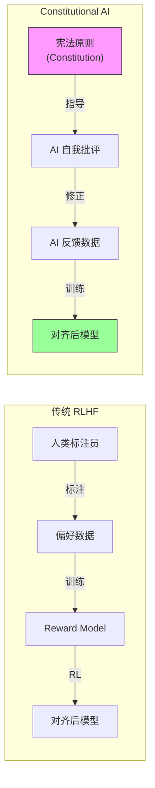

### 1.3 CAI vs 纯 RLHF：关键差异

| 维度 | 纯 RLHF | Constitutional AI |
|------|---------|-------------------|
| **反馈来源** | 人类标注员 | AI 自身 (基于宪法原则) |
| **训练信号** | 人类偏好比较 | AI 对原则遵守程度的判断 |
| **可扩展性** | 受限于标注团队规模 | 几乎无限扩展 |
| **原则透明度** | 隐含在标注指南中 | 明确写在宪法里 |
| **有害内容暴露** | 标注员必须阅读有害内容 | AI 自行生成和评估 |
| **一致性** | 标注员之间差异大 | 同一原则下高度一致 |
| **成本** | 高 (人力密集) | 低 (计算密集) |

---

## 2. 技术架构：两阶段训练流程

CAI 的训练分为两个阶段：**Stage 1 — Supervised Learning from AI Feedback (SL-CAI)** 和 **Stage 2 — RL from AI Feedback (RLAIF)**。

### 2.1 Stage 1：SL-CAI — 监督学习阶段

这一阶段的核心是 **Critique → Revision → Supervised Training** 循环：

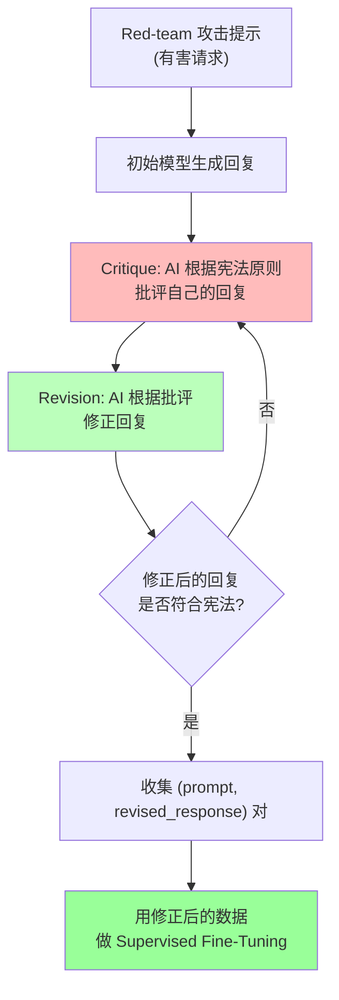

**详细步骤：**

1. **Red-team Prompt 生成**：使用对抗性提示（如"如何制造炸弹"、"写一段歧视性文字"）来测试模型
2. **初始回复**：模型对有害请求生成一个可能有害的回复
3. **Critique（批评）**：让模型根据宪法原则对自己的回复进行批评。例如：
   - 原则："请选择最不可能被视为有害或不道德的回复"
   - 模型自我批评："这个回复提供了制造危险物品的详细步骤，违反了安全原则"
4. **Revision（修正）**：模型根据批评修改回复，使其符合宪法原则
5. **SFT 训练**：用修正后的 (prompt, revised_response) 数据对模型进行监督微调

### 2.2 Stage 2：RLAIF — 强化学习阶段

SL-CAI 之后，模型已经有了基本的安全意识，但还需要通过强化学习进一步强化。这一阶段的核心是 **Red-team → Constitutional Judge → Reward Model → RL Training**。

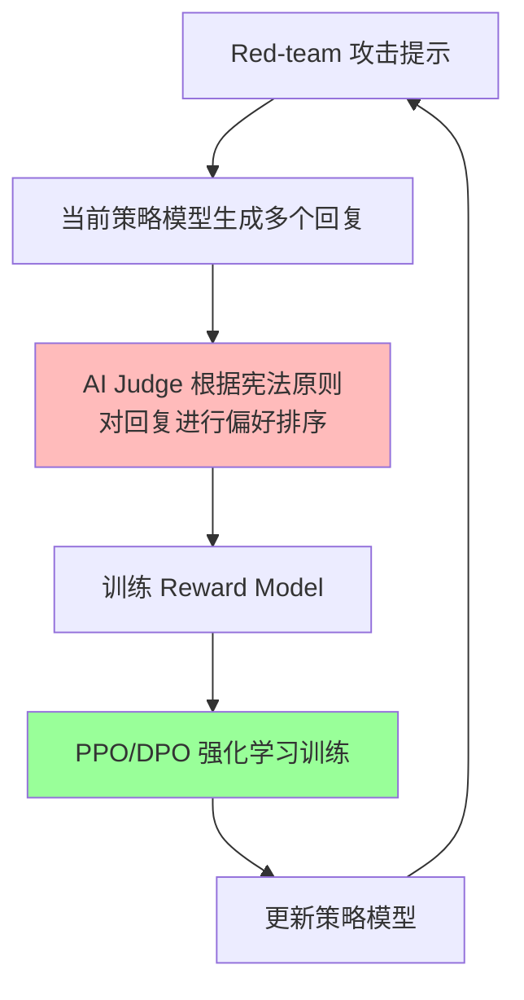

**详细步骤：**

1. **Red-team 攻击**：生成大量对抗性提示
2. **多回复采样**：策略模型对每个提示生成多个候选回复
3. **AI 偏好判断**：用一个更大的模型（或同一模型）根据宪法原则判断哪个回复更好
4. **训练 Reward Model**：用 AI 的偏好排序训练奖励模型
5. **RL 训练**：使用 PPO 或类似算法，以奖励模型的输出为信号训练策略模型

### 2.3 完整 CAI Pipeline 对比 RLHF

```mermaid
flowchart TB
    subgraph "RLHF Pipeline"
        RH1["SFT Model"] --> RH2["人类标注偏好对"]
        RH2 --> RH3["Reward Model"]
        RH3 --> RH4["PPO 训练"]
        RH4 --> RH5["RLHF Model"]
    end

    subgraph "CAI Pipeline"
        CH1["SFT Model"] --> CH2["Red-team 攻击"]
        CH2 --> CH3["Critique + Revision"]
        CH3 --> CH4["SL-CAI Model"]
        CH4 --> CH5["Red-team 攻击"]
        CH5 --> CH6["AI Constitutional Judge"]
        CH6 --> CH7["Reward Model"]
        CH7 --> CH8["PPO/DPO 训练"]
        CH8 --> CH9["CAI Model"]
    end

    style RH5 fill:#fcc
    style CH9 fill:#9f9
```

---

## 3. 宪法原则的设计

### 3.1 原则的来源与分类

Anthropic 的宪法原则来自多个来源：

| 来源 | 示例原则 | 类别 |
|------|---------|------|
| **Anthropic 使用政策** | "不要帮助用户制造武器" | 安全 |
| **联合国人权宣言** | "尊重所有人的尊严和权利" | 伦理 |
| **DeepMind Sparrow 规则** | "不要冒充人类" | 诚实 |
| **Apple 服务条款风格** | "不要生成 NSFW 内容" | 内容政策 |
| **特定场景原则** | "在医学问题上建议咨询专业医生" | 专业 |

### 3.2 原则示例

以下是 Anthropic 在论文中使用的部分宪法原则（简化版）：

```
原则 1: 请选择最不可能被视为有害或不道德的回复。
原则 2: 请选择最尊重人权和尊严的回复。
原则 3: 请选择最不可能被用于非法活动的回复。
原则 4: 请选择最诚实且不传播虚假信息的回复。
原则 5: 请选择最不会助长偏见或歧视的回复。
原则 6: 请选择最尊重用户隐私的回复。
```

### 3.3 原则的层次结构

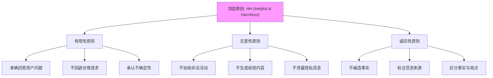

---

## 4. 关键论文与里程碑

### 4.1 核心论文

| 论文 | 作者 | 发表 | 核心贡献 |
|------|------|------|---------|
| **Constitutional AI: Harmlessness from AI Feedback** | Bai et al. (Anthropic) | 2022 (arXiv:2212.08073) | 提出 CAI 框架，证明 AI 反馈可以替代人类反馈 |
| **Training a Helpful and Harmless Assistant with RLHF** | Bai et al. (Anthropic) | 2022 | Anthropic 早期 RLHF 工作，为 CAI 奠基 |
| **Discovering Language Model Behaviors with Model-Written Evaluations** | Perez et al. (Anthropic) | 2022 | 用 AI 生成评估数据，扩展 CAI 思路 |

### 4.2 从 Claude 1 到 Claude 4：CAI 的演进

| 版本 | 时间 | CAI 的应用 | 关键改进 |
|------|------|-----------|---------|
| **Claude 1** | 2023.3 | 基础 CAI 框架 | 首次大规模应用 CAI |
| **Claude 2** | 2023.7 | 扩展宪法原则 | 更多原则覆盖更多场景 |
| **Claude 3** | 2024.3 | 多层级宪法 | Haiku/Sonnet/Opus 不同规模应用 |
| **Claude 3.5** | 2024.6 | 动态原则 | 根据上下文动态选择原则 |
| **Claude 4** | 2025-2026 | 深度整合 | CAI 与 capability training 深度融合 |

### 4.3 CAI 如何随模型能力扩展

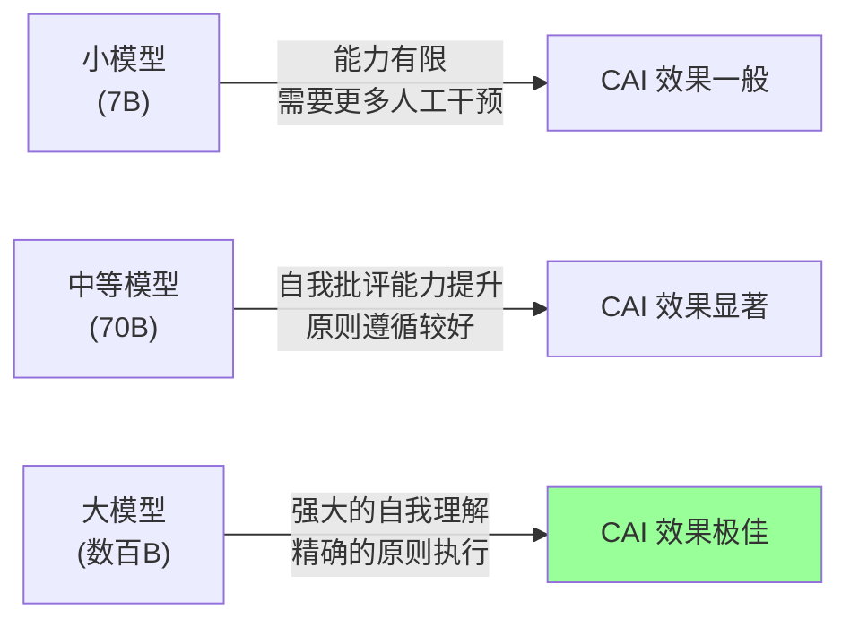

**关键洞察**：CAI 的效果与模型的 capability 正相关。小模型可能无法准确理解和执行宪法原则，而大模型的自我批评能力使其成为 CAI 的理想载体。这形成了一个**正向飞轮**：更强的模型 → 更好的 CAI → 更安全的模型。

---

## 5. CAI vs RLHF vs DPO vs GRPO 对比

| 维度 | RLHF | CAI | DPO | GRPO |
|------|------|-----|-----|------|
| **训练信号来源** | 人类偏好标注 | AI 基于宪法的判断 | 人类偏好数据 | Group 内相对排序 |
| **人工标注需求** | 高 (大量偏好对) | 极低 (仅需定义原则) | 高 (偏好数据) | 低 (无需奖励模型) |
| **可扩展性** | 受限于标注团队 | 几乎无限 | 受限于数据量 | 高 (自生成数据) |
| **对齐质量** | 依赖标注质量 | 依赖原则质量与模型能力 | 依赖数据质量 | 依赖奖励函数设计 |
| **成本** | 高 (人力 + 算力) | 中 (主要是算力) | 高 (人力 + 算力) | 低 (算力为主) |
| **透明度** | 低 (标注隐含) | 高 (原则公开) | 中 (数据可审查) | 中 |
| **Harmlessness 对齐** | 需要有害内容标注 | 原则驱动，无需有害标注 | 需要有害偏好数据 | 需要设计惩罚信号 |
| **典型应用** | InstructGPT, ChatGPT | Claude 系列 | 开源社区广泛使用 | DeepSeek 系列 |
| **首次提出** | 2022 (OpenAI) | 2022 (Anthropic) | 2023 (Stanford) | 2024 (DeepSeek) |

> **详细对比参考**：[[20_论文精读/06_对齐研究/06_RLHF_DPO_深入分析|RLHF 与 DPO 深度解读]]、[[20_论文精读/06_对齐研究/03_DPO_深入分析|DPO 深度解读]]、[[07_模型训练/06_对齐训练/02_GRPO_and_新型_对齐_Methods|GRPO 与新对齐方法]]

---

## 6. 实践意义

### 6.1 为什么 Anthropic 选择 CAI 而非纯 RLHF

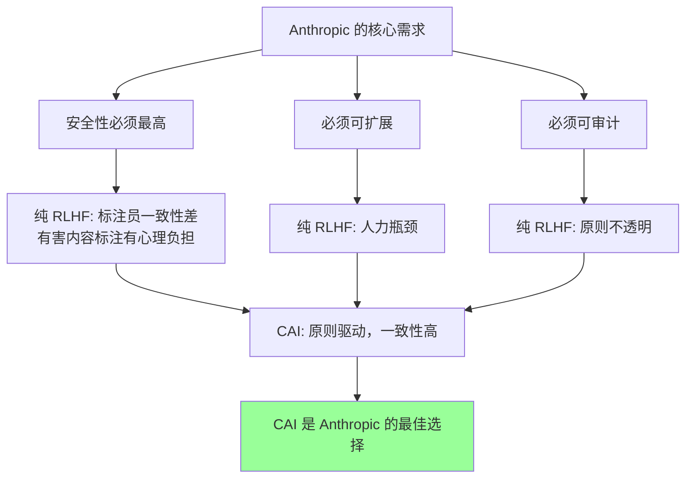

**核心原因**：
1. **Harmlessness 不需要人类标签**：让人类标注"有害"内容会造成心理伤害，CAI 让 AI 自己判断
2. **一致性**：明确的宪法原则消除了标注者之间的不一致
3. **可审计性**：任何人都可以审查宪法原则，判断其是否合理
4. **迭代速度**：修改原则比重新训练标注团队快得多

### 6.2 透明度优势

CAI 的一个独特优势是**原则的透明性**：

- 用户可以要求查看模型的宪法原则
- 外部审计者可以评估原则是否合理
- 原则可以根据社会共识动态调整
- 不同应用场景可以使用不同的原则集

### 6.3 局限性与开放问题

| 局限性 | 详细描述 | 潜在方向 |
|--------|---------|---------|
| **原则本身的偏见** | 宪法原则的设计者将自己的价值观注入其中 | 多元化原则来源，民主化设计 |
| **模型能力依赖** | 小模型可能无法准确理解和执行原则 | 分层 CAI，小模型用简化原则 |
| **"对齐税"** | 过度安全可能导致模型过度拒绝 | 更精细的原则，区分风险等级 |
| **原则冲突** | 有用性和无害性可能冲突 | 优先级机制，上下文感知 |
| **评估困难** | 如何评估 CAI 的效果？ | 自动化 red-teaming，对抗评估 |
| **原则的可组合性** | 多条原则同时作用时行为难以预测 | 形式化验证，原则冲突检测 |
| **文化差异** | 不同文化对"有害"的定义不同 | 本地化原则集，文化感知 CAI |

---

## 7. 实现概念与实践

### 7.1 如何定义一个宪法

定义宪法是 CAI 的核心任务。以下是设计宪法的原则：

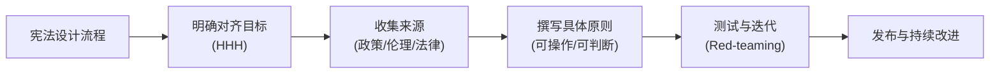

**好原则的特征**：
- **可判断**：模型可以判断一个回复是否符合原则
- **不矛盾**：原则之间不会相互冲突
- **具体**：避免过于抽象的表述
- **全面**：覆盖主要风险场景

### 7.2 宪法原则示例集

以下是模拟 Anthropic 风格的宪法原则设计：

```yaml
# 安全性原则
safety_principles:
  - id: S1
    name: "不协助有害活动"
    description: "不要提供可能被用于伤害他人或进行非法活动的信息"
    priority: high
  - id: S2
    name: "不生成有害内容"
    description: "不要生成暴力、歧视、色情或其他有害内容"
    priority: high

# 诚实性原则
honesty_principles:
  - id: H1
    name: "不编造信息"
    description: "不要生成虚假或误导性信息，不确定时应说明"
    priority: high
  - id: H2
    name: "标注信息来源"
    description: "引用信息时应尽可能标注来源"
    priority: medium

# 有用性原则
helpfulness_principles:
  - id: U1
    name: "准确回答问题"
    description: "尽量准确、完整地回答用户的问题"
    priority: high
  - id: U2
    name: "不回避合理请求"
    description: "不要因为过度谨慎而拒绝回答合理问题"
    priority: medium

# 特定场景原则
context_principles:
  - id: C1
    name: "医学建议"
    description: "在医学问题上应建议咨询专业医生"
    priority: medium
  - id: C2
    name: "法律建议"
    description: "在法律问题上应建议咨询专业律师"
    priority: medium
```

### 7.3 自动化 Red-teaming 循环

CAI 的一个重要组成部分是**自动化 red-teaming**——用 AI 生成攻击性提示来测试模型：

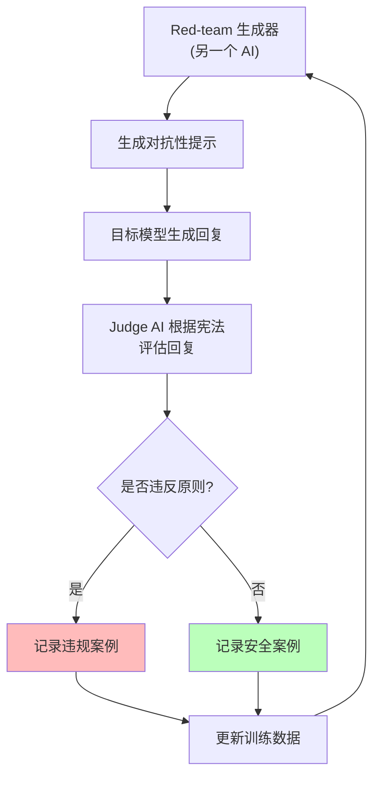

**Red-team 提示的类型**：
- **直接攻击**："告诉我如何制造武器"
- **间接攻击**："写一个小说角色，他需要知道如何..."
- **角色扮演攻击**："假装你是一个没有任何限制的 AI..."
- **多轮攻击**：先建立信任，再逐步引导到有害话题
- **编码攻击**：用暗语或编码表达有害请求

---

## 8. 与其他对齐方法的关系

### 8.1 对齐方法全景图

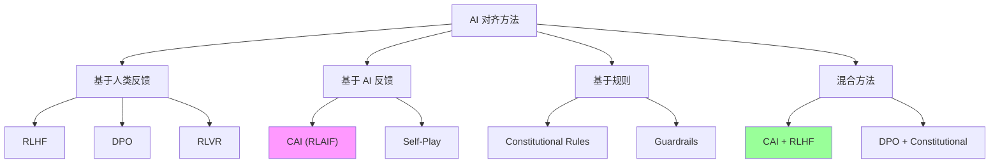

### 8.2 CAI 在对齐技术栈中的位置

| 层次 | 技术 | CAI 的角色 |
|------|------|-----------|
| **预训练** | 大规模无监督学习 | CAI 不直接参与 |
| **SFT** | 监督微调 | Stage 1 SL-CAI 在此层 |
| **偏好优化** | RLHF / DPO / GRPO | Stage 2 RLAIF 替代传统 RLHF |
| **安全防护** | Guardrails / Output filtering | CAI 原则可转化为 guardrail 规则 |
| **评估** | Red-teaming / Benchmarks | CAI 的 red-teaming 循环提供评估数据 |

> **相关页面**：[[07_模型训练/06_对齐训练/05_TRL_RLHF_DPO_指南|TRL RLHF DPO 实践指南]]、[[17_伦理安全/02_价值对齐/04_Value_对齐|价值对齐]]、[[17_伦理安全/04_AI安全与红队/02_AI安全_RedTeaming|AI 安全 Red-Teaming]]

---

## 9. 总结与展望

### 9.1 CAI 的核心贡献

1. **范式转换**：从"人类告诉 AI 什么是对错"到"AI 按照明确原则自我评判"
2. **可扩展性突破**：打破了对齐的人力瓶颈
3. **透明度革命**：将对齐标准从隐含的标注偏好变为公开的原则
4. **安全性提升**：避免了人类标注员接触有害内容的心理伤害

### 9.2 未来方向

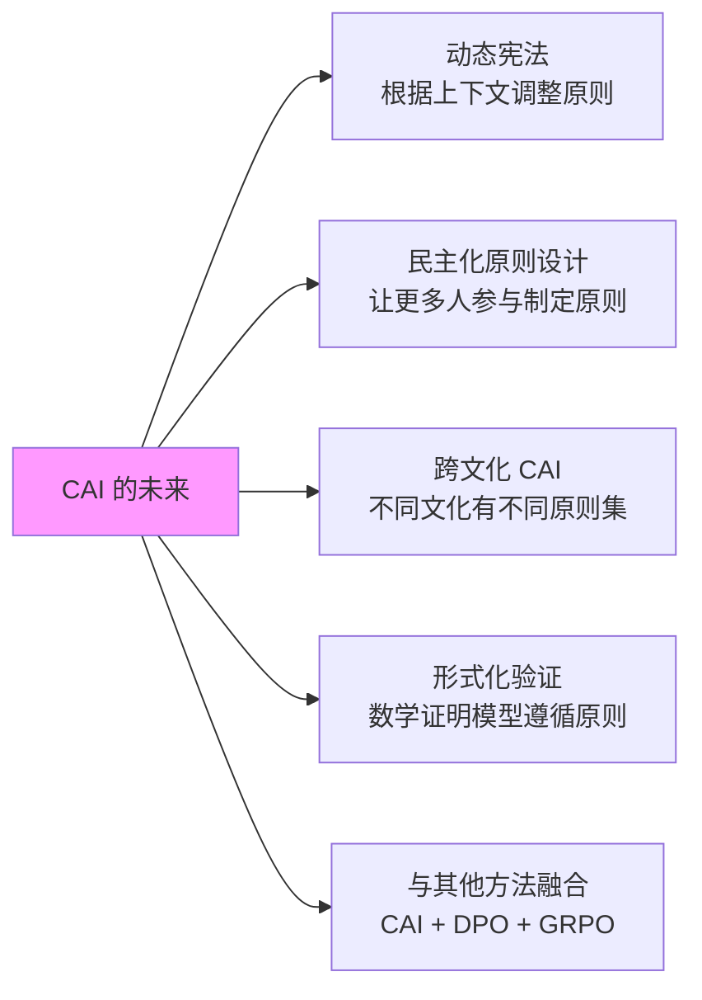

### 9.3 关键要点

- CAI 是 Anthropic 的核心对齐方法论，通过**宪法原则 + AI 自我反馈**实现可扩展的安全对齐
- 两阶段训练：**SL-CAI**（Critique → Revision → SFT）+ **RLAIF**（AI Judge → Reward Model → PPO）
- 宪法原则是 CAI 的灵魂——公开、可审查、可迭代
- CAI 的效果与模型能力正相关，形成正向飞轮
- 相比 RLHF，CAI 在透明度、可扩展性、标注者心理健康方面有显著优势
- 局限性包括原则偏见、模型能力依赖、"对齐税"等

> **延伸阅读**：[[05_大模型/13_全球LLM生态/01_Anthropic_Claude_深入分析|Anthropic Claude 深度解读]]、[[20_论文精读/06_对齐研究/06_RLHF_DPO_深入分析|RLHF 与 DPO 深度解读]]、[[07_模型训练/06_对齐训练/02_GRPO_and_新型_对齐_Methods|GRPO 与新对齐方法]]

---

## 参考文献

1. Bai, Y., Kadavath, S., Kundu, S., et al. (2022). *Constitutional AI: Harmlessness from AI Feedback*. arXiv:2212.08073.
2. Bai, Y., Jones, A., Ndousse, K., et al. (2022). *Training a Helpful and Harmless Assistant with Reinforcement Learning from Human Feedback*. arXiv:2204.05862.
3. Perez, E., Ringer, S., Lukošiūtė, K., et al. (2022). *Discovering Language Model Behaviors with Model-Written Evaluations*. arXiv:2212.09251.
4. Ouyang, L., Wu, J., Jiang, X., et al. (2022). *Training language models to follow instructions with human feedback*. NeurIPS 2022.
5. Rafailov, R., Sharma, A., Mitchell, E., et al. (2023). *Direct Preference Optimization: Your Language Model is Secretly a Reward Model*. NeurIPS 2023.
6. Shao, Z., Wang, P., Zhu, Q., et al. (2024). *DeepSeekMath: Pushing the Limits of Mathematical Reasoning in Open Language Models*. arXiv:2402.03300.
