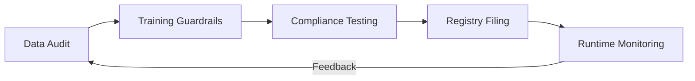

# AI Regulatory Engineering & EU AI Act Compliance 2026

> 中文简称：AI 监管工程

> **一句话理解**: 监管工程化是将法律条文转化为可执行的代码逻辑和自动化审计流程，确保 AI 系统在不牺牲创新的前提下符合全球监管标准（如欧盟 AI 法案）。

---

## 目录

| 章节 | 内容 | 难度 |
|------|------|------|
| [全球 AI 监管全景](#1-全球-ai-监管全景) | 欧盟 AI 法案、美国行政令、中国暂行办法 | 入门 |
| [欧盟 AI 法案 (EU AI Act) 深度解读](#2-欧盟-ai-法案-eu-ai-act-深度解读) | 风险等级分类、GPAI 模型义务 | 进阶 |
| [监管即代码 (Regulation as Code)](#3-监管即代码-regulation-as-code) | 自动红队测试、偏见检测流水线 | 进阶 |
| [模型身份证：Model Cards 与 Transparency](#4-模型身份证model-cards-与-transparency) | 数据溯源、能耗披露、版权管理 | 进阶 |
| [合规生命周期管理](#5-合规生命周期管理) | 从训练数据审核到实时推理监控 | 进阶 |
| [2026 关键技术：可审计性 (Auditability)](#6-2026-关键技术可审计性-auditability) | 证明可解释性、不可篡改的日志、零知识证明 | 专业 |

---

## 1. 全球 AI 监管全景

2026 年是“全球合规元年”，AI 系统面临从“自律”到“硬法律”的转型。

- **欧盟 (EU)**: 世界上第一部全面的 AI 法律。
- **美国 (US)**: 重点关注关键基础设施安全、国家安全和政府外包 AI 的透明度。
- **中国 (CN)**: 针对生成式 AI 的算法备案、内容标识及数据合规有明确要求。

---

## 2. 欧盟 AI 法案 (EU AI Act) 深度解读

该法案根据风险对 AI 应用进行分类。

### 2.1 风险四级分类
1. **不可接受风险 (Unacceptable)**: 
   - 例子: 实时生物特征识别（特定公共场所）、社会评分。
   - **状态**: 严厉禁止。
2. **高风险 (High Risk)**: 
   - 例子: 自动求职筛选、高考阅卷、医疗手术辅助、关键基础设施管理。
   - **状态**: 严格合规，必须进行符合性评估。
3. **有限风险 (Limited Risk)**: 
   - 例子: 聊天机器人、Deepfakes。
   - **状态**: 强制性透明度披露（必须让用户知道在跟 AI 对话）。
4. **最小风险 (Minimal)**: 
   - 例子: 带有 AI 的游戏。
   - **状态**: 无特殊义务。

---

## 3. 监管即代码 (Regulation as Code)

合规不应仅在上线前检查，而应集成到 CI/CD 中。

### 3.1 自动化偏见检测
在部署前自动扫描模型的“受保护属性”（如种族、性别），如果对特定群体的召回率差异超过 20%，流水线自动报错中止。

### 3.2 自动红队测试
使用专门的“攻击 Agent”对新模型进行 10 万次诱导性提问，生成 **Safety Scorecard**。

---

## 4. 模型身份证：Model Cards 与 Transparency

欧盟要求通用 AI (GPAI) 提供详细的技术文档。

- **数据溯源**: 证明训练数据没有包含受保护版权的内容，或已支付相关费用。
- **能耗审计**: 每次训练消耗的碳排放必须在 Model Card 中公示。
- **系统限制**: 明确列出模型在哪些特定任务下不可靠。

---

## 5. 合规生命周期管理

1. **数据审计**: 检查训练集中的 PII (个人信息) 和偏见。
2. **训练约束**: 设置“知识禁区”，防止模型学习制造生物武器等指令。
3. **备案**: 在相关监管机构注册模型参数和用途。
4. **推理监控**: 实时拦截违反本地法律的生成内容。

---

## 6. 2026 关键技术：可审计性 (Auditability)

### 6.1 形式化证明
利用神经符号 AI，证明模型在特定条件下永远不会产生违规输出。

### 6.2 零知识证明 (ZKP)
在不泄露模型权重（商业机密）的前提下，向监管方证明模型已通过特定安全测试。

---

## Related

- [[17_伦理安全/04_AI安全与红队/05_安全评估_框架]] — 具体的安全评估指标
- [[11_模型运维/06_持续集成部署/04_ML_CI_CD]] — 如何将合规集成到流水线
- [[05_大模型/08_推理模型/03_Neuro_Symbolic_and_Formal_Verification_2026]] — 形式化验证的技术底层
- [[概念/ai-ethics]] — 伦理基础理论

---

*Last updated: 2026-06-04*
