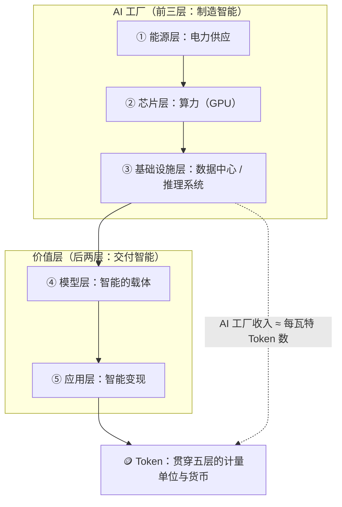

# Token 经济学与 AI 经济学 2026 (Token Economics)

> 中文简称：Token 经济学

> **一句话理解**：Token 就像 AI 时代的"千瓦时"——Token 经济学研究智能这种新商品怎么生产、怎么定价、被谁消费；而 AI 经济学把镜头拉远，看这场"发电站大建设"最终是基建还是泡沫。

---

## 1. 为什么 2026 年必须谈 Token 经济学

Token（词元）是大模型处理和生成信息的基本单位，一个 Token 大约对应 1–2 个汉字。它让 AI 第一次变成**可计量、可定价、可交易**的资源——就像"千瓦时"让电力有了价格、"桶"让石油有了期货市场。围绕这个单位正在成型的一整套供需、定价、产业链与国际竞争逻辑，就是 **Token 经济学**。

2026 年上半年的三个标志性数字，说明这不再是概念炒作：

| 指标 | 数值 | 来源 |
|:-----|------|------|
| 中国日均 Token 调用量 | **140 万亿**（两年前约 1000 亿，两年增长 **1400 倍**） | 国家数据局，2026-03 |
| OpenAI API 日均处理量 | **21.6 万亿**（每分钟超 150 亿） | OpenAI，2026-03 |
| Google Gemini 月处理量 | **1300 万亿**（日均约 43 万亿） | Google，2025-09 |

腾讯研究院的判断是：需求是真实的、旺盛的、加速增长的，只是**还没有被充分货币化**——这是理解整篇文章的钥匙。

---

## 2. Token 的三重身份与五层蛋糕

### 2.1 黄仁勋的五层蛋糕

2026 年 3 月，黄仁勋发表署名文章《AI Is a Five-Layer Cake》，并在 GTC 2026 Keynote 中系统阐述了"AI 工厂"叙事：AI 产业分为**能源、芯片、基础设施、模型、应用**五层，前三层合起来叫 AI 工厂，核心功能是"制造智能"；而 **Token 是贯穿五层的语言和货币**。

图的关键在虚线：GTC 2026 上黄仁勋给出的核心等式是 **"AI 工厂的收入 = 每瓦特产出的 Token 数"**（tokens per watt）。数据中心从"存放 IT 设备的房子"变成了"有产出、有良率、有营收的生产系统"，经营指标全部围绕 Token 展开：吞吐量、单位成本、每瓦产出、每兆瓦收入。

### 2.2 学术范式：Token 作为生产要素

2026 年 5 月，浙江大学与阿里云联合发布首篇《Token Economics for LLM Agents》（arXiv:2605.09104），首次系统提出 Token 经济学研究范式，将 Token 重新定义为三种角色：

| 角色 | 含义 | 对应经济学工具 |
|------|------|----------------|
| **生产要素** | 与劳动、资本并列的投入品 | CES 生产函数、要素替代、帕累托最优 |
| **交换媒介** | Agent 之间协作与交易的结算单位 | 交易成本理论、委托代理 |
| **记账单位** | 智能服务定价与核算的基础 | 机制设计、拥堵定价 |

该综述用"计算—经济"双重视镜给出四层分析框架：**微观层**（单 Agent 视为企业，在预算约束下权衡内部推理 Token 与外部工具 Token）、**中观层**（多 Agent 系统的协作摩擦产生超线性"内部交易成本"，拓扑剪枝与 KV Cache 共享是降税杠杆）、**宏观层**（多租户平台的拥堵定价与杰文斯悖论）、**安全层**（注入攻击等安全风险内化为 Token 影子价格的抬升）。

---

## 3. 需求侧：杰文斯悖论与消费爆炸

### 3.1 越便宜，花得越多

过去两年多，Token 生产成本下降了 **超过 99%**，但全球企业 AI 支出不降反升、翻了三倍多。这正是 1865 年杰文斯观察到的**杰文斯悖论**：蒸汽机效率提升没有减少煤炭消费，反而让更多使用场景变得经济可行，总消耗量大涨。Token 正在三年之内重演煤炭用一个世纪走完的故事。

**推理成本下降曲线**（同等能力口径）：

| 时点 | 价格（美元 / 百万 Token） | 说明 |
|:-----|--------------------------:|------|
| 2022（GPT-3 级别） | ~$60 | 当时只有金融分析、药物发现等最高价值任务用得起 |
| 2023（GPT-4 发布价） | ~$30（输入） | 补贴时代起点 |
| 2026 年中（同代前沿模型） | $2.50–$5 | 较 GPT-4 发布价下降超 90% |
| 2026 年中（预算档：Gemini Flash、DeepSeek V3） | $0.08–$0.30 | 中国模型在 OpenRouter 输入定价约 $0.3，海外主流约 $5 |
| 2026 年初（GPT-3 级能力的开源模型） | ~$0.06 | 较 2022 年下降 **99.9%** |

驱动降价的三大力量**相乘**：硬件效率每年提升 2–3 倍 × 算法效率每年提升 2–3 倍 × 系统优化每年提升 2–4 倍，合计 Token 成本**每年下降 5–10 倍**。同样规模的模型从上一代 GPU 换到新一代，每个 Token 能耗约降 10 倍。

### 3.2 Agent 接棒人类

人类消费 Token 有一个生理天花板：研究表明人有意识处理信息的速度仅约**每秒 10 比特**（Zheng & Meister, Neuron 2025）——无论 AI 多便宜，人的注意力带宽是固定的。

2025 年底开始，**智能体（Agent）**打破了这条天花板：一个编程 Agent 执行复杂任务可消耗数百万 Token 且 24 小时运行；一家企业部署 1000 个 Agent、每个每天消耗 100 万 Token，一年就是 3650 亿 Token——约等于一个中等国家全部人类用户的年消耗量。需求主体正从"人"转向"机器"，机器买家全天候运行、对延迟敏感但价格弹性低、可在毫秒间切换供应商。

> **杰文斯悖论 + Agent**：这就是"Token 不够用了"的真正原因——降价释放了被成本压制的存量需求，Agent 又打开了没有上限的增量需求。多 Agent 协作还有**近似二次方**的上下文重放开销：一个 20 步会话（4000 Token 系统提示 + 平均每轮 2000 Token）到第 20 步累计输入约 4.4 万 Token。

### 3.3 价值去了哪里：消费者剩余

按算力成本定价的 AI 服务，让创造的价值大量以**消费者剩余**形式留在用户手中：Brynjolfsson 等人估算 2024 年生成式 AI 为美国消费者创造约 **970 亿美元**消费者剩余，斯坦福 2026 年 AI Index 用同一框架更新为约 **1720 亿美元**。用户获得的价值远超实际支付——账面收入低不代表没创造价值，而是价值还没被货币化。

---

## 4. 供给侧：Token 工厂的成本结构

### 4.1 AI 看着像软件，骨子里是重工业

聊天框是最轻的一层，背后压着最重的几层：持续运转的数据中心、排队上架的 GPU、被锁定的电力与冷却系统。全球头部科技公司年资本开支已从百亿美元量级跃升至**近千亿美元量级**，绝大部分投向 AI 数据中心与配套电力。SemiAnalysis 提出的"AI Token Factory Economics Stack"分析框架，把从芯片到 Token 的每一层利润率摊开来看，结论一致：**价值正在从模型层转向基础设施生产力**。

### 4.2 利润为什么卡在上游

| 产业链位置 | 现状 | 关键事实 |
|-----------|------|----------|
| 上游（芯片/算力） | 利润已长出来 | 英伟达毛利率超 70%，数据中心年收入逼近 2000 亿美元 |
| 中游（模型） | 几乎无一盈利 | 训练层是寡头市场，门槛以十亿美元计 |
| 下游（推理/应用） | 价格压向成本线 | 开源模型已把推理价格压低九成以上，百模大战后推理服务价格贴地 |

经济学解释：**成本越快下降，越需要前置的重资产投入来推动下一轮降价**——谁控制最稀缺的供给，谁先拿到利润。英伟达的护城河不止 GPU 性能，更是 CUDA 生态的转换成本。GPU 算力成本的学习率高达 **89%**（产量每翻一番单位成本降 89%，Gogerty 对 150 项技术的研究中有记录以来的最高值），这决定了这场竞赛由资本最厚者主导。

### 4.3 GTC 2026：Token 工厂时代的六个要点

从黄仁勋 GTC 2026 Keynote（2026-03-24）蒸馏的供给侧信号：

1. **推理取代训练成为中心挑战**——训练已经"解决"，推理直接产生收入；
2. **Tokens per watt 成为核心运营指标**——AI 工厂是功率受限系统，每一瓦没用上就是收入损失；
3. **竞争单元从芯片转向系统**——Grace Blackwell、Vera Rubin 等整机架系统比单芯片叙事更重要；
4. **内存与上下文成为一等约束**——Agent 需要更多 KV Cache 与长上下文，架构向"记忆密集"演进；
5. **AI 工厂用数字孪生管理**（DSX）——设计、热管理、功耗持续优化，工厂变成软件定义环境；
6. **AI 需求从超大规模云扩散**——主权 AI、区域云、企业、边缘多线开花，基础设施市场更抗周期。

配套的开源供给侧（Red Hat Summit 2026 的判断）也在验证同一论点：企业 AI 的瓶颈不再是"能不能造出来"，而是**"养不养得起跑"**——vLLM、llm-d（单张 B200 约 3100 Token/秒，16×16 B200 拓扑输出可达 50000 Token/秒）等基础设施把"每 Token 成本"变成可治理的工程指标。72% 的大型企业已有至少一个 AI 生产负载（2024 年为 55%）。

---

## 5. 价值侧：可编程性与价值分布

### 5.1 一个 Token 值多少钱？差出十万倍

Token 有一种传统生产要素不具备的属性：**可编程性**。同一种要素，仅因接收的指令不同，就能产出价值相差万倍的智力成果——钢铁做不到，石油做不到，电力也做不到。

| Token 用途 | 价值量级（美元 / 百万 Token） |
|-----------|------------------------------:|
| 闲聊 / 角色扮演 | ~$0.01 |
| 代码生成 | ~$200 |
| 法律文档审阅 | ~$1000 |

耶鲁 Cowles 基金会 Bergemann 等人把 Token 定义为**"可合同化的计量单位"**：数量可精确计量，但价值完全取决于它被编程去做什么。推论有两个：

- **平均 Token 价格毫无意义**——就像用平均房价描述一个既有茅草屋又有摩天楼的城市。数据显示**不到 5% 的 Token 消耗创造了超过 80% 的可测量价值**；
- **定价的维度不是价值评估的维度**——当前 AI 服务按算力成本定价，而不是按它为用户创造的价值定价，这正是消费者剩余巨大、且高价值用户剩余更高的结构性原因。

### 5.2 工程视角：边际成本 ≠ 平均成本

厂商公布的每 Token 价格是**边际成本**（多调一次的单价）；而"每成功产出一次的真实成本"是**平均成本**——包含失败重试、冗长推理链、修剪不当的上下文浪费。一个重试 3 次才产出正确重构的 Agent，真实成本是标价的 3 倍。把考核指标从 cost-per-token 换成 **cost-per-successful-completion**，会直接改变你对模型选型和提示词的判断。

---

## 6. 商业模式光谱

Token 经济中已出现四种定价模式，外加一个正在倒退的方向：

| 模式 | 代表 | 优点 | 缺点 / 风险 |
|------|------|------|-------------|
| **按量计费** | OpenAI / Anthropic API | 简单透明 | 用户为省钱抑制调用 |
| **包月订阅** | ChatGPT Plus（$20/月） | 用户用量比按量计费高 5–10 倍，形成习惯 | 重度用户成本倒挂（Tokenmaxxing） |
| **按价值收费** | 按结果分成（如避开千万损失收 10 万） | 利润率最高 | 价值难以可靠度量——当前最大难题 |
| **Token 期货** | 企业预购额度锁定价格 | 对冲价格波动（类比航司对冲油价） | 2026 年仍在萌芽（Xing, 2026） |
| ~~无限包月~~ | ChatGPT "unlimited" | 获客利器 | 2026 年中据报道考虑终结——"智能便宜到可以随便用"（too cheap to meter）的承诺开始收缩 |

两个标志性事件确认了**补贴时代结束**：

- **GitHub Copilot 转向用量计费**（2026-04 宣布、6 月生效）：固定月费改为"固定月费 + 固定 AI Credits 池"（Business 每席 1900 credits/月，Enterprise 3900），重度 Agentic 用户约两周耗尽。定价逻辑从"保险式包月"（制造道德风险：没人有动力省 Token）转向"计量式"；
- **Tokenmaxxing 退潮**（2026-06）：一年前"无限制使用"还是营销口号，如今厂商集体收紧——无限消耗与 Token 工厂的成本结构天然冲突。

一个反直觉的定价悖论值得记住：**越贵的模型，总成本可能反而更低**。如果更强的模型一次做对、少绕弯路，"每个有效结论的成本"可能不升反降——这与 5.2 节的平均成本视角互为印证。

---

## 7. 宏观辩论：泡沫还是基建？

AI 经济学最大的开放问题：上游赚钱、下游亏损，到底是不是泡沫？

| 维度 | 泡沫论 | 基建论（价值未货币化论） |
|------|--------|--------------------------|
| 核心证据 | $600B 传统 CapEx 只是冰山一角；Nvidia–OpenAI 为中心的**循环投资**网络；Oracle 与 OpenAI 签下 $300B 五年协议，兑现压力集中在 2027 | 需求真实且加速（中国两年 1400 倍）；消费者剩余 $970 亿→$1720 亿说明价值在创造 |
| 资金面 | 2026 年私募向 OpenAI/Anthropic/xAI 投入近 $2500 亿；OpenAI 2026-03 估值 $852B，90%+ 用户在免费层 | 前沿实验室 IPO 后将接受公开市场的收入/现金流审视，泡沫会自我出清 |
| 历史类比 | 与 2000 年光纤泡沫同构 | **关键区别**：光纤泡沫是需求没跟上，今天是需求跑在货币化前面 |
| 观察 | Nasdaq 自 2025-06 上涨 38%，AI 支撑美国 GDP 约 0.7 个百分点，经济对 AI 持续增长形成依赖 | 增长引擎当前不是"AI 替代人力"，而是**AI 原生消费**（角色扮演、对话娱乐）等纯增量需求 |

腾讯研究院的核心论点：闭环没闭上，不是因为 AI 没有创造价值，而是**已经创造的价值没有被充分货币化**。这与光纤泡沫（资本提前铺设、使用量长期不足）有本质区别——但循环投资与 2027 年兑现压力提醒我们：需求真实 ≠ 每一笔 CapEx 都能回收。

另一个被忽视的需求侧事实：增长最快的 Token 消费不是企业生产力工具，而是**消费性娱乐应用**——Token 经济的第一波增长引擎是"AI 原生消费"，而非最吸引眼球的"AI 替代人力"叙事。

---

## 8. 对工程师与企业的启示

把宏观叙事翻译成可执行动作，2026 年共识的五条工程实践（按杠杆率排序）：

1. **Prompt 压缩**：系统提示词参与每一次请求，是最大的隐性固定成本。4000 Token 系统提示 × 每天 1 万次请求 × $3/M ≈ 每年仅提示词就要花掉一笔"超过一台托管数据库"的钱；压缩 40% 即直接省 40%；
2. **语义缓存**：厂商级 prefix caching 对命中部分降本 50–90%；应用级语义缓存可再拦截 30% 左右的重复请求；
3. **模型路由（要素替代）**：简单任务路由到 $0.15/M 档、中等任务 $3/M 档、只有真正的硬推理才打到 $15–25/M 前沿档——落地团队普遍报告**节省 60–85%** 且无质量损失；
4. **上下文卫生**：Agent 会话用"每 5 轮摘要压缩"替代全量历史重放，可将单会话成本降低 60% 以上；
5. **Token 预算治理**：按团队/项目设预算、熔断失控循环、按团队-项目-模型-任务四维出账——这就是十年前云成本管理（FinOps）纪律在 AI 时代的重演。预测：**"Token Budget" 将在 12–18 个月内成为与延迟、错误率并列的一等工程指标**。

对个人的判断标尺（腾讯研究院结语）：你工作中的环节有多少符合"输入信息 → 处理 → 输出结果"？符合的都可能被 Token 化；留给人的是判断、创意、关系与不确定性——恰恰是单纯堆 Token 做不好的事。

---

## 9. 语料来源：近期行业 talks 与研究一览

本文语料蒸馏自 2026 年 3–8 月的标志性行业 talks 与研究，供溯源与延伸阅读：

| 日期 | 来源 / 场合 | 类型 | 核心观点 |
|------|------------|------|----------|
| 2026-03-10 | 黄仁勋《AI Is a Five-Layer Cake》 | 厂商署名文章 | 五层蛋糕 + Token 是 AI 的语言与货币 |
| 2026-03-24 | NVIDIA GTC 2026 Keynote | **行业 Keynote** | AI 工厂收入 = 每瓦特 Token 数；价值从模型转向基础设施生产力 |
| 2026-03-24 | Global Data Center Hub Keynote 解读 | 分析 | 19 条 takeaways：tokens-per-watt 成核心运营指标 |
| 2026-03 | SemiAnalysis《Microsoft's AI Strategy Deconstructed》 | 研究机构 | AI Token Factory Economics Stack 分层利润框架 |
| 2026-04-17 | 腾讯研究院《Token 经济学刍议》（中国经济时报） | 智库 | 需求真实未货币化；可编程性；杰文斯悖论；利润集中上游 |
| 2026-04-18 | 腾讯研究院《Token 经济学七问》 | 智库 | 七问地图：量级、价值分层、成本曲线、Agent 需求、商业模式 |
| 2026-05 | 浙大 & 阿里云《Token Economics for LLM Agents》（arXiv:2605.09104） | **学术综述** | Token = 生产要素/交换媒介/记账单位；四维分析框架 |
| 2026-05-12 | Cicoria《Tokenomics: The Allocation of Scarce Resources in Agentic AI》 | 工程博客 | 补贴时代结束；边际 vs 平均成本；五条降本实践 |
| 2026-06-04 | 机器之心（浙大 & 阿里综述报道） | 媒体 | OpenRouter 周处理量 15 个月涨 68 倍 |
| 2026-06-10 | Technology.org《AI Tokenmaxxing Is Dying》 | 行业观察 | 无限套餐退潮，计量时代回归 |
| 2026-08-19 | Forbes《The AI Bubble And The U.S. Economy》 | 财经分析 | $600B CapEx、循环投资、OpenAI $852B 估值与兑现压力 |

> 时效提示：Token 价格与份额数据变化极快（单价年降 5–10 倍），本文数字为 2026-09 时点快照，引用时请注明数据日期。

---

## 10. Related

- [[10_部署推理/06_成本管理/01_LLM_成本优化|LLM 成本优化]] — Token 经济学微观层的工程落地：缓存、路由与上下文压缩
- [[13_运维/02_SRE与可靠性/09_成本优化_AI_深入分析|AI 成本优化 2026]] — GPU/Token 成本治理与 FinOps 体系
- [[12_架构基建/06_云厂商/Alibaba_Cloud/产品/09_Token经济与商业化|Token 经济与商业化（阿里云视角）]] — 云厂商 Token 定价与商业化实践
- [[15_智能体/README|智能体章节导航]] — Agent 是 Token 需求的下一波主力买家
- [[19_业界观点/25_Talks_Synthesis_综合演讲/09_talks_insights|AI 领袖演讲与行业洞察]] — 行业领袖观点的横向对比与演进脉络
- [[18_行业应用/01_行业概览/02_AI_平台_选型_2026|AI 平台选型 2026]] — 把成本模型放进平台选型决策
- [[概念/LLM/chinchilla-scaling-laws|Chinchilla Scaling Laws]] — 训练侧算力分配的经典经济学
- [[18_行业应用/01_行业概览/10_AI_泡沫与基建辩论_2026|AI 泡沫与基建辩论 2026]] — 宏观叙事的完整证据链与可监测预警指标
- [[15_智能体/01_Agent基础/25_Agent_经济学_2026|Agent 经济学 2026]] — Agent 单任务 Token 成本解剖与降本工具箱
- [[12_架构基建/02_架构概览/12_主权_AI_2026|主权 AI 2026]] — 国家级 Token 工厂的基建竞赛
- [[05_大模型/14_中国LLM生态/26_中国模型出海_2026|中国模型出海 2026]] — 效率商品化权重、价值转移到云与分发层

---

*Last updated: 2026-09-07*
