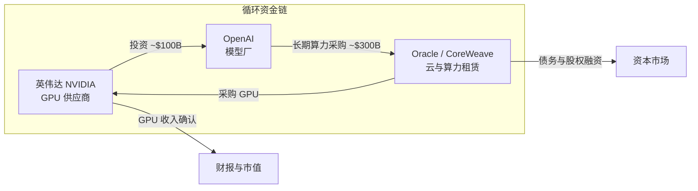
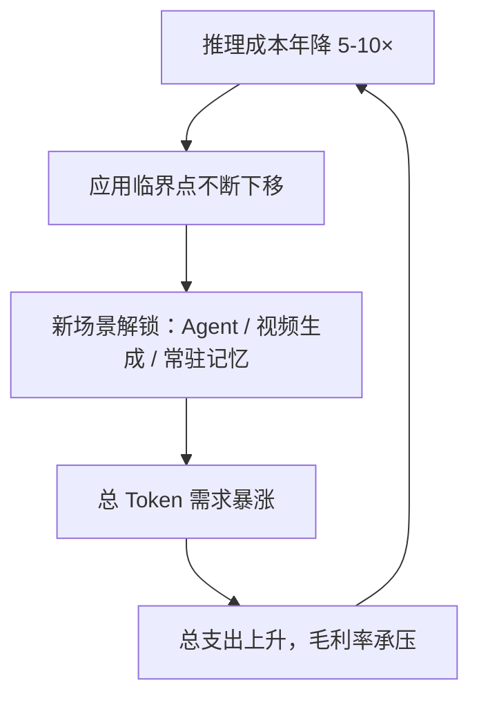

# AI 泡沫与基建辩论 2026 (AI Bubble or Infrastructure Revolution)

> 中文简称：AI 泡沫与基建辩论

> **一句话理解**：这就像 2000 年修高速公路的热潮——有人说路修多了没人跑是泡沫，有人说路修好了车自然就来了；本文把双方证据摆在一张桌子上，让你自己下注。

---

## 1. 为什么 2026 年这场辩论无法回避

2026 年的 AI 基建投资已进入**重工业节奏**：头部云厂商与模型厂年化 CapEx 合计突破 **$600B** 量级，而模型层直接收入估计仅为数百亿美元——**投入与收入的缺口**构成了"泡沫论"的核心弹药。与此同时，Token 需求两年 **1400×**、中国日均 **140 万亿** Token、消费者剩余 **$97B → $172B** 的爆炸式增长，又构成"基建论"的反证。

> **关联**: 数字细节见 [[18_行业应用/01_行业概览/09_Token_Economics_2026|Token 经济学与 AI 经济学 2026]]；本页聚焦"这场投资狂潮会不会崩"这一辩论本身。

### 三组量级数字（辩论的公共事实底座）

| **维度** | **数字** | **来源语境** |
|------|------|---------|
| 行业年化 CapEx | ~$600B | 头部厂商合计，2026 分析口径 |
| 循环融资样本 | 英伟达 → OpenAI 投资最多 $100B；OpenAI → Oracle 采购合同约 $300B | 2025-09 起多轮公告 |
| OpenAI 估值 | $852B（二级市场口径） | 2026 年初报道 |
| Token 需求 | 中国 140 万亿/日（两年 1400×）；OpenAI 21.6 万亿/日 | 2026 平台披露 |
| 消费者剩余 | $97B → $172B（年度） | 2026 行业估算 |

---

## 2. 泡沫论证据链

### 2.1 投入收入剪刀差

CapEx 年增速持续高于模型层收入增速，意味着**每一美元收入的实现需要更多美元的前置投资**。批评者的算术很简单：如果收入曲线不陡峭化，当前建设规模将在 2–3 年后形成大量低利用率资产。

### 2.2 循环融资（Circular Financing）

这是 2026 年最受争议的结构：上游芯片厂投资下游模型厂，模型厂拿这笔钱向上游采购算力、并向云厂签长期采购合同，云厂再向芯片厂买 GPU——**钱在链条里转了一圈，支撑起三方的收入确认**。

图中可见资金闭环：投资款经采购合同回流供应商收入，放大了表面需求。当链条任一环节（估值、合同续约、债务成本）松动时，需求信号会**同步失真**。

### 2.3 估值与基本面的距离

OpenAI 以 $852B 估值融资时，其年化收入仍在百亿美元量级——**估值/收入倍数远超历史上任何云厂商成熟期**。多头的辩护是"期权价值"（AGI 溢价），空头则指出这是典型的"叙事定价"。

---

## 3. 基建论证据链

### 3.1 与光纤泡沫的三大结构性不同

这是基建论最有力的部分——逐项对照 2000 年电信泡沫：

| **维度** | **2000 光纤泡沫** | **2026 AI 基建** | **判读** |
|------|-------------|-------------|------|
| **需求真实性** | 电信公司互刷流量，终端付费用户稀少 | 消费者剩余 $172B、企业订阅真实付费、主权 AI 国家采购 | **根本不同** |
| **资金结构** | 电信企业高杠杆发债 | 巨头以经营现金流为主，循环融资仅部分 | **不同但有裂缝** |
| **产能状态** | 光纤严重过剩（利用率个位数） | 电力、土地、先进封装全线短缺，供不应求 | **相反** |

> **关联**: 主权 AI 国家采购的规模证据（沙特 HUMAIN $100B、欧盟 €20B 13 座超级工厂）见 [[12_架构基建/02_架构概览/12_主权_AI_2026|主权 AI 2026]]。

### 3.2 杰文斯悖论：成本降 → 需求爆

推理成本两年下降约 **1000×**（$60/M → $0.06/M），单位 Token 价格便宜 99.9%，但行业总支出反而翻了 3 倍以上——需求弹性远大于 1。这正是"便宜会杀死需求"的泡沫论假设失效之处：

这是一个自我强化的循环：成本每降一档，就解锁一批原本不经济的应用，把需求曲线再推高一截。

### 3.3 需求侧的"备用引擎"

即便 C 端付费意愿被质疑，2026 年仍有三台备用引擎在推需求：**Agent 化**（Gartner 估算 Agent 单任务 Token 是对话的 5–30×）、**主权 AI**（国家级 IT 支出）、**开源价格战**（中国模型把均价打穿，见 [[05_大模型/14_中国LLM生态/26_中国模型出海_2026|中国模型出海 2026]]）。

---

## 4. 中间派：泡沫在应用层，不在基建层

一种被越来越多分析师接受的折中判断：

- **基建层**（电力、数据中心、GPU）：需求真实、产能短缺，短期无泡沫；
- **模型层**（估值）：叙事定价，倍数不可持续，会有一轮挤水分；
- **应用层**：重复造轮子的 Wrapper 泡沫最严重，大多数会在模型升级中被"顺手"消灭。

对应到工程实践：**别赌估值，赌单位经济性**——以 [[10_部署推理/06_成本管理/01_LLM_成本优化|LLM 成本优化]] 中的"单次成功完成成本"（cost-per-successful-completion）为北极星，而不是部署量或估值倍数。

---

## 5. 可监测的预警指标

与其站队"泡沫/不泡沫"，不如监测这些可证伪的指标：

| **指标** | **健康信号** | **危险信号** |
|------|---------|---------|
| **CapEx / 模型层收入增速** | 收入增速 ≥ CapEx 增速 | CapEx 翻倍而收入滞涨 |
| **循环融资占比** | 供应商融资 <10% 采购额 | 注资换合同成为主要资金链 |
| **Token 需求增速** | 持续 >2×/年 | 增速跌破成本下降速度 |
| **推理毛利率** | 模型厂毛利率转正 | 全行业"卖 Token 亏 Token" |
| **电力约束** | 新增供给有排队需求 | 签约容量大面积退租 |
| **估值/收入倍数** | 向云厂商历史区间收敛 | 一级市场 >50× 且无盈利路径 |

> **提示**：这些指标每月可从财报电话会、OpenRouter/平台披露与能耗数据交叉验证，属于"普通人可执行"的监测清单。

---

## 6. 对工程师与投资者的启示

1. **就业与技能**：即使资产层挤水分，"让已建成算力更赚钱"的工程岗位（推理优化、成本治理、可观测性）是逆周期资产——见 [[12_架构基建/02_架构概览/01_AI_成本优化_2026|AI 成本优化 2026]] 与 [[12_架构基建/02_架构概览/05_Capacity_Planning_2026|容量规划 2026]]。
2. **供应商风险**：架构设计假设"模型与算力均可替换"，避免被单一循环融资链条绑定——多供应商路由是廉价保险。
3. **不要用估值倒推技术路线**：泡沫辩论双方都可能对，但 Token 需求曲线是工程事实；按需求做容量规划，不按叙事。
4. **历史类比的正确用法**：光纤泡沫破灭后，贱卖的光纤成就了 Web 2.0。即便 AI 基建崩盘，过剩算力大概率同样"成就下一代应用"——崩盘改变的是**谁的资产负债表受伤**，不改变**技术曲线本身**。
5. **监管信号**：欧盟等监管方已开始把"主权 AI 补贴"与"市场集中度"挂钩，政策变量会成为下一轮辩论焦点。

---

## 7. 语料来源（2026-03 ~ 2026-05 Talks & 研报）

| **#** | **来源** | **核心贡献** | **时间** |
|---|------|---------|------|
| 1 | Forbes：AI Bubble or Infrastructure Revolution | 泡沫论 vs 基建论完整对照框架 | 2026-04 |
| 2 | Global Data Center Hub：GTC 2026 十九条要点 | 英伟达视角的基建叙事与循环融资争议 | 2026-03 |
| 3 | Presenc AI：Sovereign AI Infrastructure Tracker | 主权 AI 需求的国家级硬数据 | 2026-05 |
| 4 | Data Gravity：China's Open-Weight Takeover | 中国模型价格战对成本曲线的冲击 | 2026-05 |
| 5 | Goldman Sachs：AI Agents Forecast to Boost Tech Cash Flow | Agent 化对云厂商现金流的量化预测 | 2026-04 |
| 6 | technology.org：Jevons Paradox 与 AI 算力需求 | 成本下降 ×3 需求的悖论机制 | 2026-05 |

> ⚠️ **时效提示**：本页数字为 2026-03 ~ 2026-05 快照，CapEx、估值与融资结构每月都在变化；引用时请核对最新披露。

---

## Related

- [[18_行业应用/01_行业概览/09_Token_Economics_2026|Token 经济学与 AI 经济学 2026]] — 需求/成本/价值三侧的经济学基础
- [[12_架构基建/02_架构概览/02_AI_基础设施_2026|AI 基础设施 2026]] — 基建层的工程视角
- [[12_架构基建/02_架构概览/11_Token_工厂_2026|Token 工厂 2026]] — "AI 工厂"商业模型与 Tokens-per-watt
- [[12_架构基建/02_架构概览/12_主权_AI_2026|主权 AI 2026]] — 国家级需求引擎全景
- [[05_大模型/14_中国LLM生态/26_中国模型出海_2026|中国模型出海 2026]] — 价格战如何重塑成本曲线
- [[10_部署推理/06_成本管理/01_LLM_成本优化|LLM 成本优化]] — 工程师的逆周期技能
- [[19_业界观点/25_Talks_Synthesis_综合演讲/09_talks_insights|Talks 洞察综合]] — 2026 行业演讲综合蒸馏

---

*Last updated: 2026-09-07*
