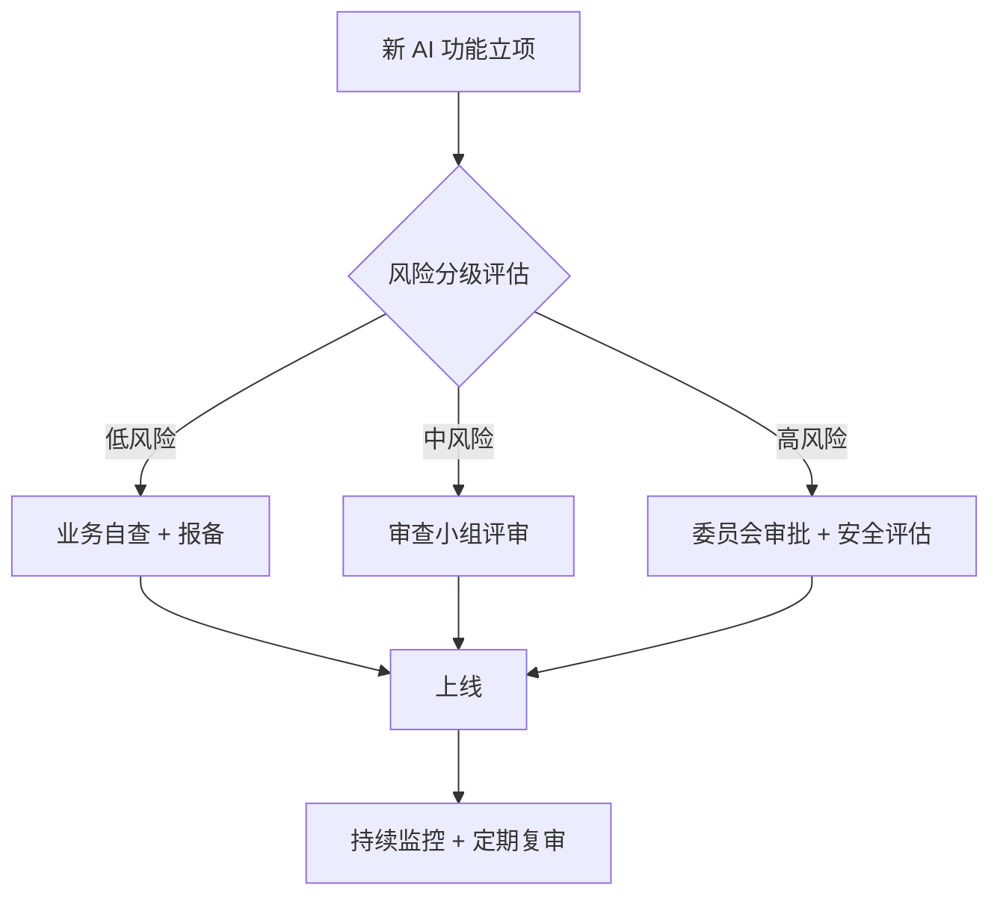

# AI Policy Specialist 面试题实例答案

> 中文简称：AI Policy Specialist 面试题实例答案

> 每个答案采用 **结论 → 展开 → 框架/示例 → 追问预判** 结构。

---

## 法规与标准

### Q1: EU AI Act 的风险四级分类是什么？各有什么义务？

**结论**: EU AI Act 按"风险等级"将 AI 系统分为四级：不可接受风险（禁止）、高风险（严格义务）、有限风险（透明度义务）、最小风险（无额外义务）。

**展开**:
| 风险等级 | 示例 | 核心义务 |
|---------|------|---------|
| **不可接受（禁止）** | 社会评分、操纵性 AI、实时生物识别（公共场所） | 完全禁止，违规最高罚款 3500 万欧元或全球营收 7% |
| **高风险** | 招聘筛选、信用评分、司法、关键基础设施、教育招生 | 风险评估、数据治理、技术文档、人工监督、合规审计、CE 标志、登记 |
| **有限风险** | 聊天机器人、深度合成内容 | 透明度义务：必须告知用户在与 AI 交互，合成内容须标识 |
| **最小风险** | 垃圾邮件过滤、推荐系统（非敏感） | 无额外义务，鼓励自愿行为准则 |

**追问预判**: "GPAI（通用目的 AI）模型在 Act 下有什么特殊要求？"
→ 提供方须公开训练摘要、遵守版权法、发布技术文档；具有"系统性风险"的 GPAI（如训练算力 >10^25 FLOPs）须做模型评估、对抗测试并上报严重事件。

---

### Q2: 中国《生成式人工智能服务管理暂行办法》的核心合规要求？

**结论**: 该办法对"面向中国境内公众提供生成式 AI 服务"的主体提出四大核心要求：内容安全、训练数据合法、算法备案、安全评估。

**展开**:
1. **内容安全**: 生成内容须符合社会主义核心价值观，不得生成违法信息
2. **训练数据合法**: 来源合法、不得侵害他人权益、涉及个人信息须取得同意
3. **算法备案**: 具有舆论属性或社会动员能力的算法须备案（《算法推荐管理规定》）
4. **安全评估**: 上线前须做安全评估，包括违法不良信息、偏见歧视、知识产权等
5. **标识义务**: 深度合成/生成内容须显著标识（2025 年起强化）
6. **用户管理**: 实名制、用户协议、违法内容处置义务

**追问预判**: "开源模型和 API 提供方的责任如何划分？"
→ 办法主要约束"服务提供方"，开源模型若直接面向公众服务同样适用；纯开源代码不直接提供服务则责任较轻，但下游滥用风险仍需关注。

---

## AI 治理框架

### Q3: 如何从 0 搭建企业内部 AI 治理委员会？

**结论**: 治理委员会需要"三权分立"——决策权（委员会）、执行权（业务/工程）、监督权（审计/法务），核心是建立分级评审流程和责任追踪。

**展开**:

**治理架构**:
```
1. AI 治理委员会（决策层）
   - 成员: 法务/安全/伦理/产品/工程/数据 代表 + 高管 sponsor
   - 职责: 制定政策、审批高风险项目、处理重大事故
   - 频率: 月度例会 + 重大事项临时会议

2. AI 审查小组（执行层）
   - 成员: 合规专员/安全工程师/伦理顾问
   - 职责: 对每个 AI 功能做风险分级和影响评估
   - 流程: 申请 → 评估 → 审批 → 监控

3. 业务与工程团队（落地层）
   - 职责: 按"合规即设计"原则实现要求、保留证据

4. 内部审计（监督层）
   - 职责: 定期审计 AI 系统合规性、独立报告
```

**风险分级评审流程**:


**追问预判**: "如何避免治理变成'橡皮图章'或'创新阻碍'？"
→ 用风险分级（tiered）分流，低风险走轻量自查，只有高风险走重流程；建立明确的 SLA（评审 X 个工作日内完成）；定期复盘流程效率。

---

### Q4: 模型卡（Model Card）和数据卡（Data Card）应披露什么？

**结论**: 模型卡让使用者了解模型能力和局限，数据卡让使用者评估数据质量和合规性，二者是"透明度"和"可问责"的核心工具。

**展开**:

**Model Card 关键内容**:
- 模型详情（版本、发布日期、开发者、许可）
- 预期用途与超出范围用途（Out-of-Scope Use）
- 训练数据概况（来源、规模、构成）
- 性能指标（不同人群/场景的细分表现）
- 伦理考量（偏见、风险、缓解措施）
- 环境影响（碳足迹）

**Data Card 关键内容**:
- 数据来源与采集方式
- 标注方法与标注者画像
- 已知偏差和清洗策略
- 个人信息与版权状况
- 维护与更新机制

**追问预判**: "如果商业机密与透明度要求冲突怎么办？"
→ 采用分级披露：对外公开能力与局限，技术细节（如训练数据具体构成）在受控范围内（如监管、审计）披露，用 NDA 保护商业机密。

---

## 风险评估

### Q5: 算法偏见的公平性指标如何选择？三大公平定义为何冲突？

**结论**: 三大公平定义（群体公平、个体公平、程序公平）在数学上不可同时满足（Impossibility Theorem），必须根据业务场景做权衡选择。

**展开**:
| 公平定义 | 指标 | 含义 | 问题 |
|---------|------|------|------|
| **群体公平** | Demographic Parity | 不同群体的正例预测率相等 | 忽略基础率差异 |
| **均衡 odds** | Equalized Odds | 不同群体的 TPR 和 FPR 相等 | 可能牺牲整体精度 |
| **预测均等** | Predictive Parity | 不同群体的 PPV 相等 | 与 Equalized Odds 冲突 |
| **个体公平** | Individual Fairness | 相似个体得到相似预测 | "相似"难定义 |
| **程序公平** | Procedural Fairness | 决策过程不使用敏感属性 | 去除特征无法消除代理变量影响 |

**冲突示例（信贷审批）**:
- Demographic Parity 要求男女通过率相同
- Equalized Odds 要求男女真正违约者的拒绝率相同
- 当男女基础违约率不同时，两者无法同时满足

**选择策略**:
- 高风险决策（信贷/司法）→ 选 Equalized Odds（避免错误率差异）
- 资源分配（招聘筛选）→ 结合业务目标 + 法律要求（ disparate impact 测试）

**追问预判**: "如果发现模型对某群体歧视，但移除敏感特征后仍歧视，怎么办？"
→ 代理变量（如邮编反映种族）问题，需要做审计、用反事实公平（Counterfactual Fairness）评估，必要时调整决策阈值或重新采样训练。

---

### Q6: AI 影响评估（AIIA）的方法论和产出？

**结论**: AIIA 是系统化识别 AI 系统潜在社会影响的方法，产出是一份结构化报告，作为是否上线和如何部署的决策依据。

**展开**:

**评估流程**:
```
1. 系统描述: 功能、用途、技术栈、决策影响程度
2. 干系人识别: 直接用户、间接受影响群体、弱势群体
3. 危害识别: 按危害类型分类（安全/公平/隐私/自主性/社会）
4. 风险评估: 可能性 × 严重性，分级（低/中/高/极高）
5. 缓解措施: 技术（去偏/隐私增强）、流程（人工复核）、治理（监控/退出）
6. 残余风险与决策: 是否可接受，需要哪些附加控制
```

**危害分类框架（Harm Taxonomy）示例**:
| 危害类型 | 具体表现 | 示例 |
|---------|---------|------|
| 分配性危害 | 不公平地拒绝机会 | 信贷/招聘歧视 |
| 代表性危害 | 刻板印象强化 | 搜索结果性别偏见 |
| 质量性危害 | 对某群体性能差 | 语音识别对方言识别差 |
| 安全性危害 | 造成人身/财产伤害 | 自动驾驶误判 |
| 社会性危害 | 损害社会制度 | 虚假信息侵蚀信任 |

**追问预判**: "AIIA 谁来做？纯技术团队能独立完成吗？"
→ 不能。需要技术 + 伦理/社会学 + 受影响群体代表多方参与，纯技术视角容易遗漏社会性危害。

---

## 合规审计

### Q7: 如何对 LLM 应用做合规审查？

**结论**: LLM 应用合规审查需覆盖"内容安全、数据合规、算法备案、知识产权、个人信息"五大维度，建立可追溯的证据链。

**展开**:

**审查清单**:
```
1. 内容安全
   □ 是否有内容过滤（违法/暴力/色情/政治敏感）
   □ 生成内容是否有显著标识（合成内容标识）
   □ 是否有用户举报和处置机制

2. 数据合规
   □ 训练数据来源是否合法（版权/同意/授权）
   □ 是否完成数据安全评估
   □ 数据出境是否合规（如调用境外 API）

3. 算法备案
   □ 是否具有舆论/社会动员属性，是否需备案
   □ 安全评估报告是否完成

4. 知识产权
   □ 生成内容版权归属是否明确
   □ 是否有侵权风险（如生成与训练数据高度相似的内容）

5. 个人信息
   □ 用户输入是否会被用于训练，是否有 opt-out
   □ 是否有敏感信息泄露风险（PII 过滤）
```

**追问预判**: "调用境外 LLM API（如 OpenAI）的合规风险？"
→ 数据出境需符合《数据出境安全评估办法》，涉及个人信息须做安全评估或签 SCC；建议境内业务优先用已完成备案的国产模型。

---

## 行为面试

### Q8: 描述一次你推动 AI 产品因合规风险而修改设计的经历（STAR）

**答题框架**:
```
S: "在 XX 公司，产品团队计划上线 AI 自动生成新闻配图功能"

T: "我作为政策合规负责人，评估该功能的风险"

A:
  - 做了 AI 影响评估，识别出版权侵权和虚假信息风险
  - 发现训练数据含版权图片，生成结果可能侵权
  - 评估 Deepfake 风险（可生成名人虚假图像）

  - 推动设计修改:
    1. 训练数据替换为授权图库 + 原创数据
    2. 加入名人面部识别过滤，拒绝生成真实人物
    3. 所有 AI 图像强制添加水印和元数据标识
    4. 建立"举报-下架"机制

R:
  - 功能延迟 2 周上线，但规避了潜在版权诉讼和监管处罚风险
  - 建立了"AI 内容生成功能"的标准化合规审查清单，后续项目复用
  - 获得法务和业务双方的认可，证明合规不是阻碍而是护航
```

**追问预判**: "如果业务方坚持按原计划上线呢？"
→ 用数据说话（同类公司的处罚案例、潜在罚款金额），升级到治理委员会决策，必要时用书面风险记录（Risk Acceptance Form）让决策方签字担责。

---

### Q9: 如何持续跟踪快速变化的全球 AI 法规？

**结论**: 建立三层监测机制——一手法规源、行业解读、专家网络，并定期产出内部法规动态简报。

**展开**:
1. **一手法规源**: 各国监管机构官网、官方公报、立法进程跟踪（如欧盟 EUR-Lex、中国国务院/网信办）
2. **行业解读**: 律所 AI 法律通讯、行业标准组织（IEEE/ISO）、智库报告
3. **专家网络**: AI 伦理/法律社群、参与立法咨询的专家、同行交流
4. **内部简报**: 月度 AI 法规动态，标注"对我司影响 + 建议行动"

**追问预判**: "法规变化快，如何避免合规要求总是'滞后'？"
→ 采用"原则先行"——以国际共识原则（OECD/UNESCO）为底座，这些原则变化慢；具体法规落地时已有原则框架支撑，只需补充执行细节。

---

*Last updated: 2026-07-23*

## Related

- [[21_面试岗位/17_数据科学家/05_question_bank|AI Policy Specialist 题库]]
- [[21_面试岗位/AI_Policy_Specialist/company_level_question_bank|AI Policy Specialist 按公司/级别区分的题库]]
- [[21_面试岗位/AI_Policy_Specialist/index|AI Policy Specialist 首页]]
- [[治理/index|AI 治理]]
- [[17_伦理安全/index|伦理安全]]
- [[21_面试岗位/AI_Safety_Engineer/index|AI Safety Engineer]]
- [[21_面试岗位/18_面试指南/01_career_interviews|面试职业指南]]
- [[21_面试岗位/18_面试指南/05_jobs|AI 相关岗位与工种清单]]
