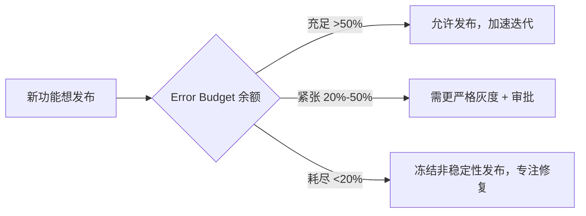
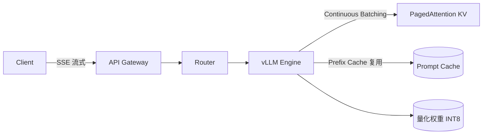
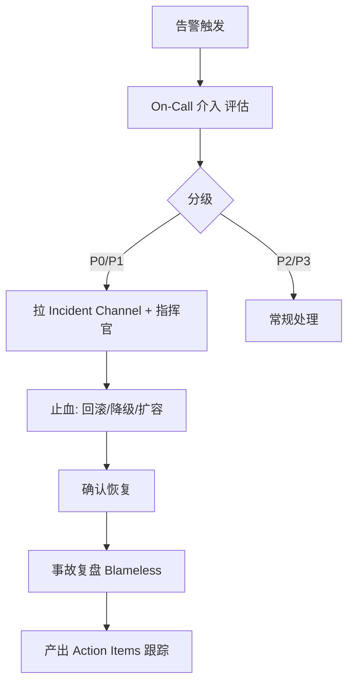

# AI Reliability Engineer 面试题实例答案

> 中文简称：AI Reliability Engineer 面试题实例答案

> 每个答案采用 **结论 → 展开 → 代码/架构 → 追问预判** 结构。

---

## SRE 基础

### Q1: SLI/SLO/SLA/Error Budget 的关系？如何用 Error Budget 平衡稳定性与迭代？

**结论**: SLI 是度量指标，SLO 是目标值，SLA 是对外的合同承诺，Error Budget = 1 - SLO 是允许的不可用额度，用来决定能否发新版本。

**展开**:
- **SLI (Service Level Indicator)**: 具体度量，如"成功请求数 / 总请求数"
- **SLO (Service Level Objective)**: 内部目标，如"可用性 99.9% / 月"
- **SLA (Service Level Agreement)**: 对外合同，通常比 SLO 宽松，如"99.5%，否则赔偿"
- **Error Budget**: 99.9% SLO → 每月 43.2 分钟可"挥霍"

**Error Budget 驱动的决策**:


**追问预判**: "如果业务方在 Error Budget 耗尽时坚持要发版怎么办？"
→ 升级到高层决策并记录风险，将此作为"债务"在下一周期偿还（如增加测试覆盖、改进回滚机制）。

---

### Q2: 熔断、降级、限流、隔离四者的区别和配合？

**结论**: 这是韧性模式（Resilience Patterns）的四件套，按"保护范围"递进：限流保护入口、熔断保护下游、降级保护核心链路、隔离防止故障蔓延。

**展开**:
| 模式 | 作用 | 触发条件 | 典型实现 |
|------|------|---------|---------|
| **限流** | 控制请求速率，防止过载 | QPS 超阈值 | 令牌桶/漏桶（Sentinel/Envoy） |
| **熔断** | 下游故障时快速失败，不堆积请求 | 错误率/超时率超阈值 | Hystrix/Resilience4j |
| **降级** | 非核心功能关闭，保核心 | 负载高/依赖故障 | 返回缓存/默认值 |
| **隔离** | 资源隔离，防互相拖垮 | 共享资源争抢 | 线程池/信号量隔离 |

**AI 推理服务中的应用示例**:
```
1. 限流: API 网关对单用户限 10 QPS，对总量限 1000 QPS
2. 熔断: LLM 调用错误率 >10% 时熔断 30s，期间返回降级提示
3. 降级: LLM 不可用时 → 返回规则引擎结果或缓存答案
4. 隔离: 高优先级客户和低优先级用独立 GPU 池，互不影响
```

**追问预判**: "令牌桶和漏桶的区别？"
→ 令牌桶允许突发（桶里攒了令牌可瞬间消费），漏桶平滑输出（固定速率），AI 服务面对突发流量用令牌桶更合适。

---

## ML 系统可靠性

### Q3: 模型漂移如何实时检测？PSI/KS/ADWIN 各自适用？

**结论**: 漂移分两种——Data Drift（特征分布变化）和 Concept Drift（特征与标签关系变化）。检测方法的选择取决于是否有实时标签和数据维度。

**展开**:
| 方法 | 原理 | 适用 | 优劣 |
|------|------|------|------|
| **PSI** | 分箱后分布距离 | 一维特征，有参考分布 | 简单稳定，不依赖标签 |
| **KS 检验** | 经验 CDF 最大差异 | 一维连续特征 | 统计严谨，单变量 |
| **ADWIN** | 滑动窗口自适应检测 | 流式数据，概念漂移 | 实时，无需分箱 |
| **KL 散度** | 分布差异 | 多维需降维后逐维 | 灵活但需参考分布 |
| **模型置信度监控** | 预测分布偏移 | 无标签场景 | 间接信号 |

**PSI 计算代码示例**:
```python
import numpy as np

def psi(expected, actual, bins=10):
    """计算 Population Stability Index"""
    # 分箱（用 expected 的分位点定义桶）
    breakpoints = np.percentile(expected, np.linspace(0, 100, bins+1))
    exp_pct = np.histogram(expected, breakpoints)[0] / len(expected) + 1e-6
    act_pct = np.histogram(actual, breakpoints)[0] / len(actual) + 1e-6
    return np.sum((act_pct - exp_pct) * np.log(act_pct / exp_pct))

# 解读: <0.1 稳定, 0.1-0.25 关注, >0.25 漂移告警
```

**追问预判**: "有标签和没标签场景下漂移检测策略有何不同？"
→ 有标签可对比实时 AUC 与基线；无标签只能依赖输入分布监控（PSI）和预测分布监控（置信度偏移），后者是间接信号，需结合人工抽检确认。

---

### Q4: LLM 推理服务如何保证 P99 延迟？Streaming/Batching/KV Cache 的作用？

**结论**: LLM 推理延迟由 TTFT（首 Token 时间）和 ITL（Token 间延迟）组成。三大手段：Streaming 降首响、Continuous Batching 提吞吐、PagedAttention/Prefix Caching 降显存压力。

**展开**:
1. **Streaming（流式输出）**: 用 SSE/WebSocket 逐 token 返回，TTFT 从"等全部生成"降到"等首 token"，用户感知大幅改善
2. **Continuous Batching（动态批处理）**: vLLM/Orca 的核心技术，请求级别动态组批，不等一批完成，新的随时加入
3. **KV Cache 优化**:
   - PagedAttention（vLLM）: 类似 OS 虚拟内存的分页 KV 存储，减少显存碎片
   - Prefix Caching: 相同 system prompt 的 KV 复用，省重复计算
4. **量化（INT8/INT4）**: 减少显存带宽压力，提速 2-3x

**架构示意**:


**追问预判**: "Continuous Batching 和 Static Batching 的吞吐差异？"
→ Static Batching 必须等一批中最慢的请求完成才能出批，GPU 空闲严重；Continuous Batching 每步可加入/移除请求，吞吐提升 2-8 倍。

---

## 监控与可观测性

### Q5: AI 系统的"静默错误"（精度退化但不报错）如何发现？

**结论**: 静默错误是 ML 系统特有风险——服务正常返回但结果错误。需要"输出质量监控"层，结合抽样标注、置信度分布、业务反馈环。

**展开**:
```
静默错误检测四层:
1. 输入层: Data Drift 监控（PSI）— 输入是否偏离训练分布
2. 模型层: 预测分布监控 — 置信度均值/方差偏移告警
3. 输出层: 抽样人工评估 — 定期抽 N 条标注质量
4. 业务层: 反馈环监控 — 用户负反馈（点踩/重试率）上升
```

**LLM 特有的质量监控**:
- 幻觉率监控：抽取输出做事实核查（用另一个模型或知识库校验）
- 毒性监控：内容分类器实时打分
- 任务完成率：多轮对话中用户是否最终达成目标（转化率）

**追问预判**: "抽样人工评估成本高，如何平衡？"
→ 用主动学习选最有信息量的样本（如模型最不确定的、置信度突变的）抽检，配合 LLM-as-Judge 做初筛，人工只复核分歧样本。

---

## 故障应急

### Q6: 设计一个 AI 事故响应流程（On-Call/分级/响应/复盘）

**结论**: 标准事故响应分五阶段——检测、分级、响应、恢复、复盘，核心是"先止血再根治"和"无 blame 复盘"。

**展开**:

**事故分级**:
| 级别 | 定义 | 响应时效 | 示例 |
|------|------|---------|------|
| P0 | 核心服务全挂 | <5min | 推理集群宕机 |
| P1 | 部分用户/功能不可用 | <15min | 某模型版本错误率高 |
| P2 | 性能退化但可用 | <1h | P99 延迟翻倍 |
| P3 | 单点问题 | 下一工作日 | 个别请求异常 |

**响应流程**:


**追问预判**: "止血和排查冲突时，先做哪个？"
→ 永远先止血（回滚、降级、切流量），保留部分现场（如 dump 一个实例）后再深入排查根因；切忌为了"找出原因"延长故障时间。

---

### Q7: 模型上线后效果突然下降，如何快速定位？

**结论**: 用"分层排查法"——从数据、特征、模型、基础设施四层逐层验证，结合影子流量和 A/B 对比。

**展开**:
```
分层排查清单:
1. 基础设施层
   □ GPU 是否正常（利用率/温度/驱动）
   □ 是否有节点降频或抢占
   □ 网络延迟是否异常

2. 数据/特征层
   □ 上游特征是否缺失（数据管道故障）
   □ 特征值是否异常（PSI 飙升）
   □ 实时特征 vs 离线特征是否一致

3. 模型层
   □ 是否加载了错误的模型版本
   □ 量化/裁剪是否有精度损失
   □ 模型权重文件是否损坏

4. 服务层
   □ 请求路由是否正确（是否打到旧版本）
   □ 预处理逻辑是否变更
   □ 是否引入了新 bug
```

**快速定位技巧**: 先对比"影子流量跑旧模型 vs 线上新模型"，若旧模型正常新模型差 → 模型/版本问题；若都差 → 数据/基础设施问题。

**追问预判**: "如何缩短 MTTR（平均恢复时间）？"
→ 自动化回滚（检测到指标下降自动切回上版本）、完善的 Runbook、定期混沌演练让团队肌肉记忆。

---

## 容量规划

### Q8: 如何为 GPU 推理集群做容量规划？

**结论**: 容量规划 = 流量预测 × 单卡吞吐 × 冗余系数。核心是测算单卡 QPS、考虑峰值倍数和故障冗余（N+1 或 N+2）。

**展开**:

**计算框架**:
```
所需 GPU 数 = (峰值 QPS × 单请求成本系数) / (单卡 QPS × 利用率)

示例:
- 峰值 QPS: 500
- 单卡（A100）vLLM 推理 QPS: 约 40（7B 模型）
- 目标利用率: 70%（留余量）
- 故障冗余: N+1（单节点故障不降级）

所需 = 500 / (40 × 0.7) ≈ 18 张 → 取 20 张（含冗余）
```

**多维度考虑**:
| 维度 | 考量 |
|------|------|
| **峰值倍数** | 历史 P99/P999 流量是均值的几倍 |
| **季节性** | 大促/活动期间扩容预案 |
| **故障域** | 单机架/单可用区故障的冗余 |
| **冷启动** | GPU 加载模型时间（是否常驻） |
| **成本** | Spot vs 按量 vs 包年组合 |

**追问预判**: "Auto-scaling 在 GPU 场景为什么难？"
→ GPU 节点启动慢（拉镜像+加载模型几分钟）、成本高（不能频繁扩缩）、指标滞后（等队列堆积才触发已晚），需要预测式扩容而非纯反应式。

---

## 行为面试

### Q9: 描述一次你主导的 AI 系统稳定性提升项目（STAR）

**答题框架**:
```
S: "接手一个 LLM 推理服务，月均 3 次告警风暴，可用性 99.5%，用户投诉延迟高"

T: "目标：6 个月内将可用性提升到 99.95%，P99 延迟降一半"

A:
  - 监控: 建立黄金信号监控 + LLM 输出质量抽样监控
  - 容量: 测算并扩容 GPU，引入 Continuous Batching 提升单卡吞吐 3 倍
  - 韧性: 实现自动熔断 + 降级到规则引擎 + 多供应商容灾
  - 发布: 引入影子流量 + 自动回滚（指标下降自动切回）
  - 流程: 建立 On-Call 轮换 + 每周混沌演练 + Blameless 复盘

R:
  - 6 个月后可用性达 99.97%，P99 延迟从 8s 降到 3s
  - 告警量下降 80%，团队 On-Call 负担显著降低
  - 混沌演练发现并修复了 12 个潜在单点故障
  - 复盘文化建立，事故后改进项完成率从 40% 提升到 90%
```

**追问预判**: "如何说服业务团队为稳定性投入（牺牲功能速度）？"
→ 用"故障成本"量化（每次宕机损失多少营收/用户），展示 ROI；用 Error Budget 机制让"稳定性投入"变成数据驱动的决策而非主观争论。

---

*Last updated: 2026-07-23*

## Related

- [[21_面试岗位/17_数据科学家/05_question_bank|AI Reliability Engineer 题库]]
- [[21_面试岗位/AI_Reliability_Engineer/company_level_question_bank|AI Reliability Engineer 按公司/级别区分的题库]]
- [[21_面试岗位/AI_Reliability_Engineer/index|AI Reliability Engineer 首页]]
- [[13_运维/index|运维]]
- [[11_模型运维/index|模型运维]]
- [[10_部署推理/index|部署推理]]
- [[12_架构基建/01_架构基础/05_llm_infrastructure_system_design|AI 系统设计面试]]
- [[21_面试岗位/18_面试指南/05_jobs|AI 相关岗位与工种清单]]
