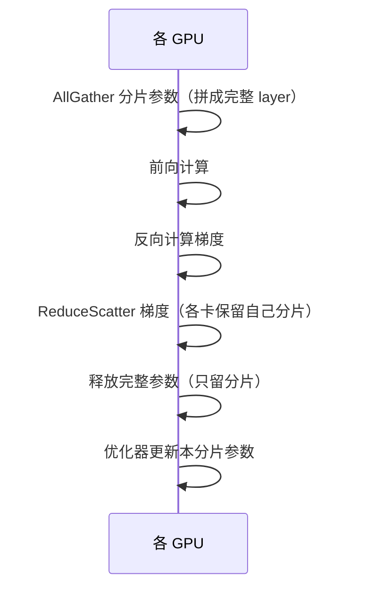

# AI Research Engineer 面试题实例答案

> 中文简称：AI Research Engineer 面试题实例答案

> 每个答案采用 **结论 → 展开 → 代码/推导 → 追问预判** 结构。

---

## 分布式训练

### Q1: 数据并行（DP/DDP/FSDP/ZeRO）的区别和显存优化？

**结论**: 数据并行的发展是"逐步切分更多状态"的过程——DP 复制全部、DDP 优化通信、FSDP/ZeRO 切分优化器状态/梯度/参数，显存占用从 O(N) 降到 O(N/P)。

**展开**:
| 方案 | 参数 | 梯度 | 优化器状态 | 通信 |
|------|------|------|-----------|------|
| **DP（朴素）** | 复制 | 复制 | 复制 | AllReduce 梯度 |
| **DDP** | 复制 | 复制 | 复制 | AllReduce 梯度（优化） |
| **ZeRO-1** | 复制 | 复制 | 切分 | AllReduce + AllGather 优化器 |
| **ZeRO-2** | 复制 | 切分 | 切分 | AllGather 梯度 |
| **ZeRO-3/FSDP** | 切分 | 切分 | 切分 | AllGather 参数（前/后） |

**显存估算（以 7B 模型 FP16 + Adam 为例）**:
```
参数(FP16): 7B × 2 bytes = 14 GB
梯度(FP16): 14 GB
优化器状态(FP32 m,v + FP32 master): 7B × 12 bytes = 84 GB
总计每卡（无切分）: 112 GB

ZeRO-3 切分到 8 卡: 112 / 8 = 14 GB/卡 → 单卡 40GB A100 可训
```

**FSDP 的工作流（每个 layer）**:


**追问预判**: "FSDP 的通信开销比 DDP 大，什么时候反而更优？"
→ 当模型大到单卡装不下时，FSDP 是唯一选择；FSDP 可通过 overlap（计算与通信重叠）、prefetch（提前 allgather 下层）隐藏通信。

---

### Q2: 张量并行（TP）的列切/行切，通信发生在哪？

**结论**: TP 把单个矩阵乘法切到多卡上并行计算。列切（Column Parallel）在前向不需通信，反向需 AllReduce；行切（Row Parallel）在前向需 AllReduce。Megatron 用"列切 + 行切"组合使一个 Transformer block 只需 2 次 AllReduce。

**展开**:

**列并行（Y = XA，A 按列切 A=[A1,A2]）**:
```
Y = X·A = [X·A1, X·A2]
每卡算 X·Ai，结果按列拼接（无需通信）
```

**行并行（Y = XA，A 按行切 A=[A1;A2]，X 按列切 X=[X1,X2]）**:
```
Y = X1·A1 + X2·A2
每卡算 Xi·Ai，结果 AllReduce 求和
```

**Megatron MLP 的组合**:

一个 block 只有 attention 后和 MLP 后各一次 AllReduce。

**追问预判**: "TP 为什么通常限制在同一节点（8 卡内）？"
→ TP 通信极其频繁（每层都通信），需要 NVLink 这样的高带宽低延迟互联，跨节点用以太网/InfiniBand 延迟太高，所以 TP 在节点内、DP/PP 跨节点。

---

## CUDA 与算子优化

### Q3: Flash Attention 的核心优化点是什么？

**结论**: 标准 Attention 的瓶颈是 HBM（显存）带宽——要读写 N×N 的 attention matrix 两次。Flash Attention 用 tiling（分块）+ online softmax + recomputation，把中间矩阵留在 SRAM，避免 HBM 读写，实现 IO 复杂度从 O(N²) 降到 O(N²·d/M)（M 是 SRAM 大小）。

**展开**:
1. **Tiling（分块）**: 把 Q/K/V 分块加载到 SRAM，逐块计算
2. **Online Softmax**: 流式计算 softmax，无需先算完整 row 的 max（标准 softmax 需要）
   ```
   传统: m = max(x); s = sum(exp(x-m)); softmax = exp(x-m)/s
   Online: 逐块更新 m 和 s，可流式处理
   ```
3. **Recomputation（重算）**: 反向时不存 N×N 的 attention matrix，而是重算（因为前向没存中间结果），用计算换显存
4. **结果**: 显存从 O(N²) 降到 O(N)，速度在长序列提升 2-4 倍

**Triton 实现示意（伪代码）**:
```python
# Flash Attention 前向核心（简化）
@triton.jit
def flash_attn(Q, K, V, O, ...):
    # 分块加载 Q, K, V 到 SRAM
    for q_block in Q:  # 外层循环 Q 块
        acc = zeros; m_i = -inf; l_i = 0
        for k_block, v_block in zip(K, V):  # 内层循环 K,V 块
            s = q_block @ k_block.T / sqrt(d)  # 块内点积
            m_new = max(m_i, s.max())
            p = exp(s - m_new)
            l_i = exp(m_i - m_new) * l_i + p.sum()
            acc = exp(m_i - m_new) * acc + p @ v_block
            m_i = m_new
        O[q_block] = acc / l_i  # 写回 HBM
```

**追问预判**: "Flash Attention v2 比 v1 快在哪？"
→ v2 优化了并行度（外层 Q 循环并行，充分利用 SM）+ 减少非 matmul 计算 + 更好的 warp 级划分。

---

### Q4: 算子融合（Operator Fusion）为什么减少显存带宽瓶颈？

**结论**: 现代 GPU 是"访存受限"（memory-bound）的——计算单元快、显存慢。未融合时每个中间结果都要写回 HBM 再读出，融合后中间结果留在寄存器/SRAM，省大量读写。

**展开**:

**未融合（如 y = dropout(geLU(layerNorm(x)))）**:
```
读 x → LayerNorm → 写 ln_out 到 HBM
读 ln_out → GeLU → 写 gelu_out 到 HBM
读 gelu_out → Dropout → 写 y 到 HBM
# 6 次 HBM 读写
```

**融合后**:
```
读 x → [LayerNorm → GeLU → Dropout 在 kernel 内] → 写 y 到 HBM
# 2 次 HBM 读写
```

**PyTorch 实现（torch.compile）**:
```python
@torch.compile  # Inductor 自动融合
def fused_fn(x):
    return torch.dropout(torch.nn.functional.gelu(x_layer_normed), p=0.1)
```

**追问预判**: "为什么 Activation Checkpointing（梯度检查点）是反融合？"
→ Activation Checkpoint 为省显存，丢弃中间激活、反向时重算，本质是用计算换显存；它和融合（省带宽）方向相反，需权衡。

---

## 训练框架与工程

### Q5: 如何保证实验可复现性？

**结论**: 复现性是 Research Engineer 的基本功，需控制"随机性来源"和"非确定性算子"两大类。

**展开**:
```
随机性来源:
1. 模型初始化权重 → torch.manual_seed
2. 数据 shuffle 顺序 → DataLoader worker seed + generator
3. Dropout mask → 同上
4. 数据增强（如随机裁剪）→ 同上

非确定性来源（更难）:
5. CUDA 非确定性算子（如 atomicAdd）→ torch.use_deterministic_algorithms(True)
6. cuDNN 算法选择 → torch.backends.cudnn.deterministic = True
7. 多卡 AllReduce 顺序 → 固定进程顺序
8. 浮点累积顺序 → 影响微小，大规模下累积可见
```

**完整种子设置代码**:
```python
import os, random, numpy as np, torch

def set_seed(seed=42):
    random.seed(seed)
    np.random.seed(seed)
    torch.manual_seed(seed)
    torch.cuda.manual_seed_all(seed)
    os.environ["PYTHONHASHSEED"] = str(seed)
    torch.backends.cudnn.deterministic = True
    torch.backends.cudnn.benchmark = False
    # 完全确定模式（可能变慢，某些算子无确定性实现会报错）
    os.environ["CUBLAS_WORKSPACE_CONFIG"] = ":4096:8"

# DataLoader 也要固定
g = torch.Generator()
g.manual_seed(42)
dataloader = DataLoader(ds, shuffle=True, generator=g,
                        worker_init_fn=lambda w: random.seed(42 + w))
```

**追问预判**: "开启确定性模式后性能下降多少？什么时候可以接受？"
→ 通常慢 10-30%。Debug/对齐论文结果时必须开，正式大规模训练时可关（吞吐优先），用统计平均弥补非确定性。

---

## 前沿研究实现

### Q6: DPO 相比 PPO 简化了什么？实现关键点？

**结论**: DPO（Direct Preference Optimization）绕过了显式的 Reward Model 和 RL，直接用偏好数据通过一个 closed-form loss 微调策略，极大简化了 RLHF 工程链路。

**展开**:

**PPO 链路（复杂）**:
```
SFT → 训练 Reward Model → PPO 训练（policy + ref + reward + value 4 模型）
显存: 4 个模型同时在线，工程复杂，超参敏感
```

**DPO 链路（简化）**:
```
SFT → DPO 微调（policy + ref 2 模型）
Loss 直接从偏好对推导，无需 RL 循环
```

**DPO Loss**:
```
L_DPO = -E[log σ(β·(log(π(yw)/π_ref(yw)) - log(π(yl)/π_ref(yl))))]
其中 yw = 偏好回答, yl = 不偏好回答, β = 温度系数
```

**实现关键点**:
```python
def dpo_loss(policy_chosen_logps, policy_rejected_logps,
             ref_chosen_logps, ref_rejected_logps, beta=0.1):
    # 用 logp 差值避免数值问题
    chosen_ratio = policy_chosen_logps - ref_chosen_logps
    rejected_ratio = policy_rejected_logps - ref_rejected_logps
    logits = beta * (chosen_ratio - rejected_ratio)
    return -torch.nn.functional.logsigmoid(logits).mean()
```

**坑点**:
- β 太大 → 偏离参考模型；β 太小 → 学不动
- ref 模型必须冻结，用 `with torch.no_grad()` 包裹
- 偏好数据质量决定上限，标签噪声敏感

**追问预判**: "DPO 一定比 PPO 好吗？"
→ 不一定。PPO 在复杂多步推理（如 o1）上可能更强；DPO 简单稳定但容易过拟合偏好数据，且无法在线探索。当前趋势是 GRPO（DeepSeek）等折中方案。

---

### Q7: 训练不收敛（loss NaN/爆炸/停滞）如何 debug？

**结论**: 系统化排查：数值稳定性 → 数据 → 超参 → 架构，四步定位。

**展开**:
```
排查清单:
1. 数值稳定性
   □ Loss scaling 是否合适（FP16 下溢）→ 换 BF16 或调 scale
   □ 梯度爆炸 → clip grad norm (通常 1.0)
   □ 某层激活 NaN → 加 LayerNorm/检查初始化
   □ 用 torch.autograd.detect_anomaly() 定位 NaN 源

2. 数据
   □ 是否有脏数据（NaN/inf 输入）→ 数据校验
   □ label 是否错位 → 检查 tokenizer/dataloader
   □ 序列是否超长被截断影响

3. 超参
   □ 学习率太大/太小 → warmup + 余弦衰减
   □ batch size 太小 → 梯度累积
   □ weight decay 过大

4. 架构
   □ 残差连接是否正确（梯度消失）
   □ 初始化方案（Xavier/He/GPT-style）
   □ 是否用了预训练权重
```

**快速诊断**:
```python
# 监控关键指标
print(f"loss={loss}, grad_norm={grad_norm}, max_act={act.max()}")
# loss 持续 NaN → 数值问题
# grad_norm 暴涨 → 梯度爆炸，需 clip 或降 lr
# loss 平台不动 → lr 太小或模型容量不足
```

**追问预判**: "大模型训练中 loss spike（突然飙高后恢复）怎么处理？"
→ 常见于训练中后期，原因复杂（数据批次/优化器状态）。实践中：回滚到 spike 前的 checkpoint，跳过该 batch，降低 lr 重热；GPT-3 论文有详细记录。

---

## 行为面试

### Q8: 描述一次你把论文算法快速复现并优化的经历（STAR）

**答题框架**:
```
S: "Research 团队提出新的注意力变体，论文仅给出伪代码，需 2 周内集成到训练框架验证"

T: "我负责复现、优化并对比基线"

A:
  - 读论文 + 参考作者开源（如有），用 PyTorch 实现核心算子
  - 写单元测试对齐前向输出（与标准 attention 数值差 <1e-5）
  - 用 Triton 重写为融合算子，benchmark 速度
  - 集成到 Megatron-LM 训练框架，跑 1B 模型消融
  - 用 W&B 跟踪 loss/吞吐/显存对比

R:
  - 2 周内完成复现，Triton 算子比朴素实现快 2.5x
  - 训练吞吐提升 30%，显存降 15%
  - 帮助团队确认算法有效，推动进入下一规模实验
  - 沉淀为可复用算子库，后续 3 个 idea 复用
```

**追问预判**: "如何平衡快速验证和代码质量？"
→ 分两阶段：验证期用"能跑就行"的脚本快速迭代；确认有效后重构为规范代码（测试+文档+接口）纳入主库。避免过早优化拖慢验证。

---

*Last updated: 2026-07-23*

## Related

- [[21_面试岗位/17_数据科学家/05_question_bank|AI Research Engineer 题库]]
- [[21_面试岗位/AI_Research_Engineer/company_level_question_bank|AI Research Engineer 按公司/级别区分的题库]]
- [[21_面试岗位/AI_Research_Engineer/index|AI Research Engineer 首页]]
- [[07_模型训练/index|模型训练]]
- [[03_深度学习/index|深度学习]]
- [[05_大模型/index|大模型]]
- [[21_面试岗位/AI_Research_Scientist/index|AI Research Scientist]]
- [[21_面试岗位/18_面试指南/05_jobs|AI 相关岗位与工种清单]]
