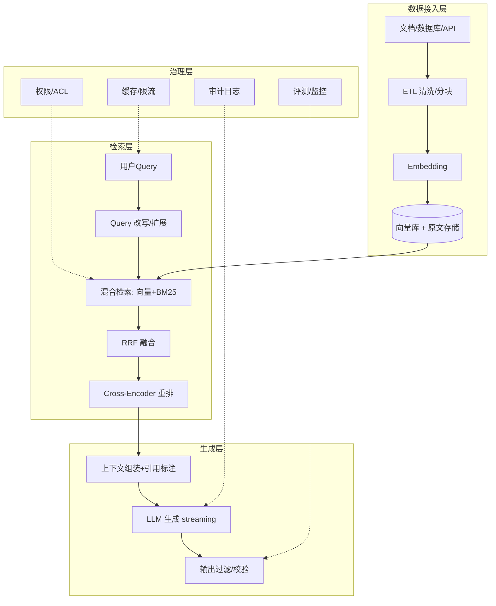
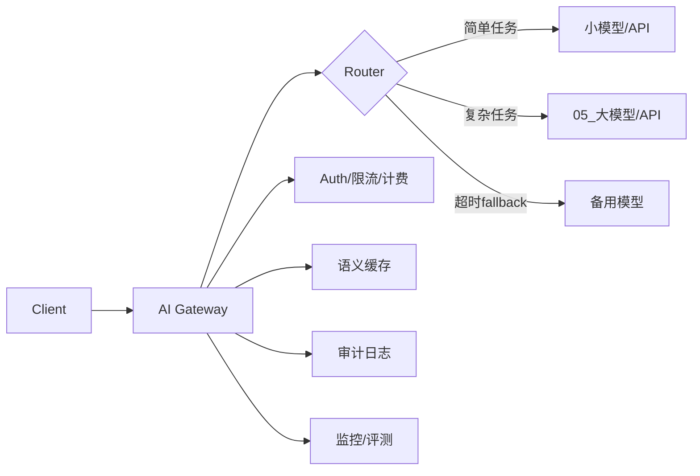
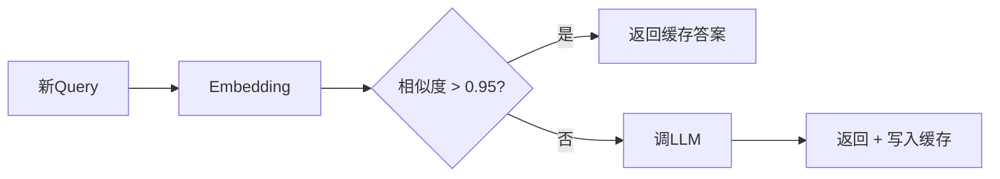
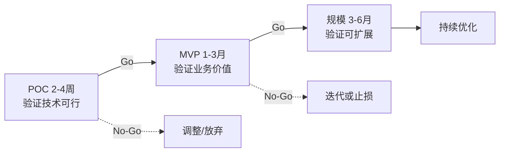

# AI Solutions Architect 面试题实例答案

> 中文简称：AI Solutions Architect 面试题实例答案

> 每个答案采用 **结论 → 展开 → 架构图/框架 → 追问预判** 结构。

---

## 端到端架构设计

### Q1: 设计一个企业级 RAG 系统的完整架构

**结论**: 生产级 RAG 不是"LLM + 向量库"那么简单，需要覆盖数据接入、索引、检索、重排、生成、治理六大子系统，并解决权限、缓存、溯源、审计等工程问题。

**展开**:

**完整架构**:


**关键工程决策**:
1. **分块策略**: 固定大小 vs 语义分块 vs 文档结构（标题/段落），按文档类型选
2. **权限控制**: 检索时按用户 ACL 过滤（metadata 过滤），非生成后过滤
3. **引用溯源**: 每个 chunk 带 source_id，生成时标注引用，避免幻觉
4. **缓存**: Query 语义缓存（相似度 >0.95 命中）+ 检索结果缓存
5. **评测**: 离线 RAGAS（Faithfulness/Relevancy）+ 在线点击反馈

**追问预判**: "文档频繁更新如何保证索引同步？"
→ 用 CDC（Change Data Capture）或定时增量索引；版本化 chunk，更新时失效旧版本；对时效敏感场景标注有效期。

---

### Q2: 设计多模型路由的 AI Gateway（成本/延迟/质量权衡）

**结论**: AI Gateway 是企业 AI 的统一入口，核心价值是"模型抽象 + 智能路由 + 治理"。路由策略按任务复杂度/延迟/成本动态选模型。

**展开**:

**路由策略矩阵**:
| 策略 | 逻辑 | 适用 |
|------|------|------|
| **任务路由** | 分类任务后选模型（简单→小，复杂→大） | 通用 |
| **级联路由** | 先小模型，置信度低再升级大模型 | 降本 |
| **Fallback** | 主模型超时/错误切备用 | 容灾 |
| **A/B 路由** | 按比例分流对比模型 | 实验 |
| **成本路由** | 剩余预算不足时降级 | 预算控制 |

**架构图**:


**Gateway 核心能力**:
1. **协议统一**: OpenAI 格式适配多供应商
2. **治理**: 鉴权、配额、成本追踪、审计
3. **可靠性**: 重试、超时、熔断、多供应商容灾
4. **优化**: 缓存、Prompt 改写、自动路由

**追问预判**: "如何决定一个任务该用哪个模型？"
→ 用一个轻量分类器（甚至规则）判任务复杂度，结合历史数据看各模型在该任务的质量/成本/延迟；持续用 A/B 数据优化路由策略。

---

## 技术选型

### Q3: 开源模型 vs 闭源 API 如何选？决策维度？

**结论**: 这是个多维度决策，核心权衡是"能力/成本/合规/控制力"。通常结论：能力前沿优先闭源，成本敏感或合规要求优先开源。

**展开**:

**决策矩阵**:
| 维度 | 闭源 API（GPT-4/Claude） | 自部署开源（Llama/Qwen） |
|------|------------------------|------------------------|
| **能力** | 前沿，最强 | 略逊，但差距缩小 |
| **成本（大规模）** | 按 token，规模大贵 | 固定 GPU 成本，规模大便宜 |
| **延迟** | 网络往返，不可控 | 可优化到极低（本地） |
| **数据合规** | 数据出域风险 | 完全可控，可私有化 |
| **定制** | 仅 Prompt/微调 API | 全权重微调，深度定制 |
| **运维** | 零运维 | 需 GPU/推理框架运维 |
| **可用性** | 依赖供应商 SLA | 自主可控 |
| **迭代** | 跟随供应商节奏 | 自主控制 |

**决策框架（决策树）**:
```
1. 数据敏感（医疗/金融/政府）？ → 是 → 私有化开源
2. 需要深度定制（专属领域/风格）？ → 是 → 开源 + 微调
3. 流量大到 API 成本爆炸（月 >$X）？ → 是 → 自部署开源
4. 需要极低延迟（<100ms）？ → 是 → 自部署小模型
5. 以上都否 → 闭源 API（快速、强能力、低运维）
```

**追问预判**: "自部署开源模型的总成本（TCO）怎么算？"
→ TCO = GPU 硬件（或云实例）+ 推理框架运维人力 + 模型迭代成本 + 电力/带宽。盈亏平衡点通常在每月百万级 token 请求，低于此闭源 API 更划算。

---

### Q4: 向量数据库选型的维度对比？

**结论**: 没有绝对最优，按"规模/延迟/功能/运维"四维选。小规模用 PGVector（复用现有 Postgres），大规模用专用库（Milvus/Qdrant）。

**展开**:

| 维度 | Milvus | Qdrant | Pinecone | PGVector | Weaviate |
|------|--------|--------|----------|----------|----------|
| **部署** | 自部署/云 | 自部署/云 | 仅云 | 自部署 | 自部署/云 |
| **规模** | 十亿级 | 亿级 | 十亿级 | 千万级 | 亿级 |
| **混合检索** | 支持 | 强 | 支持 | SQL 灵活 | 支持 |
| **元数据过滤** | 支持 | 强 | 支持 | SQL 强 | 支持 |
| **运维复杂度** | 中（分布式） | 低（单二进制） | 零托管 | 低（PG） | 中 |
| **生态** | 开源活跃 | Rust 性能 | 商业成熟 | PG 生态 | 多模态 |

**选型建议**:
- **小规模/快速验证**: PGVector（复用现有 PG，无新组件）
- **中等规模/自部署**: Qdrant（轻量、性能好、运维简单）
- **超大规模/分布式**: Milvus（专为十亿级设计）
- **不想运维**: Pinecone（全托管，贵但省心）
- **需要复杂混合检索/SQL**: PGVector + GIN 索引

**追问预判**: "PGVector 在多大规模会成瓶颈？"
→ 千万向量以内 + 高过滤条件时表现尚可；超过千万或需要高 QPS，专用库的 ANN 索引（HNSW/IVF）优势明显。瓶颈通常在索引重建速度和并发查询。

---

## 成本优化

### Q5: Semantic Cache 如何设计？级联推理如何降本？

**结论**: 语义缓存通过 embedding 相似度命中"问法不同但意图相同"的查询，命中率 20-40%（客服类高频场景）。级联推理用小模型处理简单任务、大模型兜底复杂任务，可降本 50%+。

**展开**:

**语义缓存流程**:


**关键设计点**:
- 相似度阈值需调（太高命中率低，太低返回错误答案）
- 缓存 TTL：时效敏感内容（如价格）短 TTL
- 分桶缓存：高频 query 长期缓存，长尾不缓存
- 安全：含 PII 的 query 不缓存

**级联推理（Cascading）**:
```
用户Query → 小模型（如 8B）
  └ 置信度高 + 任务简单 → 直接返回（成本低）
  └ 置信度低/任务复杂 → 升级大模型（如 70B/API）
      └ 仍不确定 → 升级最强模型（GPT-4）
```

**成本估算示例**:
```
假设 70% query 可被小模型处理:
- 全用大模型: 100% × $0.06/req = $0.060
- 级联: 70% × $0.002（小）+ 30% × $0.06（大）= $0.019
- 降本 ~68%
```

**追问预判**: "级联路由的误判风险（简单任务误升级或复杂任务误降级）？"
→ 用置信度阈值 + 兜底：设保守的升级阈值（宁可多升级）；对降级做抽样人工校验；持续用反馈数据优化路由分类器。

---

## 客户沟通

### Q6: 客户需求模糊（"想用 AI 提效"），如何引导？

**结论**: Solutions Architect 的核心能力之一是"需求挖掘"。用"业务目标 → 痛点 → AI 机会 → 可行性"四步引导，避免直接跳到技术方案。

**展开**:

**引导框架**:
```
1. 业务目标 (What)
   - "提效是手段，目标是什么？降本？增收？体验？"
   - 量化现状基线（如客服人均处理 50 单/天）

2. 痛点定位 (Why)
   - "哪个环节最耗时/最易错/最依赖资深人员？"
   - 找到 AI 能解决的具体问题（非"AI for AI"）

3. AI 机会评估 (How - AI fit)
   - 这个问题是否需要 AI？还是规则/传统方法更优？
   - 数据是否足够/可用？
   - ROI 是否合理（成本 vs 收益）？

4. 可行性 + POC 设计 (Validate)
   - 设计 2-4 周的 POC 验证核心假设
   - 定义清晰的成功指标
```

**示例对话**:
```
客户: "我们想用大模型提效"
SA: "很好。提效的哪方面最关键？比如客服、文档、代码？"
客户: "客服响应慢"
SA: "客服现在的瓶颈是什么？是查找信息慢，还是回复撰写慢？日均多少单？"
客户: "查找内部知识库慢，人均 50 单"
SA: "这很适合 RAG。我们设计一个 POC：用你们的知识库做检索增强，
     目标是把单均处理时间从 X 分钟降到 Y 分钟，先在 1 个团队试。"
```

**追问预判**: "如何判断客户场景其实不需要 AI？"
→ 用三问：1) 是否有足够数据？2) 规则/搜索能否解决 80%？3) AI 的边际价值是否值成本？若答案否定，诚实建议非 AI 方案——赢得信任比强推 AI 更重要。

---

## 迁移与落地

### Q7: 如何设计 AI 项目的分阶段交付路线图（POC→MVP→规模）？

**结论**: AI 项目不确定性高，应"小步快跑、价值驱动"，分 POC（验证可行性）、MVP（验证价值）、规模（验证可扩展）三阶段，每阶段有明确"Go/No-Go"门禁。

**展开**:

**三阶段路线图**:


**各阶段要点**:
| 阶段 | 目标 | 范围 | 成功标准 | 投入 |
|------|------|------|---------|------|
| **POC** | 技术可行 | 1 用例/小数据 | 核心指标达标 | 小团队/2-4 周 |
| **MVP** | 业务价值 | 1 团队/真实数据 | 业务指标提升 + 用户满意 | 中团队/1-3 月 |
| **规模** | 可扩展 | 全公司/高并发 | SLA + 成本 + 推广 | 大团队/3-6 月 |

**关键原则**:
1. **POC 要"真"**: 用真实数据、真实用户（非演示玩具）
2. **早期定义指标**: 避免"做完了不知道好不好"
3. **允许 No-Go**: 设止损线，POC 失败要敢放弃
4. **每阶段可交付**: 即使中止也有阶段性成果

**追问预判**: "客户要求一次性大规模部署（跳过 POC），如何劝说？"
→ 用风险与成本：AI 不确定性高，直接规模化若失败损失大；POC 投入小、2-4 周即可，是"用小钱买确定性"。展示同类项目"先 POC 后规模"的成功案例。

---

## 行为面试

### Q8: 描述一次你主导的端到端 AI 解决方案交付（STAR）

**答题框架**:
```
S: "某金融客户想做智能投研助手，分析师每天花 3 小时读研报"

T: "我作为首席架构师，负责从需求到上线的端到端方案"

A:
  - 需求挖掘: 深入分析师工作流，定位"研报摘要+数据抽取+问答"核心场景
  - 架构设计:
    1. 私有化部署（合规要求数据不出域）
    2. RAG + 微调结合（通用知识 RAG，专业术语微调）
    3. 多模型路由（摘要用小模型，深度问答用大模型）
  - POC: 2 周验证摘要准确率达标（人工评估 >85% 满意）
  - MVP: 1 个分析师团队试用，处理时间从 3h 降到 1h
  - 规模: 全部门推广，加权限/审计/监控

R:
  - 分析师人均省 2h/天，部门年化节省 XX 万工时
  - 客户追加二期合同（知识图谱扩展）
  - 沉淀为金融投研 AI 解决方案模板，复用于 3 家同类客户
  - 我因此晋升为行业解决方案负责人
```

**追问预判**: "过程中最大的技术挑战是什么？"
→ 研报中的表格/图表数据抽取（非结构化）准确率低。解决：多模态模型 + 表格专用 OCR + 人工校验闭环，把表格抽取准确率从 60% 提到 90%。

---

*Last updated: 2026-07-23*

## Related

- [[21_面试岗位/17_数据科学家/05_question_bank|AI Solutions Architect 题库]]
- [[21_面试岗位/AI_Solutions_Architect/company_level_question_bank|AI Solutions Architect 按公司/级别区分的题库]]
- [[21_面试岗位/AI_Solutions_Architect/index|AI Solutions Architect 首页]]
- [[12_架构基建/index|架构基建]]
- [[12_架构基建/11_AI网关/index|AI Gateway]]
- [[10_部署推理/index|部署推理]]
- [[14_RAG系统/index|RAG 系统]]
- [[12_架构基建/01_架构基础/05_llm_infrastructure_system_design|AI 系统设计面试]]
- [[21_面试岗位/18_面试指南/05_jobs|AI 相关岗位与工种清单]]
