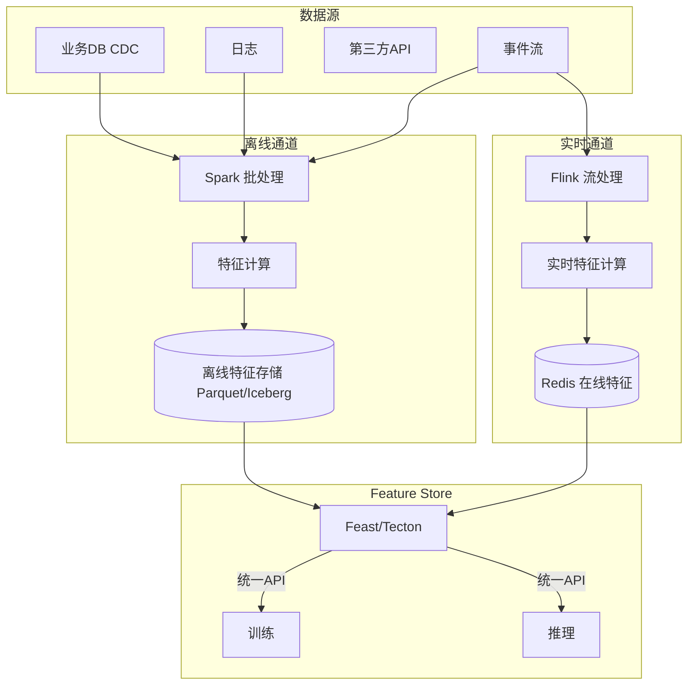

# Data Engineer 面试题实例答案

> 中文简称：Data Engineer 面试题实例答案

> 每个答案采用 **结论 → 展开 → 代码/架构 → 追问预判** 结构。

---

## 数据管道与 ETL

### Q1: 设计一个支撑 ML 训练的端到端数据管道

**结论**: ML 数据管道比 BI 管道要求更高——强调"特征一致性、时间点正确性、可复现"。核心是离线批 + 实时流双通道汇聚到 Feature Store，统一服务训练和推理。

**展开**:

**架构图**:


**关键设计点**:
1. **CDC 接入**: 用 Debezium 监听 DB binlog，实时捕获变更（非定时全量拉取）
2. **双通道**: 离线算历史聚合特征（如"过去30天购买数"），实时算秒级特征（如"最近1小时浏览"）
3. **Feature Store 统一**: 训练和推理调同一套特征定义，避免 Training-Serving Skew
4. **数据版本化**: 用 DVC/Lakehouse Time Travel 保证训练数据可复现

**追问预判**: "如何保证离线和实时特征值一致？"
→ 共享特征计算逻辑（同一份代码/配置），离线跑批、实时跑流；用 Feature Store 做对账（离线 vs 在线值差异监控）；定期抽样比对。

---

### Q2: 批 vs 流，Lambda vs Kappa 架构如何选？

**结论**: Lambda（批+流双链路）成熟但维护两套代码；Kappa（只有流，批是流的重放）简洁但要求流处理能力足够强。趋势是 Kappa / 流批一体。

**展开**:

**Lambda 架构**:
```
批层（Batch）: Spark 批处理 → 准确但慢（小时级/天级）
速度层（Speed）: Storm/Flink 流 → 快但可能不准（近似）
服务层: 合并两层结果
问题: 两套代码，逻辑需对齐
```

**Kappa 架构**:
```
只有流层: Flink 处理 Kafka 中的所有事件
"批" = 重放历史 Kafka 消息
优势: 一套代码，逻辑统一
要求: Kafka 保留足够历史，流引擎能处理大批
```

**选型建议**:
| 场景 | 推荐 |
|------|------|
| 实时性要求高 + 能容忍近似 | Kappa |
| 需要精确历史 + 实时 | Lambda（或 Flink 流批一体） |
| 流计算成熟度不足 | Lambda + Spark 批 |
| 现代新项目 | Flink 流批一体（Kappa 思路） |

**追问预判**: "Flink 如何实现流批一体？"
→ Flink 的 DataStream API 和 Table API 同时支持流（无界）和批（有界）执行，同一份代码两种模式；批模式有优化（不需要 watermark/checkpoint 频繁），结果与流一致。

---

## 数据仓库

### Q3: Lakehouse（Iceberg/Hudi/Delta Lake）的核心特性？

**结论**: Lakehouse = 数据湖的存储成本 + 数据仓库的 ACID/管理能力。三大格式都提供 ACID 事务、Time Travel、Schema Evolution、Upsert，区别在实现细节和生态。

**展开**:

**核心特性**:
| 特性 | 价值 |
|------|------|
| **ACID 事务** | 多写并发安全，读不阻塞写 |
| **Time Travel** | 查询历史版本，支持回滚和复现 |
| **Schema Evolution** | 加列/改类型不影响旧数据 |
| **Upsert/Delete** | 支持 CDC 增量更新（数据湖做不到） |
| **分区演进** | 可改分区策略不需重写全部数据 |

**三大格式对比**:
| 维度 | Iceberg | Hudi | Delta Lake |
|------|---------|------|-----------|
| **起源** | Netflix | Uber | Databricks |
| **更新模式** | Copy-on-Write / Merge-on-Read | COW / MOR | COW（MOR 实验中） |
| **生态** | 引擎中立（Spark/Flink/Trino） | 强 Spark | 强 Databricks |
| **适用** | 大规模分析 + 多引擎 | 频繁 upsert | Databricks 用户 |

**Time Travel 示例（Iceberg + Spark）**:
```sql
-- 查询昨天的数据快照（即使今天有更新）
SELECT * FROM table TIMESTAMP AS OF '2026-07-22 10:00:00';

-- 回滚到某次提交
CALL system.rollback_to_snapshot('db.table', 123456789);
```

**追问预判**: "Copy-on-Write 和 Merge-on-Read 的取舍？"
→ COW 写时合并，读快写慢；MOR 写时追加 + 异步合并，写快读慢（读时需合并）。频繁更新场景用 MOR（Hudi 优势），读多写少用 COW。

---

## Spark 性能优化

### Q4: Spark Shuffle 为什么是瓶颈？如何优化？

**结论**: Shuffle 是把数据按 key 重新分布到不同节点的过程，涉及大量磁盘 IO 和网络传输，是 Spark 性能的最大瓶颈。优化核心是"减少 Shuffle 数据量"和"避免 Shuffle"。

**展开**:

**Shuffle 发生场景**:
- `groupByKey`, `reduceByKey`, `join`, `distinct`, `repartition`
- 这些操作需把相同 key 的数据拉到同一节点

**优化手段**:
```
1. 避免不必要 Shuffle
   - 用 broadcast join 替代 shuffle join（小表广播）
   - 用 reduceByKey 而非 groupByKey（map 端预聚合）

2. 减少 Shuffle 数据量
   - 过滤无用列/行（在 shuffle 前过滤）
   - 用列式存储减少 IO

3. 调优 Shuffle 参数
   - spark.sql.shuffle.partitions（默认 200，按数据量调）
   - spark.shuffle.file.buffer（增大缓冲）
```

**Broadcast Join 示例**:
```python
# 大表 join 小表：广播小表避免 shuffle
large_df.join(broadcast(small_df), "key")
# 小表 (<spark.sql.autoBroadcastJoinThreshold，默认 10MB) 自动广播
```

**reduceByKey vs groupByKey**:
```python
# groupByKey: 所有 value 先 shuffle 再聚合（数据量大）
rdd.groupByKey().mapValues(sum)
# reduceByKey: map 端先局部聚合，再 shuffle（数据量小）
rdd.reduceByKey(lambda a, b: a + b)  # 推荐使用
```

**追问预判**: "数据倾斜（Data Skew）如何处理？"
→ 某 key 数据量远超其他导致单 task 慢。对策：1) 盐化（salt）倾斜 key 拆分；2) 两阶段聚合（局部 + 全局）；3) Adaptive Query Execution（AQE）自动处理倾斜。

---

## Kafka

### Q5: Kafka 的高吞吐原理？Exactly-once 如何实现？

**结论**: Kafka 高吞吐靠"顺序写磁盘 + 零拷贝 + 批处理 + 分区并行"。Exactly-once 通过"幂等生产者 + 事务 + 消费者 read-only committed"实现。

**展开**:

**高吞吐原理**:
1. **顺序写磁盘**: 追加写，磁盘顺序 IO 接近内存速度
2. **零拷贝（sendfile）**: 数据从磁盘直接到网卡，跳过用户空间
3. **批处理**: 生产者批量发送，消费者批量拉取
4. **分区并行**: Topic 分多 partition，并行读写
5. **Page Cache**: 利用 OS 缓存，消费者多从缓存读

**Exactly-once 实现**:
```
1. 幂等生产者（Idempotent Producer）
   - 每个 producer 有 PID，每条消息有 sequence number
   - broker 去重（基于 PID + seq）
   - 解决单 producer 重试导致的重复

2. 事务（Transactional Producer）
   - 跨多 partition 的原子写（要么全成功要么全失败）
   - 配合消费者 isolation.level=read_committed 只读已提交

3. 消费端
   - 消费 + 业务处理 + 提交 offset 需原子（通常写另一 topic/DB）
```

**配置示例**:
```python
producer = KafkaProducer(
    bootstrap_servers='...',
    enable_idempotence=True,           # 幂等
    transactional_id='my-tx-id',        # 事务
    acks='all',                         # 等所有副本确认
)
```

**追问预判**: "Exactly-once 性能代价？"
→ 幂等几乎无额外开销；事务因需协调（额外 RPC + 等待 commit）吞吐降 10-30%。对一致性要求不高的场景可用 At-least-once + 业务幂等。

---

## 数据质量

### Q6: 数据质量如何度量？Great Expectations 怎么用？

**结论**: 数据质量是数据团队的生命线，分完整性/准确性/一致性/时效性/唯一性/合法性六维度度量。Great Expectations 用声明式规则自动化校验。

**展开**:

**六维度**:
| 维度 | 含义 | 示例规则 |
|------|------|---------|
| **完整性** | 应有的数据不缺失 | 非空率 >99% |
| **准确性** | 值正确 | 年龄 0-120 |
| **一致性** | 跨表/系统一致 | 订单总额 = 明细之和 |
| **时效性** | 数据及时 | 今日数据 <10:00 前到 |
| **唯一性** | 主键唯一 | id 无重复 |
| **合法性** | 符合业务规则 | 状态在枚举内 |

**Great Expectations 示例**:
```python
import great_expectations as gx

# 定义期望（Expectations）
batch = context.get_batch(...)
batch.expect_column_values_to_not_be_null("user_id")          # 完整性
batch.expect_column_values_to_be_unique("order_id")            # 唯一性
batch.expect_column_values_to_be_between("age", 0, 120)        # 准确性
batch.expect_column_pair_values_a_to_be_greater_than_b(
    "end_time", "start_time")                                   # 业务规则

# 在 ETL 管道中嵌入校验
def etl_task():
    df = extract()
    validate(df)  # 失败则阻断 + 告警
    transform_and_load(df)
```

**实践**:
- 在 ETL 各阶段（接入/清洗/输出）加校验
- 失败时阻断 + 告警 + 自动重试/人工介入
- 建立数据质量看板（每日质量评分）

**追问预判**: "数据质量问题的根因通常在哪？"
→ 上游系统变更（schema/逻辑）未通知（60%）、ETL bug（20%）、上游数据本身脏（20%）。解决：数据契约（Data Contract）+ 上游测试 + 监控告警。

---

## Feature Store

### Q7: Point-in-Time Correctness 如何保证？

**结论**: PIT Correctness 是"训练时只用该样本时间点之前可获得的特征"，防止未来信息泄漏。Feature Store 通过"as-of join"实现。

**展开**:

**问题场景**:
```
训练样本: 用户 A 在 7月1日 是否购买
错误特征: 用户 A 在 7月的总购买数（含 7月1日之后的购买）→ 信息泄漏
正确特征: 用户 A 在 6月30日 23:59 之前的累计购买数
```

**Feature Store 的 as-of join**:
```python
# Feast 示例
from feast import FeatureStore
store = FeatureStore(repo_path=".")

training_df = store.get_historical_features(
    entity_df=pd.DataFrame({
        "user_id": [1, 2, 3],
        "event_timestamp": ["2026-07-01", "2026-07-01", "2026-07-01"]  # 事件时间
    }),
    features=["user_features:total_purchases_30d"]
).to_df()
# 自动 join: 每行只取 event_timestamp 之前最新的特征值
```

**实现原理**:
```
特征表（带 event_timestamp）:
user_id | feature_value | feature_timestamp
1       | 5             | 2026-06-28
1       | 7             | 2026-07-05   ← 未来，不用

样本: user_id=1, event=2026-07-01
PIT join → 取 feature_timestamp <= 2026-07-01 的最新值 = 5
```

**追问预判**: "在线推理如何对齐 PIT？"
→ 在线推理用"当下时间"获取最新特征，天然满足 PIT（推理时未来未发生）。关键是离线训练严格按 PIT，避免离线虚高、线上落差。

---

## 行为面试

### Q8: 描述一次数据管道延迟影响业务的经历及改进（STAR）

**答题框架**:
```
S: "推荐系统依赖的实时特征管道延迟从秒级恶化到分钟级，导致推荐新鲜度下降，
   CTR 下跌 3%"

T: "我负责定位并解决延迟问题"

A:
  - 排查: 发现 Kafka 消费者 lag 持续增长，Flink 任务背压
  - 根因: 某热点 key（大V用户）数据倾斜，单 task 成瓶颈
  - 短期: 扩容 Flink TM + 调并发
  - 长期:
    1. 热点 key 盐化拆分（大V拆成 N 个子 key）
    2. 两阶段聚合（局部 + 全局）
    3. 升级到 Flink SQL + 自动 source rescale
    4. 加延迟监控 + 自动告警（P99 > 阈值）

R:
  - 延迟从分钟级回到 P99 < 2s
  - 推荐新鲜度恢复，CTR 回升
  - 沉淀"热点 key 处理"运维手册，团队复用
  - 建立端到端延迟看板，提前发现恶化
```

**追问预判**: "如何平衡'数据新鲜度'和'管道成本'？"
→ 按业务分级：核心实时特征（秒级）用流处理，次要特征（分钟级）用微批，历史特征（天级）用批。不同 SLA 对应不同成本，避免全用最贵方案。

---

*Last updated: 2026-07-23*

## Related

- [[21_面试岗位/17_数据科学家/05_question_bank|Data Engineer 题库]]
- [[21_面试岗位/Data_Engineer/company_level_question_bank|Data Engineer 按公司/级别区分的题库]]
- [[21_面试岗位/Data_Engineer/index|Data Engineer 首页]]
- [[11_模型运维/index|模型运维]]
- [[11_模型运维/02_数据工程/index|数据工程]]
- [[11_模型运维/03_特征存储/index|Feature Store]]
- [[12_架构基建/01_架构基础/05_llm_infrastructure_system_design|AI 系统设计面试]]
- [[21_面试岗位/18_面试指南/05_jobs|AI 相关岗位与工种清单]]
