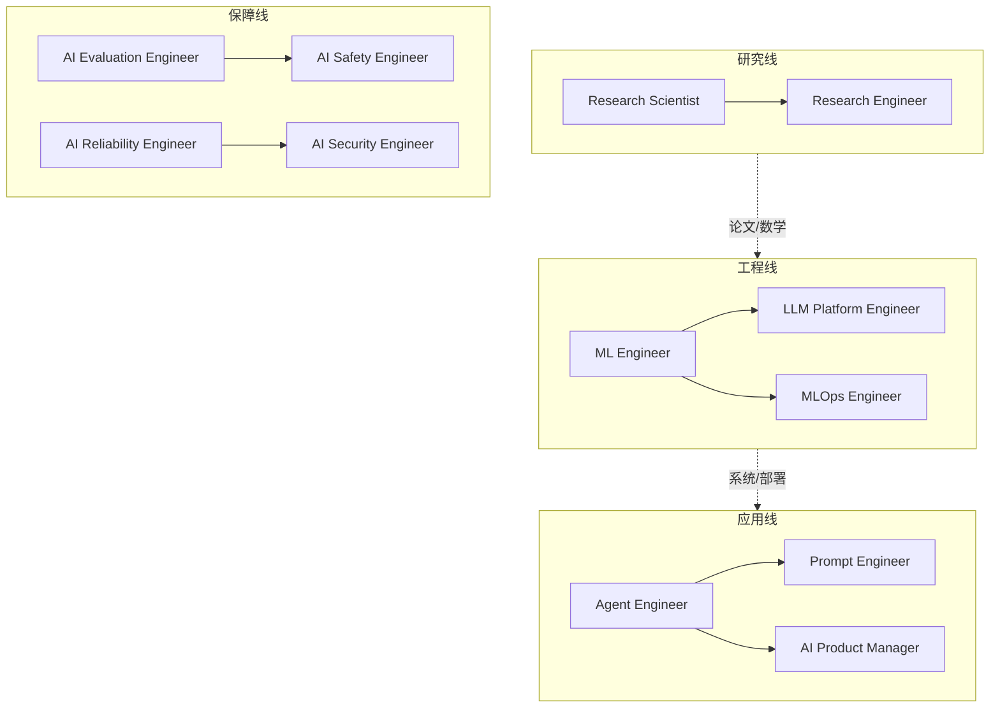

# 面试岗位速览 (AI Interview in a Nutshell)

> 中文简称：面试岗位速览

> **一句话理解**: AI 面试的本质是"岗位匹配"——先搞清楚目标岗位考什么，再针对性补短板，比盲刷一千道题有效得多。

---

## TL;DR

- **24 类岗位**: 从算法研究到平台工程，本章按岗位建目录，每个岗位有独立题库
- **四大能力轴**: 算法/模型能力、工程/系统能力、数据能力、业务/沟通能力——岗位不同权重不同
- **面试四轮标配**: 编程题 → ML/LLM 基础 → 系统设计 → 行为面（BQ）
- **2026 新趋势**: Agent 工程师、AI 评估工程师等新岗位崛起；LLM 应用经验成为通用加分项
- **备战节奏**: 3 个月足够——第 1 月补基础，第 2 月刷题+项目包装，第 3 月模拟面试
- **选岗策略**: 研究岗看论文，工程岗看系统，应用岗看产品 sense

---

## 1. 岗位地图速查

| 赛道 | 岗位 | 核心考察 | 入口 |
|------|------|----------|------|
| 研究 | Research Scientist / Applied Scientist | 论文、数学推导、实验设计 | [[21_面试岗位/24_研究科学家/README|研究科学家]] |
| 算法工程 | Machine Learning Engineer | ML 基础 + 编程 + 系统设计 | [[21_面试岗位/INDEX|MLE]] |
| LLM 平台 | LLM Platform Engineer | 推理优化、分布式、GPU | [[21_面试岗位/README.md|LLM 平台工程师]] |
| 智能体 | Agent Engineer | Agent 架构、工具调用、RAG | [[21_面试岗位/Agent_Engineer/Agent_Engineer_2026|Agent 工程师]] |
| 运维 | MLOps Engineer / Cloud Ops | 流水线、监控、成本 | [[21_面试岗位/MLOps_Engineer|MLOps]] |
| 数据 | Data Engineer / Data Scientist | SQL、管道、统计与实验 | [[21_面试岗位/README.md|数据科学家]] |
| 评估安全 | Evaluation / Safety / Security | 评测体系、红队、对齐 | [[21_面试岗位/AI_Evaluation_Engineer|评估工程师]] |
| 产品 | AI Product Manager | 产品 sense、AI 能力边界 | [[21_面试岗位/AI_Product_Manager|AI 产品经理]] |

> 完整 24 岗位列表见 [[21_面试岗位/index|章节首页]]。

---

## 2. 四轮面试拆解

| 轮次 | 考什么 | 准备要点 |
|------|--------|----------|
| 编程题 | LeetCode 中等为主 + ML 场景编码 | 数组/哈希/DP 高频；会手写 attention 加分 |
| ML/LLM 基础 | 过拟合、Transformer、RLHF、RAG | 能画图讲清反向传播和 KV Cache |
| 系统设计 | 设计推荐系统/RAG 服务/训练平台 | 套路：需求澄清→容量估算→架构→瓶颈→演进 |
| 行为面 (BQ) | 项目深挖、冲突处理、失败复盘 | STAR 法则；每个项目准备"三层追问"答案 |

系统设计专项: [[12_架构基建/01_架构基础/05_llm_infrastructure_system_design|AI 系统设计指南]]

---

## 3. 能力权重矩阵

| 岗位 | 算法/模型 | 工程/系统 | 数据 | 业务/沟通 |
|------|-----------|-----------|------|-----------|
| Research Scientist | ★★★★★ | ★★ | ★★★ | ★★ |
| ML Engineer | ★★★★ | ★★★★ | ★★★ | ★★ |
| LLM Platform Engineer | ★★★ | ★★★★★ | ★★ | ★★ |
| Agent Engineer | ★★★ | ★★★★ | ★★ | ★★★ |
| MLOps Engineer | ★★ | ★★★★★ | ★★★ | ★★ |
| AI Product Manager | ★★ | ★★ | ★★★ | ★★★★★ |

> 用法：对照目标岗位，把最弱的一轴补到"不拖后腿"，把最强的一轴打磨成"记忆点"。

---

## 4. 3 个月备战计划

| 月份 | 目标 | 关键动作 |
|------|------|----------|
| 第 1 月 | 补基础 | ML/DL 核心概念过一遍 + 每天 2 道编程题 |
| 第 2 月 | 项目 + 题库 | 包装 1-2 个 LLM/Agent 项目 + 刷目标岗位题库 |
| 第 3 月 | 模拟实战 | 每周 2 次 mock interview + 复盘错题 + 投递 |

- 完整准备指南: [[21_面试岗位/18_面试指南/03_Interview_Preparation|面试准备指南]]
- 面经与真题记录: [[21_面试岗位/18_面试指南/01_career_interviews|求职面经]]
- 笔记模板: [[21_面试岗位/18_面试指南/02_interview_notes_template|面试笔记模板]]

---

## 5. 2026 求职趋势

1. **Agent 经验通吃**: 有 Agent/RAG 生产项目的候选人在所有应用岗都占优
2. **评估能力稀缺**: AI Evaluation Engineer 供需缺口最大，转岗窗口期
3. **全栈化**: 纯调参岗萎缩，"模型 + 工程 + 产品"复合型吃香
4. **开源作品 > 刷题记录**: 高质量 GitHub 仓库/技术博客成为简历硬通货
5. **岗位市场全景**: [[21_面试岗位/18_面试指南/05_jobs|岗位与市场观察]]

---

## 延伸阅读 (Further Reading)

| 主题 | 说明 | 入口 |
|------|------|------|
| 岗位全表 | 24 类岗位完整导航 | [[21_面试岗位/index|面试岗位首页]] |
| 零基础版 | 小白求职指引 | [[21_面试岗位/18_面试指南/01_career_interviews|面试小白指南]] |
| 系统设计 | AI 系统设计专项 | [[12_架构基建/01_架构基础/05_llm_infrastructure_system_design|System Design for AI]] |

---

*Last updated: 2026-07-27*

## 相关链接

- [[21_面试岗位/index|面试岗位首页]] — 章节总览
- [[21_面试岗位/README|面试岗位小白指南]] — 零基础版
- [[90_学习/index|学习中心]] — 备战学习路径
- [[15_智能体/index|智能体]] — Agent 岗位技术栈
- [[05_大模型/index|大模型]] — LLM 岗位技术栈

## 核心知识体系

| 知识层 | 核心内容 | 深度要求 | 学习优先级 |
|--------|----------|----------|------------|
| 基础理论 | 核心概念/数学原理/基本定义 | 深入理解并能推导 | P0 |
| 核心方法 | 主流算法/技术路线/框架工具 | 熟练掌握并能应用 | P0 |
| 工程实践 | 系统设计/性能优化/生产部署 | 独立完成项目 | P1 |
| 前沿研究 | 最新论文/技术趋势/开放问题 | 了解并跟踪 | P2 |
| 行业应用 | 落地案例/最佳实践/经验教训 | 参考并借鉴 | P1 |

## 技术路线对比

| 维度 | 经典方法 | 深度学习方法 | 大模型方法 | 选型建议 |
|------|----------|--------------|------------|----------|
| 数据需求 | 少量标注 | 大量标注 | 海量预训练 | 按数据规模 |
| 计算成本 | 低 | 中-高 | 极高 | 按预算约束 |
| 泛化能力 | 有限 | 良好 | 优秀 | 按任务复杂度 |
| 可解释性 | 高 | 低 | 极低 | 按合规要求 |
| 部署难度 | 简单 | 中等 | 复杂 | 按运维能力 |
| 迭代速度 | 快 | 中 | 慢 | 按业务节奏 |

## 常见问题FAQ

| 问题 | 解答 |
|------|------|
| 如何快速入门该领域? | 先建立直觉(可视化/类比)，再学数学原理，最后代码实现 |
| 需要哪些前置知识? | 线性代数+概率统计+微积分+Python编程基础 |
| 如何选择学习资源? | 经典教材打基础+顶会论文跟前沿+开源项目练实战 |
| 理论学习和实践如何平衡? | 7:3比例——70%时间理解原理，30%时间动手验证 |
| 如何评估自己的掌握程度? | 能向他人清晰解释+能独立实现+能解决变体问题 |

## 核心术语速查

| 术语 | 含义 | 关联概念 |
|------|------|----------|
| Loss Function | 衡量预测与真实值差距 | 交叉熵/MSE/对比损失 |
| Gradient Descent | 沿负梯度方向更新参数 | SGD/Adam/学习率 |
| Overfitting | 模型在训练集过好但泛化差 | 正则化/Dropout/早停 |
| Batch Size | 每次更新的样本数 | 收敛速度/显存/噪声 |
| Epoch | 完整遍历训练集一次 | 训练轮次/早停 |
| Fine-tuning | 在预训练模型上继续训练 | 迁移学习/LoRA/全量 |
| Inference | 模型前向传播产生输出 | 延迟/吞吐/量化 |
| Token | 文本处理的最小单元 | BPE/SentencePiece |

## 推荐资源

| 类型 | 资源 | 适用阶段 |
|------|------|----------|
| 教材 | 领域经典教材(花书/CS229等) | 入门-基础 |
| 课程 | Stanford/MIT在线课程 | 入门-进阶 |
| 论文 | 顶会最佳论文+综述 | 进阶-精通 |
| 代码 | PyTorch/HuggingFace官方示例 | 基础-实战 |
| 社区 | 技术博客+论文读书会 | 全阶段 |
| 竞赛 | Kaggle/天池/学术竞赛 | 基础-进阶 |

## 检查清单

- [ ] 核心概念能向他人清晰解释
- [ ] 数学原理能独立推导
- [ ] 核心算法能手写实现
- [ ] 主流框架和工具已掌握
- [ ] 完成至少一个端到端项目
- [ ] 能阅读和理解领域论文
- [ ] 了解最新技术趋势和开放问题
- [ ] 知识已文档化沉淀
