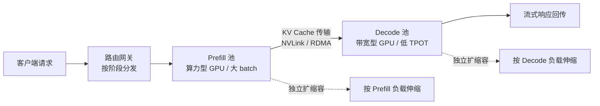
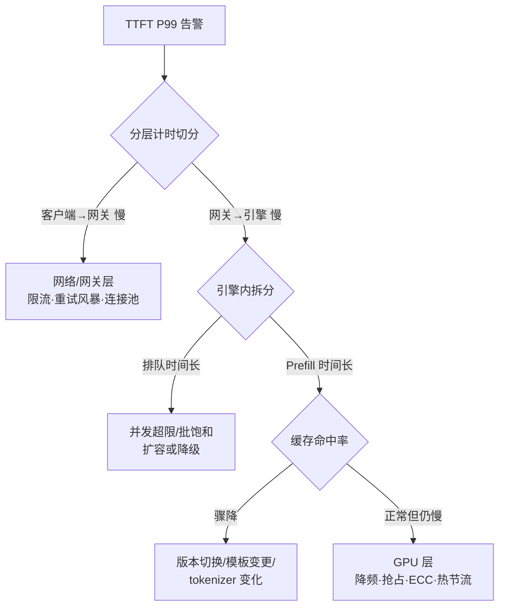

# LLM 推理高级面试问答 (LLM Inference Advanced Interview QA)

> 中文简称：LLM 推理高级面试问答

> **一句话理解**： 把 LLM 推理想象成一家餐厅——Prefill 是客人一次性报完整菜单（算力密集），Decode 是厨房一道一道上菜（受出菜口带宽限制）；高级面试考察的不是"会不会调 API"，而是"能不能同时让餐厅上菜快、翻台多、还不太贵"。

---

> **难度标注**： ⭐⭐⭐ 高级（Senior/Staff 必备）｜ **频率标注**： 🔴 高频 ｜ 🟡 中频 ｜ 🟢 低频
> **答题框架**： 每题按 **结论 → 展开 → 追问预判** 三段式，先给判断再给论据，最后预判面试官的深挖方向。

---

## 一、两阶段模型与核心指标

### Q1: Prefill 与 Decode 的本质差异是什么？为什么 TTFT 和 TPOT 必须分开优化？ ⭐⭐⭐ 🔴

**结论**: Prefill 是**计算密集**（整段 prompt 并行前向，受 GPU 算力限制），Decode 是**访存密集**（每步只生成 1 个 token，却要读完整个 KV Cache 与全部权重，受显存带宽限制）。因此 TTFT 由 Prefill 决定、TPOT 由 Decode 决定，二者的优化手段几乎相反：Prefill 靠并行与切块提吞吐，Decode 靠压缩与缓存省带宽。

**展开**:

| **维度** | **Prefill** | **Decode** |
|------|---------|--------|
| 计算模式 | 一次并行处理整个 prompt，注意力 O(n²) | 每步 1 token 的 GEMV，逐步自回归 |
| 瓶颈 | GPU 算力（compute-bound） | 显存带宽（memory-bound） |
| 决定指标 | TTFT（首 Token 延迟） | TPOT（每 Token 生成时间） |
| 优化抓手 | Chunked Prefill、算子融合、更大并行 | KV Cache 量化/压缩、投机解码、Prefix 缓存 |

- **算术强度视角**： Decode 每步的算术强度约 1–2 FLOP/byte，远低于现代 GPU 的算力带宽比（H100 FP16 约 300:1，A100 约 150:1），所以 Decode 阶段 GPU 利用率天然很低——这是所有 Decode 侧优化的第一性原理。
- **指标口径**： 生产 SLO 至少拆成 TTFT P99、TPOT P99、端到端时延、goodput（满足 SLO 的有效吞吐）四个指标；"平均延迟"在高级面试里是被扣分的答案。

**追问预判**: "为什么 Decode 一定是 memory-bound？"
→ 每步只做 1 个 token 的矩阵向量乘，但权重（几个 GB）和 KV Cache 都要从 HBM 读一遍；算的数据量远大于算的计算量，加再多 SM 也没用，瓶颈在 HBM 带宽。

深度阅读： [[10_部署推理/03_推理优化/02_LLM推理_深入分析|LLM 推理深入分析]]、[[10_部署推理/03_推理优化/01_推理性能_基础|推理性能基础]]

### Q2: 吞吐、延迟、成本三元权衡如何做决策？ ⭐⭐⭐ 🔴

**结论**: 三者不可兼得，正确的顺序是"先定 SLO 再定批处理水位，最后才谈成本"——容量跟着 goodput 走而不是跟着 QPS 走。

**展开**:

- **权衡核心**： batch 越大吞吐越高，但同批请求互相拖慢 → TPOT P99 变差。延迟-throughput 曲线上存在 knee point，生产应运行在 knee 略左，而不是追峰值吞吐。
- **按负载类型定优先级**：

| **负载类型** | **敏感指标** | **典型取向** |
|----------|----------|----------|
| 在线聊天 | TPOT P99 | 延迟优先，小 batch |
| 离线批处理/数据提取 | $/M Token | 吞吐优先，大 batch + 批处理 API |
| Agent 多轮 | TTFT + 每轮成本 | 两者折中，配合模型路由 |

- **成本视角**： 把 GPU 时租折算成 $/M Token 后，与 API 报价对比才是同口径比较；相关宏观背景见 [[18_行业应用/01_行业概览/09_Token_Economics_2026|Token 经济学 2026]]。

**追问预判**: "如何量化找到 knee point？"
→ 固定请求分布压测，横轴并发、纵轴 goodput 与 TPOT P99 双曲线，取 goodput 增速显著放缓且 SLO 即将击穿的点；参考 [[10_部署推理/02_推理引擎/15_LLM推理_基准测试_指南|LLM 推理基准测试指南]]。

---

## 二、KV Cache 与注意力架构

### Q3: KV Cache 显存怎么估算？PagedAttention 到底解决了什么问题？ ⭐⭐⭐ 🔴

**结论**: 估算公式 `KV = 2 × layers × kv_heads × head_dim × dtype_bytes × seq_len × batch`；PagedAttention 把 KV 从"按最大长度连续预留"改成"固定大小 block 的分页管理"，消除内部碎片与外部碎片，同等显存下并发能力提升数倍。

**展开**:

- **数值示例**（面试要能口算）： 7B 模型，32 层、GQA 8 个 KV 头、head_dim 128、FP16：每 token KV = 2×32×8×128×2 B = **128 KB/token**；4K 上下文单请求 = 512 MB。100 个并发 4K 请求就是 51 GB——KV Cache 通常比权重更早耗尽显存。
- **分页前的两类碎片**：
  - 内部碎片： 按 max_seq_len 预留，实际序列短，预留部分浪费（普遍 60–80% 浪费率）
  - 外部碎片： 请求结束后留下不连续空洞，新请求放不下
- **PagedAttention 机制**： 逻辑块 → 物理块映射表；序列增长按需分配 block；beam search / 并行采样通过 copy-on-write 共享前缀块。

| **方案** | **显存利用** | **并发上限** | **实现复杂度** |
|------|----------|----------|------------|
| 连续预留 | 低（碎片严重） | 低 | 简单 |
| 分页管理 | 高（>90%） | 高 | 需块表与访存 kernel |

**追问预判**: "显存还是装不下怎么办？"
→ 按优先级：① KV Cache 量化（FP8 KV）② 换 GQA/MLA 架构模型 ③ 滑动窗口/上下文压缩 ④ CPU offload ⑤ 抢占与请求重计算（preemption）。延伸阅读 [[10_部署推理/03_推理优化/05_KV_Cache_深入分析|KV Cache 深入分析]]、[[10_部署推理/02_推理引擎/30_vLLM_Paged注意力_架构|vLLM PagedAttention 架构]]。

### Q4: 长上下文（128K+）推理的三重压力分别怎么解？ ⭐⭐⭐ 🟡

**结论**: 注意力计算 O(n²) 用 FlashAttention 类分块 kernel 解；KV 显存线性膨胀用 GQA/MLA 架构解；Decode 带宽压力用 Prefix 缓存与 KV 量化解——架构层面的选择（MHA/GQA/MLA）在训练期就决定了部署上限，推理侧只能在其上补救。

**展开**:

| **注意力变体** | **KV 相对 MHA** | **代表模型** | **取舍** |
|------------|-------------|----------|------|
| MHA | 1× | Llama-2 早期 | 质量最好，KV 最贵 |
| MQA | ~1/heads | PaLM | KV 最省，质量有损 |
| GQA | ~1/8（分组数） | Llama-3、Qwen | 质量与开销的工程折中 |
| MLA | 更激进（低秩 latent） | DeepSeek | Decode 时矩阵吸收避免解压，长上下文友好 |

- **FlashAttention 原理一句话**： 分块（tiling）+ online softmax，让注意力计算不实例化 n² 的中间矩阵，IO 感知地驻留 SRAM。
- **128K+ 工程清单**： Chunked Prefill 控制单次 Prefill 峰值、radix/prefix 缓存命中系统提示、KV 量化、必要时上下文压缩或检索式截断。

**追问预判**: "MLA 为什么既能省显存又不明显掉点？"
→ 把 KV 投影到低秩 latent 空间存储，推理时用矩阵吸收（matrix absorption）把解压吸收进注意力权重计算，避免显式还原；代价是实现复杂、与部分推理优化不兼容。对比背景见 [[05_大模型/14_中国LLM生态/25_DeepSeek_架构_2026|DeepSeek 架构 2026]]。

---

## 三、调度与批处理

### Q5: Continuous Batching 与 Chunked Prefill 分别解决什么？代价是什么？ ⭐⭐⭐ 🟡

**结论**: Continuous batching 把调度粒度从"请求级"降到"token 级（迭代级）"，新请求随时插入、完成请求随时退出，消除静态批处理的队头阻塞；Chunked Prefill 把长 prompt 切成块与 Decode 混在同一批执行，用可控的 TTFT 抖动换吞吐大幅提升。

**展开**:

- **静态 batching 的病**： 一批里最长请求没结束，整批 GPU 都陪跑；短请求被迫等待。
- **迭代级调度**（Orca 提出，vLLM/SGLang 落地）： 每次迭代重建 batch 组，配合 PagedAttention 才真正可行（显存可动态进出是前提）。
- **Chunked Prefill 代价**： 长 prompt 分块后，同批 Decode 步骤被 Prefill 块挤占算力 → TPOT 出现抖动；`max_num_batched_tokens` 是核心调参。

| **技术** | **主要收益** | **主要代价** | **何时关闭** |
|------|----------|----------|----------|
| Continuous Batching | 吞吐 ↑↑，排队 ↓ | 实现复杂度 | 几乎不关 |
| Chunked Prefill | 长 prompt 吞吐 ↑、TTFT 峰值 ↓ | TPOT 抖动 | TPOT P99 极敏感的在线服务 |

**追问预判**: "Chunked Prefill 为什么不能无限切小？"
→ 块太小则 Prefill 阶段算术强度下降（退化成 Decode 式访存瓶颈），Prefill 总时长反而变长；块大小要在"单步算力利用"与"同批干扰"之间折中。

### Q6: Prefix/Prompt Caching 的命中条件与收益边界？和语义缓存什么关系？ ⭐⭐ 🔴

**结论**: Prefix caching 在 KV block 层做**精确前缀匹配**复用，命中则免算整段 Prefill，收益 = 命中率 × 可复用前缀占 prompt 的比例；语义缓存是**输入级**的答案复用，两者正交，成熟方案两层都做。

**展开**:

- **命中条件**： 从 prompt 起始位置开始 block 级完全一致；system prompt、few-shot 示例、多轮对话历史是天然高命中区。
- **实现**： SGLang 的 RadixAttention 用基数树管理前缀；vLLM 用哈希块表；多租户必须按租户/模型隔离缓存空间，防止跨租户信息泄漏。
- **失效条件**： 模型权重、tokenizer 或量化配置任何一项变更都要整体失效——这也是模型热更新必须整批切换的原因。
- **工程手段提命中率**： 动态内容后置（时间戳/随机 ID 放 prompt 尾部）、模板归一化、会话亲和路由（同一会话固定到同实例）。

| **场景** | **典型可复用前缀** | **预期收益** |
|------|----------------|----------|
| 固定 system prompt 的 API 服务 | 500–2000 token | TTFT 降 30–60% |
| 多轮对话 | 上文全部 | 每轮 Prefill 量随轮次不再线性增长 |
| Agent 循环 | 前几轮完整轨迹 | 显著，详见 [[15_智能体/01_Agent基础/25_Agent_经济学_2026|Agent 经济学 2026]] |

**追问预判**: "命中率上不去，先查什么？"
→ ① 动态字段是否在前缀里 ② 负载均衡是否打散了会话 ③ 模型/版本是否频繁切换 ④ 缓存空间是否被长尾 prompt 挤占（需 LRU + 容量预算）。

---

## 四、量化与压缩

### Q7: 量化方案谱系怎么选？如何证明量化后质量没有退化？ ⭐⭐⭐ 🟡

**结论**: 权重量化（GPTQ/AWQ/INT4）解显存与带宽、激活量化（FP8）解算力效率；选型原则是"在质量预算内选最激进的位宽"，验收必须过 perplexity + 领域任务基准 + 抽样人评/LLM 评审三重回归，单一 perplexity 达标不等于可用。

**展开**:

| **方案** | **作用对象** | **关键机制** | **硬件要求** | **典型用途** |
|------|----------|----------|----------|----------|
| GPTQ | 权重 INT4 | 逐层误差补偿（基于 Hessian） | 通用 GPU | 显存受限部署 |
| AWQ | 权重 INT4 | 激活感知，保护显著权重通道 | 通用 GPU | 4bit 下质量更稳 |
| FP8 (W8A8) | 权重+激活 | 硬件原生 FP8 张量核 | Hopper+ | 高吞吐在线服务 |
| KV INT8/FP8 | KV Cache | 缓存位宽减半 | 通用 | 并发容量翻倍级提升 |

- **验证三件套**： ① perplexity（看通用退化）② 领域任务基准（看任务级退化，长尾任务最敏感）③ 输出抽检（格式遵循、指令遵循、幻觉率）。
- **进阶手段**： 混合精度——对敏感层保留高精度；量化感知训练（QAT）用于极限位宽。

**追问预判**: "为什么 AWQ 在 4bit 下通常比朴素 GPTQ 稳？"
→ AWQ 观察到少量"显著权重通道"由激活分布决定，对它们做缩放保护而非均匀对待，等价于把量化误差从重要通道挪走。深度阅读 [[10_部署推理/04_模型量化/04_量化_技术_2026|量化技术 2026]]、[[10_部署推理/04_模型量化/03_量化精度深入分析|量化精度深入分析]]。

---

## 五、高级加速架构

### Q8: 投机解码的原理、加速条件与失效场景？ ⭐⭐⭐ 🟡

**结论**: 用小 draft 模型（或自 draft 头/n-gram 表）快速起草 k 个 token，大模型一次前向**并行验证**，按拒绝采样规则接受前缀——数学上保证输出分布与目标模型完全一致（无损）。加速的前提是"验证有多余算力 + 接受率够高"，大 batch 满载时反而失效。

**展开**:

- **变体谱系**： 经典双模型 draft → n-gram/Prompt Lookup（无需 draft 模型，适合摘要/改写类重复模式）→ EAGLE/Medusa（目标模型自带头位起草）→ MTP（多 token 预测头，DeepSeek 路线）。
- **加速条件**： ① GPU 在 Decode 有空余算力（低并发/单流）② 接受率高（代码补全、模板化文本高；专业长尾推理低）③ draft 模型足够便宜。
- **失效场景**： 高并发下 batch 已饱和（验证抢走本可服务别人的算力）、接受率低的领域、draft/目标分布差异大。

| **场景** | **是否推荐** | **原因** |
|------|----------|------|
| 单请求/低并发在线 | ✅ 强推 | Decode 本来就空转，验证近乎免费 |
| 高并发满载服务 | ⚠️ 观望 | 算力已饱和，投机反而挤占 |
| Agent 多步规划 | 🟡 看接受率 | 规划文本模式化程度决定收益 |

**追问预判**: "投机解码和 batching 冲突吗？"
→ 本质冲突：两者都在抢 Decode 阶段的多余算力。调度器需要按当前 batch 水位动态开关投机解码。延伸阅读 [[10_部署推理/03_推理优化/12_Speculative_Decoding_高级_2026|Speculative Decoding 高级]]。

### Q9: PD 分离（Prefill/Decode Disaggregation）什么时候值得上？ ⭐⭐⭐ 🟡

**结论**: 当 Prefill（算力密集）与 Decode（带宽密集）混部互相干扰、单一资源池无法同时满足 TTFT 与 TPOT SLO 时，把两者拆成独立资源池、KV 经高速互联传输；代价是 KV 传输开销与运维复杂度，所以"KV 传输时间 < 干扰消除收益"是上车的硬条件。

**展开**:

图示说明：Prefill 池与 Decode 池按各自负载特征独立扩缩容，KV Cache 是两个池之间唯一需要搬运的状态，因此传输介质（NVLink/IB）决定了方案经济性。

- **收益**： TTFT 与 TPOT 不再互相牵制（不再需要 Chunked Prefill 折中）、故障域隔离、各自独立调参。
- **代价**： KV 传输（每请求 KV 字节数 × 跨机带宽延迟）、两级调度复杂度、跨池一致性。
- **代表系统**： DistServe、Mooncake、vLLM disagg 模式。

| **信号** | **建议** |
|------|------|
| 单池下 TTFT 与 TPOT SLO 无法同时达成 | 拆 |
| 请求长度高度不均、长 prompt 占比高 | 倾向拆 |
| 单机内 NVLink 域够用、负载均匀 | 不拆，用 Chunked Prefill 即可 |

**追问预判**: "KV 传输成本怎么估？"
→ 每请求 KV 字节数（Q3 公式）÷ 有效传输带宽 = 传输时间；只有当"传输时间 + 池间排队"小于混部干扰造成的延迟增量时才划算。深度阅读 [[10_部署推理/03_推理优化/13_Prefill_Decode_Disaggregation|Prefill/Decode 分离]]。

---

## 六、生产工程：容量、排障与多租户

### Q10: 给定峰值 QPS 与 SLO，如何估算 GPU 数量？基准测试怎么做才可信？ ⭐⭐⭐ 🔴

**结论**: 容量 = 峰值负载 ÷ 单实例"SLO 约束下的有效并发"，再用压测曲线（而非线性外推）确定单实例并发；基准必须用真实流量回放，报告 P99 与 goodput，均值和合成 prompt 都不可信。

**展开**:

- **三步估算法**：
  1. **显存上限并发**： 权重占用 + 单请求 KV（Q3 公式）→ 理论最大并发
  2. **SLO 约束并发**： 压测 latency-throughput 曲线，取 TPOT P99/TTFT P99 刚好达标的点（通常远小于显存上限）
  3. **实例数**： `N = 峰值并发 ÷ 单实例 SLO 并发 × (1 + 冗余系数)`，冗余覆盖滚动发布与故障域
- **基准维度清单**： TTFT/TPOT P50/P99、吞吐、goodput、缓存命中率、显存水位、排队长度——全部作为并发的函数输出，而不是单点。
- **常见陷阱**： 用均值掩盖长尾、synthetic prompt 长度分布与真实不符、忽略 Prefix 缓存命中率对结果的数量级影响、冷启动计入稳态数据。

**追问预判**: "为什么不能按 QPS 线性外推？"
→ KV 显存与并发非线性耦合、batch 调度有排队放大效应、缓存命中随流量结构变化——三者都让"线性外推"系统性低估延迟。选型背景见 [[10_部署推理/02_推理引擎/17_LLM_推理引擎_选型_指南|推理引擎选型指南]]。

### Q11: 线上 TTFT 突然劣化，给出你的排查框架 ⭐⭐⭐ 🔴

**结论**: 按"现象分层 → 逐层取证据 → 收敛根因"执行：先在客户端/网络/网关/推理引擎四层切分归因，再看引擎内部把 TTFT 拆成排队时间与 Prefill 时间，高频根因 Top3 是并发超限排队、Prefix 缓存命中率骤降、GPU 降频或抢占。

**展开**:

图示说明：先用分层计时把问题域切小，再在引擎内把 TTFT 拆成"排队 + Prefill"两段分别归因，最后落到 GPU 硬件层检查。

- **证据清单**： 客户端全链路计时、网关 5xx/429 曲线、引擎 `queue_time` 与 `prefill_time` 指标、缓存命中率曲线、GPU 利用率/功耗/温度/ECC 计数。
- **典型真实案例**： 模型版本升级后 tokenizer 微调 → 前缀 block 哈希全变 → 缓存命中率从 70% 跌到 0 → TTFT 翻倍；修复手段是热更新时新旧实例灰度并存并预热缓存。

**追问预判**: "如何在故障前发现？"
→ SLO 燃烧率告警 + 排队长度与命中率的前瞻趋势告警，而不是等 TTFT P99 击穿再响应。体系化方法见 [[10_部署推理/02_推理引擎/FTA/README|推理引擎 FTA 故障树]]。

### Q12: 多租户多 LoRA 服务怎么做？边界在哪？ ⭐⭐ 🟢

**结论**: Multi-LoRA serving（S-LoRA/Punica/vLLM LoRA 层）共享基座权重、adapter 常驻显存池按请求热切换，把"每个微调模型一份权重"降到"每个 adapter 几十至几百 MB"；硬边界是所有 adapter 必须共享同一基座，且 adapter 数量受显存池与调度开销约束。

**展开**:

| **方案** | **显存开销** | **切换延迟** | **适用** |
|------|----------|----------|------|
| 每 LoRA 独立实例（合并权重） | 最高 | 无（已合并） | adapter 少、流量大 |
| Multi-LoRA 统一服务 | adapter 池仅 | 微秒级（换指针/分组 GEMM） | 多租户、长尾 adapter |
| 动态加载/换入换出 | 最低 | 秒级（IO） | adapter 极多、流量稀疏 |

- **工程要点**： adapter 显存统一分页、按 rank 分桶、冷热分层（高频常驻 + 低频换出）、发布走热加载与回滚流程。
- **与多模型路由的关系**： Multi-LoRA 解决"同一基座的个性化"，模型路由解决"不同基座的能力差异"，生产通常两层叠加。

**追问预判**: "上限在哪？"
→ ① 基座必须相同，跨基座不共享 ② adapter 数 × rank 的显存与 grouped GEMM 调度开销 ③ 热更新必须走整批切换（权重/adapter/量化配置一致），参考 [[10_部署推理/01_部署基础/08_模型_Hot_Reload_and_回滚_操作手册|模型热更新与回滚 Runbook]]。

---

## Related

- [[10_部署推理/03_推理优化/08_paged_attention_continuous_batching|PagedAttention 与 Continuous Batching]] — Q3/Q5 的原理层展开
- [[10_部署推理/03_推理优化/14_Request_调度_for_LLMs|Request 调度 for LLMs]] — 调度策略全景
- [[10_部署推理/03_推理优化/03_推理_Tuning_Cheat_Sheet|推理 Tuning Cheat Sheet]] — 参数级速查
- [[10_部署推理/02_推理引擎/29_vLLM_深入分析|vLLM 深入分析]] / [[10_部署推理/02_推理引擎/23_SGLang_深入分析|SGLang 深入分析]] / [[10_部署推理/02_推理引擎/25_TensorRT_LLM_深入分析|TensorRT-LLM 深入分析]] — 三大引擎实现差异
- [[10_部署推理/06_成本管理/01_LLM_成本优化|LLM 成本优化]] — 成本侧的工程落地
- [[12_架构基建/02_架构概览/11_Token_工厂_2026|Token 工厂 2026]] — 从工厂视角理解推理吞吐
- [[18_行业应用/01_行业概览/09_Token_Economics_2026|Token 经济学 2026]] — 推理优化的商业语境
- [[15_智能体/01_Agent基础/25_Agent_经济学_2026|Agent 经济学 2026]] — Agent 负载对推理的差异化要求
- [[21_面试岗位/19_LLM平台工程师/03_interview_answers|LLM Platform Engineer 面试答案]] — 平台工程侧的姊妹篇
- [[21_面试岗位/18_面试指南/06_系统设计_for_AI|系统设计 for AI]] — 系统设计轮的方法论

---

*Last updated: 2026-09-07*
