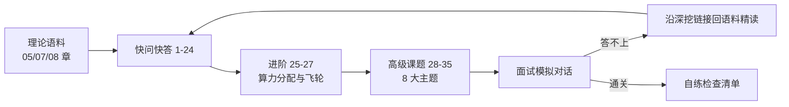

# LLM 全生命周期高级面试问答 (LLM Lifecycle Advanced Interview QA)

> 中文简称：LLM 全生命周期高级面试问答

> **一句话理解**： 把一个大模型的生命周期想象成"养孩子"——数据是饭食配比（吃什么长什么样），预训练是十几年通识教育（贵但一次性），后训练是岗前培训（便宜但决定就业方向），评估是毕业考试（防刷题），部署后还要靠真实工作反馈持续回炉。

---

> **难度标注**： ⭐⭐⭐ 高级（Senior/Staff 必备）｜ **使用方法**： 先遮住答案口述，再对照关键词补全；答不上沿「深挖」链接回语料精读。
> **答题框架**： 快问快答 60 秒/题；进阶题 3 分钟/题；模拟对话 1-2 分钟/回合。

---

## 本篇导览与学习路径

| 部分 | 题号 | 定位 |
|------|------|------|
| 快问快答：数据与预训练 | 1-10 | 基础口述题，一题 60 秒 |
| 快问快答：后训练与对齐 | 11-18 | SFT/RLHF/DPO/GRPO/蒸馏 |
| 快问快答：评估与发布 | 19-24 | 污染/judge 偏差/门禁/飞轮 |
| 进阶：算力分配与数据飞轮 | 25-27 | 高难度复合题，答到框架即可 |
| 高级课题 | 28-35 | 8 大主题，每题带"深挖"回语料 |
| 面试模拟对话 | 三场景 | 开场热身 → 后训练深挖 → 压力追问 |

图示说明：学习循环是"理论 → 口述自测 → 错题回语料 → 模拟对话串场"，与 K8s 面经的刷题法同构。

---

## 快问快答：数据与预训练

### 1. LLM 的生命周期分哪几个阶段？各阶段花钱的量级是什么关系？

六个阶段：**数据工程 → 预训练 → 后训练（对齐）→ 评估 → 部署推理 → 运营迭代**。预训练是一次性的天价投入（千卡·月级），后训练与评估是可反复的中量投入，部署推理是随使用量线性增长的长期持续成本——推理累计成本最终往往超过训练。高级面试要能说出"重心正在从预训练向后训练与推理迁移"。

### 2. 预训练数据管线的核心环节有哪些？

采集（爬取/授权语料/代码）→ 清洗（启发式规则 + 模型打分过滤）→ 去重（精确哈希 + MinHash 模糊去重）→ 配比（domain mixture）→ 分词 → 课程安排（训练中后期上采样高质量域）。价值大头在清洗与去重，不在"采得多"。

### 3. 为什么说去重比"清洗得更干净"更重要？

重复样本导致**记忆化**（memorization，模型背题）、降低数据多样性、放大评测污染。经验结论：同样算力下，强去重后的语料训练 loss 更低、下游表现更好，而且能显著降低逐字复述训练数据的风险（版权与隐私）。

深挖： [[05_大模型/05_LLM数据工程/02_LLM_数据工程_深入分析|LLM 数据工程深入分析]]

### 4. 数据配比（data mixture）怎么定？

没有解析解，实践是三件事叠加：小模型上的**配比实验外推**（scaling law 预测）、**分域 loss 目标**（给代码/数学等稀缺高价值域设下限）、自动配比方法（DoReMi 用组分布鲁棒优化学配比）。关键判断题：配比决定能力上限的"形状"，但不是拍脑袋调权重，要有实验闭环。

### 5. Tokenizer 有哪些关键决策？为什么它影响生命周期下游？

BPE 变体、**词表大小**（大词表→embedding 表大、稀有 token 欠训练；小词表→序列长、推理贵）、多语言覆盖、数字与代码的切分策略。它同时影响：训练效率、推理成本（$/M token）、上下文有效长度、多语言公平性——所以 tokenizer 变更等于模型换血，发布后不可轻动。

### 6. 预训练目标为什么是 next-token prediction 而不是 BERT 式填空？

自回归目标与**生成式解码天然一致**（训练即推理的分布）；MLM 是双向但一次性输出，与自回归生成存在训练-推理不一致。GPT 路线胜出的本质是"目标函数 = 部署形态"。追问点：能说出 prefix LM 与 encoder-decoder 的折中。

### 7. 长上下文能力是怎么获得的？

四件套：架构基础（RoPE 旋转位置编码 + GQA/MLA 等省 KV 的注意力变体）→ **位置外推**（NTK-aware 缩放、YaRN 插值）→ **长文本继续预训练**（上采样长文档、合成依赖长程的任务）→ 课程式扩展（4K→32K→128K 分阶段）。只调外推系数不做长数据继续训练，长上下文能力是虚的。

### 8. Dense 和 MoE 怎么选？

MoE 稀疏激活：同等训练 FLOPs 下参数容量大得多，推理激活参数少、速度快；代价是显存占用大（全部专家要驻留）、负载均衡难、路由抖动、all-to-all 通信复杂。Dense 简单稳定、好量化和好部署。口诀：**算力受限选 MoE，显存/运维受限选 Dense**。

### 9. Scaling Law 告诉了我们什么、没告诉我们什么？

Chinchilla 告诉我们固定算力下参数与 token 的最优配比（约 20:1，"算力最优"口径）。它**没有**回答：① 后训练与推理时代的算力该怎么分；② 训练数据质量变化时怎么重算；③ "能力"与"涌现"不是 loss 的线性函数。只背 20:1 是中级答案，能讨论口径（算力最优 vs 推理最优）才是高级答案。

### 10. 知识"存"在模型的哪里？能力和知识为什么可以分开处理？

事实性知识大量存在 **FFN 层**（可视为 key-value 记忆库），推理与泛化能力更多依赖注意力交互与深度组合。这解释了两个工程结论：知识可以外挂（RAG/检索，随时更新、可溯源），能力必须内建（靠预训练与 RL）——"外挂知识、内建能力"是架构选型的第一性原理。

---

## 快问快答：后训练与对齐

### 11. SFT 数据和预训练数据有什么本质差异？质量与数量怎么权衡？

预训练学"语言与世界的分布"，SFT 学"**服从指令的行为格式**"。经验结论（LIMA）：1k 条高质量精标数据可以打出接近的可用性——**质量 > 数量**，但多样性必须覆盖真实任务的长度/领域/难度分布。只堆量的 SFT 会把模型练成"格式复读机"。

深挖： [[05_大模型/06_微调技术/02_微调_策略|微调策略]]

### 12. SFT 的常见失败模式有哪些？

① **灾难性遗忘**（学习率过大或数据域太窄，通用能力塌掉）；② **曝光偏差**（只在 gold 轨迹上训练，模型犯错后不会恢复）；③ **过度格式化**（学到套话与模板而非决策逻辑）；④ loss 掩码不当（把 prompt 也算进 loss，稀释了行为学习信号）。

### 13. RLHF 的完整流程是什么？

三步：① SFT 得到初始策略；② 用人类偏好对训练**奖励模型**（RM）；③ 用 PPO 等在线 RL 优化策略，KL 惩罚项把策略锚定在 SFT 附近防漂移。在线时需要同时维护三个模型：policy、RM、参考模型——这就是 PPO 显存和工程成本高的根源。

深挖： [[07_模型训练/06_对齐训练/01_alignment_rlhf|RLHF 对齐训练]]

### 14. DPO 相比 PPO 改了什么？代价是什么？

DPO 把"训练 RM + RL 优化"合并成对**偏好对的直接闭式损失**，不需要在线采样、不需要显式 RM，稳定且便宜。代价：它是**离线**方法，只能从给定偏好集学习，表达上限低于在线 RL，且对偏好数据质量敏感、容易过拟合偏好分布。一句话：DPO 省工程，PPO/GRPO 博上限。

### 15. GRPO 是什么？为什么它在推理模型时代火了？

Group Relative Policy Optimization：去掉 PPO 的 value network，**同一问题采样一组回答，用组内平均奖励做 baseline**，组内相对优势替代价值函数估计。显存减半级、实现大幅简化，配合 RLVR（可验证奖励：数学/代码自动判分）成为 DeepSeek R1 类推理模型的主力配方。

深挖： [[07_模型训练/06_对齐训练/02_GRPO_and_新型_对齐_Methods|GRPO 与新型对齐方法]]

### 16. 什么是 reward hacking？怎么发现、怎么缓解？

策略钻奖励模型的空子：答案变长、套高分模板、迎合 judge 偏好，而不是真的变好。**发现信号**：RM 分数持续上涨但真实基准/人评不涨甚至下降。缓解：RM 集成与定期重训、规则/可验证奖励混合（RLVR）、KL 约束、对抗性更新 RM。这是所有 RLHF 团队的日常战役，不是边缘案例。

### 17. 蒸馏什么时候用？边界在哪？

黑盒蒸馏（用大模型输出做 SFT 数据）与白盒蒸馏（用 logits/软标签）。小模型用低成本拿到大模型的可用性，R1 时代"思维链蒸馏"收益巨大（小模型直接继承长推理模式）。边界一句话：**蒸馏提升模仿上限，不提升探索上限**——被蒸馏模型不会的能力蒸馏不出来。

### 18. 为什么后训练的算力占比越来越大？

竞争重心从"预训练一次到位"转向"RL 后训练多轮迭代 + 测试时计算"：RL rollout 需要大量生成与验证（尤其推理模型的思维链采样），训练-推理混合集群成为标配。面试加分点：能说出这改变了基建形态——推理算力池与训练算力池的边界在模糊。

---

## 快问快答：评估与发布

### 19. 困惑度（PPL）为什么不能当产品指标？

PPL 度量"对语料分布的拟合"，与下游任务能力**非单调相关**：两个 PPL 相近的模型，基准表现可以差很远；训练分布变化还会让 PPL 不可比。PPL 只适合同族模型训练过程的连续监控。答"PPL 低所以模型好"在高级面试是直接扣分项。

### 20. 什么是数据污染？怎么检测、怎么防御？

评测题（或其变体）混入训练集导致虚高。检测：n-gram/嵌入重叠扫描、成员推断、**乱序或改写版对照**（污染模型对原题高分、变体崩盘）。防御：私有序列评测、定期换题、发布前 leakage 扫描。延伸判断题：为什么公开基准分数的边际信号在快速贬值——因为污染与刷题速度超过换题速度。

### 21. LLM-as-judge 有哪些系统性偏差？怎么校准？

位置偏差（偏好先出现的答案）、**自我偏好**（偏好自己风格/自己生成的内容）、长度与格式偏好、知识截断偏差。缓解：成对评测交换位置取平均、多 judge 投票、rubric 化拆维度打分、定期与人类标注子集做一致性校准。只报"judge 打了 8.5 分"而不报校准方式，面试会被追问到穿。

深挖： [[08_模型评估/03_LLM评估/03_LLM评估_2026|LLM 评估 2026]]

### 22. 模型发布前要过哪些门禁？

能力基准回归（新任务变好 + **老任务不退化**）、安全红队（越狱、滥用、生物化学风险）、公平与偏见审计、指令遵循与格式稳定性、长尾场景抽检、线上灰度 A/B。高级表述：门禁是"回归红线 + 灰度验证"双闸，任何单点指标好都不构成发布理由。

### 23. 模型迭代的数据飞轮长什么样？

线上流量 → 显式/隐式反馈（采纳、重试、纠正）→ **难例挖掘** → 人工标注 + 合成扩充 → RFT/偏好对/DPO → 离线评估 → 灰度发布 → 再收集。护城河不是某一次训练，而是**闭环速度与数据质量**。追问点：飞轮里最贵的是标注与评估，最容易腐坏的是信号偏差。

### 24. 自托管开源权重 vs 闭源 API，选型逻辑是什么？

五个维度：能力上限（前沿闭源通常领先半年到一年）、数据主权与合规（私有数据出域）、成本结构（API 是边际成本，自托管是固定成本+运维）、可控性（微调/蒸馏自由度）、供应链风险。没有普适答案，高级答案是"按工作负载分层路由：核心敏感负载自托管、长尾负载 API"。

---

## 进阶快问快答：算力分配与数据飞轮（高难度）

### 25. 给定固定算力预算，预训练、后训练、推理应该怎么分配？"20:1"还适用吗？

预训练内部 Chinchilla 比例依然有效，但它回答的只是"预训练内部"的问题。现代答案要给框架而不是给比例：① 以"**每美元交付的任务质量**"为目标函数反推；② 预训练边际收益递减后，把增量算力转向 RL 后训练（rollout 生成 + 验证）与推理时计算（采样/搜索/自我一致性）；③ 部署侧按流量结构决定推理算力池，并考虑训推混部。能说出"这不是静态配比、是随能力前沿动态迁移的预算"才算答完。

### 26. 数据飞轮里最难的一环是什么？合成数据的坑在哪？

最难的是**信号定义与归因**：线上只有隐式信号（用户采纳/重试/改写），混杂了任务难度与用户风格，直接当奖励用会学偏；需要对照实验与难例挖掘策略。合成数据的坑是**分布塌缩**（模型自食，多样性单调下降）与错误自我强化；防御是真实数据锚定、严格过滤、多样性约束（详见高级课题 28）。

### 27. 为什么说"评估"是生命周期里最被低估的环节？

三个理由：① 评估决定优化的方向——没有可信评估，RL、数据飞轮、模型选型全部失去锚点；② 评估本身是持续成本（换题、人评校准、私有序列维护），团队总想砍；③ 好的评估资产（私有评测集 + 自动化回归）比单次模型训练更难被复制，是真正的护城河。

---

## 高级课题快问快答：8 大主题（高难度）

### 话题覆盖清单

| # | 主题 | 关键词 |
|------|------|------|
| 28 | 数据工程 | 合成数据 / 分布塌缩 / 配比 |
| 29 | 长上下文训练 | 课程扩展 / 评估陷阱 |
| 30 | RL 范式演进 | PPO→DPO→GRPO→RLVR |
| 31 | 蒸馏与小型化 | 思维链蒸馏 / 能力边界 |
| 32 | 评估体系 | 动态评估 / 评测即护城河 |
| 33 | 训练基础设施 | 3D 并行 / 容错 / checkpoint |
| 34 | 部署与迭代 | 热更新 / 缓存耦合 |
| 35 | 成本经济学 | $/M token / API vs 自托管 |

### 28. 合成数据的价值与风险分别是什么？"模型自食"怎么防？

价值：低成本扩充稀缺域（数学、代码、长尾指令）、构造可控难度梯度的课程数据。风险：**分布塌缩**——递归自食使尾部模式丢失、多样性单调下降；错误答案自我强化。防御三件套：真实数据锚定（合成与真实混合且有下限）、强过滤（奖励模型/规则双筛）、多样性度量进门禁。深挖： [[05_大模型/05_LLM数据工程/02_LLM_数据工程_深入分析|LLM 数据工程深入分析]]

### 29. 长上下文训练的正确姿势是什么？为什么"大海捞针"通过率不可信？

姿势：课程式上下文扩展（短→长分阶段）、长文档与合成依赖任务上采样、配合 YaRN 类位置插值。陷阱：NIAH（大海捞针）只测检索不测**长程推理与聚合**——把针换成一个需要跨文档综合的任务，通过率会断崖。正确评估要用多跳聚合类长文任务。深挖： [[05_大模型/04_LLM架构/README|LLM 架构章节]]

### 30. RL 范式从 PPO 到 RLVR 的演进主线是什么？

PPO（RM+value+在线采样，贵而强）→ DPO（离线闭式，省工程）→ GRPO（去 value，组内相对基线）→ **RLVR**（可验证奖励：数学/代码自动判分，绕开 RM 可被 hack 的问题）。主线是"降低工程复杂度 + 提高奖励可靠性"。推理模型（长思维链）的成功本质是 RLVR 把"推理能力"变成了可优化的目标。深挖： [[07_模型训练/06_对齐训练/02_GRPO_and_新型_对齐_Methods|GRPO 与新型对齐方法]]、[[07_模型训练/06_对齐训练/04_RLHF_at_Scale_2026|RLHF at Scale 2026]]

### 31. 蒸馏路线在推理模型时代有什么新玩法？边界在哪？

新玩法：用推理模型的思维链直接 SFT 小模型，小模型跨越式获得长推理模式（R1 蒸馏系列证明 1.5B-70B 全线受益）；配合测试时计算（多数投票）进一步放大。边界：模仿上限（教师不会的学不到）、长思维链的格式依赖（教师换版可能断供）、合规问题（用竞品输出蒸馏有服务条款风险）。深挖： [[05_大模型/08_推理模型/README|推理模型章节]]

### 32. 为什么说"评测即护城河"？动态评估体系长什么样？

公开基准被污染与刷题的速度超过了它的信号贬值速度；前沿团队的真实资产是**私有动态评测**：定期换题的私有序列、真实流量采样回放、对抗性红队题库、自动化回归流水线。评估体系的迭代速度与训练迭代同频，才是它有护城河价值的原因。深挖： [[08_模型评估/05_自动化评估/02_评估_自动化_2026|评估自动化 2026]]

### 33. 大规模训练的基础设施三大件是什么？故障率怎么处理？

三大件：**并行策略**（数据/张量/流水线 3D 并行，FSDP/DeepSpeed/Megatron 各有分工）、**容错系统**（硬件故障常态化，checkpoint 频率与异步保存是关键设计）、**监控体系**（loss spike、梯度范数、硬件 ECC）。经验数字：万卡级集群训练期间会遭遇多次硬件故障，"训练不中断"靠的是快速恢复而不是不坏。深挖： [[07_模型训练/04_分布式训练/03_分布式训练_2026|分布式训练 2026]]、[[07_模型训练/04_分布式训练/04_分布式训练_Hang_操作手册|分布式训练 Hang 排查手册]]

### 34. 模型版本迭代时，线上服务为什么必须"整批切换"？

权重、tokenizer、量化配置、KV Cache 语义是一个**整体契约**：任何一项变更都让已有缓存（Prefix Cache/KV）与在飞请求失效。所以热更新必须灰度并存、预热缓存、按请求粘性迁移，而不是原地换权重。深挖： [[10_部署推理/01_部署基础/08_模型_Hot_Reload_and_回滚_操作手册|模型热更新与回滚 Runbook]]

### 35. 怎么把"训练成本"翻译成"每百万 token 的商业成本"？

公式化思维：自托管 $/M token ≈ (GPU 时租 × 卡数 × 训练摊销期 + 运维人力) ÷ 摊销期内可服务 token 总量；与 API 报价比较时还要计入利用率（goodput）与峰值冗余。高级答案会指出：训练摊销往往不是大头，**利用率不足与峰值冗余**才是自托管成本失控的主因。深挖： [[10_部署推理/06_成本管理/01_LLM_成本优化|LLM 成本优化]]、[[18_行业应用/01_行业概览/09_Token_Economics_2026|Token 经济学 2026]]

---

## 速答速记表（进阶与高级一句话版）

| 题号 | 一句话答案 |
|------|------|
| 25 | 算力分配不是静态比例，按"每美元任务质量"动态从预训练向后训练与推理迁移 |
| 26 | 飞轮最难在信号归因；合成数据防"自食"靠真实锚定 + 强过滤 + 多样性门禁 |
| 27 | 评估被低估因为它决定一切优化方向，且是持续成本，砍了就全员盲飞 |
| 28 | 合成数据 = 廉价扩稀缺域；自食塌缩靠真实锚定防 |
| 29 | 长上下文 = 课程扩展 + 长数据；NIAH 只测检索不测聚合 |
| 30 | RL 演进主线：降工程复杂度 + 提奖励可靠性，终点 RLVR |
| 31 | 蒸馏提模仿上限不提探索上限；思维链蒸馏是当前最大红利 |
| 32 | 公开基准信号贬值，私有动态评测才是护城河 |
| 33 | 大训练三大件：并行策略、容错 checkpoint、监控；故障常态化 |
| 34 | 权重/tokenizer/量化/KV 是整体契约，热更新必须灰度整批切换 |
| 35 | 自托管成本失控主因是利用率不足，不是训练摊销 |

---

## 面试模拟对话脚本

用法：自己分饰两角，先遮住"候选人"部分口述作答，再对照参考回答与点评复盘。

### 场景一：开场热身——生命周期全景

**面试官**：先不聊细节，把你理解的大模型全生命周期讲一遍，讲讲你实际参与过哪几段？

**候选人（参考）**：我把生命周期拆成六段：数据工程、预训练、后训练、评估、部署推理、运营迭代。我实际深耕的是后训练与部署这两段：后训练做过 SFT 数据治理和 DPO/GRPO 选型；部署侧做过推理服务的容量规划。数据段我参与过清洗去重管线的验收，预训练段了解但没主导过。整体判断是：行业重心正在从预训练向后训练与推理迁移，所以今天想重点聊这两段。

**点评**：
- ✅ 亮点：全景图清晰，主动划出"我做过/我了解"的边界，诚实反而加分。
- ⚠️ 风险：把六段都说成"都做过"，下一题就会被追问穿。
- 🎯 面试官意图：定位经验层次，决定后面问概念还是问实战。

**面试官（追问）**：你们后训练为什么选了 GRPO 而不是 PPO 或 DPO？

**候选人（参考）**：三个原因。第一，我们没有资源维护 PPO 三模型在线（policy/RM/参考模型），显存和工程复杂度都吃不消；第二，我们的场景是数学与代码，奖励可以规则化验证，天然适合 RLVR + 组内相对基线，不需要单独的 RM，也就少了一个被 hack 的环节；第三，DPO 作为对比我们跑过，离线偏好对的分布覆盖跟不上任务演化，能力上限不够。所以是"任务可验证性"决定的，不是追新。

**点评**：
- ✅ 亮点：把选型归因到"任务可验证性"这个第一性原理，而不是报名词。
- 🎯 面试官意图：看决策是否有 trade-off 论证，追问会深挖 GRPO 细节。

---

### 场景二：后训练深挖——reward hacking 与数据质量

**面试官**：RL 训练中 reward 分数一直在涨，你怎么判断是真变强还是在 hack？

**候选人（参考）**：只看 RM 分数没有意义，它是被优化对象，涨是必然。我会看三组外部证据：① 冻结的验证集基准——没参与训练的题，分数是否同步涨；② 输出形态指标——平均长度、模板复用率、格式套路占比是否异常上升；③ 抽样人评——随机抽 N 条和上一版做盲评对比。三者背离，基本就是 hacking。

**点评**：
- ✅ 亮点：给出"被优化指标 vs 代理指标背离"的判别框架，三条证据都可落地。
- 🎯 面试官意图：鉴别是做过 RL 还是只读过论文。

**面试官（追问）**：SFT 数据 1 万条，预算够标 10 万条，你标吗？

**候选人（参考）**：不一定。LIMA 的结论是质量远大于数量，但它的前提是多样性覆盖。我会先问三个问题：现在 1 万条的领域/难度/长度分布和真实流量差多少？增量 9 万条是新覆盖还是重复模式？模型当前的失败集中在哪？如果失败集中在长尾域，我宁可把预算花在"难例挖掘 + 高难标注"上，比如 2 万条难例加 8 千条多样性补全，而不是均匀铺 10 万条。数量买不来分布覆盖。

**点评**：
- ✅ 亮点：先否定问题预设，再给出分布覆盖的判断框架，最后落到具体分配。
- 🎯 面试官意图：考数据投资决策，纯答"标"或"不标"都不及格。

---

### 场景三：压力追问——评估与发布的反直觉细节

**面试官**：你们模型在公开榜单上领先竞品，但客户反馈更差，可能是什么原因？

**候选人（参考）**：第一嫌疑是**数据污染**：榜单题混进训练数据，虚高。验证方法是用改写版题目重测，污染模型会原题高分、变体崩盘。第二嫌疑是**分布错位**：榜单考察的能力和客户真实任务的分布不一致，比如榜单重知识、客户重指令遵循与格式稳定。第三嫌疑是**回归红线失守**：新能力涨了，但客户依赖的老场景退化了。三条都要查，但我的排查顺序是先污染、再分布、再回归。

**点评**：
- ✅ 亮点：三个嫌疑按可能性排序，每个都带验证手段。
- 🎯 面试官意图：经典"榜单 vs 现实"题，考的是对评估体系的怀疑精神。

**面试官（追问）**：judge 评测你们模型的输出是 4.5 分、竞品是 4.2 分，客户还是说竞品好，为什么？

**候选人（参考）**：先查 judge 自身的偏差。最大嫌疑是**自我偏好**：如果 judge 本身和我们的模型同源，它会偏好我们的风格——这时换一个异构 judge 重测。其次是位置偏差：成对评测时两两换位，看结论是否翻转。第三是 rubric 太粗：把"好不好"拆成事实性、完整性、格式遵循分别打分，往往会在某一维发现真实差距。一句话：judge 分数是证据不是结论，没有校准协议的 judge 分数不能进决策。

**点评**：
- ✅ 亮点：三种偏差逐一对号入座，收尾金句"分数是证据不是结论"。
- ⚠️ 风险：不要说"客户不懂"，永远先怀疑自己的度量。

**面试官（收尾）**：最后，如果只能保留生命周期里的一个环节的投资，你留哪个？

**候选人（参考）**：留评估。理由：数据飞轮没有评估就找不到难例，RL 没有评估就无从优化，发布没有评估就是盲飞——评估是所有环节的锚点。而且评估资产（私有评测集 + 自动化回归）比模型本身更难复制：模型半年就换代，一套和业务同频的评估体系是长期资产。

**点评**：
- ✅ 亮点：反直觉但有完整论证链，收尾把"评估"升维成资产，记忆点强。
- 🎯 面试官意图：收尾题看全局判断，敢给非常规答案并论证，通常拿高分。

---

### 自练检查清单

- 快问快答能否每题 60 秒内口述完不卡壳？
- 是否至少说出 3 个"踩过坑式"细节（reward hacking 信号、NIAH 陷阱、污染检测的改写法）？
- 被追问倒时能否说清"我知道边界在哪，回去怎么查"？
- 收尾题能否不看稿一镜到底讲完评估护城河论证？

---

## 相关链接

- [[21_面试岗位/26_高级面试问答/01_LLM推理_高级面试问答|LLM 推理高级面试问答]] — 生命周期"部署推理"段的深潜姊妹篇
- [[05_大模型/05_LLM数据工程/02_LLM_数据工程_深入分析|LLM 数据工程深入分析]] — Q2/Q3/Q28 语料
- [[05_大模型/06_微调技术/07_LoRA_QLoRA_SFT_RLHF_DPO_in_Detail|LoRA/QLoRA/SFT/RLHF/DPO 详解]] — Q11-Q17 语料
- [[07_模型训练/06_对齐训练/01_alignment_rlhf|RLHF 对齐训练]] — Q13 语料
- [[07_模型训练/06_对齐训练/02_GRPO_and_新型_对齐_Methods|GRPO 与新型对齐方法]] — Q15/Q30 语料
- [[07_模型训练/04_分布式训练/03_分布式训练_2026|分布式训练 2026]] — Q33 语料
- [[08_模型评估/03_LLM评估/03_LLM评估_2026|LLM 评估 2026]] — Q19-Q21 语料
- [[08_模型评估/05_自动化评估/02_评估_自动化_2026|评估自动化 2026]] — Q32 语料
- [[10_部署推理/06_成本管理/01_LLM_成本优化|LLM 成本优化]] — Q35 语料
- [[18_行业应用/01_行业概览/09_Token_Economics_2026|Token 经济学 2026]] — 成本商业语境
- [[21_面试岗位/18_面试指南/06_系统设计_for_AI|系统设计 for AI]] — 系统设计轮方法论

---

*Last updated: 2026-09-08*
