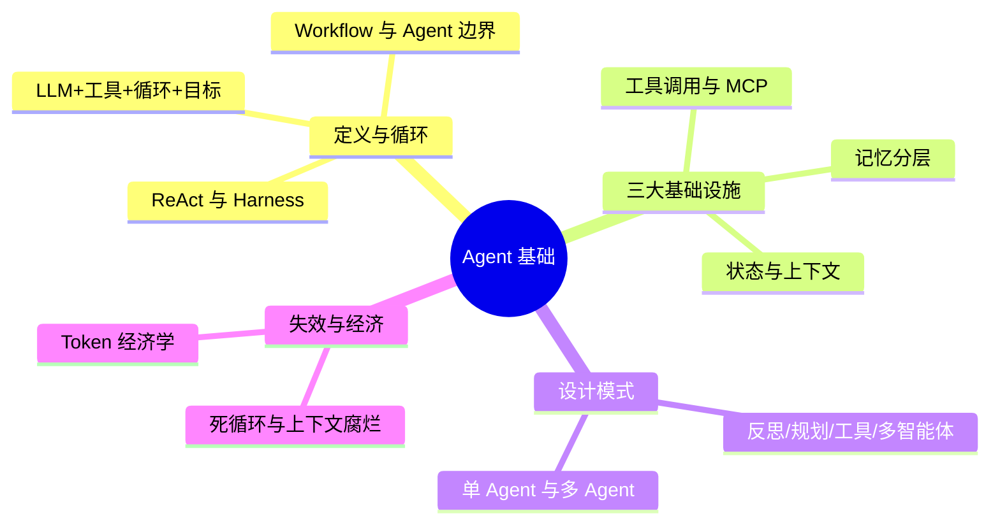

# Agent 基础高级面试问答 (Agent Fundamentals Advanced Interview QA)

> 中文简称：Agent 基础高级面试问答

> **一句话理解**： Agent 就是"给 LLM 装上手和眼睛再放进一个循环里"——LLM 本来只会说，加了工具调用它会"做"，加了循环它会"看着结果接着做"，加了目标它会"自己决定下一步做什么"；高级面试考的不是会不会写循环，而是知不知道这个循环什么时候会失灵、为什么失灵、怎么设计才不容易失灵。

---

> **难度标注**： ⭐⭐⭐ 高级（Senior/Staff 必备）｜ **使用方法**： 先遮住答案口述，再对照关键词补全；答不上沿「深挖」链接回语料精读。
> **答题框架**： 快问快答 60 秒/题；进阶题 3 分钟/题；模拟对话 1-2 分钟/回合。

---

## 本篇导览与学习路径

| 部分 | 题号 | 定位 |
|------|------|------|
| 快问快答：定义与核心循环 | 1-10 | Agent 是什么、怎么转 |
| 快问快答：工具/记忆/协议 | 11-20 | 三大基础设施 |
| 快问快答：模式与失效 | 21-27 | 设计模式与失效模式 |
| 进阶：MDP 视角与上下文第一性 | 28-30 | 高难度复合题 |
| 高级课题 | 31-36 | 6 大主题，带"深挖"回语料 |
| 面试模拟对话 | 三场景 | 概念辨析 → 架构设计 → 失效排查 |

图示说明：知识树按"是什么 → 靠什么转 → 怎么设计 → 怎么坏"四层展开，刷题时按层自测。

---

## 快问快答：定义与核心循环

### 1. 一句话定义 Agent，四个要素缺一不可？

**LLM（决策内核）+ 工具（行动能力）+ 循环（持续交互）+ 目标（自主终止条件）**。缺工具是聊天机器人，缺循环是一次性补全，缺目标/终止条件是失控进程。高级表述：Agent 是"以 LLM 为策略函数、以环境反馈为观测的闭环决策系统"。

### 2. Agent 和 Workflow 的本质区别是什么？什么时候该用哪个？

Workflow 是**开发者预先写死控制流**，LLM 只填空；Agent 是 **LLM 自己决定控制流**（下一步调什么工具、何时终止）。判断标准：任务路径可枚举且稳定→Workflow（便宜、可控、可测）；路径不可枚举或长尾→Agent（灵活、贵、难测）。Anthropic 的 "Building Effective Agents" 口径：能用 Workflow 就不要上 Agent——自主性是要用钱和风险买的。

深挖： [[15_智能体/03_Agent工作流/02_Agentic_工作流_设计_模式_2026|Agentic 工作流设计模式 2026]]

### 3. ReAct 循环具体转的是什么？

每轮：**推理（Thought：现在缺什么）→ 行动（Action：调哪个工具、什么参数）→ 观测（Observation：工具返回什么）→ 回填上下文进入下一轮**，直到模型判断目标达成或触发终止条件。本质是把"思考-行动"交错化，让中间观测纠正后续推理。追问点：ReAct 之所以有效，是因为观测把"幻觉"变成了"可被现实打脸的错误"。

### 4. 什么是 Harness（脚手架）？它和模型的关系是什么？

Harness 是模型外围的**整套工程系统**：上下文组装、工具注册与执行、状态与记忆管理、权限与安全、重试与错误恢复、日志与观测。关系类比：模型是发动机，Harness 是整辆车。高级判断题：同一模型换 Harness，任务成功率可以差数倍——所以"Agent 能力 = 模型能力 × Harness 质量"，两者是乘法不是加法。

深挖： [[15_智能体/04_Agent脚手架/01_Agent_脚手架_架构_2026|Agent 脚手架架构 2026]]

### 5. Function Calling 的机制是什么？模型真的在"调用"函数吗？

不是。模型只输出**结构化的调用意图**（JSON：工具名 + 参数），真正的执行发生在 Harness：解析意图 → 校验参数 → 执行本地/远程函数 → 把结果回填到下一轮上下文。模型"调用"是生成文本，执行权始终在 Harness 手里——这就是权限控制可以完全做在模型外面的原因。

### 6. 上下文窗口在 Agent 里扮演什么角色？它和"记忆"什么关系？

上下文窗口是 Agent 的**工作记忆（唯一被模型直接读取的状态）**：系统提示、工具定义、对话历史、工具结果全部挤在同一个窗口里。记忆（Memory）是窗口之外的持久层，按需检索后**注入**窗口。关键认知：模型没有"记性"，只有"此刻看得见的"——一切记忆设计的终点都是"在正确时刻把正确内容放进窗口"。

### 7. Agent 的状态管理为什么要显式建模？

长任务跨越多轮多会话，必须区分：**会话状态**（当前上下文）、**任务状态**（进度、检查点、中间产物）、**环境状态**（外部系统的事实）。不显式建模的后果：断线恢复不了、重试产生副作用、多 Agent 互相覆盖。LangGraph 用图 + checkpoint 显式管理状态，就是这个问题的工程答案。

深挖： [[15_智能体/01_Agent基础/10_Agent_State_Management|Agent 状态管理]]

### 8. 什么任务适合交给 Agent，什么不适合？判断标准？

核心标准是**可验证性**：目标是否可判定（测试通过/订单创建成功/字段抽取准确）。可验证 → Agent 可以自我纠错，闭环成立；不可验证（开放式写作、品味类决策）→ 只适合人机协作或一次性生成。次级标准：步骤数（>3 步且路径多变才值得 Agent）、风险敞口（高副作用操作要加审批）。Coding Agent 最先成功，正是因为代码有编译器和测试这个天然验证器。

### 9. Agent 的典型失效模式有哪些？

五大件：① **死循环**（重复调用同一工具无进展）；② **上下文腐烂**（历史工具结果占满窗口，关键信息被稀释）；③ **目标漂移**（做着做着忘了原始目标）；④ **幻觉行动**（编造不存在的工具参数/文件路径）；⑤ **过度行动**（权限内但不该做的事）。每种都有对应 Harness 对策：步数预算、上下文压缩、目标重申、参数校验、权限分层。

### 10. 为什么"工具越多"反而可能越差？

三重代价：① 工具定义挤占上下文（几十个工具的 schema 就是大几千 token）；② **选择集过大降低选择质量**（相似工具互相干扰，模型选错率上升）；③ 维护面扩大（描述过期、命名冲突）。工程结论：工具集合要按任务**动态裁剪**（工具检索/分组暴露），不是注册得越多越能干。

---

## 快问快答：工具、记忆与协议

### 11. 工具定义（schema）设计有哪些原则？

少而精（先做减法）、**命名即 API**（动词_对象，自解释）、参数最小化（能用枚举不用自由文本）、**返回值可导航**（报错信息里告诉模型"下一步该怎么改"，错误也是给模型看的 prompt）、幂等与副作用标注。工具描述就是写给模型看的文档，质量直接决定调用准确率。

深挖： [[15_智能体/05_Agent技能/14_工具调用_最佳实践|工具调用最佳实践]]

### 12. MCP 解决了什么问题？它没解决什么？

MCP（Model Context Protocol）把"模型 ↔ 工具/资源"的对接标准化：M×N 的私有集成变成 M+N，一次实现、任意客户端复用，附带资源、提示模板、采样等原语。它**没解决**：工具质量本身（描述烂照样调错）、权限与审计（还是要 Harness 自己做）、多 Agent 间协作（那是 A2A 的领域）。

深挖： [[15_智能体/01_Agent基础/20_MCP_实现_指南|MCP 实现指南]]

### 13. MCP、A2A、AG-UI 这三个协议各管哪一层？

**MCP 管 Agent ↔ 工具**（垂直能力接入）；**A2A 管 Agent ↔ Agent**（跨框架的 Agent 间任务委托与状态同步，Agent Card 声明能力）；**AG-UI/ACP 管 Agent ↔ 前端 UI**（流式事件、生成式 UI）。三层叠起来才是完整协议栈，不要在面试里把它们说成竞品。

深挖： [[15_智能体/01_Agent基础/08_Agent_协议_对比_2026|Agent 协议对比 2026]]、[[15_智能体/16_Agent协议/01_A2A_协议_深入分析|A2A 协议深入分析]]

### 14. Agent 记忆怎么分层？

常用四层：**工作记忆**（上下文窗口本体）、**情景记忆**（ episodic：本会话/历史任务的轨迹与结果）、**语义记忆**（结构化事实与用户偏好）、**程序记忆**（可复用的技能/流程，如 skills）。设计与检索策略各不相同，先分清层再谈实现。

深挖： [[15_智能体/06_记忆基础设施/01_Agent_Memory_系统_2026|Agent Memory 系统 2026]]

### 15. 记忆检索和 RAG 检索有什么区别？

RAG 检索的是**外部客观知识**（文档、事实），查询意图明确；记忆检索的是**主体相关经验**（这个用户是谁、上次怎么失败的），带有时间性与置信度，还需要**写入时机**（什么时候记）、**冲突消解**（新记忆 vs 旧记忆）、**遗忘策略**（过时记忆降权）三个 RAG 没有的问题。把记忆系统当 RAG 做是常见初级错误。

### 16. 规划（Planning）有哪些形态？各自的适用场景？

三种形态：① **计划先行**（plan-then-execute：先出完整计划再逐步执行，适合结构化长任务，抗漂移但怕变化）；② **交错规划**（边做边定下一步，ReAct 默认，灵活但易漂移）；③ **分层规划**（高层 planner 拆解 + 低层 worker 执行，兼顾两者）。当前共识：复杂任务用"计划先行 + 关键节点重规划"的混合式。

### 17. 反思（Reflection）模式为什么有效？代价是什么？

让模型对自己的输出做批判性复查再修订，把"一次生成"变成"生成-评审-修正"的内部迭代，质量显著提升。代价：**每轮反思至少翻倍的 token 成本与时延**，且反思质量受模型自我认知能力限制（弱模型反思不出真错误）。适用：高价值、低频次、可判定的任务。

### 18. 单 Agent 和多 Agent 怎么选？多 Agent 的真实收益是什么？

默认单 Agent。上多 Agent 的三个正当理由：① **上下文隔离**（子任务的中间过程不污染主上下文——这是最被低估的收益）；② **并行加速**（独立子任务并发）；③ **职责分离**（不同角色用不同模型/提示，如 builder/critic）。反正当理由："看起来高级"。多 Agent 的代价：通信信息损耗、成本倍增、错误传播、调试复杂度指数上升。

深挖： [[15_智能体/01_Agent基础/21_多智能体系统_指南|多智能体系统指南]]

### 19. Agent 的"自主性"怎么分级？为什么要分级？

实用分级（L0-L5 粗口径）：L0 人工触发单步 → L1 单轮工具辅助 → L2 有界循环（单任务内自主）→ L3 跨任务调度 → L4 自我改进 → L5 完全自主。分级的价值是**权限与监控随级联增长**：L2 只需要步数预算，L3 就需要审批与配额，L4+ 需要沙箱与治理。面试里说"我们要做全自主 Agent"而不给分级，是风险信号。

### 20. Agent 一次任务大概花多少钱？怎么估算？

估算公式：**成本 ≈ 轮数 × (输入 token × 输入价 + 输出 token × 输出价) + 工具执行成本**。坑在于：输入 token 随轮次**累计增长**（历史越来越长），真实成本接近 O(轮数²)；有 Prefix Caching 可大幅缓解。经验量级：一次严肃的 coding agent 任务消耗几十万到数百万 token，成本从几美分到几美元不等。深挖： [[15_智能体/01_Agent基础/25_Agent_经济学_2026|Agent 经济学 2026]]

---

## 快问快答：模式与失效

### 21. Andrew Ng 的四大 Agentic 设计模式是什么？

**Reflection（反思）、Tool Use（工具使用）、Planning（规划）、Multi-Agent（多智能体协作）**。价值不在模式本身，而在"agentic 工作流 > 单次生成"的范式判断：同一个模型包进这四种模式，任务表现可以大幅超过裸模型。追问点：四模式可以叠加，但每叠一层都增加成本与时延，要有选择地用。

深挖： [[15_智能体/01_Agent基础/13_Agentic_设计_模式_AndrewNg|Agentic 设计模式（Andrew Ng）]]

### 22. 什么是上下文腐烂（context rot）？怎么对抗？

随轮次增加，上下文里堆满过时工具结果、失败尝试、冗长输出，**信噪比持续下降**，模型对关键约束的"注意力"被稀释，表现为后期轮次质量明显劣于前期。对抗手段：工具结果摘要化、旧轮次压缩（compaction）、关键约束定期重申、把大输出落盘只回填引用。

### 23. 为什么说"模型升级，Agent 重测"？

Agent 行为是模型 × 提示 × 工具的**涌现组合**，模型换版会整体改变行为分布：工具调用格式偏好变了、终止判断变了、提示的隐性假设失效了。所以生产 Agent 必须把"模型版本"纳入变更管理，升级要走完整回归评估——这也是 Agent 评估资产的价值所在。

### 24. Agent 怎么处理"工具执行失败"？错误恢复的设计要点？

要点：① 错误信息**可导航**（不是 "error"，而是"参数 X 缺失，Y 的合法取值是……"）；② 重试有策略（区分瞬时错误/参数错误/权限错误，只有瞬时错误值得原样重试）；③ 失败也要**留痕**（写进上下文，让模型换路径而不是重复撞墙）；④ 步数预算兜底（接近预算时降级为"汇报部分结果 + 请求人类介入"）。

### 25. 温度（temperature）等采样参数在 Agent 里怎么设？

任务链路里**规划与工具调用轮次要低温**（0 附近，稳定可复现），创意生成子步骤可以升温。更重要的工程点：低温 + 种子固定只是降低方差，Agent 的随机性主要来自环境与工具返回，不要指望采样参数换来确定性。

### 26. System Prompt 在 Agent 里承担什么、不承担什么？

承担：角色与目标、**不可违反的硬约束**（安全红线、权限边界）、输出协议、工具使用政策、终止条件。不承担：具体任务知识（应放工具/检索/记忆）、业务流程的每一步（那是 Workflow 的事）。反模式：把 system prompt 写成几千字的"操作手册"，模型每轮都要背着它走，关键约束反而被稀释。

### 27. Reasoning 模型（如 o1/R1 类）对 Agent 架构改变了什么？

改变了"想"与"做"的配比：推理模型把长链推理内置到生成里，Agent 的提示里不再需要"请一步步思考"这类引导，规划轮次可以减少；但**工具调用的编排责任反而更重**（模型想得多，每一步都更贵），且推理 token 也计费，成本结构变了。混合策略：规划/复杂决策用推理模型，简单工具轮用轻量模型。

---

## 进阶快问快答：MDP 视角与上下文第一性（高难度）

### 28. 为什么说 Agent 本质是一个（部分可观测的）马尔可夫决策过程？这个视角有什么工程价值？

对应关系：状态 = 任务与环境状态，动作 = 工具调用，观测 = 工具返回（部分可观测：模型只看得见上下文窗口），策略 = LLM，奖励 = 任务验证信号。工程价值：① 术语直接映射到设计（观测不完整 → 需要记忆与环境读取工具；奖励可验证 → 能上 RL/自动评估）；② 解释失效（死循环 = 策略在有噪观测下收敛到重复动作）；③ 指出优化方向（改观测质量往往比改提示收益大）。能推出"**上下文 = 策略的输入分布，上下文工程 = 策略改进**"是高级信号。

### 29. 为什么说上下文是 Agent 时代的第一性资源？

三段论证：① 模型无状态，一切能力作用点都在窗口内——上下文质量直接决定行为上限；② 所有基础设施（记忆、RAG、压缩、缓存、多 Agent）本质上都在做同一件事：**决定窗口里放什么**；③ 成本与时延都随窗口增长（Decode 计算量与 KV 显存都与上下文长度相关），所以"放什么、留什么、何时丢弃"是 Agent 工程的核心优化问题。这个视角把 prompt engineering、记忆、RAG、多 Agent 统一在一个框架下——面试收尾讲这个，层次立刻不同。

### 30. "Agent 能力 = 模型 × Harness"是乘法关系，这个判断对架构决策意味着什么？

意味着两条铁律：① 模型短板可以靠 Harness 补（弱模型的死循环用步数预算兜住），模型长板必须靠 Harness 释放（强模型的工具不用好等于浪费）；② **任何一维为零则整体为零**——再强的模型配上没有权限控制、没有错误恢复的 Harness，生产可用性为零。推论：评估也必须按组合评估（同一模型换 Harness 分数会变），不能只评模型。

---

## 高级课题快问快答：6 大主题（高难度）

### 话题覆盖清单

| # | 主题 | 关键词 |
|------|------|------|
| 31 | 脚手架解剖 | Subsystems / 生命周期钩子 |
| 32 | 框架选型 | LangGraph / AutoGen / ADK / SmolAgents |
| 33 | 技能与程序记忆 | Skills / 可复用流程 |
| 34 | 状态机与恢复 | Checkpoint / 幂等 / 补偿 |
| 35 | Agent + RAG 融合 | 检索作为工具 / Agentic RAG |
| 36 | 经济学 | 成本结构 / 路由 / 缓存 |

### 31. 一个生产级脚手架（Harness）包含哪些核心子系统？哪些最容易被低估？

核心子系统：上下文组装器、工具注册与执行器、状态与记忆管理、**权限与安全层**、错误恢复与重试、观测与 trace、评估钩子、终止与预算控制。最被低估的两个：**权限层**（出事故都在这）与**终止控制**（没有预算上限的循环就是生产事故预备队）。深挖： [[15_智能体/04_Agent脚手架/02_脚手架_核心_Subsystems|脚手架核心 Subsystems]]

### 32. 主流 Agent 框架（LangGraph/AutoGen/CrewAI/ADK/SmolAgents）的选型逻辑？

按需求维度选：要**显式状态机与可控流** → LangGraph（图 + checkpoint，生产最常用）；要**多角色对话编排** → AutoGen/CrewAI（对话驱动，原型快）；要**官方生态与托管** → OpenAI Agents SDK / Google ADK；要**教学与极简** → SmolAgents。共识判断：框架的价值在状态管理与可观测，"自动多 Agent"类卖点基本是伪需求；框架会换，Harness 思维不会过时。深挖： [[15_智能体/02_Agent框架/04_AutoGen_CrewAI_LangGraph_Dive|AutoGen/CrewAI/LangGraph 深度对比]]

### 33. Skills（技能）和工具（Tools）的区别是什么？技能系统解决什么问题？

工具是**单次原子调用**（读文件、发请求），技能是**打包的程序性知识**（多步骤流程 + 领域规则 + 示例，按需加载）。技能系统解决"程序性记忆的复用与分发"：把团队里"怎么做好 X"沉淀成可版本管理的资产，模型按任务动态装载。这是 Agent 从"会调 API"到"有作业规范"的分水岭。深挖： [[15_智能体/05_Agent技能/02_Agent_技能_深入分析|Agent 技能深入分析]]

### 34. 长任务的断点恢复怎么设计？幂等为什么是生命线？

三件套：**checkpoint**（每轮把状态/上下文/进度持久化）、**幂等工具**（重试不产生重复副作用，用幂等键或"先查后写"）、**补偿动作**（无法幂等时定义逆向操作）。幂等是生命线的原因：LLM 重试与断点恢复随时发生，非幂等工具 + 自动重试 = 重复扣款/重复发单。深挖： [[15_智能体/01_Agent基础/06_Agent_生产_部署_操作手册|Agent 生产部署操作手册]]

### 35. Agentic RAG 和传统 RAG pipeline 的区别是什么？

传统 RAG 是固定流水线（检索→重排→生成），Agentic RAG 把检索变成**模型可决策的工具**：查不查、查什么、查几轮、要不要换关键词/换数据源，由 Agent 根据中间结果动态决定。收益：多跳问题、模糊查询的成功率显著提升；代价：时延与成本上升、检索行为不可预测。选型口径：简单 QA 用流水线（便宜可控），研究型/多跳任务用 Agentic RAG。深挖： [[15_智能体/01_Agent基础/22_rag_agents|RAG 与 Agents]]

### 36. Agent 成本治理的三大抓手是什么？

① **上下文瘦身**（压缩、摘要、工具结果裁剪——直接砍掉 O(轮数²) 的输入增长）；② **模型路由**（简单轮次用小模型，规划轮次用大模型，prefix caching 全开）；③ **任务预算**（每任务 token 上限 + 超限降级策略）。治理意识：Agent 成本的病根几乎都在"上下文无节制增长"，先治它。深挖： [[15_智能体/01_Agent基础/25_Agent_经济学_2026|Agent 经济学 2026]]

---

## 速答速记表（进阶与高级一句话版）

| 题号 | 一句话答案 |
|------|------|
| 28 | Agent = POMDP：LLM 是策略、工具是动作、上下文是（不完整的）观测 |
| 29 | 上下文是第一性资源：记忆/RAG/压缩/多 Agent 本质都在决定"窗口里放什么" |
| 30 | 能力 = 模型 × Harness 是乘法：任一为零则整体为零 |
| 31 | 脚手架最被低估的是权限层与终止预算 |
| 32 | 框架选型看状态管理与可观测；"自动多 Agent"是伪需求 |
| 33 | 技能 = 打包的程序性记忆，是从调 API 到有作业规范的分水岭 |
| 34 | 断点恢复三件套：checkpoint + 幂等 + 补偿 |
| 35 | Agentic RAG 把检索变成模型可决策的工具，多跳强、时延贵 |
| 36 | 成本病根是上下文无节制增长：瘦身 → 路由 → 预算 |

---

## 面试模拟对话脚本

用法：自己分饰两角，先遮住"候选人"部分口述作答，再对照参考回答与点评复盘。

### 场景一：开场热身——概念辨析

**面试官**：很多人把 Agent 和 RAG 应用混着说，你在项目里怎么划这条线？

**候选人（参考）**：我用控制流归属来划。RAG 应用是固定流水线：检索、重排、生成，路径是工程师写死的。Agent 是模型自己决定下一步——包括要不要检索、检索几轮、要不要换数据源。实际项目里两者会融合：我在一个合规问答系统里，简单查询走固定 RAG（便宜、可控、好评估），只有多跳问题才升级到 agentic 检索，由模型决定是否追问第二轮。关键是这条升级线是显式设计的，不是"全都用 Agent"。

**点评**：
- ✅ 亮点：给出"控制流归属"这个判别标准，并落到真实取舍。
- 🎯 面试官意图：开场题考概念清晰度，能主动谈融合架构的是有实战的人。

**面试官（追问）**：那 Workflow 和 Agent 的边界呢？你们什么时候会故意不用 Agent？

**候选人（参考）**：Anthropic 那篇的口径我很认同：能用 Workflow 就不用 Agent。我们三分之二的"智能"需求最后落在了 Workflow 上。判断标准是任务路径可不可枚举：退票流程路径固定，写死控制流，便宜可测；只有"帮用户分析这份账单哪里有问题"这种路径长尾的任务，才值得上 Agent——因为自主性是用成本、时延和风险换来的，不是免费的加分项。

**点评**：
- ✅ 亮点："三分之二需求落在 Workflow"这种量化表述非常有说服力。
- ⚠️ 风险：别把话说成"Agent 不成熟"，要表述成"按需分配自主性"。

---

### 场景二：架构深挖——工具与记忆设计

**面试官**：你们 Agent 接了 40 多个工具，调用准确率上不去，怎么治？

**候选人（参考）**：先做减法再做加法。第一步审计：40 个工具里真实调用分布大概率是二八开，低频高相似的工具合并或下线。第二步分层暴露：按任务类型动态挂载工具组——跑账单分析时只挂账单相关十个，而不是全量 40 个。第三步重写描述：工具描述是写给模型看的文档，参数说明里直接写合法示例和错误情形。三步做完，选择集小了、描述准了，准确率自然上来。反模式是继续堆工具，选择集越大选得越差。

**点评**：
- ✅ 亮点：先减后加的顺序 + 动态挂载 + 描述即 prompt，三招都是可落地的。
- 🎯 面试官意图：考工具工程手感，报"加 few-shot"这种单一手段是中级答案。

**面试官（追问）**：记忆系统你为什么不用向量库一把梭？

**候选人（参考）**：因为记忆和文档检索不是一类问题。记忆有三个 RAG 没有的问题：写入时机（不是所有交互都值得记，全记就是垃圾场）、冲突消解（用户说换了城市，旧地址是删还是降权）、遗忘策略。我的分层做法：用户偏好类进语义记忆用结构化存储（可更新、可审计），历史轨迹进情景记忆按时间衰减，只有"事实性知识"才走向量检索。向量库只是其中一个组件，不是记忆系统的架构。

**点评**：
- ✅ 亮点：直接指出"记忆 ≠ RAG"的三个独有问题，分层方案具体。
- 🎯 面试官意图：鉴别是抄了开源记忆方案还是真设计过。

---

### 场景三：失效排查与压力追问

**面试官**：生产上你的 Agent 时不时陷入循环，调同一个工具五六次，怎么根治？

**候选人（参考）**：分三层治。急治：步数预算与重复调用检测——同一工具同参数连续 N 次直接熔断，转入"汇报 + 请求人工"。中治：修观测——循环的根因通常是工具返回的错误信息不可导航，模型不知道怎么改参数，把错误信息写成"缺什么、合法值是什么"，循环率立刻下降。根治：把失败轨迹沉淀成评估用例和技能修正——循环高发的工具往往描述有歧义或粒度不对，这是长期资产。顺序是先熔断保生产，再修根因。

**点评**：
- ✅ 亮点：急治/中治/根治三层递进，且点出"循环的根因在观测质量"。
- 🎯 面试官意图：考生产事故思维，只答"加个次数限制"是初级答案。

**面试官（追问）**：模型升级后你的 Agent 突然变笨了，模型分明明更高，怎么回事？

**候选人（参考）**：这是典型的"乘法关系"问题：Agent 能力 = 模型 × Harness，模型变了，Harness 里的隐性假设就失效了。常见三处：提示里针对旧模型行为调的措辞（比如格式引导）在新模型上起了反作用；工具调用格式的偏好变了导致解析失败率上升；终止判断变保守或变激进，步数分布整体漂移。所以我把模型版本纳入变更管理：升级必须跑全量轨迹回归，灰度上线，这和模型训练里的"回归红线"是一个道理。

**点评**：
- ✅ 亮点：用乘法框架解释现象，落到版本管理与轨迹回归的工程动作。
- 🎯 面试官意图：收尾题考系统观，能把模型升级当"系统性变更"管理的是稀缺能力。

---

### 自练检查清单

- 快问快答能否每题 60 秒口述完？
- 是否至少说出 3 个生产级细节（工具动态挂载、幂等键、步数熔断）？
- 能否不看稿讲清"上下文是第一性资源"的三段论证？
- 收尾题能否一镜到底讲完"模型升级为什么必须重测"？

---

## 相关链接

- [[21_面试岗位/26_高级面试问答/02_LLM全生命周期_高级面试问答|LLM 全生命周期高级面试问答]] — 模型侧的姊妹篇
- [[15_智能体/01_Agent基础/05_Agent_概览|Agent 概览]] — 定义与全景语料
- [[15_智能体/01_Agent基础/12_Agentic_AI_完整_指南|Agentic AI 完整指南]] — 核心概念语料
- [[15_智能体/04_Agent脚手架/13_The_Anatomy_of_an_Agent_脚手架|The Anatomy of an Agent]] — Harness 解剖语料
- [[15_智能体/05_Agent技能/14_工具调用_最佳实践|工具调用最佳实践]] — Q11 语料
- [[15_智能体/06_记忆基础设施/01_Agent_Memory_系统_2026|Agent Memory 系统 2026]] — Q14/Q15 语料
- [[15_智能体/02_Agent框架/04_AutoGen_CrewAI_LangGraph_Dive|框架深度对比]] — Q32 语料
- [[15_智能体/01_Agent基础/08_Agent_协议_对比_2026|Agent 协议对比 2026]] — Q12/Q13 语料
- [[15_智能体/03_Agent工作流/02_Agentic_工作流_设计_模式_2026|工作流设计模式 2026]] — Q2 语料
- [[15_智能体/01_Agent基础/25_Agent_经济学_2026|Agent 经济学 2026]] — Q20/Q36 语料
- [[21_面试岗位/26_高级面试问答/04_Agent全生命周期_高级面试问答|Agent 全生命周期高级面试问答]] — 从基础到生产治理的进阶篇

---

*Last updated: 2026-09-08*
