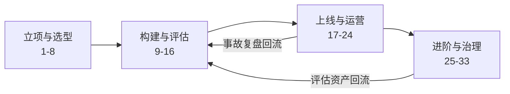

# Agent 全生命周期高级面试问答 (Agent Lifecycle Advanced Interview QA)

> 中文简称：Agent 全生命周期高级面试问答

> **一句话理解**： Agent 的生命周期像"招一个实习生"——先想清楚让他干什么（可验证的任务）、给他立规矩（权限与审批）、带教试用（影子模式）、转正后持续看产出（指标与复盘）、干得不好要么调岗（降级为 Workflow）要么劝退（退役）；高级面试考的是"从立项到退役"每一关的关卡设计。

---

> **难度标注**： ⭐⭐⭐ 高级（Senior/Staff 必备）｜ **使用方法**： 先遮住答案口述，再对照关键词补全；答不上沿「深挖」链接回语料精读。
> **答题框架**： 快问快答 60 秒/题；进阶题 3 分钟/题；模拟对话 1-2 分钟/回合。

---

## 本篇导览与学习路径

| 部分 | 题号 | 定位 |
|------|------|------|
| 快问快答：立项与选型 | 1-8 | 需求/买建/模型/团队 |
| 快问快答：构建与评估 | 9-16 | 三层评估/影子/HITL/CI |
| 快问快答：上线与运营 | 17-24 | 指标/trace/事故/降级 |
| 进阶：评估先行与 ROI | 25-27 | 高难度复合题 |
| 高级课题 | 28-33 | 6 大主题，带"深挖"回语料 |
| 面试模拟对话 | 三场景 | 立项 → 上线 → 事故复盘 |

图示说明：生命周期不是单向流水线——评估资产与事故复盘都会回流到构建阶段，形成飞轮；面试讲闭环的比讲直线的高一档。

---

## 快问快答：立项与选型

### 1. Agent 项目立项要过的第一道关是什么？

三连问：① **任务可验证吗**（结果能否自动判定对错）——不可验证的任务做不了闭环；② **ROI 成立吗**（替代的工时/新增的吞吐 vs token + 人力 + 事故成本）；③ **风险敞口多大**（错误操作的代价与可逆性）。三问中任何一问答不好，宁可先做 Workflow 或 RAG。高级表述：立项先证明"这个任务配得上自主性"。

### 2. 买（平台/SaaS）、建（自研 Harness）、混合怎么选？

按差异化价值判断：**核心业务流程自建**（Harness 是竞争力所在，外包等于交出核心资产）；**通用能力买**（代码执行沙箱、浏览器自动化等成熟件）；**平台做底座、业务做上层**是主流混合形态。判断信号：如果供应商今天关停，你的业务死不死——会死的环节必须自建或可替换。

### 3. 从 Workflow 升级到 Agent 的信号是什么？

三个信号同时出现才升级：① 长尾分支占比上升（例外路径的代码维护成本超过 Agent 的 token 成本）；② 分支决策本身需要"理解"（不是 if-else 能表达的）；③ 有可信验证器兜底（升级后错了能被发现）。只满足前两条不上——没有验证器的 Agent 是把 if-else 的 bug 换成了更贵的 bug。

### 4. PoC 阶段最容易犯什么错？

**用 demo 成功率外推生产成功率**。demo 的输入是精心挑的、环境是理想的、失败有人兜；生产的输入分布长尾、环境带噪、没人兜底。对策：PoC 第一天就建评测集（哪怕 50 条真实任务），一切结论对着评测集说话，"看起来能用"不构成推进依据。

### 5. 基座模型怎么选？流程是什么？

正确顺序：**先建评估集，再选模型**——用自有评测集跑候选模型（含工具调用可靠性、指令遵循、目标领域的任务成功率），而不是看榜单。维度：能力 × 成本 × 上下文长度 × 工具调用稳定性 × 许可证与数据政策。加分点：模型是**可替换组件**，选型要验证"换模型的迁移成本"，别把提示词工程焊死在某一家模型的行为上。

### 6. 框架选型应该放在生命周期的什么位置？

**越晚锁死越好**。框架解决的是 Harness 的工程效率，不是能力本身；过早锁定框架 = 提前背上它的抽象与迁移成本。实践：PoC 期用轻量自研或薄框架验证价值；价值确认后，按"状态管理 + 可观测 + 社区活跃度"三维度选生产框架。面试加分点：能说出"框架会换、Harness 思维不变"。

### 7. 需求阶段要定义哪些"非功能需求"？

四项：**时延预算**（单轮/端到端 SLO）、**成本预算**（单任务 token 上限）、**权限边界**（能动哪些系统、哪些操作要审批）、**审计要求**（留存什么、留多久、给谁看）。这些在 Agent 项目里不是"上线后再说"的项——权限边界决定架构（沙箱、审批流），预算决定模型与策略选择。

### 8. Agent 项目需要什么角色配置？

最小配置四类：**Agent 工程师**（Harness 与集成）、**评估/数据角色**（评测集与质量）、**领域专家 SME**（定义"做对了"长什么样——最常缺）、**安全/风控**（权限模型与红队）。经验判断：缺 SME 的 Agent 项目会做成"工程师想象中的业务"，这是失败项目的高频画像。

---

## 快问快答：构建与评估

### 9. Agent 评估分哪三层？各层测什么？

① **单步评估**：工具选择对不对、参数填得对不对（可自动判定，量大管饱）；② **轨迹评估**：整条行动路径的质量——有没有绕路、冗余调用、该并行没并行；③ **端到端评估**：任务成功率 + 效率（步数/时长/成本）。只测第三层会"黑箱到底没法改"，只测第一层会"每步都对但任务失败"。

深挖： [[15_智能体/07_Agent评估/01_Agent_评估_指南|Agent 评估指南]]

### 10. 评测集从零怎么建？

四步：① 从真实流量/SME 访谈收集**主干任务 50-100 条**（覆盖典型路径 + 已知难点）；② 每条带**可判定的验收标准**（自动化断言或明确 rubric）；③ 划分**分层子集**（简单/中等/对抗性，分别算分防止被平均掩盖）；④ 建立版本化与扩充机制（事故、反馈持续回流为新用例）。先有再好：50 条真实的胜过 1000 条合成的。

### 11. LLM-as-judge 用于 Agent 评估的坑是什么？

最大坑：**用 judge 给整条轨迹打总分**——长轨迹里好坏混杂，judge 会被结尾效应和长度带偏。正确姿势：拆步判（每步按 rubric 独立判定）+ 结果判（最终产物用确定性断言）+ judge 只做两处（参数合理性、中间步骤是否推进目标），并定期与人工标注校准一致性。

深挖： [[08_模型评估/03_LLM评估/01_Agent_评估|Agent 评估（LLM 评估章）]]

### 12. 离线评估全绿，为什么上线还要灰度？

因为离线环境与生产的**分布差**：真实输入的长尾、外部系统的真实行为（限流、脏数据、超时）、并发与状态竞争，都只在生产存在。灰度是最后一道"真实分布"的验证，从 1% 流量起步看核心指标，不是形式流程。

### 13. 影子模式（shadow mode）是什么？什么时候必须用？

新 Agent 并行运行但不执行真实动作（只记录"我会怎么做"），与人类/旧系统对照。**必须用的场景**：有不可逆副作用的领域（支付、下单、发送外部消息）。影子期回答两个问题：决策一致率多少？分歧案例里谁对？一致率达标才允许它碰真实世界。

### 14. 上线前的权限模型怎么设计？

四原则：**最小权限**（按任务授予，不是按模型能力授予）、**白名单工具**（只注册任务需要的）、**危险操作审批**（写操作/资金/外部通信走 HITL）、**环境隔离**（生产凭证不进 Agent 上下文，用代理与短期凭证）。判断题：权限是架构问题不是提示词问题——"在 system prompt 里写好别乱删文件"不是权限控制。

深挖： [[15_智能体/10_企业级Agent/01_Agent_Auth_Authorization|Agent Auth 与授权]]

### 15. Human-in-the-loop 的插入点怎么设计？

三类插入点：**风险触发**（危险操作清单强制审批）、**置信触发**（模型自评低置信或验证器打分低时升级人工）、**预算触发**（步数/成本超限自动转人工）。设计要点：审批界面必须给足上下文（Agent 要干什么、为什么、有什么风险），否则审批人只会无脑点通过，HITL 形同虚设。

### 16. CI/CD 对 Agent 项目意味着什么？

变更单元从代码扩展为四件套：**提示词、工具定义、模型版本、流程配置**——每一项都要走版本管理 + 回归门禁。每次变更跑三层评估（至少核心子集），红线任务不退化才可合入。没有 Agent CI 的团队，一次提示词微调就能静默搞砸 20% 的任务，两周后才被发现。

---

## 快问快答：上线与运营

### 17. 上线后盯哪四个核心指标？

**任务成功率**（按任务类型分层）、**人工干预率**（HITL 触发占比，持续上升是腐坏信号）、**单位任务成本**（token + 工具执行）、**完成时长**（端到端时延分布）。辅助指标：重试率、熔断触发率、用户采纳率。原则：指标必须分层看，整体平均会掩盖"某类任务崩了"。

### 18. AgentOps 和 MLOps/LLMOps 的本质区别是什么？

**观测与调试的单元不同**：MLOps 围绕模型训练版本，LLMOps 围绕请求与生成，AgentOps 围绕**轨迹**——一条任务从发起到终止的完整决策链。所以 AgentOps 的核心资产是轨迹存储、轨迹回放、轨迹级评估，以及基于轨迹的回归测试。深挖： [[15_智能体/03_Agent工作流/03_AgentOps_生产_指南|AgentOps 生产指南]]

### 19. 一条可复盘的 trace 要记录什么？

最小集：每轮的**完整上下文快照**（或可重建的增量）、模型原始输出、工具调用与返回（含耗时与错误）、决策点标注（为什么走这条分支）、终态与终止原因。没有完整上下文快照的事故复盘等于考古——"当时模型到底看见了什么"是第一个无法回答的问题。深挖： [[15_智能体/01_Agent基础/04_Agent_可观测性_2026|Agent 可观测性 2026]]

### 20. 怎么发现"慢腐坏"（slow rot）？

慢腐坏指成功率在数周内缓降 5-10%，单日告警永远不响。对策：① 指标看**周环比趋势**而非绝对阈值；② 固定"金丝雀任务集"每天自动跑，充当基线；③ 外部依赖变更（接口改版、模型热更新）纳入变更事件流，和指标曲线对齐看。慢腐坏的根因往往是环境漂移，不在你的代码里。

### 21. 用户反馈怎么回流到系统？

显式反馈（点赞/纠错）价值有限且稀疏，**隐式信号更值钱**：用户重试、改写后重问、人工接管后干了什么、最终有没有用 Agent 的产出。回流管线：信号采集 → 归因到轨迹 → 自动生成候选评估用例 → SME 确认入集 → 进回归。让"用户的每一次纠错"都变成一道回归题，是 Agent 团队复利最高的机制。

### 22. 模型或工具升级的发布流程是什么？

四步：**影子对比**（新旧版本在真实流量影子运行，分歧案例逐条审）→ **离线回归**（全量评测集 + 红线子集）→ **灰度放量**（1%→10%→50%，每档看四指标）→ **可回滚**（版本切换保留快速回退通道；注意上下文/缓存与版本耦合）。工具升级同样走此流程——外部 API 改版对 Agent 是"模型级"变更。

### 23. 线上事故的标准响应 SOP 是什么？

五步：**熔断**（自动止损：暂停写操作/切换降级模式）→ **降级**（Agent 切 Workflow 或人工接管，保业务连续）→ **定位**（轨迹回放，找到第一个错误决策点）→ **修复**（修根因：工具/提示/权限/验证器）→ **回归沉淀**（事故轨迹转化为评估用例 + 防复发断言）。原则：先止损再归因，禁止边跑边猜。深挖： [[15_智能体/Agent_Production_Deployment_Runbook|Agent 生产部署 Runbook]]

### 24. 什么时候该把 Agent 降级为 Workflow？退役流程怎么做？

降级信号：任务路径稳定化了（长尾消失）、成本长期超支、风险事件频发且 HITL 干预率居高不下。降级不是失败，是生命周期的正常归宿——把已验证的路径固化成 Workflow，把 Agent 留给真正长尾的部分。退役：任务迁出 → 数据与记忆归档 → 依赖方通知 → 权限回收。只增不减的是知识（评测集、技能），不是运行中的进程。

---

## 进阶快问快答：评估先行与 ROI（高难度）

### 25. 为什么"评估先行"是 Agent 项目的第一原则？没有评估集的 Agent 项目等于什么？

论证链：Agent 的产出是**概率性行为**而非确定性函数 → 没有度量就无法区分"变好"与"变坏" → 所有后续投资（提示优化、模型升级、工具扩展）都失去方向 → 团队退化为"改一版看感觉"。没有评估集的 Agent 项目等于没有测试的生产代码：每个变更都在裸奔，且失败以周为单位延迟暴露。实践口径：评估集建设排在第一个迭代，投入占比 20-30% 不算多。

### 26. 给一个线上事故的完整复盘示例：客服 Agent 重复给用户发了三次退款，复盘怎么写？

结构化五层：① **事实层**：时间线、影响面（3 笔重复退款、金额、用户数）；② **根因链**：用户催单 → Agent 调退款工具超时 → 重试 → 工具非幂等（无幂等键）+ 审批流按"调用次数"而非"退款单号"去重 → 三次都通过审批。三层失效叠加：工具幂等缺失、验证器不查业务唯一键、审批流形同虚设；③ **修复层**：幂等键、审批以业务单据去重、退款类操作强制人工；④ **回归层**：新增"重复操作"对抗用例集；⑤ **制度层**：所有写操作工具上线前强制幂等审查。加分点：能说出"这单事故的三个失效点任意一个存在都不会发生"——纵深防御。

### 27. Agent 项目的 ROI 怎么算才能说服 CFO？

三本账合一：**成本账** = token 消耗 + 基础设施 + 人力（开发/运营/标注）+ 事故期望损失（频率 × 单次损失）；**收益账** = 替代工时（按处理量 × 单件人力成本）+ 新增吞吐（原来来不及做的单量）+ 质量收益（错误率下降的赔偿减少）；**风险账** = 灰度策略与保险（HITL）的成本。关键动作：把"任务成功率每提升 1% 折算成多少钱"讲清楚——CFO 听得懂的语言是单价与单量，不是模型分。

---

## 高级课题快问快答：6 大主题（高难度）

### 话题覆盖清单

| # | 主题 | 关键词 |
|------|------|------|
| 28 | 评估体系从 0 到 1 | 三层 / 回归流水线 / 金丝雀 |
| 29 | 红队与安全测试 | 注入 / 越权 / 外泄 |
| 30 | 企业治理 | 审计溯源 / 责任边界 |
| 31 | 多 Agent 生命周期 | 协作协议 / 联合评估 |
| 32 | 平台化 | 模板 / 共享工具库 / 统一观测 |
| 33 | 组织能力 | 技能矩阵 / 知识沉淀 |

### 28. Agent 评估体系从 0 到 1 的路线图是什么？

四阶段：**第 1 周**主干评测集（50 条真实任务 + 确定性断言）→ **第 1 月**三层评估 + CI 门禁（每次变更自动回归）→ **第 1 季**金丝雀任务集日跑 + 生产轨迹回流用例 → **长期**私有对抗集（红队题库 + 长尾分层）。判断成熟度的标志：任何变更（哪怕一个提示词）都能在 30 分钟内知道伤没伤到哪。深挖： [[15_智能体/07_Agent评估/03_Agent_评估_系统_架构|Agent 评估系统架构]]

### 29. Agent 的红队测试和 LLM 的红队测试差在哪？场景库怎么建？

LLM 红队测"说什么"，Agent 红队测"**做什么**"——攻击面从文本扩展到工具与权限。核心场景库四类：**间接注入**（网页/文档/工单里藏指令劫持 Agent）、**越权链**（诱导组合调用低危工具达成高危效果）、**数据外泄**（把上下文里的敏感数据写进外部系统）、**资源滥用**（诱导无限循环消耗成本）。每类要配"防御断言"进回归。深挖： [[15_智能体/07_Agent评估/08_Agent_红队测试_2026|Agent 红队测试 2026]]

### 30. 企业级 Agent 治理要回答哪几个"谁负责"？

四个责任边界：**决策责任**（Agent 的建议被采纳后出错的问责链）、**操作责任**（写操作的事后审计与撤销机制）、**数据责任**（Agent 访问了什么数据、驻留在哪、模型供应商是否可见）、**变更责任**（谁批准提示词/模型/工具的上线）。工程化落点：全程审计日志（谁授权、Agent 看见了什么、做了什么）+ 责任矩阵写进治理文档。深挖： [[15_智能体/10_企业级Agent/04_企业级Agent_治理_2026|企业级 Agent 治理 2026]]

### 31. 多 Agent 系统的生命周期管理比单 Agent 多出什么？

多出四件：**协作契约**（Agent 间消息格式与任务交接协议，A2A 或自定义）、**联合评估**（单 Agent 各自达标 ≠ 编排后达标，要测系统级成功率与错误传播）、**调试方法论**（跨 Agent trace 串联，定位"哪个 Agent 开始歪的"）、**成本分账**（每个子 Agent 的消耗归因，防止编排失控烧钱）。深挖： [[15_智能体/04_Agent脚手架/12_多智能体_脚手架_设计|多智能体脚手架设计]]、[[15_智能体/07_Agent评估/14_多智能体_评估_2026|多智能体评估 2026]]

### 32. 从"一个 Agent"到"Agent 平台"要沉淀什么？

四大共享资产：**Agent 模板**（可复制的架构与配置基线）、**工具库**（统一注册、鉴权、版本管理的 MCP 工具市场）、**评估基础设施**（共享评测框架 + 各业务评测集）、**统一观测**（全平台 trace 标准与检索）。平台化的价值判断：第三个 Agent 项目开始，新建 Agent 的边际成本应该显著低于第一个——否则你只是复制了三份代码。深挖： [[15_智能体/10_企业级Agent/03_Agent_生产_2026|Agent 生产 2026]]

### 33. Agent 团队的知识沉淀机制怎么设计？

三层沉淀：**代码层**（Harness 组件模板化）、**资产层**（评测集/技能/工具描述的版本化管理）、**判断层**（事故复盘、选型决策写成 runbook 与 ADR）。关键机制是"**事故 → 资产**"的强制转化：每次复盘必须产出至少一条回归用例或一条 Harness 改进，复盘不开白会。深挖： [[15_智能体/01_Agent基础/02_Agent工程_方法论_系统_2026|Agent 工程方法论 2026]]

---

## 速答速记表（进阶与高级一句话版）

| 题号 | 一句话答案 |
|------|------|
| 25 | 评估先行：没有评测集的 Agent 项目 = 没有测试的生产代码，全程裸奔 |
| 26 | 复盘五层：事实 → 根因链（幂等+验证器+审批三失效）→ 修复 → 回归 → 制度 |
| 27 | ROI 用 CFO 语言：任务成功率 1% = 多少钱，成本含事故期望损失 |
| 28 | 评估成熟度标志：任何变更 30 分钟内知道伤到哪 |
| 29 | Agent 红队测"做什么"：注入/越权链/外泄/滥用四类场景库 |
| 30 | 治理四问：决策/操作/数据/变更，各自谁负责 |
| 31 | 多 Agent 多出四件：契约、联合评估、跨 trace 调试、成本分账 |
| 32 | 平台化标准：第三个项目起，边际成本显著下降 |
| 33 | 复盘不开白会：每次事故强制产出一条回归用例或 Harness 改进 |

---

## 面试模拟对话脚本

用法：自己分饰两角，先遮住"候选人"部分口述作答，再对照参考回答与点评复盘。

### 场景一：立项与选型——"老板要三个月上线"

**面试官**：老板要求三个月内上线一个自动处理客诉的 Agent，你会怎么启动？

**候选人（参考）**：第一周我不写代码，先回答三个立项问题：客诉处理结果可不可自动判定（退款金额对不对、答复是否违反合规话术——大部分可判定，这关能过）；ROI 账（客诉单量 × 单件人力成本 vs token 与运营成本）；风险敞口（涉及退款，属于不可逆写操作，必须 HITL）。然后定边界：三个月上线的不是"全自动 Agent"，而是"Agent 处理 + 人工审批写操作"的灰度版——先接管查询类和草拟类，退款走审批。评测集第一周同步开建，从历史工单抽 80 条真实案例。

**点评**：
- ✅ 亮点：主动收缩承诺范围（灰度版而非全自动），把风险变成了分期交付。
- 🎯 面试官意图：考立项判断力，直接答应"三个月全自动"的是危险候选人。

**面试官（追问）**：为什么这么执着于先建评测集？直接上线看投诉率不行吗？

**候选人（参考）**：投诉率是滞后的、聚合的、不可归因的信号——等投诉上来，伤害已经发生几周了，而且你不知道是哪类任务坏的。评测集是事前的、分层的、可归因的：每次改提示词、换模型，30 分钟内知道伤到哪。换句话说，投诉率告诉你"出事了"，评测集告诉你"能不能上"。两者都要有，但顺序不能反。

**点评**：
- ✅ 亮点："投诉率 vs 评测集"的对比句有记忆点：一个告诉你出事了，一个告诉你能不能上。
- ⚠️ 风险：别说"线上指标没用"，要说"顺序不能反"。

---

### 场景二：上线与灰度——影子模式的设计

**面试官**：退款这种高风险操作，你说的"影子模式"具体怎么跑？

**候选人（参考）**：Agent 接真实工单流，但对写操作只产出"操作计划"（我要给订单 X 退款 Y 元，理由 Z）不执行，由人工按正常流程处理。系统自动比对：Agent 的计划和人的实际操作一致率多少？不一致的案例分流给 SME 复盘——是 Agent 错还是人有惯性操作。同时记录 Agent 的建议质量分。一致率连续两周达标（我们定 95%）且分歧案例里 Agent 正确率不低，才放开低金额档位的自动执行，金额分档逐步放开。

**点评**：
- ✅ 亮点：影子不只是"对答案"，还复盘"谁对"，且放开策略是分档的。
- 🎯 面试官意图：考风险工程手感，答"先小流量试试"是没设计过的人。

**面试官（追问）**：灰度放量到 50% 的时候，周环比成功率掉了 3 个点，但绝对值还是达标的，你停不停？

**候选人（参考）**：先不停，先看两个东西：① 掉的 3 个点集中在哪类任务——如果集中在一个新暴露的长尾类型，这是灰度的价值（早暴露），停该类型不全局停；② 是不是外部环境变了——查变更事件流（模型热更新、客诉系统接口改版）。如果金丝雀任务集同步在掉、且找不到变更事件对应，那是系统性回归，回滚到上一版本再查。原则：分层归因决定动作粒度，不全局急刹车也不装没看见。

**点评**：
- ✅ 亮点："停该类型不全局停"体现指标分层思维，金丝雀与变更事件对齐是成熟运维动作。
- 🎯 面试官意图：考灰度期的决策粒度，答"停"或"不停"都太粗。

---

### 场景三：事故复盘与治理

**面试官**：你们 Agent 昨晚对同一批工单重复执行了清理任务，把客户的草稿数据删了两遍，复盘给我讲讲。

**候选人（参考）**：按五层写复盘。事实层：影响时间窗、涉及工单数、可恢复性（草稿有无备份）。根因链用轨迹回放找第一个错误决策点——初判是定时任务与 Agent 循环叠加：调度器重复触发 + Agent 没有识别"这批已清理过"，删除工具非幂等且无状态检查。三层失效：调度去重缺失、Agent 缺环境状态感知、删除工具无"先查后删"保护。修复层：删除类工具强制"先查后删"+ 二次确认断言、调度器加幂等键、清理任务列入 HITL 清单。回归层：新增"重复执行"对抗用例集，所有写工具补幂等审查。制度层：写操作工具上线前过幂等审查卡点。

**点评**：
- ✅ 亮点：五层结构完整，根因链给出"三层失效叠加"的纵深防御视角。
- 🎯 面试官意图：事故复盘是 Senior/Staff 的硬通货，考的是结构化与归因纪律。

**面试官（收尾）**：这单事故之后，有人提议"以后高危操作全部收回人工"，你怎么回应？

**候选人（参考）**：我会反对一刀切，用数据说话：拉出全部写操作的执行记录，按"操作类型 × 风险等级 × 历史错误率"分层——错误率高的类型收紧到 HITL，错误率低且可逆的保持自动。一刀切收回人工的代价是干预率回升、时延回升、团队回到人工瓶颈，等于项目白做。正确的治理是**按风险分级的权限体系持续演化**，而不是每次事故后全局摆动。这次事故真正暴露的是幂等审查缺失，补的是卡点，不是收回全部自主性。

**点评**：
- ✅ 亮点：用分层数据反对一刀切，指出"补卡点而非收回自主性"的本质。
- 🎯 面试官意图：收尾考治理观——事故后的组织反应模式，决定 Agent 项目能走多远。

---

### 自练检查清单

- 快问快答能否每题 60 秒口述完？
- 是否至少说出 3 个生产级细节（影子模式分档放开、金丝雀任务集、幂等审查卡点）？
- 能否不看稿讲完"评估先行"的完整论证链？
- 事故复盘能否按五层结构一镜到底？

---

## 相关链接

- [[21_面试岗位/26_高级面试问答/03_Agent基础_高级面试问答|Agent 基础高级面试问答]] — 概念与架构层的前置篇
- [[15_智能体/Agent_Production_Deployment_Runbook|Agent 生产部署 Runbook]] — Q23 语料
- [[15_智能体/01_Agent基础/06_Agent_生产_部署_操作手册|Agent 生产部署操作手册]] — 上线流程语料
- [[15_智能体/03_Agent工作流/03_AgentOps_生产_指南|AgentOps 生产指南]] — Q18 语料
- [[15_智能体/01_Agent基础/04_Agent_可观测性_2026|Agent 可观测性 2026]] — Q19 语料
- [[15_智能体/07_Agent评估/01_Agent_评估_指南|Agent 评估指南]] — Q9-Q11 语料
- [[15_智能体/07_Agent评估/08_Agent_红队测试_2026|Agent 红队测试 2026]] — Q29 语料
- [[15_智能体/10_企业级Agent/01_Agent_Auth_Authorization|Agent Auth 与授权]] — Q14 语料
- [[15_智能体/10_企业级Agent/04_企业级Agent_治理_2026|企业级 Agent 治理 2026]] — Q30 语料
- [[15_智能体/04_Agent脚手架/07_脚手架_生产_安全|脚手架生产安全]] — 权限与沙箱语料
- [[21_面试岗位/26_高级面试问答/05_Agent_Engineering_高级面试问答|Agent Engineering 高级面试问答]] — 八大专项工程篇
- [[21_面试岗位/18_面试指南/06_系统设计_for_AI|系统设计 for AI]] — 系统设计轮方法论

---

*Last updated: 2026-09-08*
