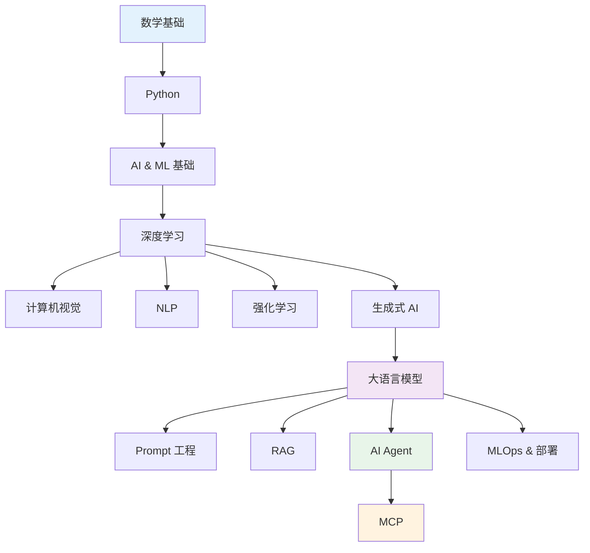

# AI 工程学习路线图 2026（免费资源精选）

> 中文简称：AI 工程学习路线图 2026

> **一句话理解**: 从零到一掌握 AI 工程所需的全部技能——数学、ML、深度学习、LLM、Prompt 工程、RAG、Agent、MCP、MLOps，每一步都有精选免费资源。

> **来源**: [ashishps1/learn-ai-engineering](https://github.com/ashishps1/learn-ai-engineering) (⭐5.7k, 🍴1.4k) — 本页面在其基础上增加了与 AI Guru 知识库的交叉引用和中文解读。

---

## 路线总览

---

## 1. 数学基础 (Mathematical Foundations)

| 资源 | 类型 | 说明 |
|------|------|------|
| [Mathematics Roadmap for ML](https://thepalindrome.org/p/the-roadmap-of-mathematics-for-machine-learning) | 文章 | ML 所需数学的完整路线图 |
| [Essence of Linear Algebra - 3Blue1Brown](https://www.youtube.com/playlist?list=PLZHQObOWTQDPD3MizzM2xVFitgF8hE_ab) | 视频 | 直觉式线性代数，必看 |
| [Probability & Statistics - Khan Academy](https://www.khanacademy.org/math/statistics-probability) | 课程 | 概率统计基础 |
| [Statistics Fundamentals - Josh Starmer](https://www.youtube.com/playlist?list=PLblh5JKOoLUK0FLuzwntyYI10UQFUhsY9) | 视频 | 统计学核心概念 |
| [Mathematics for ML Specialization](https://www.coursera.org/specializations/mathematics-machine-learning) | 课程 | Coursera 吴恩达数学专项 |

> **关联**: → [[01_数学基础/README|数学基础]]

---

## 2. Python

| 资源 | 类型 | 说明 |
|------|------|------|
| [AI Python for Beginners](https://www.deeplearning.ai/short-courses/ai-python-for-beginners/) | 课程 | DeepLearning.AI 免费 Python 入门 |

---

## 3. AI & ML 基础

| 资源 | 类型 | 说明 |
|------|------|------|
| [ML Crash Course - Google](https://developers.google.com/machine-learning/crash-course) | 课程 | Google 官方 ML 速成 |
| [AI for Beginners - Microsoft](https://microsoft.github.io/AI-For-Beginners/) | 课程 | 微软 AI 入门（12 周） |
| [Elements of AI](https://course.elementsofai.com/) | 课程 | 赫尔辛基大学 AI 通识 |
| [ML Playlist - Josh Starmer](https://www.youtube.com/playlist?list=PLblh5JKOoLUICTaGLRoHQDuF_7q2GfuJF) | 视频 | 机器学习可视化讲解 |
| [ML Specialization - Coursera](https://www.coursera.org/specializations/machine-learning-introduction) | 课程 | 吴恩达 ML 专项（经典） |

### ML 框架

| 框架 | 说明 |
|------|------|
| [Scikit-learn](https://scikit-learn.org/stable/) | 经典 ML 库 |
| [XGBoost](https://xgboost.ai/) | 梯度提升框架 |
| [LightGBM](https://lightgbm.readthedocs.io/en/stable/) | 微软高性能 GBDT |
| [CatBoost](https://catboost.ai/) | Yandex 出品，支持类别特征 |

> **关联**: → [[02_机器学习/01_机器学习基础|机器学习基础]]

---

## 4. 深度学习

| 资源 | 类型 | 说明 |
|------|------|------|
| [DL Specialization - Coursera](https://www.coursera.org/specializations/deep-learning) | 课程 | 吴恩达深度学习专项（5 门） |
| [Practical DL for Coders - Fast.ai](https://course.fast.ai/) | 课程 | 实战导向深度学习 |
| [Mathematics for DL](https://d2l.ai/chapter_appendix-mathematics-for-deep-learning/) | 教材 | 《动手学深度学习》数学附录 |
| [DL Playlist - Josh Starmer](https://www.youtube.com/playlist?list=PLblh5JKOoLUIxGDQs4LFFD--41Vzf-ME1) | 视频 | 深度学习可视化 |

### DL 框架

| 框架 | 说明 |
|------|------|
| [PyTorch](https://pytorch.org/) | 主流研究框架 |
| [TensorFlow](https://www.tensorflow.org/) | Google 生产框架 |
| [Keras](https://keras.io/) | 高层 API |

> **关联**: → [[03_深度学习/01_深度学习基础|深度学习基础]]

---

## 5. 深度学习专项

### 计算机视觉
- [DL for CV - Stanford CS231n](https://cs231n.stanford.edu/) — 斯坦福经典 CV 课程
- **关联**: → [[04_计算机视觉/01_CV基础|计算机视觉基础]]

### NLP
- [NLP Specialization - Coursera](https://www.coursera.org/specializations/natural-language-processing)
- **关联**: → [[05_大模型/01_LLM基础/07_NLP_基础|NLP 基础]]

### 强化学习
- [Deep RL Course - Hugging Face](https://huggingface.co/learn/deep-rl-course/unit0/introduction)
- [Deep RL Bootcamp - UC Berkeley](https://sites.google.com/view/deep-rl-bootcamp/lectures)
- **关联**: → [[06_强化学习/01_强化学习基础/03_RL基础|强化学习基础]]

---

## 6. 生成式 AI

| 资源 | 类型 | 说明 |
|------|------|------|
| [Building Blocks of GenAI](https://shriftman.substack.com/p/the-building-blocks-of-generative) | 文章 | 生成式 AI 构建模块 |
| [GenAI for Beginners - Microsoft](https://github.com/microsoft/generative-ai-for-beginners) | 课程 | 微软生成式 AI 入门（18 课） |
| [GenAI for Everyone - Coursera](https://www.coursera.org/learn/generative-ai-for-everyone) | 课程 | 吴恩达生成式 AI 通识 |

---

## 7. 大语言模型 (LLMs)

### 核心理解

| 资源 | 类型 | 说明 |
|------|------|------|
| [The Illustrated Transformer](https://jalammar.github.io/illustrated-transformer/) | 文章 | 图解 Transformer，必读经典 |
| [LLMs explained briefly](https://www.youtube.com/watch?v=LPZh9BOjkQs) | 视频 | LLM 简明解释 |
| [Intro to LLMs](https://www.youtube.com/watch?v=zjkBMFhNj_g) | 视频 | Andrej Karpathy 入门讲座 |
| [Understanding LLMs](https://magazine.sebastianraschka.com/p/understanding-large-language-models) | 文章 | Sebastian Raschka 深度解析 |
| [Visual Guide to Reasoning LLMs](https://newsletter.maartengrootendorst.com/p/a-visual-guide-to-reasoning-llms) | 文章 | 推理型 LLM 图解 |
| [Understanding Reasoning LLMs](https://magazine.sebastianraschka.com/p/understanding-reasoning-llms) | 文章 | 推理模型原理 |
| [Understanding Multimodal LLMs](https://magazine.sebastianraschka.com/p/understanding-multimodal-llms) | 文章 | 多模态 LLM 原理 |
| [Visual Guide to MoE](https://newsletter.maartengrootendorst.com/p/a-visual-guide-to-mixture-of-experts) | 文章 | 混合专家模型图解 |
| [Finetuning LLMs](https://magazine.sebastianraschka.com/p/finetuning-large-language-models) | 文章 | LLM 微调指南 |
| [How Transformer LLMs Work](https://www.deeplearning.ai/short-courses/how-transformer-llms-work/) | 课程 | DeepLearning.AI 短课 |
| [Building GPT from scratch](https://www.youtube.com/watch?v=kCc8FmEb1nY) | 视频 | Karpathy 从零构建 GPT |

### 学习资源集合

| 资源 | 说明 |
|------|------|
| [LLM Course - GitHub (mlabonne)](https://github.com/mlabonne/llm-course) | ⭐ 综合 LLM 学习路线 |
| [LLM Course - Hugging Face](https://huggingface.co/learn/llm-course/chapter1/1) | HF 官方 LLM 课程 |
| [Awesome LLM Apps](https://github.com/Shubhamsaboo/awesome-llm-apps) | LLM 应用案例集合 |

### LLM 聊天产品

| 产品 | 公司 |
|------|------|
| [ChatGPT](https://chatgpt.com/) | OpenAI |
| [Claude](https://claude.ai/new) | Anthropic |
| [Gemini](https://gemini.google.com/app) | Google |
| [Perplexity](https://www.perplexity.ai/) | Perplexity |

### 开源 LLM

| 模型 | 说明 |
|------|------|
| [Llama](https://www.llama.com/) | Meta 开源 LLM |
| [DeepSeek](https://chat.deepseek.com/) | 深度求索 |

### LLM API

| API | 说明 |
|------|------|
| [OpenAI Platform](https://platform.openai.com/docs/overview) | GPT 系列 API |
| [Anthropic Docs](https://docs.anthropic.com/en/docs/overview) | Claude API |
| [Gemini API](https://ai.google.dev/gemini-api/docs) | Google Gemini |
| [Groq](https://groq.com/) | 高速推理 |

> **关联**: → [[05_大模型/01_LLM基础|LLM 基础]] · [[20_论文精读/02_模型架构/01_注意力_Is_All_You_Need_深入分析|Attention 论文]] · [[20_论文精读/03_规模扩展/GPT3_Deep_Dive|GPT-3 论文]]

---

## 8. LLM 工具与框架

| 工具 | 说明 |
|------|------|
| [LangChain](https://www.langchain.com/) | LLM 应用开发框架 |
| [LlamaIndex](https://www.llamaindex.ai/) | 数据连接与 RAG 框架 |
| [Ollama](https://ollama.com/) | 本地运行 LLM |
| [Instructor](https://python.useinstructor.com/) | 结构化输出 |
| [Outlines](https://github.com/dottxt-ai/outlines) | 受控生成 |

### LLM IDE

| 工具 | 说明 |
|------|------|
| [Cursor](https://www.cursor.com/) | AI 编程 IDE |
| [Windsurf](https://windsurf.com/editor) | Codeium AI IDE |
| [GitHub Copilot](https://github.com/features/copilot) | GitHub AI 助手 |

### Agentic 编程工具

| 工具 | 说明 |
|------|------|
| [Claude Code](https://code.claude.com/docs/en/overview) | Anthropic CLI Agent |
| [Codex](https://openai.com/codex/) | OpenAI 编程 Agent |

> **关联**: → [[16_编程/05_开发工具|AI 编程工具]]

---

## 9. Prompt 工程

| 资源 | 类型 | 说明 |
|------|------|------|
| [Google Prompting Essentials](https://www.coursera.org/google-learn/prompting-essentials) | 课程 | Google 提示词基础 |
| [ChatGPT Prompt Engineering for Developers](https://www.deeplearning.ai/short-courses/chatgpt-prompt-engineering-for-developers/) | 课程 | 吴恩达 × OpenAI |
| [Advanced Prompting - Instructor](https://python.useinstructor.com/prompting/) | 文档 | 高级提示技术 |
| [Prompt Engineering Techniques](https://github.com/NirDiamant/Prompt_Engineering) | GitHub | 提示工程技巧大全 |
| [Getting Structured LLM Output](https://www.deeplearning.ai/short-courses/getting-structured-llm-output/) | 课程 | 结构化输出 |
| [God Tier Prompts](https://www.godtierprompts.com/) | 工具 | 高质量提示词库 |

> **关联**: → [[05_大模型/07_提示工程|提示词工程]]

---

## 10. RAG（检索增强生成）

| 资源 | 类型 | 说明 |
|------|------|------|
| [Introduction to RAG - Coursera](https://www.coursera.org/projects/introduction-to-rag) | 课程 | RAG 入门实践 |
| [RAG Techniques](https://github.com/NirDiamant/RAG_Techniques) | GitHub | ⭐ RAG 技术大全 |

> **关联**: → [[14_RAG系统/01_RAG基础|RAG 基础]] · [[20_论文精读/10_检索技术/02_RAG_深入分析|RAG 论文]]

---

## 11. AI Agent

| 资源 | 类型 | 说明 |
|------|------|------|
| [Visual Guide to LLM Agents](https://newsletter.maartengrootendorst.com/p/a-visual-guide-to-llm-agents) | 文章 | Agent 架构图解 |
| [Agents - Chip Huyen](https://huyenchip.com/2025/01/07/agents.html) | 文章 | Chip Huyen Agent 深度解析 |
| [AI Agents Course - Hugging Face](https://huggingface.co/learn/agents-course/) | 课程 | HF Agent 课程 |
| [Building AI Browser Agents](https://www.deeplearning.ai/short-courses/building-ai-browser-agents/) | 课程 | 浏览器 Agent |
| [GenAI Agents](https://github.com/NirDiamant/GenAI_Agents) | GitHub | ⭐ Agent 实现集合 |
| [AI Agents in Action (2nd Ed)](https://www.manning.com/books/ai-agents-in-action-second-edition) | 书籍 | Manning 出版 |

> **关联**: → [[15_智能体/README|Agent 生产]]

---

## 12. MCP（模型上下文协议）

| 资源 | 类型 | 说明 |
|------|------|------|
| [MCP - Anthropic Guide](https://modelcontextprotocol.io/introduction) | 官方文档 | MCP 协议规范 |
| [Building AI Apps using MCP](https://www.deeplearning.ai/short-courses/mcp-build-rich-context-ai-apps-with-anthropic/) | 课程 | MCP 实战 |
| [MCP Course - Hugging Face](https://huggingface.co/learn/mcp-course/unit0/introduction) | 课程 | HF MCP 课程 |
| [Awesome MCP Servers](https://github.com/punkpeye/awesome-mcp-servers) | GitHub | MCP 服务器集合 |

---

## 13. MLOps & 部署

| 资源 | 类型 | 说明 |
|------|------|------|
| [ML in Production - Coursera](https://www.coursera.org/learn/introduction-to-machine-learning-in-production) | 课程 | 吴恩达 ML 生产化 |
| [Full Stack Deep Learning](https://fullstackdeeplearning.com/course/2022/) | 课程 | 全栈深度学习 |
| [ML System Design - Stanford](https://stanford-cs329s.github.io/syllabus.html) | 课程 | 斯坦福 ML 系统设计 |

### MLOps 工具

| 工具 | 说明 |
|------|------|
| [Streamlit](https://streamlit.io/) | 快速构建 ML Web 应用 |
| [MLflow](https://mlflow.org/docs/latest/index.html) | ML 生命周期管理 |

> **关联**: → [[11_模型运维/README|MLOps 流水线]] · [[10_部署推理/README|部署推理]]

---

## 14. 官方指南

| 资源 | 说明 |
|------|------|
| [OpenAI Cookbook](https://cookbook.openai.com/) | OpenAI 官方示例与最佳实践 |
| [Anthropic Courses](https://github.com/anthropics/courses/tree/master) | Anthropic 官方教程 |

---

## 15. 推荐书籍

### 入门与综合

| 书名 | 作者 | 说明 |
|------|------|------|
| Hands-On Machine Learning | Aurélien Géron | ML/DL 实战圣经 |
| Why Machines Learn | Anil Ananthaswamy | ML 背后的数学直觉 |
| Designing ML Systems | Chip Huyen | ML 系统设计 |
| AI Engineering | Chip Huyen | AI 工程实践 |

### 深度学习

| 书名 | 作者 | 说明 |
|------|------|------|
| Deep Learning | Ian Goodfellow et al. | 深度学习"花书" |
| Deep Learning with Python | François Chollet | Keras 作者的 DL 教程 |

### LLM 专项

| 书名 | 作者 | 说明 |
|------|------|------|
| Build a LLM from Scratch | Sebastian Raschka | 从零构建 LLM |
| Prompt Engineering for LLMs | — | 提示工程指南 |
| NLP with Transformers | Hugging Face | Transformers 实战 |
| LLMs in Production | — | LLM 生产化 |

### Agent 专项

| 书名 | 作者 | 说明 |
|------|------|------|
| Build a Multi-Agent System | — | 从零构建多 Agent |
| Build a Reasoning Model | — | 从零构建推理模型 |
| Build an AI Agent | — | 从零构建 AI Agent |
| Build an LLM Application | — | 从零构建 LLM 应用 |
| AI Agents in Action (2nd Ed) | — | Agent 实战 |

---

## 16. YouTube 频道

| 频道 | 说明 |
|------|------|
| [Andrej Karpathy](https://www.youtube.com/@AndrejKarpathy) | 前 OpenAI/Tesla，深度技术讲解 |
| [3Blue1Brown](https://www.youtube.com/@3blue1brown) | 数学可视化，线性代数必看 |

---

## 17. 必读论文

| 论文 | 年份 | Wiki 深度解读 |
|------|------|---------------|
| [Attention Is All You Need](https://arxiv.org/pdf/1706.03762) | 2017 | → [[20_论文精读/02_模型架构/01_注意力_Is_All_You_Need_深入分析]] |
| [Generative Adversarial Networks](https://arxiv.org/abs/1406.2661) | 2014 | → [[20_论文精读/08_计算机视觉/04_GAN_深入分析]] |
| [GPT: Improving Language Understanding](https://cdn.openai.com/research-covers/language-unsupervised/language_understanding_paper.pdf) | 2018 | — |
| [GPT-3: Few-Shot Learners](https://arxiv.org/abs/2005.14165) | 2020 | → [[20_论文精读/03_规模扩展/GPT3_Deep_Dive]] |
| [BERT](https://arxiv.org/abs/1810.04805) | 2018 | → [[20_论文精读/02_模型架构/02_BERT_深入分析]] |
| [Chain-of-Thought Prompting](https://arxiv.org/abs/2201.11903) | 2022 | → [[20_论文精读/06_对齐研究/Chain_of_Thought_Deep_Dive]] |

---

## 18. 其他资源

| 资源 | 说明 |
|------|------|
| [Papers with Code](https://paperswithcode.com/) | 论文 + 代码 + 排行榜 |
| [Kaggle Competitions](https://www.kaggle.com/competitions) | 数据科学竞赛 |

---

## 与 AI Guru 知识库的映射

本路线图中的每个主题在 AI Guru 知识库中都有对应的深度内容：

| 路线图主题 | AI Guru 对应章节 |
|-----------|-----------------|
| 数学基础 | [[01_数学基础/README]] |
| ML 基础 | [[02_机器学习/README]] |
| 深度学习 | [[03_深度学习/README]] |
| NLP / LLM | [[05_大模型/README]] |
| 计算机视觉 | [[04_计算机视觉/README]] |
| 强化学习 | [[06_强化学习/README]] |
| 模型训练 | [[07_模型训练/README]] |
| 模型评估 | [[08_模型评估/README]] |
| 部署推理 | [[10_部署推理/README]] |
| MLOps | [[11_模型运维/README]] |
| RAG | [[14_RAG系统/README]] |
| 架构基础 | [[12_架构基建/README]] |
| Agent 生产 | [[15_智能体/README]] |
| AI 网关 | [[12_架构基建/11_AI网关/README|AI 网关]] |
| 测试 | [[09_测试/README]] |
| AI Ops | [[13_运维/README]] |
| AI 编程 | [[16_编程/README]] |
| 论文精读 | [[20_论文精读/README]] |
| 学习路径 | [[90_学习/04_实践指南/05_learning_paths_2026|AI Guru 学习路径]] |

---

## Wiki 页面索引（本路线图导入的页面）

### GitHub 仓库
- [[90_学习/05_参考资料/Courses/04_llm_course_mlabonne|MLabonne LLM 课程 (80k)]]
- [[90_学习/05_参考资料/Courses/02_rag_techniques_nirdiamant|RAG 技术大全 (27.9k)]]
- [[90_学习/05_参考资料/Courses/05_genai_agents_nirdiamant|GenAI Agent 实现集合 (22.5k)]]
- [[90_学习/03_课程资源/microsoft/01_microsoft_genai_for_beginners|微软生成式 AI 入门 (75k)]]
- [[90_学习/05_参考资料/Courses/03_prompt_engineering_nirdiamant|Prompt 工程技术大全 (5k)]]
- [[90_学习/05_参考资料/Articles/04_awesome_mcp_servers|Awesome MCP Servers (15k)]]
- [[90_学习/05_参考资料/Courses/06_anthropic_courses|Anthropic 官方教程]]
- [[90_学习/05_参考资料/Articles/05_awesome_llm_apps|Awesome LLM Apps (10k)]]

### 在线课程
- [[90_学习/03_课程资源/coursera/04_coursera_ml_specialization|吴恩达机器学习专项]]
- [[90_学习/03_课程资源/coursera/06_coursera_deep_learning_specialization|吴恩达深度学习专项]]
- [[90_学习/03_课程资源/coursera/05_coursera_math_for_ml|Mathematics for ML]]
- [[90_学习/03_课程资源/coursera/03_coursera_nlp_specialization|NLP 专项课程]]
- [[90_学习/03_课程资源/coursera/02_coursera_rag_intro|RAG 入门实践]]
- [[90_学习/03_课程资源/other/06_fastai_practical_dl|Fast.ai 实战深度学习]]
- [[90_学习/03_课程资源/other/02_stanford_cs231n|斯坦福 CS231n]]
- [[90_学习/03_课程资源/hugging_face/03_deep_rl_course|HF 深度 RL 课程]]
- [[90_学习/03_课程资源/hugging_face/04_agents_course|HF AI Agent 课程]]

### 技术文章
- [[90_学习/05_参考资料/Articles/02_illustrated_transformer|图解 Transformer]]
- [[90_学习/05_参考资料/Courses/01_sebastian_raschka_articles|Sebastian Raschka LLM 系列]]
- [[90_学习/05_参考资料/Articles/01_maarten_grootendorst_visual_指南|Maarten Grootendorst 图解系列]]
- [[90_学习/05_参考资料/Articles/03_chip_huyen_agents_article|Chip Huyen Agent 深度解析]]

### 推荐书籍 (15 本)
- [[90_学习/05_参考资料/books/07_hands_on_ml_geron|Hands-On Machine Learning]]
- [[90_学习/05_参考资料/books/11_deep_learning_goodfellow|Deep Learning (花书)]]
- [[90_学习/05_参考资料/books/09_dl_with_python_chollet|Deep Learning with Python]]
- [[90_学习/05_参考资料/books/10_designing_ml_systems_huyen|Designing ML Systems]]
- [[90_学习/05_参考资料/books/15_ai_engineering_huyen|AI Engineering]]
- [[90_学习/05_参考资料/books/14_build_llm_from_scratch_raschka|Build a LLM from Scratch]]
- [[90_学习/05_参考资料/books/05_llm_engineers_handbook|LLM Engineer's Handbook]]
- [[90_学习/05_参考资料/books/03_nlp_with_transformers|NLP with Transformers]]
- 更多书籍见 参考/books/ 目录

### YouTube 频道
- [[19_业界观点/02_Andrej_Karpathy_卡帕西/05_youtube_channel|Andrej Karpathy]]
- [[19_业界观点/01_3Blue1Brown_三蓝一棕/04_youtube_channel|3Blue1Brown]]
- [[19_业界观点/15_Josh_Starmer_斯塔默/04_youtube_channel|StatQuest Josh Starmer]]

### ML/DL 框架
- [[02_机器学习/12_ML框架/05_scikit_learn_概览|Scikit-learn]]
- [[02_机器学习/12_ML框架/06_xgboost_概览|XGBoost]]
- [[02_机器学习/12_ML框架/03_lightgbm_概览|LightGBM]]
- [[02_机器学习/12_ML框架/01_catboost_概览|CatBoost]]
- [[03_深度学习/08_DL框架/06_pytorch_概览|PyTorch]]
- [[03_深度学习/08_DL框架/07_tensorflow_概览|TensorFlow]]
- [[03_深度学习/08_DL框架/05_keras_概览|Keras]]

### 高级主题
- [[概念/Agent/a2a-protocol|A2A 协议]]
- [[05_大模型/15_约束生成/03_Structured_输出_指南|结构化输出指南]]
- [[08_模型评估/04_评估工具/04_LLM_as_Judge_指南|LLM-as-Judge 评估]]
- [[概念/long-context-vs-rag|长上下文 vs RAG]]
- [[16_编程/01_编程基础/01_AI编程2026指南|AI 编程 2026 全景]]
- [[10_部署推理/03_推理优化/10_提示缓存_高级|Prompt 缓存高级]]
- [[14_RAG系统/04_高级RAG/02_Agentic_RAG_指南|Agentic RAG]]
- [[17_伦理安全/04_AI安全与红队/03_Guardrails_生产_指南|AI 护栏实践]]
- [[13_运维/AI_Observability_Guide_2026|AI 可观测性]]
- [[17_伦理安全/04_AI安全与红队/01_AI_红队测试_指南|AI 红队测试]]
- [[12_架构基建/11_AI网关/10_LLM_Gateway_对比_2026|LLM 网关对比]]
- [[14_RAG系统/02_嵌入技术/01_嵌入_模型_指南|Embedding 模型选型]]
- [[15_智能体/06_记忆基础设施/02_Agent_Memory_技术|Agent 记忆技术]]
- [[10_部署推理/06_成本管理/01_LLM_成本优化|LLM 成本优化]]

### 应用场景
- [[18_行业应用/18_代码生成/AI_Code_Generation_2026|AI 代码生成]]
- [[18_行业应用/04_金融/AI_Finance_Applications_2026|AI 金融应用]]
- [[18_行业应用/05_教育/AI_Education_Applications_2026|AI 教育应用]]
- [[18_行业应用/03_医疗健康/AI_Healthcare_Applications_2026|AI 医疗应用]]

### 平台
- [[90_学习/05_参考资料/Projects/01_papers_with_code|Papers with Code]]
- [[90_学习/05_参考资料/Projects/02_kaggle|Kaggle]]
