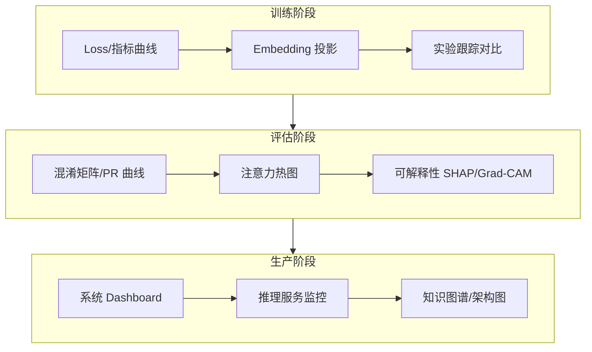

# AI 可视化速览 (AI Visualization in a Nutshell)

> 中文简称：AI 可视化速览

> **一句话理解**: 可视化是 AI 工程师的"仪表盘"——模型训不训得动、好不好、跑得稳不稳，一张图看清比一堆日志好用一百倍。

---

## TL;DR

- **四大子域**: 训练可视化（曲线/embedding）、评估可视化（混淆矩阵/注意力）、系统可视化（架构/推理服务）、最佳实践（图表设计原则）
- **工具三层**: 实验跟踪（TensorBoard/W&B）→ 通用图表（Matplotlib/Plotly）→ 定制交互（D3.js）
- **降维双雄**: t-SNE 看局部聚类，UMAP 兼顾全局结构——embedding 可视化必备
- **训练三张图**: loss 曲线、学习率调度、梯度范数——90% 的训练问题都能从中定位
- **解释性可视化**: 注意力热图、Grad-CAM、SHAP 让黑盒模型"开口说话"
- **原则第一**: 图表类型服从数据关系（比较/分布/构成/关联），少即是多

---

## 1. 四大子域导航

| 子域 | 解决什么问题 | 代表内容 | 入口 |
|------|--------------|----------|------|
| Training_Viz | 训练过程透明化 | 训练曲线、embedding、实验跟踪 | [[94_可视化/INDEX|训练可视化]] |
| Evaluation_Viz | 模型好坏与为什么 | 注意力、降维、可解释性 | [[94_可视化/03_评估可视化/INDEX|评估可视化]] |
| System_Viz | 系统状态一目了然 | Dashboard、推理监控、架构图 | [[94_可视化/04_系统可视化/INDEX|系统可视化]] |
| Best_Practices | 图做得对不对 | 图表选型、配色、反模式 | [[94_可视化/01_最佳实践/INDEX|最佳实践]] |

---

## 2. 工具选型速查

| 工具 | 定位 | 适用场景 | 不适用 |
|------|------|----------|--------|
| TensorBoard | 训练标配 | loss 曲线、直方图、embedding projector | 多人协作对比 |
| Weights & Biases | 实验管理 | 超参扫描、团队协作、报告 | 离线/内网受限环境 |
| Matplotlib/Seaborn | 论文图表 | 静态出版级图表 | 交互探索 |
| Plotly | 交互图表 | Notebook 交互、Web Dashboard | 超大规模数据点 |
| D3.js | 完全定制 | 知识图谱、定制交互叙事 | 快速出图 |
| Grafana | 生产监控 | GPU/延迟/吞吐实时面板 | 模型内部可解释性 |

---

## 3. 训练可视化三张图

| 图 | 看什么 | 异常信号 → 诊断 |
|----|--------|-----------------|
| Loss 曲线 | 收敛趋势、train/val 间距 | 间距拉大 → 过拟合；不降 → 学习率/数据问题 |
| 学习率调度 | warmup 与衰减是否符合预期 | loss 尖刺常与 LR 突变对齐 |
| 梯度范数 | 数值稳定性 | 爆炸 → 加 clip；趋零 → 梯度消失/死层 |

深入: [[94_可视化/README.md|训练曲线分析]] · [[94_可视化/02_训练可视化/07_训练_监控_可视化|训练监控可视化]] · [[94_可视化/02_训练可视化/03_实验追踪_可视化|实验跟踪可视化]]

---

## 4. 评估与解释可视化

| 技术 | 回答的问题 | 入口 |
|------|-----------|------|
| 注意力热图 | 模型在"看"哪里 | [[94_可视化/01_最佳实践/04_Visualization_简明指南|注意力可视化指南]] |
| t-SNE / UMAP | embedding 空间长什么样 | [[94_可视化/03_评估可视化/03_降维可视化.md|降维可视化]] |
| SHAP / Grad-CAM | 哪个特征/像素决定了预测 | [[94_可视化/Evaluation_Viz/Model_Interpretability_Visualization|可解释性可视化]] |
| 混淆矩阵 / PR 曲线 | 错在哪一类、阈值怎么选 | [[94_可视化/01_最佳实践/04_Visualization_简明指南|评估可视化指南]] |

> t-SNE vs UMAP 一句话：**t-SNE 局部聚类更漂亮，UMAP 更快且全局距离更可信**；两者的簇间距离都不能过度解读。

---

## 5. 图表选择决策

| 数据关系 | 推荐图表 | 反模式 |
|----------|----------|--------|
| 比较 | 条形图、雷达图 | 3D 柱状图（视觉欺骗） |
| 分布 | 直方图、箱线图、小提琴图 | 只报均值不看分布 |
| 构成 | 堆叠条形、Treemap | 超过 5 类的饼图 |
| 关联 | 散点图、热力图 | 双 Y 轴暗示因果 |
| 演化 | 折线图、面积图 | 截断 Y 轴夸大趋势 |

完整原则: [[94_可视化/Best_Practices/Data_Visualization_Best_Practices|数据可视化最佳实践]]

---

## 延伸阅读 (Further Reading)

| 主题 | 说明 | 入口 |
|------|------|------|
| 神经网络结构图 | 网络结构绘制方法 | [[94_可视化/01_最佳实践/04_Visualization_简明指南|网络可视化指南]] |
| Embedding 可视化 | 词向量/句向量投影 | [[94_可视化/Training_Viz/Embedding_Visualization_Guide|Embedding 指南]] |
| 系统 Dashboard | AI 系统监控面板设计 | [[94_可视化/System_Viz/AI_System_Dashboard|AI 系统 Dashboard]] |
| 推理服务监控 | 延迟/吞吐/GPU 可视化 | [[94_可视化/System_Viz/Inference_Serving_Visualization|推理服务可视化]] |

---

*Last updated: 2026-07-27*

## 相关链接

- [[94_可视化/index|可视化首页]] — 章节总览
- [[94_可视化/README|可视化小白指南]] — 零基础版
- [[07_模型训练/index|模型训练]] — 训练监控的上游
- [[08_模型评估/index|模型评估]] — 评估可视化的上游
- [[11_模型运维/index|模型运维]] — 生产监控体系

## 核心知识体系

| 知识层 | 核心内容 | 深度要求 | 学习优先级 |
|--------|----------|----------|------------|
| 基础理论 | 核心概念/数学原理/基本定义 | 深入理解并能推导 | P0 |
| 核心方法 | 主流算法/技术路线/框架工具 | 熟练掌握并能应用 | P0 |
| 工程实践 | 系统设计/性能优化/生产部署 | 独立完成项目 | P1 |
| 前沿研究 | 最新论文/技术趋势/开放问题 | 了解并跟踪 | P2 |
| 行业应用 | 落地案例/最佳实践/经验教训 | 参考并借鉴 | P1 |

## 技术路线对比

| 维度 | 经典方法 | 深度学习方法 | 大模型方法 | 选型建议 |
|------|----------|--------------|------------|----------|
| 数据需求 | 少量标注 | 大量标注 | 海量预训练 | 按数据规模 |
| 计算成本 | 低 | 中-高 | 极高 | 按预算约束 |
| 泛化能力 | 有限 | 良好 | 优秀 | 按任务复杂度 |
| 可解释性 | 高 | 低 | 极低 | 按合规要求 |
| 部署难度 | 简单 | 中等 | 复杂 | 按运维能力 |
| 迭代速度 | 快 | 中 | 慢 | 按业务节奏 |

## 常见问题FAQ

| 问题 | 解答 |
|------|------|
| 如何快速入门该领域? | 先建立直觉(可视化/类比)，再学数学原理，最后代码实现 |
| 需要哪些前置知识? | 线性代数+概率统计+微积分+Python编程基础 |
| 如何选择学习资源? | 经典教材打基础+顶会论文跟前沿+开源项目练实战 |
| 理论学习和实践如何平衡? | 7:3比例——70%时间理解原理，30%时间动手验证 |
| 如何评估自己的掌握程度? | 能向他人清晰解释+能独立实现+能解决变体问题 |

## 核心术语速查

| 术语 | 含义 | 关联概念 |
|------|------|----------|
| Loss Function | 衡量预测与真实值差距 | 交叉熵/MSE/对比损失 |
| Gradient Descent | 沿负梯度方向更新参数 | SGD/Adam/学习率 |
| Overfitting | 模型在训练集过好但泛化差 | 正则化/Dropout/早停 |
| Batch Size | 每次更新的样本数 | 收敛速度/显存/噪声 |
| Epoch | 完整遍历训练集一次 | 训练轮次/早停 |
| Fine-tuning | 在预训练模型上继续训练 | 迁移学习/LoRA/全量 |
| Inference | 模型前向传播产生输出 | 延迟/吞吐/量化 |
| Token | 文本处理的最小单元 | BPE/SentencePiece |

## 推荐资源

| 类型 | 资源 | 适用阶段 |
|------|------|----------|
| 教材 | 领域经典教材(花书/CS229等) | 入门-基础 |
| 课程 | Stanford/MIT在线课程 | 入门-进阶 |
| 论文 | 顶会最佳论文+综述 | 进阶-精通 |
| 代码 | PyTorch/HuggingFace官方示例 | 基础-实战 |
| 社区 | 技术博客+论文读书会 | 全阶段 |
| 竞赛 | Kaggle/天池/学术竞赛 | 基础-进阶 |

## 检查清单

- [ ] 核心概念能向他人清晰解释
- [ ] 数学原理能独立推导
- [ ] 核心算法能手写实现
- [ ] 主流框架和工具已掌握
- [ ] 完成至少一个端到端项目
- [ ] 能阅读和理解领域论文
- [ ] 了解最新技术趋势和开放问题
- [ ] 知识已文档化沉淀
