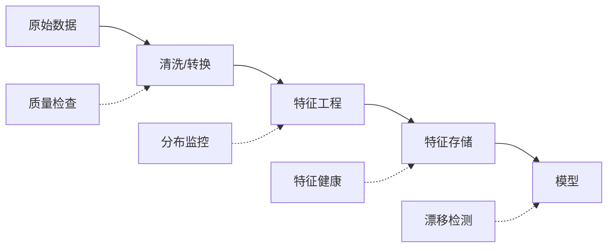
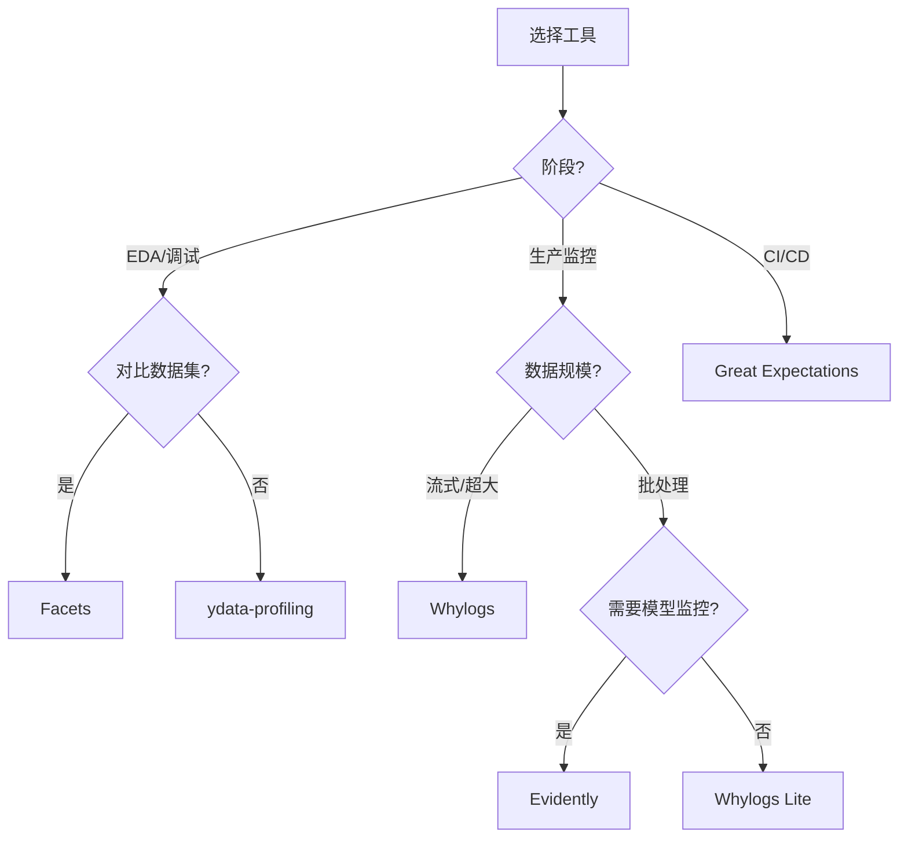

# 数据管道与特征可视化 (Data Pipeline & Feature Visualization)

> 中文简称：数据管道与特征可视化

> **一句话理解**: 数据管道与特征可视化是 ML 系统的"体检报告"——从数据摄入到特征工程再到模型输入，全链路监控数据分布、质量和漂移，确保"垃圾进"不会导致"垃圾出"。

---

## 目录

1. [概述](#1-概述)
2. [核心概念](#2-核心概念)
3. [EDA Dashboard](#3-eda-dashboard)
4. [数据漂移检测可视化](#4-数据漂移检测可视化)
5. [特征分布监控](#5-特征分布监控)
6. [工具对比：Facets/Whylogs/Evidently](#6-工具对比facetswhylogsevidently)
7. [数据质量报告自动化](#7-数据质量报告自动化)
8. [实践代码](#8-实践代码)
9. [最佳实践](#9-最佳实践)
10. [相关概念](#10-相关概念)

---

## 1. 概述

### 1.1 数据问题的代价

| 问题类型 | 占比 | 典型表现 |
|----------|------|----------|
| 数据漂移 | ~35% | 准确率缓慢下降 |
| 数据质量 | ~25% | 缺失值/异常值激增 |
| 特征管道故障 | ~20% | 特征全为0/NaN |
| 标签延迟 | ~10% | 训练标签不完整 |
| 数据泄露 | ~10% | 离线好在线差 |

### 1.2 全链路监控



### 1.3 监控时间尺度

| 尺度 | 内容 | 频率 |
|------|------|------|
| 实时 | Schema 验证、到达率 | 每批 |
| 近实时 | 特征分布、异常值 | 每小时 |
| 周期性 | 漂移、模型衰减 | 每天/周 |

---

## 2. 核心概念

### 2.1 数据漂移类型

- **Covariate Shift**：$P(X)$ 变化，$P(Y|X)$ 不变
- **Concept Drift**：$P(Y|X)$ 变化
- **Prior Shift**：$P(Y)$ 变化（类别比例改变）

### 2.2 检测方法

| 方法 | 适用 | 原理 |
|------|------|------|
| PSI | 单特征 | 分箱后分布距离 |
| KS 检验 | 连续特征 | CDF 最大差异 |
| 卡方检验 | 分类特征 | 频率分布差异 |
| MMD | 多变量 | 核方法 |
| 分类器方法 | 多变量 | 区分两数据集 |

### 2.3 数据质量维度

```
数据质量
├── 完整性 (Completeness): 缺失值比例、必填字段覆盖率
├── 准确性 (Accuracy): 值域合规性、逻辑一致性
├── 一致性 (Consistency): 跨表一致性、时间序列连续性
├── 及时性 (Timeliness): 数据到达延迟、更新频率
└── 唯一性 (Uniqueness): 重复记录比例、主键唯一性
```

### 2.4 特征健康指标

| 指标 | 告警阈值 |
|------|----------|
| 缺失率 | > 5% |
| 零值率突变 | > 50% |
| 均值偏移 | > 2σ |
| PSI | > 0.2 |
| 相关性变化 | |Δρ| > 0.3 |

---

## 3. EDA Dashboard

### 3.1 自动化 EDA

```python
import pandas as pd, numpy as np
import plotly.express as px
from plotly.subplots import make_subplots
import plotly.graph_objects as go

class EDADashboard:
    def __init__(self, df: pd.DataFrame):
        self.df = df
        self.numeric_cols = df.select_dtypes(include=[np.number]).columns.tolist()
        self.categorical_cols = df.select_dtypes(include=['object', 'category']).columns.tolist()
    
    def overview(self):
        """数据概览面板"""
        fig = make_subplots(rows=2, cols=2,
            subplot_titles=['数据类型分布', '缺失值 Top20', '数值特征分布', '相关性热力图'])
        
        # 类型分布
        type_counts = self.df.dtypes.value_counts()
        fig.add_trace(go.Pie(labels=type_counts.index.astype(str),
                            values=type_counts.values), row=1, col=1)
        # 缺失值
        missing = self.df.isnull().mean().sort_values(ascending=False)[:20]
        fig.add_trace(go.Bar(x=missing.index, y=missing.values,
                            marker_color='orange'), row=1, col=2)
        # 小提琴图
        for col in self.numeric_cols[:5]:
            fig.add_trace(go.Violin(y=self.df[col].dropna(), name=col,
                                   box_visible=True), row=2, col=1)
        fig.update_layout(height=800, width=1000, title='EDA 概览', showlegend=False)
        fig.show()
    
    def feature_detail(self, col: str):
        """单特征详细分析"""
        data = self.df[col].dropna()
        fig = make_subplots(rows=1, cols=3,
            subplot_titles=[f'{col} 直方图', f'{col} 箱线图', 'Q-Q 图'])
        fig.add_trace(go.Histogram(x=data, nbinsx=50), row=1, col=1)
        fig.add_trace(go.Box(y=data, name=col), row=1, col=2)
        from scipy import stats
        (osm, osr), (slope, intercept, _) = stats.probplot(data, dist='norm')
        fig.add_trace(go.Scatter(x=osm, y=osr, mode='markers'), row=1, col=3)
        fig.update_layout(height=350, width=1000, title=f'特征: {col}')
        fig.show()
```

### 3.2 ydata-profiling 一键报告

```python
from ydata_profiling import ProfileReport

def generate_eda_report(df, output='eda_report.html'):
    profile = ProfileReport(df, title='数据质量报告', explorative=True,
                           correlations={'pearson': {'calculate': True}})
    profile.to_file(output)
```

---

## 4. 数据漂移检测可视化

### 4.1 PSI 计算与可视化

```python
import numpy as np, plotly.graph_objects as go
from plotly.subplots import make_subplots

def calculate_psi(expected, actual, bins=10):
    """计算 PSI (Population Stability Index)"""
    bp = np.percentile(expected, np.linspace(0, 100, bins + 1))
    bp[0], bp[-1] = -np.inf, np.inf
    exp_pct = (np.histogram(expected, bp)[0] + 1) / (len(expected) + bins)
    act_pct = (np.histogram(actual, bp)[0] + 1) / (len(actual) + bins)
    psi_values = (act_pct - exp_pct) * np.log(act_pct / exp_pct)
    return np.sum(psi_values), psi_values

def visualize_drift(train_data, prod_data, feature):
    """单特征漂移可视化"""
    psi_total, psi_values = calculate_psi(
        train_data[feature].dropna(), prod_data[feature].dropna())
    
    fig = make_subplots(rows=2, cols=1,
        subplot_titles=[f'{feature} 分布对比 (PSI={psi_total:.4f})', '各分箱 PSI 贡献'])
    
    fig.add_trace(go.Histogram(x=train_data[feature], name='训练', opacity=0.6,
                               marker_color='blue', nbinsx=30), row=1, col=1)
    fig.add_trace(go.Histogram(x=prod_data[feature], name='生产', opacity=0.6,
                               marker_color='red', nbinsx=30), row=1, col=1)
    
    colors = ['red' if v > 0.1 else 'orange' if v > 0.05 else 'green' for v in psi_values]
    fig.add_trace(go.Bar(x=[f'Bin{i}' for i in range(len(psi_values))],
                         y=psi_values, marker_color=colors), row=2, col=1)
    fig.add_hline(y=0.1, line_dash='dash', line_color='orange', row=2, col=1)
    fig.add_hline(y=0.25, line_dash='dash', line_color='red', row=2, col=1)
    
    fig.update_layout(height=600, barmode='overlay', title=f'漂移检测: {feature}')
    fig.show()
    
    status = '✅ 无漂移' if psi_total < 0.1 else '⚠️ 中等' if psi_total < 0.25 else '🚨 严重'
    print(f"PSI = {psi_total:.4f} → {status}")
```

### 4.2 多特征漂移总览

```python
def drift_dashboard(train_df, prod_df, features):
    """多特征 PSI 总览"""
    results = [{'feature': f, 'psi': calculate_psi(
        train_df[f].dropna(), prod_df[f].dropna())[0]} for f in features]
    drift_df = pd.DataFrame(results).sort_values('psi', ascending=False)
    
    colors = ['red' if p > 0.25 else 'orange' if p > 0.1 else 'green' for p in drift_df['psi']]
    fig = go.Figure(go.Bar(x=drift_df['psi'], y=drift_df['feature'], orientation='h',
                           marker_color=colors, text=drift_df['psi'].round(4), textposition='auto'))
    fig.add_vline(x=0.1, line_dash='dash', line_color='orange', annotation_text='警告')
    fig.add_vline(x=0.25, line_dash='dash', line_color='red', annotation_text='严重')
    fig.update_layout(title='特征漂移总览 (PSI)', xaxis_title='PSI')
    fig.show()
```

### 4.3 漂移趋势监控

```python
def drift_trend(reference, daily_data_list, feature, window=7):
    """PSI 随时间变化趋势"""
    psi_history = [calculate_psi(reference[feature].dropna(),
                                 daily[feature].dropna())[0]
                   for _, daily in daily_data_list]
    dates = [d for d, _ in daily_data_list]
    psi_smooth = pd.Series(psi_history).rolling(window).mean()
    
    fig = go.Figure()
    fig.add_trace(go.Scatter(x=dates, y=psi_history, mode='markers',
                             name='每日 PSI', marker=dict(size=5, opacity=0.5)))
    fig.add_trace(go.Scatter(x=dates, y=psi_smooth, mode='lines',
                             name=f'{window}日均值', line=dict(width=2)))
    fig.add_hrect(y0=0.1, y1=0.25, fillcolor='orange', opacity=0.1)
    fig.add_hrect(y0=0.25, y1=max(psi_history)*1.1, fillcolor='red', opacity=0.1)
    fig.update_layout(title=f'漂移趋势: {feature}', yaxis_title='PSI')
    fig.show()
```

---

## 5. 特征分布监控

### 5.1 统计量时序监控

```python
def feature_stats_monitor(feature_history: dict):
    """特征均值/缺失率时序监控（含 ±2σ 置信带）"""
    n = len(feature_history)
    fig = make_subplots(rows=n, cols=2, vertical_spacing=0.05,
        subplot_titles=[f'{f} {t}' for f in feature_history for t in ['均值±2σ', '缺失/零值率']])
    
    for i, (feat, stats) in enumerate(feature_history.items(), 1):
        mean, std = np.array(stats['mean']), np.array(stats['std'])
        dates = stats['dates']
        fig.add_trace(go.Scatter(x=dates, y=mean, mode='lines', showlegend=False), row=i, col=1)
        fig.add_trace(go.Scatter(
            x=list(dates)+list(dates[::-1]), y=list(mean+2*std)+list((mean-2*std)[::-1]),
            fill='toself', fillcolor='rgba(100,100,200,0.2)', line=dict(width=0),
            showlegend=False), row=i, col=1)
        fig.add_trace(go.Scatter(x=dates, y=stats['missing_rate'], mode='lines',
                                line=dict(color='red'), showlegend=False), row=i, col=2)
    fig.update_layout(height=250*n, width=1000, title='特征统计量监控')
    fig.show()
```

### 5.2 相关性漂移检测

```python
def correlation_drift_viz(train_corr, prod_corr, feature_names):
    """特征相关性矩阵变化可视化"""
    corr_diff = prod_corr - train_corr
    
    fig = make_subplots(rows=1, cols=3,
        subplot_titles=['训练集相关性', '生产集相关性', '相关性变化'],
        horizontal_spacing=0.05)
    
    for i, matrix in enumerate([train_corr, prod_corr, corr_diff], 1):
        fig.add_trace(go.Heatmap(
            z=matrix.values, x=feature_names, y=feature_names,
            colorscale='RdBu_r' if i == 3 else 'Viridis',
            zmin=-1 if i == 3 else None, zmax=1 if i == 3 else None,
            showscale=(i == 3)), row=1, col=i)
    
    fig.update_layout(width=1500, height=500, title='特征相关性漂移')
    fig.show()
    
    # 报告变化最大的相关性对
    mask = np.triu(np.ones_like(corr_diff, dtype=bool), k=1)
    max_changes = corr_diff.where(~mask).abs().stack().nlargest(5)
    print("相关性变化最大的特征对:")
    print(max_changes)
```

---

## 6. 工具对比：Facets/Whylogs/Evidently

### 6.1 综合对比表

| 维度 | Facets (Google) | Whylogs | Evidently AI |
|------|-----------------|---------|--------------|
| **定位** | 数据集对比探索 | 数据日志/剖析 | 数据/模型监控 |
| **部署** | Jupyter | SDK + SaaS | SDK + SaaS |
| **开源** | ✅ | ✅ | ✅ |
| **实时支持** | ❌ | ✅ 流式 | ⚠️ 批处理 |
| **漂移检测** | ⚠️ 手动 | ✅ 内置 | ✅ 丰富 |
| **数据质量** | ⚠️ 基础 | ✅ 约束 | ✅ 测试套件 |
| **大规模** | ⚠️ 内存限制 | ✅ 近似算法 | ✅ 采样 |
| **学习曲线** | 极低 | 中 | 低 |

### 6.2 选择决策



---

## 7. 数据质量报告自动化

### 7.1 Evidently 报告

```python
from evidently.report import Report
from evidently.metric_preset import DataDriftPreset, DataQualityPreset

def generate_quality_report(reference_df, current_df, output='report.html'):
    """Evidently 数据质量+漂移报告"""
    report = Report(metrics=[DataDriftPreset(), DataQualityPreset()])
    report.run(reference_data=reference_df, current_data=current_df)
    report.save_html(output)
```

### 7.2 Airflow 集成

```python
from airflow import DAG
from airflow.operators.python import PythonOperator
from datetime import datetime, timedelta

def check_data_quality(**context):
    """每日数据质量检查任务"""
    reference = pd.read_parquet('s3://data/reference/train.parquet')
    current = pd.read_parquet(f"s3://data/prod/{context['ds']}/features.parquet")
    
    report = Report(metrics=[DataDriftPreset()])
    report.run(reference_data=reference, current_data=current)
    
    drifted = [m for m in report.as_dict()['metrics']
               if m.get('result', {}).get('drift_detected', False)]
    
    if len(drifted) > len(reference.columns) * 0.3:
        send_alert(f"🚨 {len(drifted)} 个特征漂移")
    
    report.save_html(f's3://reports/{context["ds"]}/drift.html')

dag = DAG('data_quality', schedule_interval='@daily', start_date=datetime(2024, 1, 1))
PythonOperator(task_id='check_quality', python_callable=check_data_quality, dag=dag)
```

### 7.3 Great Expectations 验证

```python
import great_expectations as gx

def setup_validation():
    context = gx.get_context()
    suite = context.add_expectation_suite('feature_quality')
    suite.add_expectation(gx.expectations.ExpectColumnValuesToNotBeNull('user_id', mostly=0.99))
    suite.add_expectation(gx.expectations.ExpectColumnValuesToBeBetween('age', 0, 120))
    suite.add_expectation(gx.expectations.ExpectColumnDistinctValuesToBeInSet(
        'gender', ['M', 'F', 'Other']))
    return suite
```

---

## 8. 实践代码

### 8.1 完整数据监控器

```python
from dataclasses import dataclass
from typing import List, Dict

@dataclass
class DataQualityReport:
    timestamp: str
    total_rows: int
    drift_scores: Dict[str, float]
    alerts: List[str]
    status: str  # 'healthy' | 'warning' | 'critical'

class DataMonitor:
    def __init__(self, reference_df, numeric_features):
        self.reference = reference_df
        self.features = numeric_features
        self.ref_stats = {f: {'mean': reference_df[f].mean(), 'std': reference_df[f].std()}
                         for f in numeric_features}
        self.history: List[DataQualityReport] = []
    
    def check_batch(self, batch_df, timestamp):
        alerts = []
        drift_scores = {}
        
        for feat in self.features:
            # 缺失率
            miss = batch_df[feat].isnull().mean()
            if miss > 0.05:
                alerts.append(f"⚠️ {feat} 缺失率 {miss:.1%}")
            # PSI 漂移
            psi, _ = calculate_psi(self.reference[feat].dropna(), batch_df[feat].dropna())
            drift_scores[feat] = psi
            if psi > 0.25:
                alerts.append(f"🚨 {feat} 严重漂移 PSI={psi:.3f}")
            elif psi > 0.1:
                alerts.append(f"⚠️ {feat} 中等漂移 PSI={psi:.3f}")
        
        critical = sum(1 for a in alerts if '🚨' in a)
        status = 'critical' if critical > 0 else 'warning' if len(alerts) > 3 else 'healthy'
        
        report = DataQualityReport(timestamp, len(batch_df), drift_scores, alerts, status)
        self.history.append(report)
        return report
```

### 8.2 Facets 对比

```python
from facets_overview.feature_statistics_generator import FeatureStatisticsGenerator
import base64
from IPython.core.display import display, HTML

def facets_compare(df_train, df_test):
    fsg = FeatureStatisticsGenerator()
    cproto = fsg.ProtoFromDataFrames([
        {'name': '训练集', 'table': df_train},
        {'name': '测试集', 'table': df_test}])
    protostr = base64.b64encode(cproto.SerializeToString()).decode('utf-8')
    html = f'''<script src="https://cdnjs.cloudflare.com/ajax/libs/webcomponentsjs/1.3.3/webcomponents-lite.js"></script>
    <link rel="import" href="https://raw.githubusercontent.com/PAIR-code/facets/1.0.0/facets-dist/facets-jupyter.html">
    <facets-overview protoInput="{protostr}"></facets-overview>'''
    display(HTML(html))
```

---

## 9. 最佳实践

### 9.1 监控分层

| 层级 | 检查 | 频率 | 响应 |
|------|------|------|------|
| L0: Schema | 字段/类型 | 每批 | 立即阻断 |
| L1: 质量 | 缺失/值域 | 每批 | 5min |
| L2: 分布 | PSI/KS | 每小时 | 1h |
| L3: 漂移 | 多变量 | 每天 | 24h |
| L4: 性能 | 模型指标 | 每周 | 计划内 |

### 9.2 告警原则

1. **分级**：Info → Warning → Critical → Emergency
2. **避免疲劳**：合并同类、设静默期
3. **可操作**：包含"下一步做什么"
4. **上下文**：附带图表和历史对比

### 9.3 常见错误

| 错误 | 正确做法 |
|------|----------|
| 只监控模型指标 | 从数据源开始监控 |
| 阈值太严 | 基于历史设动态阈值 |
| 不做参考基线 | 保存训练数据统计量 |
| 忽略分类特征 | 监控基数变化 |
| 报告无人看 | 集成工作流+告警 |

---

## 10. 相关概念

- [[94_可视化/02_训练可视化/07_训练_监控_可视化]] — 训练过程监控
- [[94_可视化/02_训练可视化/03_实验追踪_可视化]] — 实验追踪可视化
- [[Embedding_Visualization_Guide]] — 嵌入空间可视化
- [[94_可视化/01_最佳实践/04_Visualization_简明指南]] — 注意力可视化
- [[Inference_Serving_Visualization]] — 推理服务监控
- [[94_可视化/01_最佳实践/04_Visualization_简明指南]] — 评估指标可视化
- [[AI_System_Dashboard]] — AI 系统仪表盘
- [[Data_Visualization_Best_Practices]] — 数据可视化最佳实践

---

## 参考资源

| 资源 | 说明 |
|------|------|
| Evidently AI | https://docs.evidentlyai.com |
| Whylogs | https://whylogs.readthedocs.io |
| Facets | https://github.com/PAIR-code/facets |
| Great Expectations | https://greatexpectations.io |
| ydata-profiling | https://github.com/ydataai/ydata-profiling |
