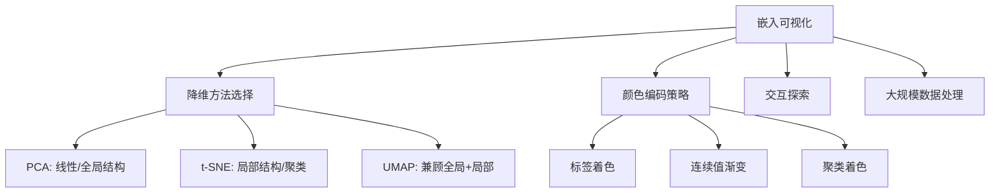
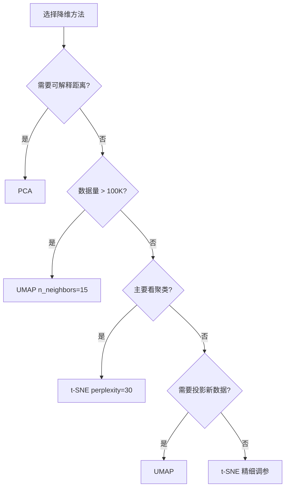

# 嵌入可视化 (Embedding Visualization Guide)

> 中文简称：嵌入可视化

> **一句话理解**: 嵌入可视化是将高维向量空间"降维投影"到2D/3D平面的艺术——让你亲眼看到语义相似性、聚类结构和模型学到的知识几何。

---

## 目录

1. [概述](#1-概述)
2. [核心概念：降维三巨头](#2-核心概念降维三巨头)
3. [t-SNE 深度解析](#3-t-sne-深度解析)
4. [UMAP 深度解析](#4-umap-深度解析)
5. [PCA 深度解析](#5-pca-深度解析)
6. [三者对比与选择](#6-三者对比与选择)
7. [TensorBoard Embedding Projector](#7-tensorboard-embedding-projector)
8. [聚类可视化](#8-聚类可视化)
9. [词向量空间可视化](#9-词向量空间可视化)
10. [多模态嵌入投影](#10-多模态嵌入投影)
11. [实践代码](#11-实践代码)
12. [最佳实践](#12-最佳实践)
13. [相关概念](#13-相关概念)

---

## 1. 概述

### 1.1 为什么需要嵌入可视化

嵌入（Embedding）将文本、图像、音频映射到高维向量空间。人类无法直接理解 768 维空间，降维可视化成为理解模型表示的关键手段。

| 应用场景 | 可视化目标 | 典型工具 |
|----------|-----------|----------|
| NLP 语义分析 | 词/句向量聚类结构 | t-SNE, UMAP |
| 图像检索评估 | 视觉相似性分布 | PCA, UMAP |
| 模型调试 | 类别分离度 | t-SNE + 标签着色 |
| 多模态对齐 | 跨模态嵌入空间 | UMAP 3D |
| RAG 质量评估 | 文档块聚类与重叠 | UMAP + HDBSCAN |

### 1.2 核心问题框架



---

## 2. 核心概念：降维三巨头

### 2.1 降维的本质

将高维数据 $\mathbf{x} \in \mathbb{R}^D$ 映射到低维 $\mathbf{y} \in \mathbb{R}^d$（$d=2$ 或 $3$），保留原始空间结构。

**核心权衡**：全局结构 vs 局部结构、距离保真 vs 拓扑保真、确定性 vs 随机性。

### 2.2 流形假设

高维数据实际分布在低维流形上，降维就是"展开"这个流形：

```
高维空间 (768D)          低维投影 (2D)
┌─────────────────┐      ┌──────────────┐
│  ● ● ●  类别A   │ ──→  │   ●●●  A    │
│       ○ ○ ○ B   │      │    ○○○  B    │
└─────────────────┘      └──────────────┘
```

---

## 3. t-SNE 深度解析

### 3.1 算法原理

t-SNE（t-distributed Stochastic Neighbor Embedding）由 van der Maaten & Hinton 于 2008 年提出。

**核心思想**：将高维点对相似度转为条件概率，在低维空间最小化 KL 散度。

**步骤分解**：

1. **高维空间**：计算条件概率（高斯分布）
$$p_{j|i} = \frac{\exp(-\|x_i - x_j\|^2 / 2\sigma_i^2)}{\sum_{k \neq i} \exp(-\|x_i - x_k\|^2 / 2\sigma_i^2)}$$

2. **低维空间**：使用 Student-t 分布（自由度=1，即 Cauchy 分布）
$$q_{ij} = \frac{(1 + \|y_i - y_j\|^2)^{-1}}{\sum_{k \neq l}(1 + \|y_k - y_l\|^2)^{-1}}$$

3. **优化**：最小化 $KL(P \| Q) = \sum_{i \neq j} p_{ij} \log \frac{p_{ij}}{q_{ij}}$

**为什么用 t 分布？** 低维空间的"拥挤问题"——t 分布的长尾让不相似的点可以被推得更远。

### 3.2 关键超参数

| 超参数 | 默认值 | 影响 | 调参建议 |
|--------|--------|------|----------|
| `perplexity` | 30 | 有效邻居数 | 5-50，大数据用50-100 |
| `learning_rate` | 200 | 优化步长 | 数据量/12 到 /4 |
| `n_iter` | 1000 | 迭代次数 | 复杂数据2000+ |
| `init` | 'random' | 初始化 | 'pca' 更稳定 |

### 3.3 t-SNE 的陷阱

> ⚠️ 聚类间**距离无意义**；不同 perplexity 产生**完全不同布局**；聚类**大小无意义**；每次运行结果不同。

---

## 4. UMAP 深度解析

### 4.1 算法原理

UMAP（Uniform Manifold Approximation and Projection）由 Leland McInnes 于 2018 年提出，基于黎曼几何和代数拓扑理论。

**核心步骤**：
1. 构建高维空间的**模糊拓扑表示**（Fuzzy Simplicial Set）
2. 构建低维空间的对应拓扑结构
3. 优化两个拓扑之间的**交叉熵**（而非 KL 散度）

**与 t-SNE 的关键区别**：
- 使用**局部连通性**假设而非高斯邻域
- 低维使用**参数化族**而非固定 t 分布
- 优化**交叉熵**（对称性更好，全局结构保留更佳）
- 支持 `transform()` 投影新数据（t-SNE 不支持）

### 4.2 UMAP 的优势

- 保留更多全局结构（如 MNIST 数字的连续过渡）
- 速度更快（$O(n^{1.14})$ vs t-SNE 的 $O(n \log n)$）
- 支持新数据投影
- 超参数更直观（n_neighbors 直接对应邻域大小）

### 4.3 关键超参数

| 超参数 | 默认值 | 影响 |
|--------|--------|------|
| `n_neighbors` | 15 | 小值→局部，大值→全局 |
| `min_dist` | 0.1 | 小值→紧密聚类，大值→均匀 |
| `metric` | 'euclidean' | cosine 用于文本 |

```python
import umap
reducer = umap.UMAP(n_neighbors=15, min_dist=0.1, metric='cosine', random_state=42)
embedding_2d = reducer.fit_transform(high_dim_embeddings)
```

---

## 5. PCA 深度解析

### 5.1 原理与适用场景

PCA 通过正交变换找方差最大方向：$C = \frac{1}{n}X^TX$，特征值分解取前 $d$ 个特征向量。

| 场景 | 适合度 | 原因 |
|------|--------|------|
| 初步探索/去噪 | ⭐⭐⭐⭐⭐ | 快速、确定性 |
| 非线性流形 | ⭐⭐ | 线性方法局限 |
| 实时/在线降维 | ⭐⭐⭐⭐ | 增量PCA支持流式 |

```python
from sklearn.decomposition import PCA
pca = PCA(n_components=50)
pca.fit(embeddings)
# 方差解释率决定保留维度数
print(f"前50维解释方差: {pca.explained_variance_ratio_.sum():.2%}")
```

---

## 6. 三者对比与选择

### 6.1 综合对比表

| 维度 | PCA | t-SNE | UMAP |
|------|-----|-------|------|
| **类型** | 线性 | 非线性 | 非线性 |
| **保留结构** | 全局（方差） | 局部（邻域） | 全局+局部 |
| **时间复杂度** | $O(nD^2)$ | $O(n \log n)$ | $O(n^{1.14})$ |
| **确定性** | ✅ | ❌ | ❌（可固定种子） |
| **新数据投影** | ✅ | ❌ | ✅ |
| **距离可解释性** | ✅ | ❌ | ⚠️ 部分 |
| **大规模数据** | ✅ 百万级 | ⚠️ 万级 | ✅ 十万级 |

### 6.2 选择决策树



### 6.3 组合策略（推荐）

```python
# PCA 预降维 → UMAP 精细投影
from sklearn.decomposition import PCA
import umap

pca = PCA(n_components=50, random_state=42)
embeddings_pca = pca.fit_transform(embeddings)  # (N, 768) → (N, 50)

reducer = umap.UMAP(n_neighbors=15, min_dist=0.1, random_state=42)
embeddings_2d = reducer.fit_transform(embeddings_pca)  # (N, 50) → (N, 2)
```

---

## 7. TensorBoard Embedding Projector

### 7.1 基本使用

```python
from torch.utils.tensorboard import SummaryWriter

writer = SummaryWriter('runs/embedding_demo')
writer.add_embedding(
    mat=embeddings,           # (N, 768)
    metadata=metadata,        # [[text, label], ...]
    label_img=images,         # 可选：图像缩略图
    tag='text_embeddings'
)
writer.close()
# 启动: tensorboard --logdir=runs/embedding_demo --port=6006
```

### 7.2 交互功能

- **搜索**：输入关键词高亮相关点
- **选择**：拖拽框选子集查看统计
- **着色**：按标签/自定义列着色
- **距离**：点击一个点查看最近邻
- **投影**：切换 PCA/t-SNE/自定义

---

## 8. 聚类可视化

```python
import umap, hdbscan
import plotly.express as px
import pandas as pd, numpy as np

def visualize_clusters(embeddings, texts, min_cluster_size=15):
    """嵌入聚类可视化完整流程"""
    # UMAP 降维
    coords = umap.UMAP(n_neighbors=15, min_dist=0.0, random_state=42
                       ).fit_transform(embeddings)
    # HDBSCAN 聚类
    clusterer = hdbscan.HDBSCAN(min_cluster_size=min_cluster_size, min_samples=5)
    cluster_labels = clusterer.fit_predict(coords)
    
    df = pd.DataFrame({
        'x': coords[:, 0], 'y': coords[:, 1],
        'cluster': cluster_labels.astype(str),
        'text': [t[:80] for t in texts],
        'probability': clusterer.probabilities_
    })
    
    fig = px.scatter(df, x='x', y='y', color='cluster',
                     hover_data=['text', 'probability'],
                     title=f'发现 {len(set(cluster_labels)) - (1 if -1 in cluster_labels else 0)} 个簇',
                     opacity=0.7)
    fig.update_traces(marker=dict(size=5))
    fig.show()
    return df, cluster_labels
```

---

## 9. 词向量空间可视化

```python
import plotly.graph_objects as go
from gensim.models import KeyedVectors
from sklearn.decomposition import PCA
import numpy as np

def visualize_word_analogy(wv, word_pairs):
    """词向量类比关系可视化: king - man + woman ≈ queen"""
    words = [w for pair in word_pairs for w in pair]
    vectors = np.array([wv[w] for w in words])
    coords = PCA(n_components=2).fit_transform(vectors)
    
    fig = go.Figure()
    for i, word in enumerate(words):
        fig.add_annotation(x=coords[i, 0], y=coords[i, 1],
                          text=word, showarrow=False, font=dict(size=14))
    
    colors = ['#FF6B6B', '#4ECDC4', '#45B7D1', '#96CEB4']
    for idx, (w1, w2) in enumerate(word_pairs):
        i1, i2 = words.index(w1), words.index(w2)
        fig.add_annotation(x=coords[i2, 0], y=coords[i2, 1],
                          ax=coords[i1, 0], ay=coords[i1, 1],
                          showarrow=True, arrowhead=2,
                          arrowcolor=colors[idx % len(colors)])
    
    fig.update_layout(title='词向量类比关系', showlegend=False)
    fig.show()
```

---

## 10. 多模态嵌入投影

```python
import torch, clip
import umap, plotly.express as px
import pandas as pd, numpy as np
from PIL import Image

def visualize_multimodal_embeddings(image_paths, texts, model_name='ViT-B/32'):
    """CLIP 多模态嵌入空间可视化"""
    device = 'cuda' if torch.cuda.is_available() else 'cpu'
    model, preprocess = clip.load(model_name, device=device)
    
    images = torch.stack([preprocess(Image.open(p)) for p in image_paths]).to(device)
    text_tokens = clip.tokenize(texts).to(device)
    
    with torch.no_grad():
        img_feat = model.encode_image(images).cpu().numpy()
        txt_feat = model.encode_text(text_tokens).cpu().numpy()
    
    all_feat = np.concatenate([img_feat, txt_feat])
    all_feat /= np.linalg.norm(all_feat, axis=1, keepdims=True)  # L2 归一化
    
    coords = umap.UMAP(n_neighbors=10, min_dist=0.1, metric='cosine',
                       random_state=42).fit_transform(all_feat)
    
    n_img = len(image_paths)
    df = pd.DataFrame({
        'x': coords[:, 0], 'y': coords[:, 1],
        'modality': ['图像'] * n_img + ['文本'] * len(texts),
        'content': [p.split('/')[-1] for p in image_paths] + texts
    })
    
    fig = px.scatter(df, x='x', y='y', color='modality', symbol='modality',
                     hover_data=['content'], title='CLIP 多模态嵌入空间',
                     color_discrete_map={'图像': '#FF6B6B', '文本': '#4ECDC4'})
    fig.show()
```

---

## 11. 实践代码

### 11.1 Plotly 交互式可视化

```python
import plotly.express as px
import pandas as pd, numpy as np, umap

def interactive_embedding_viz(embeddings, labels, texts, method='umap', **kwargs):
    """生产级交互式嵌入可视化"""
    if method == 'umap':
        reducer = umap.UMAP(n_neighbors=kwargs.get('n_neighbors', 15),
                           min_dist=kwargs.get('min_dist', 0.1),
                           metric='cosine', random_state=42)
    else:
        from sklearn.manifold import TSNE
        reducer = TSNE(n_components=2, perplexity=kwargs.get('perplexity', 30),
                      random_state=42, init='pca')
    
    coords = reducer.fit_transform(embeddings)
    df = pd.DataFrame({'x': coords[:, 0], 'y': coords[:, 1],
                       'label': labels, 'text': [t[:100] for t in texts]})
    
    fig = px.scatter(df, x='x', y='y', color='label', hover_data=['text'],
                     title=f'嵌入空间 ({method.upper()})', opacity=0.7,
                     width=1000, height=700)
    fig.update_traces(marker=dict(size=6))
    fig.write_html('embedding_visualization.html')
    fig.show()
    return fig, df
```

### 11.2 Altair 声明式可视化

```python
import altair as alt
import pandas as pd, numpy as np, umap

def altair_embedding_viz(embeddings, labels, texts, sample_size=5000):
    """Altair 可视化（适合大规模数据的采样展示）"""
    if len(embeddings) > sample_size:
        idx = np.random.choice(len(embeddings), sample_size, replace=False)
        embeddings, labels = embeddings[idx], [labels[i] for i in idx]
        texts = [texts[i] for i in idx]
    
    coords = umap.UMAP(n_neighbors=15, min_dist=0.1, random_state=42
                       ).fit_transform(embeddings)
    df = pd.DataFrame({'x': coords[:, 0], 'y': coords[:, 1],
                       'label': labels, 'text': [t[:80] for t in texts]})
    
    brush = alt.selection_interval()
    points = alt.Chart(df).mark_circle(size=30, opacity=0.6).encode(
        x=alt.X('x:Q', axis=None), y=alt.Y('y:Q', axis=None),
        color=alt.condition(brush, 'label:N', alt.value('lightgray')),
        tooltip=['text:N', 'label:N']
    ).properties(width=600, height=500).add_params(brush)
    
    return points
```

### 11.3 GPU 加速大规模可视化

```python
def gpu_embedding_viz(embeddings, n_samples=100000):
    """cuML GPU 加速降维"""
    try:
        from cuml import UMAP as cuUMAP
        from cuml.decomposition import PCA as cuPCA
        import cupy as cp
        
        if len(embeddings) > n_samples:
            idx = np.random.choice(len(embeddings), n_samples, replace=False)
            embeddings = embeddings[idx]
        
        emb_gpu = cp.asarray(embeddings)
        reduced = cuPCA(n_components=50).fit_transform(emb_gpu)
        coords = cp.asnumpy(cuUMAP(n_neighbors=15, min_dist=0.1,
                                    random_state=42).fit_transform(reduced))
    except ImportError:
        from sklearn.decomposition import PCA
        import umap
        reduced = PCA(n_components=50, random_state=42).fit_transform(embeddings)
        coords = umap.UMAP(n_neighbors=15, min_dist=0.1,
                          random_state=42).fit_transform(reduced)
    return coords
```

---

## 12. 最佳实践

### 12.1 方法选择速查

| 场景 | 推荐 | 关键参数 |
|------|------|----------|
| 快速探索 | PCA | n_components=2 |
| 聚类发现 | UMAP | min_dist=0.0 |
| 精细局部结构 | t-SNE | perplexity=30, init='pca' |
| 全局拓扑 | UMAP | n_neighbors=50 |
| 超大规模 | PCA→UMAP(GPU) | cuML |

### 12.2 常见错误

```python
# ❌ 直接在高维空间做 t-SNE（太慢）
# ✅ 先 PCA 降到 50 维再 t-SNE

# ❌ 用 t-SNE 结果做下游聚类
# ✅ 在原始/PCA 空间聚类，t-SNE 仅做可视化着色

# ❌ 不固定随机种子
# ✅ 始终设置 random_state=42 确保可复现
```

### 12.3 设计原则

1. **标注方法**：标题必须说明降维方法
2. **多方法验证**：PCA + UMAP + t-SNE 交叉验证
3. **颜色有意义**：用标签/聚类着色
4. **悬停信息**：交互图必须含原文/ID
5. **避免过度解读**：t-SNE 簇间距离无意义
6. **性能**：>10K 先 PCA；>50K 用 WebGL 渲染

---

## 13. 相关概念

- [[94_可视化/02_训练可视化/07_训练_监控_可视化]] — 训练过程指标监控
- [[Model_Interpretability_Visualization]] — 模型可解释性方法总览
- [[94_可视化/01_最佳实践/04_Visualization_简明指南]] — 注意力机制可视化
- [[Data_Pipeline_Feature_Visualization]] — 特征分布与数据质量可视化
- [[94_可视化/01_最佳实践/04_Visualization_简明指南]] — 网络结构与激活可视化
- [[94_可视化/02_训练可视化/03_实验追踪_可视化]] — 实验追踪与对比
- [[Inference_Serving_Visualization]] — 推理服务监控

---

## 参考资源

| 资源 | 说明 |
|------|------|
| t-SNE 原论文 | van der Maaten & Hinton, 2008 |
| UMAP 原论文 | McInnes et al., 2018 |
| TensorBoard Projector | https://projector.tensorflow.org |
| Distill.pub t-SNE 指南 | https://distill.pub/2016/misread-tsne |
| CLIP 论文 | OpenAI, Radford et al., 2021 |
