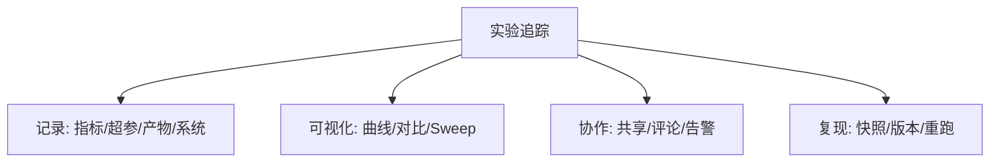
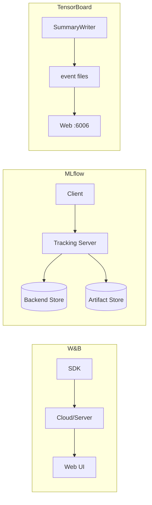
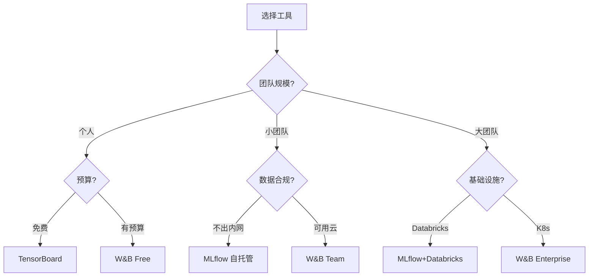

# 实验追踪可视化 (Experiment Tracking Visualization)

> 中文简称：实验追踪可视化

> **一句话理解**: 实验追踪可视化是 ML 团队的"实验笔记本+仪表盘"——自动记录每次训练的超参、指标、产物，并通过交互式面板让数百次实验可对比、可复现、可协作。

---

## 目录

1. [概述](#1-概述)
2. [核心概念](#2-核心概念)
3. [四大平台对比](#3-四大平台对比)
4. [超参搜索可视化](#4-超参搜索可视化)
5. [Run 对比](#5-run-对比)
6. [Sweep 面板](#6-sweep-面板)
7. [团队协作 Dashboard](#7-团队协作-dashboard)
8. [选型指南](#8-选型指南)
9. [实践代码](#9-实践代码)
10. [最佳实践](#10-最佳实践)
11. [相关概念](#11-相关概念)

---

## 1. 概述

### 1.1 为什么需要实验追踪

| 痛点 | 没有追踪 | 有追踪后 |
|------|----------|----------|
| "上次好结果用什么参数？" | 翻记录/凭记忆 | 一键查看配置 |
| "这次比上次好吗？" | 手动对比日志 | 自动叠加曲线 |
| "200组超参哪些有效？" | Excel 整理 | 平行坐标图 |
| "同事能复现吗？" | 环境不明 | 完整 Run 快照 |

### 1.2 核心组件



---

## 2. 核心概念

### 2.1 基本术语

| 术语 | 含义 | 示例 |
|------|------|------|
| **Run** | 一次训练/评估执行 | 训练 ResNet-50 |
| **Project** | 相关 Run 集合 | "ImageNet 实验" |
| **Sweep** | 超参搜索（多 Run） | Grid Search lr×bs |
| **Artifact** | 训练产物 | best_model.pt |
| **Config** | 超参配置 | {lr: 0.001, bs: 32} |

### 2.2 实验追踪 vs 模型版本控制

- **实验追踪**：记录训练过程、对比实验、超参搜索（W&B/MLflow/Neptune）
- **模型注册**：管理模型生命周期、版本标记、部署审批（MLflow Registry/W&B Models）

---

## 3. 四大平台对比

### 3.1 综合对比表

| 维度 | W&B | MLflow | TensorBoard | Neptune.ai |
|------|-----|--------|-------------|------------|
| **部署** | SaaS/私有化 | 开源自托管 | 本地 | SaaS/私有化 |
| **价格** | 免费额度+付费 | 完全免费 | 完全免费 | 免费额度+付费 |
| **UI 质量** | ⭐⭐⭐⭐⭐ | ⭐⭐⭐ | ⭐⭐⭐ | ⭐⭐⭐⭐ |
| **超参搜索** | ✅ 强大 | ⚠️ 基础 | ❌ | ✅ 强大 |
| **模型注册** | ✅ | ✅ | ❌ | ✅ |
| **协作** | ⭐⭐⭐⭐⭐ | ⭐⭐ | ⭐ | ⭐⭐⭐⭐ |
| **大规模 Run** | ✅ 万级 | ⚠️ 千级 | ⚠️ 百级 | ✅ 万级 |
| **离线支持** | ⚠️ 需同步 | ✅ 本地 | ✅ 本地 | ⚠️ 需同步 |
| **学习曲线** | 低 | 中 | 极低 | 低 |

### 3.2 各平台核心优势

- **W&B**：最美 UI、Sweeps 最强、Reports 适合汇报、集成最广
- **MLflow**：完全开源、数据不出内网、Databricks 生态
- **TensorBoard**：零配置、TF/PyTorch 原生、Embedding Projector
- **Neptune**：元数据管理强、对比细致、企业级权限

### 3.3 架构差异



### 3.4 集成生态对比

| 框架 | W&B | MLflow | TensorBoard | Neptune |
|------|-----|--------|-------------|---------|
| PyTorch | ✅ 原生 | ✅ | ✅ | ✅ |
| TensorFlow | ✅ | ✅ | ✅ 原生 | ✅ |
| JAX/Flax | ✅ | ⚠️ | ⚠️ | ✅ |
| HuggingFace | ✅ 深度 | ✅ | ✅ | ✅ |
| PyTorch Lightning | ✅ 回调 | ✅ | ✅ | ✅ |
| scikit-learn | ✅ | ✅ 原生 | ⚠️ | ✅ |
| XGBoost/LightGBM | ✅ | ✅ | ⚠️ | ✅ |

---

## 4. 超参搜索可视化

### 4.1 搜索方法对比

| 方法 | 效率 | 适用场景 |
|------|------|----------|
| Grid Search | 低 | 参数少（<3） |
| Random Search | 中 | 参数多 |
| Bayesian (TPE) | 高 | 昂贵实验 |
| Hyperband | 高 | 训练成本高 |

### 4.2 平行坐标图

```python
import plotly.express as px
import pandas as pd, numpy as np

def plot_parallel_coordinates(sweep_results):
    """超参搜索平行坐标图"""
    df = pd.DataFrame(sweep_results)
    fig = px.parallel_coordinates(
        df, dimensions=['learning_rate', 'batch_size', 'num_layers', 
                        'dropout', 'val_accuracy'],
        color='val_accuracy', color_continuous_scale='RdYlGn',
        title='超参搜索平行坐标图')
    fig.show()
```

### 4.3 超参重要性分析

```python
from sklearn.ensemble import RandomForestRegressor
import plotly.graph_objects as go

def plot_param_importance(sweep_results, target='val_accuracy'):
    """基于随机森林的超参重要性"""
    df = pd.DataFrame(sweep_results)
    param_cols = ['learning_rate', 'batch_size', 'num_layers', 'dropout']
    rf = RandomForestRegressor(n_estimators=100, random_state=42)
    rf.fit(df[param_cols], df[target])
    
    fig = go.Figure(go.Bar(
        x=rf.feature_importances_, y=param_cols, orientation='h',
        marker_color=['#FF6B6B', '#4ECDC4', '#45B7D1', '#96CEB4']))
    fig.update_layout(title=f'超参对 {target} 的重要性', xaxis_title='Gini Importance')
    fig.show()
```

### 4.4 2D 超参景观

```python
import plotly.graph_objects as go
from scipy.interpolate import griddata

def plot_param_landscape(df, px='learning_rate', py='batch_size', metric='val_accuracy'):
    """两个超参的性能景观 3D 曲面"""
    x, y, z = np.log10(df[px]), df[py], df[metric]
    xi = np.linspace(x.min(), x.max(), 50)
    yi = np.linspace(y.min(), y.max(), 50)
    xi, yi = np.meshgrid(xi, yi)
    zi = griddata((x, y), z, (xi, yi), method='cubic')
    
    fig = go.Figure(go.Surface(x=10**xi, y=yi, z=zi, colorscale='Viridis', opacity=0.8))
    fig.add_trace(go.Scatter3d(x=df[px], y=df[py], z=df[metric],
                               mode='markers', marker=dict(size=4, color='red')))
    fig.update_layout(title=f'{px} × {py} → {metric}')
    fig.show()
```

---

## 5. Run 对比

### 5.1 多 Run 指标对比

```python
import wandb, plotly.graph_objects as go

def compare_runs(project, run_ids, metric='val_loss'):
    """W&B 多 Run 指标对比"""
    api = wandb.Api()
    fig = go.Figure()
    for run_id in run_ids:
        run = api.run(f"{project}/{run_id}")
        history = run.history(keys=[metric, '_step'])
        fig.add_trace(go.Scatter(
            x=history['_step'], y=history[metric],
            mode='lines', name=f"{run.name} (lr={run.config.get('lr')})", opacity=0.8))
    fig.update_layout(title=f'Run 对比: {metric}', xaxis_title='Step', yaxis_title=metric)
    fig.show()
```

### 5.2 本地日志对比

```python
def compare_runs_local(run_logs, metric='loss'):
    """从本地日志对比（无需 W&B）"""
    fig = go.Figure()
    for name, data in run_logs.items():
        fig.add_trace(go.Scatter(x=data['steps'], y=data[metric],
                                mode='lines', name=name, opacity=0.8))
    fig.update_layout(title=f'实验对比: {metric}', template='plotly_white')
    fig.show()
```

### 5.3 Run 对比摘要表

```python
def create_comparison_table(runs_info):
    """创建 Run 对比摘要表"""
    df = pd.DataFrame(runs_info)
    fig = go.Figure(data=[go.Table(
        header=dict(values=['Run', 'LR', 'Batch Size', 'Epochs', 'Val Acc', 'Val Loss'],
                   fill_color='#4ECDC4', font=dict(size=12, color='white')),
        cells=dict(values=[df['name'], df['lr'], df['batch_size'],
                          df['epochs'], df['val_accuracy'], df['val_loss']],
                  fill_color='white', font=dict(size=11)))])
    fig.update_layout(title='实验对比摘要')
    fig.show()
```

---

## 6. Sweep 面板

### 6.1 W&B Sweep 配置

```python
import wandb

sweep_config = {
    'method': 'bayes',
    'metric': {'name': 'val_accuracy', 'goal': 'maximize'},
    'parameters': {
        'learning_rate': {'distribution': 'log_uniform_values', 'min': 1e-5, 'max': 1e-2},
        'batch_size': {'values': [16, 32, 64, 128]},
        'num_layers': {'values': [2, 4, 6, 8]},
        'dropout': {'distribution': 'uniform', 'min': 0.0, 'max': 0.5},
    },
    'early_terminate': {'type': 'hyperband', 'min_iter': 5, 'eta': 3}
}

sweep_id = wandb.sweep(sweep_config, project='my-project')

def train():
    wandb.init()
    config = wandb.config
    for epoch in range(100):
        loss = train_epoch(config.learning_rate, config.batch_size)
        wandb.log({'train_loss': loss, 'val_accuracy': evaluate(), 'epoch': epoch})

wandb.agent(sweep_id, function=train, count=50)
```

### 6.2 Sweep 结果可视化

```python
def visualize_sweep(sweep_id):
    """Sweep 搜索结果面板"""
    api = wandb.Api()
    sweep = api.sweep(sweep_id)
    data = [{'val_accuracy': r.summary.get('val_accuracy'), **r.config}
            for r in sweep.runs if r.state == 'finished']
    df = pd.DataFrame(data)
    
    fig = px.scatter(df, x='learning_rate', y='val_accuracy',
                     size='batch_size', color='val_accuracy',
                     log_x=True, title='Sweep 结果', color_continuous_scale='Viridis')
    fig.show()
```

---

## 7. 团队协作 Dashboard

### 7.1 受众分层

| 受众 | 关注指标 | 频率 | 展示 |
|------|----------|------|------|
| ML 工程师 | Loss、超参、梯度 | 实时 | 交互面板 |
| Tech Lead | 最佳 Run、资源 | 每日 | 摘要报告 |
| 产品经理 | 模型性能、上线状态 | 每周 | 简洁仪表盘 |
| 管理层 | ROI、GPU 成本 | 每月 | 趋势图 |

### 7.2 Prometheus 导出（MLflow 后端）

```python
from prometheus_client import Gauge, start_http_server
import mlflow, time

ml_accuracy = Gauge('ml_model_accuracy', 'Val accuracy', ['run_name'])
ml_loss = Gauge('ml_model_loss', 'Train loss', ['run_name'])

def export_to_prometheus(experiment_name, port=8000):
    """MLflow 指标实时导出到 Prometheus → Grafana"""
    start_http_server(port)
    client = mlflow.tracking.MlflowClient()
    exp = client.get_experiment_by_name(experiment_name)
    while True:
        for run in client.search_runs([exp.experiment_id], "status = 'RUNNING'"):
            m = client.get_run(run.info.run_id).data.metrics
            ml_accuracy.labels(run.info.run_id[:8]).set(m.get('val_accuracy', 0))
            ml_loss.labels(run.info.run_id[:8]).set(m.get('train_loss', 0))
        time.sleep(30)
```

---

## 8. 选型指南

### 8.1 决策树



### 8.2 场景推荐

| 场景 | 推荐 | 理由 |
|------|------|------|
| 学术论文 | W&B Free / TensorBoard | 免费、可分享 |
| 企业内网 | MLflow 自托管 | 数据不出网 |
| 大规模超参搜索 | W&B Sweeps | 算法+可视化最强 |
| 快速原型 | TensorBoard | 零配置 |
| CI/CD 集成 | MLflow | API 友好、开源 |

---

## 9. 实践代码

### 9.1 PyTorch + W&B 完整集成

```python
import torch, wandb

def train_with_wandb(config=None):
    wandb.init(project='image-classification', config=config or {
        'architecture': 'resnet18', 'learning_rate': 0.001,
        'batch_size': 64, 'epochs': 50, 'optimizer': 'adamw'})
    config = wandb.config
    
    model = create_model(config.architecture)
    wandb.watch(model, log='all', log_freq=100)
    optimizer = torch.optim.AdamW(model.parameters(), lr=config.learning_rate)
    
    best_acc = 0
    for epoch in range(config.epochs):
        train_loss = train_epoch(model, optimizer)
        val_acc = evaluate(model)
        wandb.log({'train/loss': train_loss, 'val/accuracy': val_acc, 'epoch': epoch})
        
        if val_acc > best_acc:
            best_acc = val_acc
            torch.save(model.state_dict(), 'best_model.pt')
            wandb.save('best_model.pt')
    
    wandb.summary['best_val_accuracy'] = best_acc
    wandb.finish()
```

### 9.2 MLflow 集成

```python
import mlflow, mlflow.pytorch

def train_with_mlflow(config):
    mlflow.set_experiment('image-classification')
    with mlflow.start_run(run_name=f"resnet18_lr{config['lr']}"):
        mlflow.log_params(config)
        for epoch in range(config['epochs']):
            train_loss, val_acc = train_epoch(config)
            mlflow.log_metrics({'train_loss': train_loss, 'val_accuracy': val_acc}, step=epoch)
        mlflow.pytorch.log_model(model, 'model')
        mlflow.log_artifact('training_curves.png')
```

### 9.3 TensorBoard 高级用法

```python
from torch.utils.tensorboard import SummaryWriter

writer = SummaryWriter('runs/exp_001')
writer.add_scalar('loss/train', train_loss, step)
writer.add_scalars('accuracy', {'train': train_acc, 'val': val_acc}, step)

# 权重/梯度分布
for name, param in model.named_parameters():
    writer.add_histogram(f'params/{name}', param, step)
    if param.grad is not None:
        writer.add_histogram(f'grads/{name}', param.grad, step)

writer.add_pr_curve('precision_recall', labels, predictions, step)
writer.add_graph(model, sample_input)
writer.close()
```

---

## 10. 最佳实践

### 10.1 命名规范

```python
# ✅ 好: "resnet50-lr1e-3-bs64-aug-v2"
# ❌ 差: "test1", "final_final_v3_REAL"
```

### 10.2 每次实验必须记录

- [ ] 完整超参数 + 随机种子
- [ ] 训练/验证/测试指标
- [ ] 数据版本/代码 Git hash
- [ ] 环境信息（GPU、CUDA、库版本）
- [ ] 训练时间和资源消耗
- [ ] 关键观察/结论

### 10.3 可视化设计原则

1. **一致性**：同一 Project 内使用统一的指标名称和颜色
2. **上下文**：图表必须包含基线对比
3. **可操作**：异常指标配合告警，不只是"看看"
4. **分层展示**：概览 → 详情 → 原始数据，逐层深入
5. **时间维度**：保留历史，支持回溯对比

### 10.4 团队工作流

1. **实验前**：创建 Project，定义指标规范
2. **实验中**：自动记录，设置异常告警
3. **实验后**：标记最佳 Run，写 Report 总结
4. **迭代时**：基于历史结果设计下一轮 Sweep
5. **上线前**：模型注册，关联实验记录

### 10.5 迁移成本评估

| 从 → 到 | 难度 | 注意事项 |
|----------|------|----------|
| TensorBoard → W&B | 低 | 替换 SummaryWriter 为 wandb.log |
| TensorBoard → MLflow | 低 | 替换为 mlflow.log_metric |
| W&B → MLflow | 中 | 需重写 logging 逻辑 |
| MLflow → W&B | 中 | 历史数据需导出/导入 |

---

## 11. 相关概念

- [[94_可视化/02_训练可视化/07_训练_监控_可视化]] — 训练过程实时监控
- [[Embedding_Visualization_Guide]] — 嵌入空间可视化
- [[94_可视化/01_最佳实践/04_Visualization_简明指南]] — 注意力可视化
- [[Data_Pipeline_Feature_Visualization]] — 数据管道与特征可视化
- [[Inference_Serving_Visualization]] — 推理服务监控
- [[94_可视化/01_最佳实践/04_Visualization_简明指南]] — 网络结构可视化
- [[AI_System_Dashboard]] — AI 系统仪表盘

---

## 参考资源

| 资源 | 说明 |
|------|------|
| W&B 文档 | https://docs.wandb.ai |
| MLflow 文档 | https://mlflow.org/docs |
| TensorBoard 指南 | https://www.tensorflow.org/tensorboard |
| Neptune.ai 文档 | https://docs.neptune.ai |
| Optuna 可视化 | https://optuna.readthedocs.io |
