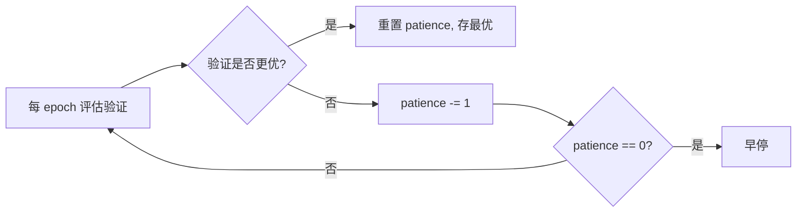
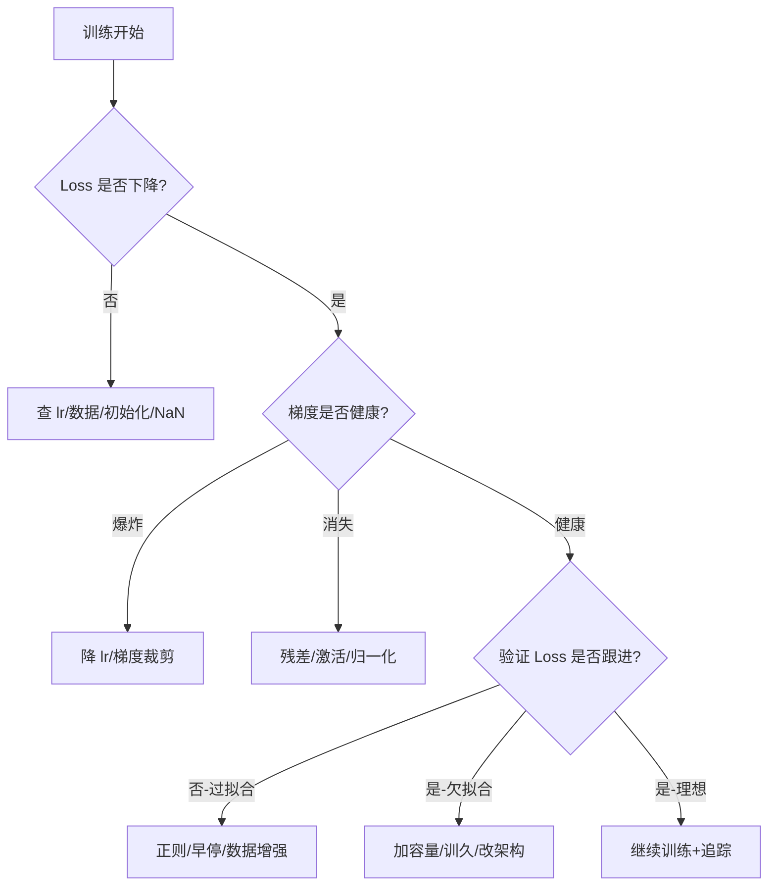

# 训练曲线分析深度解析 (Training Curves Analysis)

> 中文简称：训练曲线分析深度解析

> **一句话理解**: 训练曲线分析是模型训练的"听诊器"——通过 Loss、梯度范数与学习率曲线的形态，诊断收敛、发散、过拟合与数值不稳定，并定位处方。

---

## 目录

1. [背景与动机](#1-背景与动机)
2. [核心原理与数学](#2-核心原理与数学)
3. [Loss 曲线形态学](#3-loss-曲线形态学)
4. [梯度监控](#4-梯度监控)
5. [学习率调度分析](#5-学习率调度分析)
6. [过拟合与欠拟合诊断](#6-过拟合与欠拟合诊断)
7. [可视化实现要点](#7-可视化实现要点)
8. [诊断流程与处方](#8-诊断流程与处方)
9. [对比表](#9-对比表)
10. [应用场景](#10-应用场景)
11. [局限与误区](#11-局限与误区)
12. [关联](#关联)

---

## 1. 背景与动机

深度学习训练是一个高度非凸、高维、随机的优化过程。模型动辄训练数小时乃至数天，若没有可视化的"仪表盘"，工程师只能盲飞。**训练曲线分析**（Training Curves Analysis）就是把训练过程中产生的标量信号（Loss、梯度范数、学习率、指标）按步数/epoch 绘成曲线，通过**形态学**（morphology）判断训练健康度。

### 1.1 为什么不能只看最终 Loss

| 只看终值的危害 | 例子 |
|----------------|------|
| 误判收敛 | Loss 卡在平台期但终值尚可 |
| 错过发散 | Loss 末段回升被均值掩盖 |
| 无法定位 | 不知道是 lr/数据/初始化问题 |
| 不可复现 | 不知训练过程是否稳定 |
| 浪费算力 | 本可早停却训到底 |

### 1.2 训练曲线的三类信号

1. **目标信号**: 训练 Loss、验证 Loss、各项指标（accuracy/F1/bleu）。
2. **优化信号**: 梯度范数、参数范数、学习率、动量。
3. **数值信号**: Loss 是否 NaN、激活/梯度分布、权重直方图。

本篇聚焦前两类信号的可视化与诊断，数值分布可视化见 [[94_可视化/01_最佳实践/04_Visualization_简明指南|神经网络可视化]]。

---

## 2. 核心原理与数学

### 2.1 随机梯度下降的噪声曲线

小批量 SGD 的 Loss 曲线本质是对期望损失 $\mathcal{L}(\theta) = \mathbb{E}_{(x,y)\sim\mathcal{D}}[\ell(f_\theta(x),y)]$ 的随机近似：

$$\hat{\mathcal{L}}_t = \frac{1}{B}\sum_{i=1}^{B}\ell(f_{\theta_t}(x_i),y_i), \qquad \theta_{t+1}=\theta_t - \eta_t \nabla \hat{\mathcal{L}}_t$$

因此曲线必然带噪，其方差近似正比于 $1/B$。这意味着：

- 小 batch → 曲线抖动大；
- 大 batch → 曲线平滑但泛化可能变差（flat/sharp minima之争）。

### 2.2 指数移动平均（EMA）平滑

为看清趋势，常对原始曲线做 EMA：

$$\bar{\mathcal{L}}_t = \alpha \hat{\mathcal{L}}_t + (1-\alpha)\bar{\mathcal{L}}_{t-1}$$

| 参数 | 含义 | 典型值 |
|------|------|--------|
| $\alpha$ | 平滑系数 | 0.1-0.3 |
| 窗口 $1/\alpha$ | 有效记忆步数 | ~10-30 |

**原则**: 平滑曲线看趋势，但必须保留原始曲线看抖动。

### 2.3 梯度范数与 Lipschitz

梯度范数 $\|\nabla \hat{\mathcal{L}}_t\|_2$ 反映当前点"坡度"。训练稳定要求步长不超过损失函数的局部 Lipschitz 常数 $L$：

$$\eta_t \cdot \|\nabla \hat{\mathcal{L}}_t\| \lesssim \frac{1}{L}$$

违反则 Loss 震荡或发散。

### 2.4 学习率与损失曲面

损失曲面曲率由 Hessian $\nabla^2\mathcal{L}$ 刻画。最优学习率约 $\eta^\* \approx 1/\lambda_{\max}$（$\lambda_{\max}$ 为最大特征值）。学习率调度（warmup/cosine/step）本质是随训练动态匹配局部曲率。

---

## 3. Loss 曲线形态学

### 3.1 健康收敛曲线

```
Loss
 │\
 │ \____
 │      \____
 │           \____
 │                \__________
 └──────────────────────────── step
```

特征: 初期快降 → 中期缓降 → 末期平台，训练/验证曲线贴合。

### 3.2 病态形态对照

| 形态 | 图示特征 | 诊断 | 处方 |
|------|----------|------|------|
| **完全不动** | 水平线 | lr 过小/数据未加载/梯度被阻断 | 调大 lr、检查数据管道 |
| **震荡发散** | 锯齿且上升 | lr 过大 | 降 lr 一个数量级 |
| **爆炸到 NaN** | 突然飙升到 NaN | 梯度爆炸/数值不稳 | 梯度裁剪、加 epsilon、降 lr |
| **平台过早** | 快速平直不动 | lr 过小/陷入鞍点/局部最优 | 提 lr 或用动量/Adam |
| **训练降验证升** | 二者分叉 | 过拟合 | 正则、早停、数据增强 |
| **训练验证都高** | 都平在高处 | 欠拟合 | 加容量/训更久/改架构 |
| **缓慢下降** | 极缓斜率 | lr 小或数据难 | 提 lr 或检查初始化 |

### 3.3 阶段识别

| 阶段 | 曲线特征 | 关注 |
|------|----------|------|
| 初期（0-10%） | 快降 | 是否发散、初始化好坏 |
| 中期（10-70%） | 稳定下降 | 收敛速度、lr 是否需衰减 |
| 末期（70-100%） | 趋于平台 | 是否过拟合、是否该早停 |

---

## 4. 梯度监控

### 4.1 为什么要看梯度

Loss 曲线只能告诉你"结果"，梯度曲线能告诉你"原因"。

| 梯度现象 | 含义 | 处置 |
|----------|------|------|
| 范数趋零 | 梯度消失 | 残差连接、换激活、归一化 |
| 范数飙升 | 梯度爆炸 | 裁剪、降 lr |
| 范数剧烈震荡 | batch 小/lr 大 | 增大 batch、降 lr |
| 范数平稳适中 | 健康 | 维持 |

### 4.2 按层梯度分析

深层网络不同层梯度差异巨大。建议按层记录梯度范数直方图，定位"梯度瓶颈层"。

```python
# PyTorch 按层梯度范数记录示例
grad_norms = {}
for name, p in model.named_parameters():
    if p.grad is not None:
        grad_norms[name] = p.grad.norm(2).item()
# 上报到 TensorBoard / W&B（按 layer 分桶）
```

### 4.3 梯度裁剪可视化

裁剪阈值应略高于正常梯度范数分布的 P95。可视化裁剪前后梯度范数分布，可判断阈值是否合理。

---

## 5. 学习率调度分析

### 5.1 常见调度策略

| 策略 | 形态 | 适用 |
|------|------|------|
| Step decay | 阶梯下降 | 经典 CNN |
| Cosine annealing | 余弦衰减到 0 | 现代训练默认 |
| Warmup + cosine | 先升后降 | Transformer/大模型 |
| One-cycle | 升到峰值再降 | 快速收敛 |
| Cyclical | 周期波动 | 跳出局部最优 |

### 5.2 学习率范围测试（LR Range Test）

Leslie Smith 提出的方法: 从极小 lr 线性增大，画 lr-loss 曲线，选取 loss 下降最快段的 lr 作为起点。

```
loss
 │      \
 │       \      <- 选此区间 lr
 │        \____
 │             \
 └────────────────── lr (log)
```

### 5.3 lr 与 Loss 的耦合诊断

| 现象 | 含义 |
|------|------|
| Loss 随 lr 增大而降 | lr 合理区间 |
| Loss 随 lr 增大而升 | lr 过大 |
| Loss 对 lr 不敏感 | 梯度消失或死区 |

---

## 6. 过拟合与欠拟合诊断

### 6.1 训练-验证 Gap 分析

| Gap 形态 | 诊断 | 处方 |
|----------|------|------|
| 训练 ≪ 验证且 gap 扩大 | 过拟合 | 正则/早停/数据增强/Dropout |
| 训练 ≈ 验证且都高 | 欠拟合 | 加容量/训更久/改架构 |
| 训练 ≈ 验证且都低 | 理想 | 维持 |
| 训练 ≪ 验证但 gap 稳定 | 轻度过拟合 | 可接受或微调正则 |

### 6.2 早停（Early Stopping）可视化

在验证 Loss 曲线上标注最佳点与 patience 窗口，直观判断是否触发早停。



---

## 7. 可视化实现要点

### 7.1 采样与聚合

| 要点 | 建议 |
|------|------|
| 记录频率 | 关键阶段（初期/末期）加密采样 |
| 聚合 | 每 N 步取均值，避免曲线过密 |
| 多种子 | 多条曲线 + 置信区间带 |
| 对数轴 | Loss 跨数量级时用 log y 轴并标注 |

### 7.2 标准实现（TensorBoard）

```python
from torch.utils.tensorboard import SummaryWriter
writer = SummaryWriter("runs/exp1")
for step, batch in enumerate(loader):
    loss = train_step(model, batch)
    writer.add_scalar("Loss/train", loss, step)
    writer.add_scalar("GradNorm", grad_norm, step)
    if step % 100 == 0:
        writer.add_scalar("Loss/val", eval_loss, step)
writer.close()
```

### 7.3 Weights & Biases 协作版

```python
import wandb
wandb.init(project="my-exp", config=config)
for step, batch in enumerate(loader):
    loss = train_step(model, batch)
    wandb.log({"loss": loss, "grad_norm": grad_norm}, step=step)
```

详见 [[09_测试/02_测试框架/09_Weights_Biases_深入分析|Weights & Biases]]。

---

## 8. 诊断流程与处方

### 8.1 总流程



### 8.2 处方速查表

| 症状 | 首选处方 | 次选 |
|------|----------|------|
| Loss 不动 | 提 lr 10× | 检查数据/梯度阻断 |
| Loss 发散 | 降 lr 10× | 梯度裁剪 |
| Loss NaN | 降 lr + 裁剪 + fp32 | 检查除零/log(0) |
| 梯度消失 | 残差 + LayerNorm | 换 GELU/初始化 |
| 过拟合 | 早停 + Dropout | 数据增强/正则 |
| 欠拟合 | 加层/训久 | 换架构 |

---

## 9. 对比表

### 9.1 监控工具对比

| 工具 | 实时曲线 | 实验对比 | 嵌入 | 自托管 | 协作 |
|------|----------|----------|------|--------|------|
| TensorBoard | ✅ | 弱 | ✅ | ✅ | 弱 |
| W&B | ✅ | ✅✅ | ✅ | 否 | ✅✅ |
| MLflow | ✅ | ✅ | 弱 | ✅ | ✅ |
| ClearML | ✅ | ✅ | ✅ | ✅ | ✅ |
| 自建(ECharts) | ✅ | 定制 | 定制 | ✅ | 定制 |

### 9.2 调度策略对比

| 策略 | 收敛速度 | 最终性能 | 超参敏感 | 推荐场景 |
|------|----------|----------|----------|----------|
| Step | 中 | 中 | 中 | 经典 CNN |
| Cosine | 快 | 高 | 低 | 现代默认 |
| Warmup+Cosine | 中 | 高 | 低 | Transformer/大模型 |
| One-cycle | 很快 | 中高 | 中 | 快速实验 |

---

## 10. 应用场景

| 场景 | 关键曲线 | 关注 |
|------|----------|------|
| CV 分类 | train/val loss/acc | 过拟合、lr 衰减时机 |
| NLM 预训练 | ppl/loss/grad | 发散、warmup |
| RL 训练 | reward/value loss | 方差大、不稳定 |
| 扩散模型 | noise pred loss | 收敛缓慢 |
| LLM 微调 | loss/grad/lr | 灾难性遗忘 |
| 多模态 | 各模态 loss 对齐 | 模态失衡 |

---

## 11. 局限与误区

| 局限/误区 | 说明 |
|-----------|------|
| 曲线好≠泛化好 | 训练/验证曲线都好仍可能在分布外失败 |
| 过度平滑掩盖尖刺 | EMA 太强会藏关键异常 |
| 单种子下结论 | 训练有随机性，需多种子 |
| lr 测试误用 | LR range test 结果依赖 warmup 与架构 |
| 忽视数值信号 | NaN/Inf 往往先于 Loss 异常 |
| 曲线依赖 batch | 不同 batch 曲线不可直接比 |


---

## 附录 A：Loss 曲线形态对照图集

下面用 ASCII 给出典型病态曲线，便于快速对照识别。

### A.1 健康收敛

```
train loss   ─── steep drop → gentle slope → plateau
val loss     ─── tracks train, small gap
```

### A.2 发散

```
loss ────╮
         ╰────╮
              ╰────── (上升)
```

### A.3 过拟合

```
train ──── 持续下降
val   ──── 先降后升（V 形分叉）
```

### A.4 平台过早

```
loss ────╮ (快速)
         ╰────────────── (水平不动)
```

### A.5 梯度消失

```
grad norm ──── 快速趋近 0
loss       ──── 几乎不动
```

---

## 附录 B：常用超参与曲线表现

| 超参 | 调大 | 调小 | 曲线表现 |
|------|------|------|----------|
| 学习率 | 发散/震荡 | 不动/极慢 | 见上文 |
| batch size | 曲线平滑、可能泛化降 | 抖动大 | 方差带宽窄 |
| 动量 | 加速但可能过冲 | 收敛慢 | 震荡幅度 |
| 权重衰减 | 抑制过拟合 | 过拟合 | train/val gap |
| Dropout | 抑制过拟合 | 过拟合 | gap |
| warmup 步数 | 稳定启动 | 启动快可能不稳 | 初期曲线 |

---

## 附录 C：多种子报告模板

汇报实验时建议附"均值±标准差+置信区间带"的多种子曲线，而非单次结果。

| 项 | 建议 |
|----|------|
| 种子数 | ≥ 3，关键实验 ≥ 5 |
| 报告 | 均值线 + ±1σ 阴影带 |
| 表格 | 指标均值±std，标显著性 |
| 异常 | 单独列出离群种子并分析 |


---

## 附录 D：分布式训练的曲线特殊性

| 现象 | 原因 | 处置 |
|------|------|------|
| 多卡 Loss 曲线略不同 | 数据划分/AllReduce 顺序 | 取主卡曲线 |
| 梯度范数骤降 | 梯度聚合平均化 | 按 world_size 还原比较 |
| Loss 阶梯 | 数据并行 batch 变大 | 对齐有效 batch |
| 通信瓶颈致曲线卡顿 | AllReduce 慢 | 监控通信占比 |

---

## 附录 E：与实验追踪的协作

- 曲线与超参、代码版本、数据版本绑定（[[94_可视化/02_训练可视化/03_实验追踪_可视化|实验追踪]]）。
- 多实验曲线同图对比，标注关键事件（lr 衰减/早停）。
- 用 tag/sweep 组织曲线，支持过滤与下钻。

---

## 附录 F：术语速查

| 术语 | 含义 |
|------|------|
| EMA | 指数移动平均 |
| Warmup | 学习率预热 |
| Cosine Annealing | 余弦退火 |
| Gradient Clipping | 梯度裁剪 |
| Plateau | 平台期 |
| Flat vs Sharp Minima | 平坦/尖锐极小值 |
| Loss Spike | Loss 尖刺 |
| Gradient Noise Scale | 梯度噪声尺度 |
---

## 关联

- [[94_可视化/index|可视化首页]]
- [[94_可视化/Training_Viz/index|Training Viz]]
- [[94_可视化/02_训练可视化/07_训练_监控_可视化|训练监控可视化]]
- [[94_可视化/02_训练可视化/03_实验追踪_可视化|实验追踪可视化]]
- [[94_可视化/01_最佳实践/04_Visualization_简明指南|神经网络可视化]]
- [[07_模型训练/index|模型训练]]
- [[03_深度学习/index|深度学习]]
- [[09_测试/02_测试框架/09_Weights_Biases_深入分析|Weights & Biases]]
- [[01_数学基础/index|数学基础]]

---

*Last updated: 2026-07-23*
