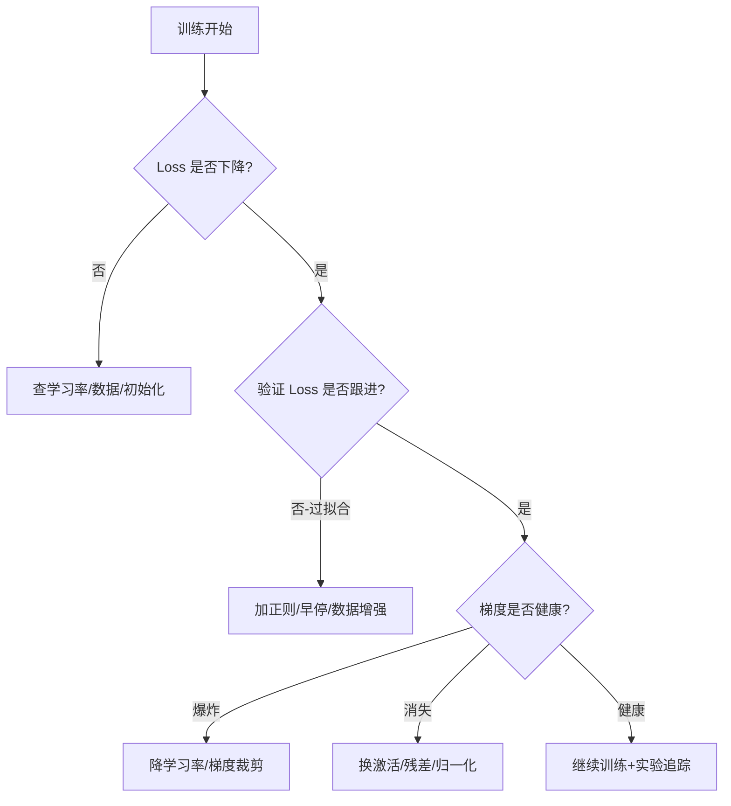

# 训练可视化（Training Visualization）

> 中文简称：训练可视化 ｜ English Name: Training Viz

> **一句话理解**: 训练可视化让你"看见"模型学习的过程——从 Loss 曲线、梯度范数到学习率调度，把黑盒训练变成可监控、可诊断、可对比的工程。

训练可视化（Training Visualization）覆盖模型训练全过程的监控（training monitoring）、Loss 曲线分析、梯度/激活/学习率跟踪、嵌入与网络结构可视化、实验追踪与数据管道可视化。本子域面向 ML 工程师与深度学习实践者，是排查训练发散、调参、复现实验的核心武器。

---

## 一、为什么需要训练可视化

| 问题 | 没有可视化的后果 | 可视化如何帮助 |
|------|------------------|----------------|
| 训练不收敛 | 浪费数小时 GPU 才发现 | Loss 曲线实时显示平台期/发散 |
| 梯度爆炸/消失 | Loss 突然变 NaN 不知为何 | 梯度范数曲线提前预警 |
| 学习率不当 | 收敛慢或不稳 | 学习率调度曲线对照 |
| 过拟合/欠拟合 | 验证集表现差找不到原因 | 训练/验证 Loss 对比曲线 |
| 实验不可复现 | 调参靠玄学 | 实验追踪记录超参+曲线 |

---

## 二、文件导航

| 文件 | 说明 | 适用人群 |
|------|------|----------|
| [[94_可视化/02_训练可视化/07_训练_监控_可视化|Training Monitoring Visualization]] | Loss/梯度/激活的实时跟踪与告警 | ML 工程师 / 深度学习实践者 |
| [[94_可视化/02_训练可视化/06_训练_Curves_分析.md|Training Curves Analysis]] | 训练曲线深度分析（损失/梯度/学习率诊断） | ML 工程师 / 调参者 |
| [[94_可视化/Training_Viz/Embedding_Visualization_Guide|Embedding Visualization Guide]] | 嵌入空间投影与聚类可视化 | DL 研究员 |
| [[94_可视化/01_最佳实践/04_Visualization_简明指南|Neural Network Visualization Guide]] | 网络结构、特征图与神经元可视化 | DL 研究员 |
| [[94_可视化/02_训练可视化/03_实验追踪_可视化|Experiment Tracking Visualization]] | 多实验对比、超参搜索与追踪 | ML 工程师 |
| [[94_可视化/Training_Viz/Data_Pipeline_Feature_Visualization|Data Pipeline & Feature Visualization]] | 数据分布、特征统计与管道健康度 | 数据工程师 |

---

## 三、核心可视化类型

### 3.1 训练曲线（Training Curves）

| 曲线 | 横轴 | 纵轴 | 诊断意义 |
|------|------|------|----------|
| Loss 曲线 | step/epoch | 训练 Loss | 收敛速度、是否发散 |
| 验证 Loss | step/epoch | 验证 Loss | 过拟合/欠拟合 |
| 梯度范数 | step | ‖∇‖ | 爆炸/消失 |
| 学习率 | step | lr | 调度策略是否合理 |
| 指标曲线 | step | accuracy/F1 | 性能走势 |

详见 [[94_可视化/README.md|训练曲线分析]]。

### 3.2 权重与梯度分布

| 可视化 | 方法 | 用途 |
|--------|------|------|
| 权重直方图 | 按层统计权重分布 | 检测死神经元/饱和 |
| 梯度直方图 | 按层统计梯度 | 定位梯度瓶颈 |
| 激活分布 | 按层激活统计 | 检测 ReLU 死区 |

### 3.3 嵌入与网络结构

详见 [[94_可视化/Training_Viz/Embedding_Visualization_Guide|嵌入可视化]] 与 [[94_可视化/01_最佳实践/04_Visualization_简明指南|网络可视化]]。

---

## 四、典型诊断流程

---

## 五、工具与平台

| 工具 | 训练可视化强项 | 关联 |
|------|----------------|------|
| TensorBoard | 原生曲线/直方图/嵌入投影 | 训练监控 |
| Weights & Biases | 实验对比/超参搜索/协作 | [[09_测试/02_测试框架/09_Weights_Biases_深入分析|W&B]] |
| MLflow | 实验追踪/模型注册 | 实验追踪 |
| ClearML / Comet | 实验管理 | 实验追踪 |
| 自建 Dashboard | 定制化监控 | ECharts/Plotly |

---

## 六、常见陷阱

| 陷阱 | 后果 | 正确做法 |
|------|------|----------|
| 只看训练 Loss | 误以为收敛 | 必须同看验证 Loss |
| y 轴用对数却未标注 | 误判下降速度 | 明确标注 log scale |
| 单次实验下结论 | 噪声误导 | 多随机种子取均值+方差带 |
| 不记录超参 | 无法复现 | 实验追踪自动记录 |
| 曲线采样太稀 | 漏掉尖刺 | 关键阶段提高采样率 |

---

## 七、术语速查

| 术语 | 含义 |
|------|------|
| Loss Landscape | 损失函数曲面 |
| Gradient Clipping | 梯度裁剪防爆炸 |
| Plateau | Loss 平台期 |
| Early Stopping | 验证不升则停训 |
| Checkpoint | 训练状态保存点 |

---

## 八、训练曲线诊断速查

| 现象 | 可能原因 | 处置 |
|------|----------|------|
| Loss 完全不动 | 学习率过小/数据未打乱 | 调大 lr/检查数据管道 |
| Loss 上升后发散 | 学习率过大/梯度爆炸 | 降 lr/梯度裁剪 |
| Loss 震荡剧烈 | batch 过小/学习率大 | 增大 batch/降 lr |
| 训练降但验证升 | 过拟合 | 正则/早停/数据增强 |
| 训练验证都高 | 欠拟合 | 加容量/训更久/改架构 |
| Loss 突然 NaN | 数值不稳定/除零 | 梯度裁剪/加 epsilon/换 fp32 |
| 梯度范数趋零 | 梯度消失 | 残差/换激活/归一化 |
| 梯度范数飙升 | 梯度爆炸 | 裁剪/降 lr |

---

## 九、实验对比最佳实践

| 维度 | 建议 |
|------|------|
| 对齐 | 同数据/同种子/同硬件 |
| 可视化 | 多曲线同图+置信区间带 |
| 表格 | 超参+指标一表呈现 |
| 显著性 | 多种子均值±方差 |
| 记录 | 实验追踪自动归档 |

---

## 十、学习路径

| 阶段 | 内容 | 产出 |
|------|------|------|
| 入门 | 训练监控 README | 跑通 TensorBoard |
| 基础 | 训练曲线分析 | 诊断收敛问题 |
| 进阶 | 嵌入/网络可视化 | 理解内部表征 |
| 实战 | 实验追踪+数据管道 | 完整可视化流程 |

---

## 十一、常见问题（FAQ）

| 问题 | 解答 |
|------|------|
| TensorBoard 和 W&B 选哪个？ | 单机调试用 TensorBoard，团队协作与多实验对比用 W&B。 |
| 训练曲线要不要平滑？ | 轻度平滑（EMA）便于看趋势，但必须保留原始曲线。 |
| 多久存一次 checkpoint？ | 大模型按 epoch 或固定步数，关键阶段加密。 |
| 梯度范数多少算爆炸？ | 与初值对比，突增 10× 以上需警惕。 |
| 嵌入可视化每次都变？ | t-SNE/UMAP 随机性强，固定种子并多跑几次取一致结构。 |
| 实验追踪记录哪些？ | 超参、代码版本、数据版本、指标曲线、环境、最终指标。 |

---

## 十二、训练可视化检查清单

- [ ] 训练/验证 Loss 同图显示
- [ ] 梯度范数与学习率曲线已开
- [ ] 关键指标按步数记录
- [ ] 实验超参与代码版本已追踪
- [ ] 嵌入可视化已配置（关键阶段）
- [ ] 多种子结果有置信区间
- [ ] Checkpoint 间隔合理

---

## 关联

- [[94_可视化/index|可视化首页]]
- [[94_可视化/Best_Practices/index|Best Practices]]
- [[94_可视化/Evaluation_Viz/index|Evaluation Viz]]
- [[07_模型训练/index|模型训练]]
- [[09_测试/02_测试框架/09_Weights_Biases_深入分析|Weights & Biases]]
- [[03_深度学习/index|深度学习]]
- [[11_模型运维/index|模型运维]]

---

*Last updated: 2026-07-23*
