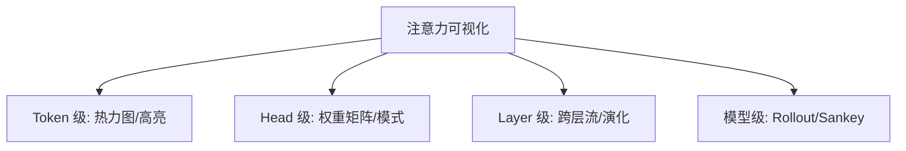
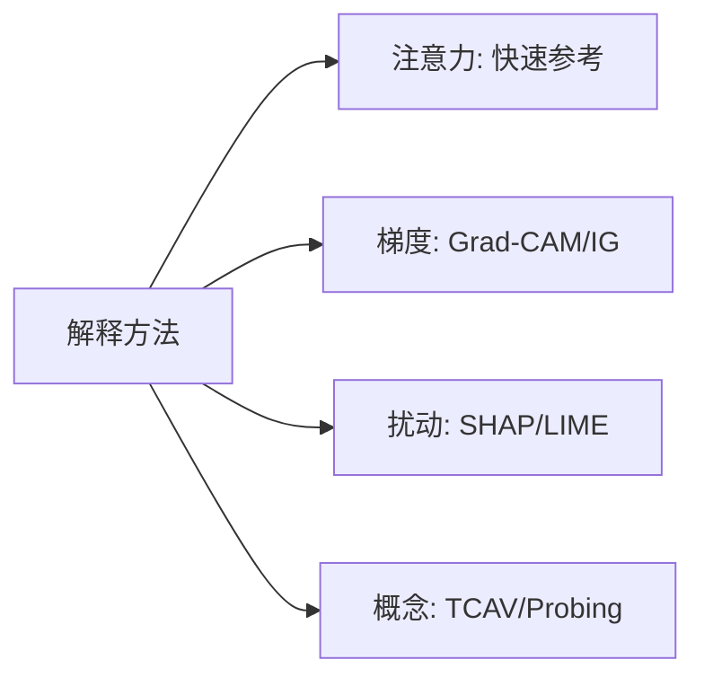

# 注意力可视化 (Attention Visualization Guide)

> 中文简称：注意力可视化

> **一句话理解**: 注意力可视化是打开 Transformer "黑箱"的窗口——将抽象的注意力权重矩阵转化为直观的热力图、流向图和连接图，揭示模型"在看哪里"。

---

## 目录

1. [概述](#1-概述)
2. [核心概念](#2-核心概念)
3. [Attention Head 分析](#3-attention-head-分析)
4. [BertViz 工具详解](#4-bertviz-工具详解)
5. [跨层注意力流](#5-跨层注意力流)
6. [Multi-Head 模式解读](#6-multi-head-模式解读)
7. [注意力 ≠ 解释性争论](#7-注意力--解释性争论)
8. [LLM 长文本注意力模式](#8-llm-长文本注意力模式)
9. [工具对比](#9-工具对比)
10. [实践代码](#10-实践代码)
11. [最佳实践](#11-最佳实践)
12. [相关概念](#12-相关概念)

---

## 1. 概述

### 1.1 为什么需要注意力可视化

- **调试模型**：发现注意力是否聚焦在正确的上下文
- **理解行为**：解释模型为何做出特定预测
- **发现模式**：识别不同 Head 的功能分工
- **优化架构**：指导注意力机制的改进方向

### 1.2 注意力机制回顾

$$\text{Attention}(Q, K, V) = \text{softmax}\left(\frac{QK^T}{\sqrt{d_k}}\right)V$$

注意力权重矩阵 $A = \text{softmax}\left(\frac{QK^T}{\sqrt{d_k}}\right)$ 是可视化的核心对象。



---

## 2. 核心概念

### 2.1 注意力权重矩阵

每个 Head 产生 $n \times n$ 矩阵（n=序列长度），每行之和=1：

```
         Key tokens
         [CLS] The  cat  sat  [SEP]
Query  ┌─────────────────────────┐
tokens │ 0.1  0.1  0.6  0.1  0.1│ [CLS]
       │ 0.0  0.3  0.3  0.3  0.1│ cat
       └─────────────────────────┘
```

### 2.2 可视化维度

| 维度 | 内容 | 典型图表 |
|------|------|----------|
| 单 Head 单 Layer | 一个 $n \times n$ 矩阵 | 热力图 |
| 所有 Head 单 Layer | $h$ 个矩阵并排 | 小多图 |
| 单 Head 跨 Layer | 不同层的同一 Head | 动画 |
| 聚合注意力 | 所有 Head+Layer 汇总 | 文本高亮 |
| 注意力流 | Token 间信息流动 | Sankey/弦图 |

---

## 3. Attention Head 分析

### 3.1 Head 功能分类

| Head 类型 | 功能 | 典型模式 |
|-----------|------|----------|
| **Syntactic** | 句法关系（主谓、动宾） | 对角线偏移 |
| **Positional** | 相对/绝对位置 | 对角线 |
| **Separator** | 关注 [SEP]、标点 | 列聚焦 |
| **Aggregate** | 均匀分配 | 近均匀矩阵 |
| **Coreference** | 指代追踪 | 跨距离连接 |
| **Neighborhood** | 相邻 token | 窄对角带 |

### 3.2 Head 重要性评估

```python
import torch, numpy as np

def analyze_head_importance(model, tokenizer, texts):
    """通过注意力熵评估各 Head 重要性（低熵=高聚焦=重要）"""
    model.eval()
    n_layers = model.config.num_hidden_layers
    n_heads = model.config.num_attention_heads
    entropy_map = np.zeros((n_layers, n_heads))
    
    for text in texts:
        inputs = tokenizer(text, return_tensors='pt', truncation=True)
        with torch.no_grad():
            outputs = model(**inputs, output_attentions=True)
        for layer_idx, attn in enumerate(outputs.attentions):
            for head_idx in range(n_heads):
                attn_w = attn[0, head_idx]
                entropy = -(attn_w * torch.log(attn_w + 1e-10)).sum(-1)
                entropy_map[layer_idx, head_idx] += entropy.mean().item()
    
    return entropy_map / len(texts)
```

---

## 4. BertViz 工具详解

### 4.1 安装与使用

```bash
pip install bertviz
```

```python
from bertviz import head_view, model_view, neuron_view
from transformers import BertTokenizer, BertModel

model = BertModel.from_pretrained('bert-base-uncased', output_attentions=True)
tokenizer = BertTokenizer.from_pretrained('bert-base-uncased')

sentence_a = "The cat sat on the mat"
inputs = tokenizer(sentence_a, return_tensors='pt')
outputs = model(**inputs)
attention = outputs.attentions
tokens = tokenizer.convert_ids_to_tokens(inputs['input_ids'][0])

# 三种视图
head_view(attention, tokens, layer=6, heads=[0, 1])  # 单 Head 矩阵
model_view(attention, tokens)                          # 全局注意力流
neuron_view(model, tokenizer, sentence_a, layer=6, head=0)  # Q/K/V 细节
```

### 4.2 视图对比

| 视图 | 适用场景 | 信息量 |
|------|----------|--------|
| Head View | 分析特定 Head 模式 | 中 |
| Model View | 全局注意力流概览 | 高 |
| Neuron View | 深入理解 Q/K/V 计算 | 最高 |

---

## 5. 跨层注意力流

### 5.1 Attention Rollout

将多层注意力累积：$A_{\text{rollout}} = A_L \cdot A_{L-1} \cdot ... \cdot A_1$

```python
import torch

def attention_rollout(attentions, discard_ratio=0.0):
    """计算 Attention Rollout（含残差连接）"""
    result = torch.eye(attentions[0].shape[-1])
    
    for attn in attentions:
        attn_mean = attn.mean(dim=0)  # 平均所有 Head
        if discard_ratio > 0:
            flat = attn_mean.flatten()
            attn_mean[attn_mean < flat.quantile(discard_ratio)] = 0
        # 残差: 0.5*I + 0.5*A，行归一化
        attn_res = 0.5 * torch.eye(attn_mean.shape[0]) + 0.5 * attn_mean
        attn_res = attn_res / attn_res.sum(dim=-1, keepdim=True)
        result = attn_res @ result
    
    return result
```

### 5.2 跨层演化动画

```python
import matplotlib.animation as animation
import matplotlib.pyplot as plt

def animate_attention_evolution(attentions, tokens, head_idx=0):
    """动画展示同一 Head 在不同层的注意力变化"""
    fig, ax = plt.subplots(figsize=(8, 8))
    
    def update(frame):
        ax.clear()
        attn = attentions[frame][0, head_idx].numpy()
        ax.imshow(attn, cmap='Blues', vmin=0)
        ax.set_xticks(range(len(tokens)))
        ax.set_yticks(range(len(tokens)))
        ax.set_xticklabels(tokens, rotation=45, ha='right')
        ax.set_yticklabels(tokens)
        ax.set_title(f'Layer {frame}, Head {head_idx}')
    
    ani = animation.FuncAnimation(fig, update, frames=len(attentions), interval=1000)
    ani.save('attention_evolution.gif', writer='pillow', fps=1)
```

---

## 6. Multi-Head 模式解读

### 6.1 自动模式识别

```python
import numpy as np

def classify_attention_pattern(attn_matrix):
    """自动识别注意力模式类型"""
    n = attn_matrix.shape[0]
    diag_strength = np.trace(attn_matrix) / n  # 对角线（Positional）
    col_entropy = -np.sum(attn_matrix * np.log(attn_matrix + 1e-10), axis=0)
    col_focus = 1 - col_entropy.mean() / np.log(n)  # 列聚焦（Vertical）
    local_band = (np.sum(np.diag(attn_matrix, 1)) + np.sum(np.diag(attn_matrix, -1))) / (2*(n-1))
    
    patterns = {'Positional': diag_strength, 'Vertical': col_focus, 'Local': local_band}
    return max(patterns, key=patterns.get), patterns
```

### 6.2 批量分析所有 Head

```python
def analyze_all_heads(attentions):
    """分析所有层所有 Head 的模式分布"""
    results = []
    for layer in range(len(attentions)):
        for head in range(attentions[layer].shape[1]):
            attn = attentions[layer][0, head].numpy()
            pattern, scores = classify_attention_pattern(attn)
            results.append({'layer': layer, 'head': head, 'pattern': pattern, **scores})
    return results
```

---

## 7. 注意力 ≠ 解释性争论

### 7.1 争论核心

| 立场 | 代表 | 论点 |
|------|------|------|
| 注意力 ≠ 解释 | Jain & Wallace (2019) | 不同注意力可产生相同预测 |
| 有条件可解释 | Wiegrebe et al. (2019) | 特定约束下有效 |
| 综合使用 | Mohseni et al. (2020) | 需结合梯度方法 |

### 7.2 正确使用姿势

| 用途 | 合适? | 说明 |
|------|-------|------|
| 调试训练 | ✅ | 注意力是否合理 |
| 理解关注区域 | ⚠️ | 参考但非因果 |
| 向用户解释预测 | ❌ | 应用 SHAP/LIME |
| Head 剪枝 | ✅ | 低重要性可移除 |

### 7.3 更可靠的解释方法



---

## 8. LLM 长文本注意力模式

### 8.1 长上下文挑战

| 挑战 | 影响 |
|------|------|
| 128K×128K 矩阵 | 无法直接可视化 |
| 大部分注意力近零 | 需稀疏可视化 |
| 新模式出现 | 需新分析工具 |

### 8.2 LLM 特有模式

- **Attention Sink**：BOS token 吸收大量注意力（Softmax 副产品）
- **局部窗口 + 全局锚点**：近邻高注意力 + 关键实体远程连接
- **层级检索**：浅层语法 → 中层语义 → 深层任务相关

### 8.3 Attention Sink 现象

**发现**：在 LLM 中，初始 token（尤其是 BOS）吸收大量注意力，即使语义无关。

**原因**：Softmax 归一化要求注意力权重之和为 1，模型需要一个"垃圾桶"来放置不需要的注意力。

**影响**：
- 流式推理中不能简单丢弃初始 token
- StreamingLLM 等方法利用此现象实现无限长度推理
- 可视化时需要单独分析第一个 token 的注意力列

```python
def visualize_attention_sink(attentions, tokens):
    """可视化 Attention Sink"""
    import matplotlib.pyplot as plt
    attn = attentions[-1][0].mean(axis=0).numpy()  # 最后一层，平均所有 Head
    seq_len = len(tokens)
    
    fig, axes = plt.subplots(1, 2, figsize=(14, 5))
    # 所有位置对第一个 token 的注意力
    axes[0].bar(range(seq_len), attn[:, 0], alpha=0.7)
    axes[0].axhline(y=1/seq_len, color='r', linestyle='--', label='均匀基线')
    axes[0].set_title('所有 Query 对 [BOS] 的注意力')
    axes[0].legend()
    # 每个 token 被关注的总量
    axes[1].bar(range(min(20, seq_len)), attn.sum(axis=0)[:20], color='orange', alpha=0.7)
    axes[1].set_title('各 token 被关注总量（注意第一个异常高）')
    plt.tight_layout()
    plt.show()
```

### 8.4 长文本可视化策略

```python
import numpy as np, matplotlib.pyplot as plt

def visualize_long_context_attention(attn, tokens, window_size=256):
    """长文本注意力多尺度可视化"""
    seq_len = len(tokens)
    fig, axes = plt.subplots(2, 2, figsize=(16, 14))
    
    # 1. 全局稀疏视图（top 5%）
    threshold = np.percentile(attn, 95)
    axes[0,0].imshow(np.where(attn > threshold, attn, 0), cmap='hot', aspect='auto')
    axes[0,0].set_title('全局稀疏注意力 (top 5%)')
    
    # 2. 局部窗口
    mid = seq_len // 2
    s, e = max(0, mid - window_size//2), min(seq_len, mid + window_size//2)
    axes[0,1].imshow(attn[s:e, s:e], cmap='Blues', aspect='auto')
    axes[0,1].set_title(f'局部窗口 [{s}:{e}]')
    
    # 3. 注意力距离分布
    distances = [abs(i-j) for i in range(seq_len) for j in range(seq_len) if attn[i,j] > 0.01]
    axes[1,0].hist(distances, bins=100, alpha=0.7)
    axes[1,0].set_yscale('log')
    axes[1,0].set_title('注意力距离分布')
    
    # 4. 每行熵
    row_entropy = -np.sum(attn * np.log(attn + 1e-10), axis=1)
    axes[1,1].plot(row_entropy, alpha=0.7)
    axes[1,1].set_title('各位置注意力集中度')
    
    plt.tight_layout()
    plt.show()
```

---

## 9. 工具对比

| 工具 | 支持模型 | 视图 | 长文本 | 易用性 |
|------|----------|------|--------|--------|
| **BertViz** | BERT/GPT-2/T5 | Head/Model/Neuron | ⚠️ <512 | ⭐⭐⭐⭐⭐ |
| **TransformerLens** | GPT-2/Pythia | 编程式全控制 | ✅ | ⭐⭐⭐ |
| **Captum** | PyTorch 通用 | 梯度+注意力 | ✅ | ⭐⭐⭐ |
| **Ecco** | HuggingFace | 文本高亮+因子 | ⚠️ | ⭐⭐⭐⭐ |
| **自建 Plotly** | 任意 | 完全自定义 | ✅ | ⭐⭐ |

---

## 10. 实践代码

### 10.1 完整注意力分析器

```python
import torch, plotly.graph_objects as go
from plotly.subplots import make_subplots
from transformers import AutoModel, AutoTokenizer

class AttentionAnalyzer:
    def __init__(self, model_name='bert-base-uncased'):
        self.tokenizer = AutoTokenizer.from_pretrained(model_name)
        self.model = AutoModel.from_pretrained(model_name, output_attentions=True)
        self.model.eval()
    
    def get_attentions(self, text):
        inputs = self.tokenizer(text, return_tensors='pt', truncation=True)
        with torch.no_grad():
            outputs = self.model(**inputs)
        tokens = self.tokenizer.convert_ids_to_tokens(inputs['input_ids'][0])
        return tokens, [a[0].numpy() for a in outputs.attentions]
    
    def plot_heatmap(self, tokens, attentions, layer=0, head=0):
        fig = go.Figure(data=go.Heatmap(
            z=attentions[layer][head], x=tokens, y=tokens,
            colorscale='Blues',
            hovertemplate='Query: %{y}<br>Key: %{x}<br>Weight: %{z:.4f}'
        ))
        fig.update_layout(title=f'Layer {layer}, Head {head}',
                         xaxis_title='Key', yaxis_title='Query')
        fig.show()
    
    def plot_multi_head(self, tokens, attentions, layer=0):
        n_heads = attentions[layer].shape[0]
        cols = min(4, n_heads)
        rows = (n_heads + cols - 1) // cols
        fig = make_subplots(rows=rows, cols=cols,
                           subplot_titles=[f'H{i}' for i in range(n_heads)])
        for i in range(n_heads):
            fig.add_trace(go.Heatmap(z=attentions[layer][i], x=tokens, y=tokens,
                                    colorscale='Blues', showscale=False),
                         row=i//cols+1, col=i%cols+1)
        fig.update_layout(title=f'Layer {layer} All Heads',
                         height=200*rows, width=200*cols)
        fig.show()
```

### 10.2 GPT-2 因果注意力

```python
from transformers import GPT2LMHeadModel, GPT2Tokenizer
import seaborn as sns, matplotlib.pyplot as plt, numpy as np

def visualize_gpt2_causal(text, layer=-1, head=0):
    """GPT-2 因果注意力（下三角）"""
    tokenizer = GPT2Tokenizer.from_pretrained('gpt2')
    model = GPT2LMHeadModel.from_pretrained('gpt2', output_attentions=True)
    model.eval()
    
    inputs = tokenizer(text, return_tensors='pt')
    with torch.no_grad():
        outputs = model(**inputs)
    
    tokens = tokenizer.convert_ids_to_tokens(inputs['input_ids'][0])
    attn = outputs.attentions[layer][0, head].numpy()
    mask = np.triu(np.ones_like(attn, dtype=bool), k=1)
    
    fig, ax = plt.subplots(figsize=(10, 8))
    sns.heatmap(attn, mask=mask, xticklabels=tokens, yticklabels=tokens,
                cmap='YlOrRd', annot=True, fmt='.2f', ax=ax)
    ax.set_title(f'GPT-2 Causal Attention (L{layer}, H{head})')
    plt.tight_layout()
    plt.show()
```

---

## 11. 最佳实践

### 11.1 分析流程

1. **全局概览** → Model View / Attention Rollout
2. **模式发现** → 所有 Head 小多图，识别功能 Head
3. **深入分析** → 特定 Head 跨层演化
4. **验证假设** → 扰动/消融实验验证注意力功能
5. **综合解释** → 结合梯度方法交叉验证

### 11.2 常见陷阱

| 陷阱 | 说明 | 解决方案 |
|------|------|----------|
| 过度解读单个 Head | 一个 Head 不代表模型决策 | 聚合多 Head 分析 |
| 忽略 Softmax 效应 | 注意力必须归一化 | 结合梯度分析 |
| 只看最后一层 | 不同层有不同功能 | 跨层对比 |
| 用注意力做因果解释 | 注意力 ≠ 因果 | 使用 SHAP/IG |
| 忽略特殊 token | [CLS]/[SEP] 有特殊含义 | 单独分析 |

### 11.3 性能考虑

- 长文本（>2K token）注意力矩阵非常大，注意内存
- 可视化时优先使用采样/聚合策略
- 交互式图表数据点过多时使用 WebGL
- 保存注意力权重时注意磁盘空间（每层每 Head 一个矩阵）
- 批量分析时只保留统计摘要，不保存完整矩阵

### 11.4 设计原则

- 明确标注 Query（行）/ Key（列）方向
- 区分因果（下三角）/ 双向（完整矩阵）
- 多粒度展示：全局 → 局部
- 交互优先：静态图信息密度有限

---

## 12. 相关概念

- [[Model_Interpretability_Visualization]] — 模型可解释性方法总览
- [[Embedding_Visualization_Guide]] — 嵌入空间可视化
- [[94_可视化/02_训练可视化/07_训练_监控_可视化]] — 训练过程监控
- [[94_可视化/01_最佳实践/04_Visualization_简明指南]] — 网络结构可视化
- [[94_可视化/01_最佳实践/04_Visualization_简明指南]] — 评估指标可视化
- [[94_可视化/02_训练可视化/03_实验追踪_可视化]] — 实验追踪
- [[Inference_Serving_Visualization]] — 推理服务监控

---

## 参考资源

| 资源 | 说明 |
|------|------|
| BertViz GitHub | https://github.com/jessevig/bertviz |
| "Attention is not Explanation" | Jain & Wallace, NAACL 2019 |
| TransformerLens | https://github.com/neelnanda-io/TransformerLens |
| "A Mathematical Framework for Transformer Circuits" | Elhage et al., Anthropic 2021 |
| Ecco Library | https://github.com/jalammar/ecco |
