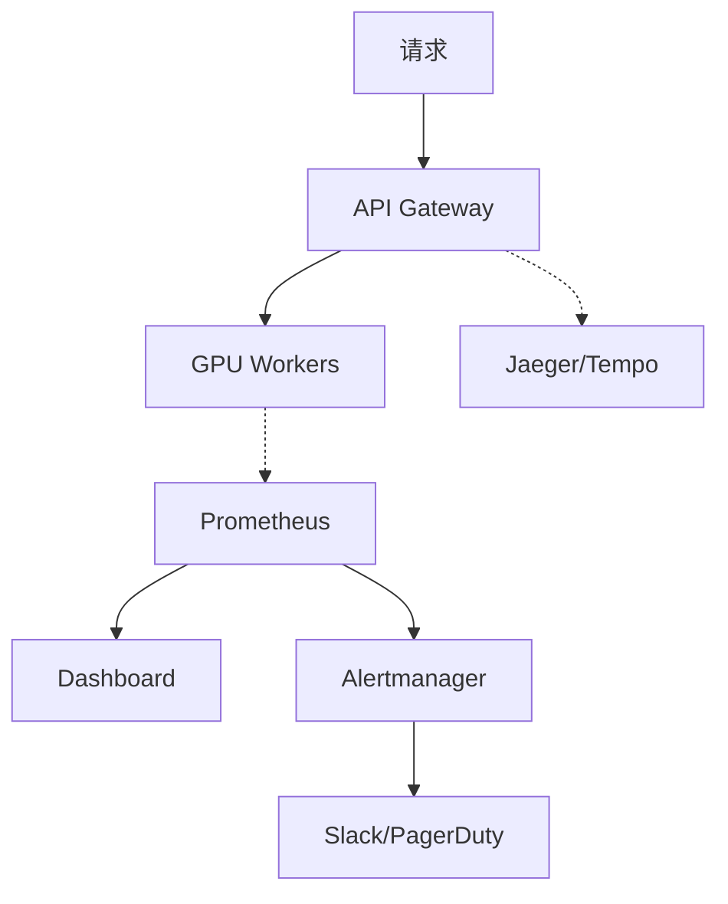
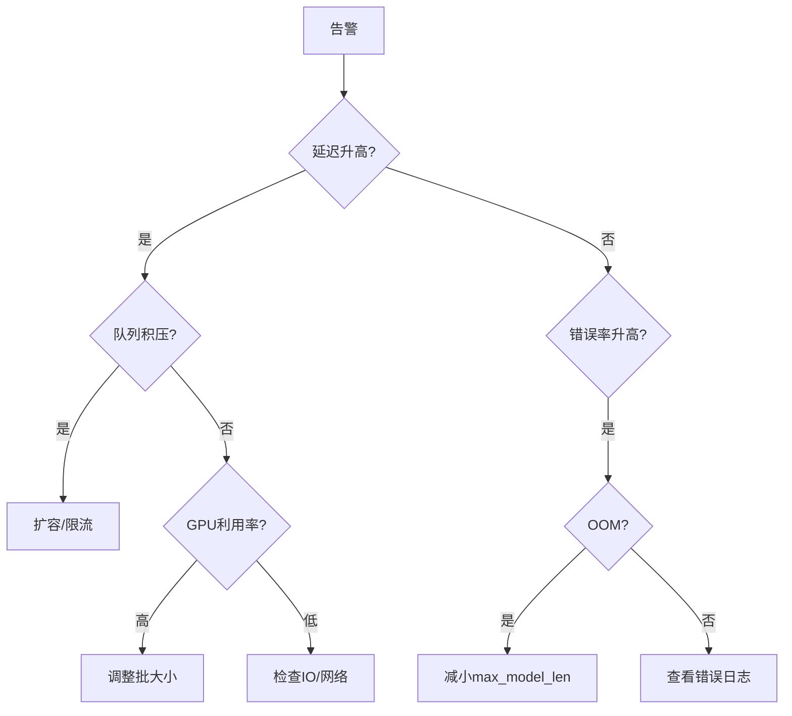

# 推理服务可视化 (Inference Serving Visualization)

> 中文简称：推理服务可视化

> **一句话理解**: 推理服务可视化是 LLM 在线服务的"运维指挥塔"——实时呈现延迟分布、吞吐曲线、GPU 利用率和 SLO 达标率，让每一次推理请求可追踪、可优化、可保障。

---

## 目录

1. [概述](#1-概述)
2. [核心概念](#2-核心概念)
3. [延迟热力图](#3-延迟热力图)
4. [吞吐监控](#4-吞吐监控)
5. [请求追踪](#5-请求追踪)
6. [Grafana + Prometheus 方案](#6-grafana--prometheus-方案)
7. [vLLM/TGI Dashboard](#7-vllmtgi-dashboard)
8. [A/B 测试面板](#8-ab-测试面板)
9. [SLO 监控](#9-slo-监控)
10. [工具对比](#10-工具对比)
11. [实践代码](#11-实践代码)
12. [最佳实践](#12-最佳实践)
13. [相关概念](#13-相关概念)

---

## 1. 概述

### 1.1 LLM 推理 vs 传统服务

| 维度 | 传统 Web | LLM 推理 |
|------|----------|----------|
| 延迟 | 10-100ms | 500ms-60s |
| 资源 | CPU | GPU（显存关键） |
| 请求模式 | 短平快 | 流式输出 |
| 批处理 | 无 | Continuous Batching |
| 成本 | 按请求 | 按 token |

### 1.2 监控全景



### 1.3 Golden Signals

| 信号 | 指标 |
|------|------|
| **延迟** | TTFT, TPS, E2E Latency |
| **流量** | QPS, Token/s |
| **错误** | Error Rate, Timeout Rate |
| **饱和度** | GPU Util, Memory, Queue Depth |

---

## 2. 核心概念

### 2.1 延迟分解

```
请求 → 排队 → Prefill → Decode(逐token) → 完成
       │        │         │
   Queue Time  TTFT   Generation Time
       └────────┴─────────┴──────────── E2E Latency
```

| 指标 | 定义 | 典型值 |
|------|------|--------|
| **TTFT** | 首 token 延迟 | 100-2000ms |
| **TPS** | 每秒生成 token | 20-100 tok/s |
| **ITL** | token 间延迟 | 10-50ms |
| **E2E** | 端到端总延迟 | 1-60s |

### 2.2 Continuous Batching

```
传统: 所有请求同时完成（等最慢的）
Continuous: 完成即释放，新请求立即加入 → 吞吐提升 2-3x
```

---

## 3. 延迟热力图

```python
import numpy as np, pandas as pd
import plotly.graph_objects as go

def latency_heatmap(latency_data, time_window='1h'):
    """延迟分布热力图: X=时间, Y=延迟分桶, 颜色=请求数"""
    latency_data['time_bucket'] = pd.to_datetime(latency_data['timestamp']).dt.floor(time_window)
    bins = [0, 100, 200, 500, 1000, 2000, 5000, 10000, 60000]
    labels = ['<100ms', '100-200', '200-500', '500-1s', '1-2s', '2-5s', '5-10s', '>10s']
    latency_data['bucket'] = pd.cut(latency_data['latency_ms'], bins=bins, labels=labels)
    
    heatmap = latency_data.groupby(['time_bucket', 'bucket']).size().unstack(fill_value=0)
    
    fig = go.Figure(go.Heatmap(z=heatmap.values, x=heatmap.index.astype(str),
                               y=heatmap.columns, colorscale='YlOrRd',
                               hovertemplate='时间:%{x}<br>延迟:%{y}<br>数量:%{z}'))
    fig.update_layout(title=f'延迟热力图 ({time_window})', xaxis_title='时间', yaxis_title='延迟')
    fig.show()

def ttft_percentile_trend(ttft_data):
    """TTFT 分位数趋势"""
    fig = go.Figure()
    for p in [50, 90, 95, 99]:
        daily_p = ttft_data.groupby('date')['ttft_ms'].quantile(p/100)
        fig.add_trace(go.Scatter(x=daily_p.index, y=daily_p.values,
                                mode='lines+markers', name=f'P{p}'))
    fig.add_hline(y=500, line_dash='dash', line_color='red', annotation_text='SLO: P95<500ms')
    fig.update_layout(title='TTFT 分位数趋势', yaxis_type='log')
    fig.show()

def latency_vs_length(request_data):
    """延迟与输入/输出长度关系（定位性能瓶颈）"""
    fig = make_subplots(rows=1, cols=2,
        subplot_titles=['TTFT vs 输入长度', 'E2E vs 输出长度'])
    
    fig.add_trace(go.Scatter(x=request_data['input_tokens'], y=request_data['ttft_ms'],
        mode='markers', marker=dict(size=4, opacity=0.5, color='blue')), row=1, col=1)
    fig.add_trace(go.Scatter(x=request_data['output_tokens'], y=request_data['e2e_latency_ms'],
        mode='markers', marker=dict(size=4, opacity=0.5, color='red')), row=1, col=2)
    
    fig.update_xaxes(title_text='Input Tokens', row=1, col=1)
    fig.update_xaxes(title_text='Output Tokens', row=1, col=2)
    fig.update_yaxes(title_text='ms')
    fig.update_layout(width=1000, height=400, showlegend=False)
    fig.show()
```

---

## 4. 吞吐监控

```python
import plotly.graph_objects as go
from plotly.subplots import make_subplots

def throughput_dashboard(metrics):
    """推理服务吞吐监控面板"""
    fig = make_subplots(rows=2, cols=2, subplot_titles=[
        'QPS', 'Token 吞吐', 'GPU 利用率', '队列深度'])
    
    t = metrics['timestamp']
    fig.add_trace(go.Scatter(x=t, y=metrics['qps'], mode='lines', name='QPS'), row=1, col=1)
    fig.add_trace(go.Scatter(x=t, y=metrics['output_tokens_per_sec'], mode='lines',
                            fill='tozeroy', name='tokens/s'), row=1, col=2)
    fig.add_trace(go.Scatter(x=t, y=metrics['gpu_util'], mode='lines',
                            fill='tozeroy', name='GPU%'), row=2, col=1)
    fig.add_trace(go.Bar(x=t, y=metrics['queue_depth'], name='Queue'), row=2, col=2)
    
    fig.update_layout(height=600, width=1000, title='推理吞吐监控')
    fig.show()

def capacity_planning(current_qps, max_qps, growth_rate, months=12):
    """容量规划预测"""
    future = np.arange(0, months + 1)
    projected = current_qps * (1 + growth_rate) ** future
    
    fig = go.Figure()
    fig.add_hline(y=max_qps, line_dash='dash', line_color='red', annotation_text='容量上限')
    fig.add_hline(y=max_qps*0.8, line_dash='dot', line_color='orange', annotation_text='80%警戒')
    fig.add_trace(go.Scatter(x=future, y=projected, mode='lines+markers',
                            fill='tozeroy', name='预测 QPS'))
    exp_month = np.argmax(projected > max_qps * 0.8)
    if exp_month > 0:
        fig.add_vline(x=exp_month, line_dash='dash', line_color='red',
                      annotation_text=f'需扩容(第{exp_month}月)')
    fig.update_layout(title='容量规划', xaxis_title='月', yaxis_title='QPS')
    fig.show()
```

---

## 5. 请求追踪

### 5.1 请求生命周期（甘特图）

```python
import plotly.graph_objects as go

def visualize_request_trace(trace):
    """单请求完整生命周期可视化"""
    colors = {'Gateway': '#4ECDC4', 'Auth': '#45B7D1', 'Queue': '#FFA07A',
              'Prefill': '#FF6B6B', 'Decode': '#96CEB4', 'Response': '#DDA0DD'}
    
    fig = go.Figure()
    for span in trace['spans']:
        fig.add_trace(go.Bar(x=[span['duration']], y=[span['name']], orientation='h',
                            base=[span['start']], marker_color=colors.get(span['name'], 'gray'),
                            text=f"{span['duration']}ms", textposition='inside', name=span['name']))
    
    total = sum(s['duration'] for s in trace['spans'])
    fig.update_layout(title=f"请求 {trace['request_id']} ({total}ms)",
                     xaxis_title='ms', barmode='stack', showlegend=False, height=300)
    fig.show()
```

### 5.2 追踪统计

```python
def trace_statistics(traces_df):
    """多请求追踪统计"""
    fig = make_subplots(rows=1, cols=2,
        subplot_titles=['各阶段耗时占比', 'Queue Time 分布'])
    
    stage_totals = traces_df[['queue_ms', 'prefill_ms', 'decode_ms']].sum()
    fig.add_trace(go.Pie(labels=['Queue', 'Prefill', 'Decode'],
                         values=stage_totals.values), row=1, col=1)
    fig.add_trace(go.Histogram(x=traces_df['queue_ms'], nbinsx=50,
                               marker_color='orange'), row=1, col=2)
    fig.update_layout(height=400, width=900, title='请求追踪统计')
    fig.show()
```

---

## 6. Grafana + Prometheus 方案

### 6.1 指标定义

```python
from prometheus_client import Counter, Histogram, Gauge

REQUEST_TOTAL = Counter('inference_requests_total', 'Total requests', ['model', 'status'])
REQUEST_DURATION = Histogram('inference_request_duration_seconds', 'E2E latency', ['model'],
                             buckets=[0.1, 0.5, 1, 2, 5, 10, 20, 30, 60])
TTFT = Histogram('inference_time_to_first_token_seconds', 'TTFT', ['model'],
                 buckets=[0.05, 0.1, 0.2, 0.5, 1, 2, 5])
TOKENS_GENERATED = Counter('inference_tokens_generated_total', 'Tokens generated', ['model'])
GPU_UTIL = Gauge('gpu_utilization_percent', 'GPU util', ['gpu_id'])
KV_CACHE = Gauge('inference_kv_cache_usage_ratio', 'KV Cache usage', ['model'])
QUEUE_DEPTH = Gauge('inference_queue_depth', 'Queue depth', ['model'])
```

### 6.2 告警规则

```yaml
groups:
  - name: inference_alerts
    rules:
      - alert: HighTTFT
        expr: histogram_quantile(0.95, rate(inference_time_to_first_token_seconds_bucket[5m])) > 2
        for: 5m
        labels: {severity: warning}
        annotations: {summary: "TTFT P95 > 2s"}

      - alert: HighErrorRate
        expr: rate(inference_requests_total{status="error"}[5m]) / rate(inference_requests_total[5m]) > 0.05
        for: 3m
        labels: {severity: critical}

      - alert: QueueBacklog
        expr: inference_queue_depth > 100
        for: 2m
        labels: {severity: warning}

      - alert: GPUMemoryHigh
        expr: gpu_memory_used_bytes / gpu_memory_total_bytes > 0.95
        for: 1m
        labels: {severity: critical}
```

### 6.3 关键 Grafana PromQL

| 面板 | PromQL |
|------|--------|
| QPS | `rate(inference_requests_total[5m])` |
| TTFT P95 | `histogram_quantile(0.95, rate(..._bucket[5m]))` |
| Token 吞吐 | `sum(rate(inference_tokens_generated_total[5m]))` |
| 错误率 | `rate(...{status="error"}[5m]) / rate(...[5m])` |
| GPU 利用率 | `gpu_utilization_percent` |

---

## 7. vLLM/TGI Dashboard

### 7.1 vLLM 内置指标

```bash
# 启动 vLLM（自带 /metrics 端点）
python -m vllm.entrypoints.openai.api_server \
    --model meta-llama/Llama-2-70b-chat-hf \
    --tensor-parallel-size 4 \
    --max-model-len 4096 \
    --port 8000

# 查看指标
curl http://localhost:8000/metrics
```

| 指标 | 说明 |
|------|------|
| `vllm:num_requests_running` | 处理中请求数 |
| `vllm:num_requests_waiting` | 等待中请求数 |
| `vllm:gpu_cache_usage_perc` | KV Cache 使用率 |
| `vllm:avg_generation_throughput_toks_per_s` | 生成吞吐 |
| `vllm:time_to_first_token_seconds` | TTFT Histogram |
| `vllm:e2e_request_latency_seconds` | E2E 延迟 |

### 7.2 TGI 指标

| 指标 | 说明 |
|------|------|
| `tgi_request_queue_duration` | 排队耗时 |
| `tgi_request_inference_duration` | 推理耗时 |
| `tgi_batch_current_size` | 当前批大小 |
| `tgi_queue_size` | 队列大小 |

---

## 8. A/B 测试面板

```python
import scipy.stats as stats
import plotly.graph_objects as go
from plotly.subplots import make_subplots
import numpy as np

def ab_test_dashboard(control, treatment, metric='latency_p95'):
    """A/B 测试结果可视化"""
    fig = make_subplots(rows=1, cols=2,
        subplot_titles=[f'{metric} 分布对比', '累积均值收敛'])
    
    # 小提琴图
    fig.add_trace(go.Violin(y=control[metric], name='Control', box_visible=True,
                           marker_color='blue'), row=1, col=1)
    fig.add_trace(go.Violin(y=treatment[metric], name='Treatment', box_visible=True,
                           marker_color='red'), row=1, col=1)
    
    # 累积均值
    c_cum = np.cumsum(control[metric]) / np.arange(1, len(control[metric])+1)
    t_cum = np.cumsum(treatment[metric]) / np.arange(1, len(treatment[metric])+1)
    fig.add_trace(go.Scatter(y=c_cum, mode='lines', name='Control', line=dict(color='blue')), row=1, col=2)
    fig.add_trace(go.Scatter(y=t_cum, mode='lines', name='Treatment', line=dict(color='red')), row=1, col=2)
    
    # 统计检验
    t_stat, p_value = stats.ttest_ind(control[metric], treatment[metric])
    pooled_std = np.sqrt((np.std(control[metric])**2 + np.std(treatment[metric])**2) / 2)
    cohens_d = (np.mean(treatment[metric]) - np.mean(control[metric])) / pooled_std
    
    fig.update_layout(title=f'A/B Test: p={p_value:.4f}, d={cohens_d:.3f} ' +
                     ('✅显著' if p_value < 0.05 else '❌不显著'), height=400, width=900)
    fig.show()
    return {'p_value': p_value, 'cohens_d': cohens_d}
```

---

## 9. SLO 监控

### 9.1 SLO 定义

| 指标 | 目标 |
|------|------|
| 可用性 | 99.9% (月停机<43min) |
| TTFT P95 | < 500ms |
| E2E P99 | < 30s |
| 错误率 | < 0.1% |

### 9.2 Error Budget 燃烧率

```python
def slo_burn_rate_dashboard(slo_data):
    """SLO Error Budget 消耗监控"""
    fig = make_subplots(rows=1, cols=2,
        subplot_titles=['Error Budget 消耗', '燃烧率'])
    
    consumed_pct = slo_data['consumed'] / slo_data['total'] * 100
    fig.add_trace(go.Scatter(x=slo_data['date'], y=consumed_pct, mode='lines',
                            fill='tozeroy', fillcolor='rgba(255,100,100,0.2)',
                            name='已消耗%'), row=1, col=1)
    fig.add_trace(go.Scatter(x=slo_data['date'],
                            y=np.linspace(0, 100, len(slo_data)),
                            mode='lines', name='理想', line=dict(dash='dash', color='gray')), row=1, col=1)
    
    burn_rate = slo_data['consumed'].diff() / (slo_data['total'] / 30)
    fig.add_trace(go.Bar(x=slo_data['date'], y=burn_rate,
                        marker_color=['red' if b > 1 else 'green' for b in burn_rate.fillna(0)],
                        name='燃烧率'), row=1, col=2)
    fig.add_hline(y=1, line_dash='dash', line_color='orange', row=1, col=2)
    
    fig.update_layout(height=400, width=1000, title='SLO 监控')
    fig.show()
```

---

## 10. 工具对比

| 方案 | 适用 | 优势 | 劣势 |
|------|------|------|------|
| **Grafana+Prometheus** | 自托管通用 | 开源、灵活 | 需自建 |
| **Datadog** | 企业全栈 | 一体化、AI检测 | 贵 |
| **Langfuse** | LLM 应用 | Token追踪、成本 | 较新 |
| **Helicone** | LLM API | 零侵入 | 仅API层 |
| **Arize Phoenix** | ML 监控 | 嵌入漂移 | 仅ML |

---

## 11. 实践代码

### 11.1 GPU 监控

```python
import subprocess

def get_gpu_metrics():
    """nvidia-smi 指标采集"""
    cmd = ['nvidia-smi', '--query-gpu=index,utilization.gpu,memory.used,memory.total,temperature.gpu',
           '--format=csv,noheader,nounits']
    result = subprocess.run(cmd, capture_output=True, text=True)
    return [{'index': int(p[0]), 'gpu_util': float(p[1]),
             'mem_used_mb': float(p[2]), 'mem_total_mb': float(p[3]),
             'temp': float(p[4])} for p in (line.split(',') for line in result.stdout.strip().split('\n'))]
```

### 11.2 故障排查流程



---

## 12. 最佳实践

### 12.1 监控分层

| 层级 | 关注 | 告警渠道 |
|------|------|----------|
| L0: 基础设施 | GPU/网络/存储 | PagerDuty |
| L1: 服务健康 | 进程/端口 | PagerDuty |
| L2: 性能 | 延迟/吞吐/队列 | Slack |
| L3: 业务 | Token成本/满意度 | Email |

### 12.2 Dashboard 设计

1. **5秒规则**：打开即知"正常/异常"
2. **分层**：概览 → 详情 → 原始数据
3. **时间对比**：始终显示同比/环比
4. **自动刷新**：生产 30s 刷新

### 12.3 容量规划清单

- [ ] 当前/峰值 QPS
- [ ] GPU 利用率趋势
- [ ] KV Cache 使用率
- [ ] 队列深度趋势
- [ ] 请求长度分布变化
- [ ] 3个月流量增长预测

---

## 13. 相关概念

- [[94_可视化/02_训练可视化/07_训练_监控_可视化]] — 训练过程监控
- [[94_可视化/02_训练可视化/03_实验追踪_可视化]] — 实验追踪可视化
- [[Data_Pipeline_Feature_Visualization]] — 数据管道可视化
- [[AI_System_Dashboard]] — AI 系统仪表盘
- [[Embedding_Visualization_Guide]] — 嵌入空间可视化
- [[94_可视化/01_最佳实践/04_Visualization_简明指南]] — 注意力可视化
- [[94_可视化/01_最佳实践/04_Visualization_简明指南]] — 评估指标可视化
- [[Knowledge_Graph_Visualization]] — 知识图谱可视化

---

## 参考资源

| 资源 | 说明 |
|------|------|
| vLLM Metrics | https://docs.vllm.ai/en/latest/serving/metrics.html |
| TGI 文档 | https://huggingface.co/docs/text-generation-inference |
| Prometheus 最佳实践 | https://prometheus.io/docs/practices/ |
| Google SRE - SLO | https://sre.google/sre-book/service-level-objectives/ |
| Langfuse | https://langfuse.com/docs |
| NVIDIA DCGM | https://developer.nvidia.com/dcgm |
