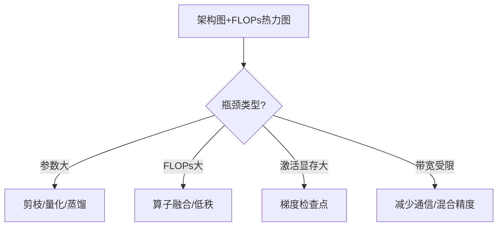

# 模型架构可视化深度解析 (Model Architecture Visualization)

> 中文简称：模型架构可视化深度解析

> **一句话理解**: 模型架构可视化把"层与层如何连接"变成图——用结构图、计算图与参数面板，让架构可沟通、可调试、可审计。

---

## 目录

1. [背景与动机](#1-背景与动机)
2. [核心概念](#2-核心概念)
3. [架构图的层次](#3-架构图的层次)
4. [计算图可视化](#4-计算图可视化)
5. [参数与 FLOPs 分析](#5-参数与-flops-分析)
6. [工具链](#6-工具链)
7. [可视化实现要点](#7-可视化实现要点)
8. [调试用例](#8-调试用例)
9. [对比表](#9-对比表)
10. [应用场景](#10-应用场景)
11. [局限与误区](#11-局限与误区)
12. [关联](#关联)

---

## 1. 背景与动机

现代模型动辄数十层、上亿参数，架构复杂度远超人脑可直接把握。**模型架构可视化**（Model Architecture Visualization）把模型的结构、数据流、参数分布与计算开销以图形方式呈现，服务于沟通、调试与审计三大目的。

### 1.1 三大用途

| 用途 | 说明 | 受众 |
|------|------|------|
| 沟通 | 论文/汇报里展示架构 | 决策者/同行 |
| 调试 | 定位形状错误/连接错误 | 工程师 |
| 审计 | 核对参数量/FLOPs/层构成 | 架构师/运维 |

### 1.2 为什么需要专门的可视化

| 单看代码的问题 | 可视化价值 |
|----------------|------------|
| 层次关系不直观 | 一图看清连接 |
| 形状错误难发现 | 计算图标注 shape |
| 参数分布不可见 | 参数面板直方图 |
| 改动影响难评估 | diff 前后架构图 |

---

## 2. 核心概念

### 2.1 模型的图表示

一个神经网络可视为有向无环图（DAG）：节点=层/算子，边=张量流。可视化即对该图布局（layout）并编码形状/类型/参数。

### 2.2 关键信息维度

| 维度 | 内容 | 可视化方式 |
|------|------|------------|
| 拓扑 | 层连接关系 | 节点+边 |
| 形状 | 每层输入输出张量 | 节点标注 |
| 类型 | conv/linear/attention | 颜色编码 |
| 参数 | 权重形状/数量 | 节点面板 |
| 开销 | FLOPs/显存 | 节点大小/颜色 |
| 激活 | 输出分布 | 叠加直方图 |

---

## 3. 架构图的层次

### 3.1 四层抽象

| 层次 | 内容 | 工具 | 受众 |
|------|------|------|------|
| 概念层 | block/模块流水线 | 手绘/draw.io/mermaid | 决策者 |
| 逻辑层 | 模块+数据流 | plot_neural_net/mermaid | 架构师 |
| 物理层 | 计算图（算子级） | Netron/TensorBoard graph | 工程师 |
| 实现层 | 参数/权重细节 | 框架 summary/面板 | 调优者 |

### 3.2 概念层示例（mermaid）


### 3.3 何时用哪层

| 场景 | 推荐层次 |
|------|----------|
| 论文配图 | 概念/逻辑层 |
| 调试 shape 错误 | 物理（计算图）层 |
| 参数审计 | 实现层 |
| 汇报演示 | 概念层 |

---

## 4. 计算图可视化

### 4.1 静态图 vs 动态图

| 类型 | 代表 | 可视化 |
|------|------|--------|
| 静态图 | TF1/ONNX | 完整 DAG 可导出 |
| 动态图 | PyTorch | 需 trace/script 后可视化 |

### 4.2 导出与查看

```python
import torch
# TorchScript trace
scripted = torch.jit.script(model)
scripted.save("model.pt")
# 或导出 ONNX
dummy = torch.randn(1, 3, 224, 224)
torch.onnx.export(model, dummy, "model.onnx")
# 用 Netron 打开 model.onnx / model.pt
```

### 4.3 计算图的价值

- 检查算子是否被正确融合（推理优化）。
- 定位异常分支/未使用层。
- 核对量化/剪枝后的图变化。

---

## 5. 参数与 FLOPs 分析

### 5.1 参数面板

| 信息 | 用途 |
|------|------|
| 每层参数量 | 找"重层"做优化 |
| 总参数量 | 模型规模 |
| 可训练/冻结 | 微调策略 |
| 参数分布直方图 | 检查初始化/死权重 |

### 5.2 FLOPs 与显存

```python
# 用 thop / fvcore 估算
from thop import profile
flops, params = profile(model, inputs=(dummy,))
print(f"FLOPs={flops/1e6:.1f}M, Params={params/1e6:.1f}M")
```

| 指标 | 含义 | 用途 |
|------|------|------|
| FLOPs | 浮点运算量 | 推理速度估计 |
| MACs | 乘加次数 | 硬件相关 |
| 激活显存 | 中间张量大小 | 显存瓶颈 |
| 参数显存 | 权重占用 | 模型大小 |

### 5.3 层开销热力图

把每层 FLOPs/参数量映射为节点颜色，一眼看出"计算大头"在哪。

---

## 6. 工具链

| 工具 | 类型 | 强项 |
|------|------|------|
| Netron | 通用 | 支持 ONNX/PT/TF/TFLite，交互 |
| TensorBoard Graph | 训练图 | 与训练日志联动 |
| torchviz | PyTorch | 动态图 trace 可视化 |
| plot_neural_net | 概念图 | 论文级精美架构图 |
| draw.io/mermaid | 通用绘图 | 概念/逻辑层 |
| fvcore/thop | 参数/FLOPs | 自动统计 |
| HF `model.summary` | 文本 | 层表概览 |
| Microsoft NN 洞察 | 在线 | 交互探索 |

---

## 7. 可视化实现要点

### 7.1 模型摘要表

```python
# PyTorch 简易摘要
def summary(model, input_size):
    # 遍历模块，打印层名/输出形状/参数量
    ...
# 或用 torchinfo
import torchinfo
torchinfo.summary(model, input_size=(1,3,224,224))
```

### 7.2 设计原则

| 原则 | 说明 |
|------|------|
| 分层折叠 | 大模型默认折叠，按需展开 |
| 颜色语义 | 同类层同色 |
| 标注形状 | 每边标张量形状 |
| 高亮异常 | 死层/超大层标红 |
| 可导出 | 支持 PNG/SVG/交互 |

### 7.3 与训练监控联动

把架构图与 [[94_可视化/02_训练可视化/07_训练_监控_可视化|训练监控]] 联动：点击某层查看其梯度/激活直方图。

---

## 8. 调试用例

### 8.1 用例：形状不匹配

计算图标注每层输出 shape，快速定位哪一层 shape 不对。

### 8.2 用例：参数未更新

参数面板标记"冻结/可训练"，核对哪些层未参与训练。

### 8.3 用例：显存爆炸

激活显存热力图定位占用最大的层，考虑梯度检查点（gradient checkpointing）。

### 8.4 用例：推理慢

FLOPs 热力图找"计算大头"，针对性优化（融合/量化/剪枝）。

---

## 9. 对比表

### 9.1 工具能力对比

| 工具 | 交互 | 算子级 | 参数/FLOPs | 论文图 | 格式支持 |
|------|------|--------|------------|--------|----------|
| Netron | ✅ | ✅ | 部分 | 否 | 广 |
| TensorBoard graph | ✅ | ✅ | 否 | 否 | TF/PT |
| torchviz | 静态 | ✅ | 否 | 否 | PT |
| plot_neural_net | 否 | 否 | 否 | ✅ | — |
| mermaid/draw.io | ✅ | 否 | 否 | 中 | — |
| fvcore/thop | 否 | 否 | ✅ | 否 | PT |

### 9.2 层次 vs 工具

| 层次 | 首选工具 |
|------|----------|
| 概念 | mermaid/draw.io/plot_neural_net |
| 逻辑 | mermaid + 摘要表 |
| 物理（计算图） | Netron/TensorBoard |
| 实现（参数） | torchinfo/fvcore |

---

## 10. 应用场景

| 场景 | 用法 |
|------|------|
| 论文配图 | 概念层架构图 |
| 复现论文 | 对照计算图核对 |
| 模型压缩 | 看参数/FLOPs 分布 |
| 迁移学习 | 标注冻结/可训练层 |
| 端侧部署 | 导出 ONNX 后查图 |
| 教学演示 | 概念层动画 |
| 审计合规 | 参数与计算路径核对 |
| 架构搜索 | 对比候选架构开销 |

---

## 11. 局限与误区

| 局限/误区 | 说明 |
|-----------|------|
| 大模型图过密 | 需折叠/子图 |
| 概念图失真 | 与实际计算图可能有差 |
| 动态图难可视化 | 需 trace，可能丢控制流 |
| FLOPs ≠ 实测速度 | 受内存带宽/算子影响 |
| 过度美化 | 论文图美化掩盖真实结构 |
| 只看参数量 | 忽视激活显存/带宽 |
| 图过时 | 改代码未同步更新图 |


---

## 附录 A：架构图绘制清单

| 检查项 | 说明 |
|--------|------|
| 层次清晰 | 用哪层抽象已定 |
| 形状标注 | 每层输入输出 shape |
| 颜色语义 | 同类同色 |
| 参数/FLOPs | 关键层标注开销 |
| 数据流方向 | 箭头明确 |
| 折叠策略 | 大模型可折叠 |
| 来源/版本 | 标注模型版本 |
| 与代码一致 | 图随代码更新 |

---

## 附录 B：模型摘要表示例

| Layer | Type | Output Shape | Param # |
|-------|------|--------------|---------|
| embed | Embedding | [B, T, 768] | 39M |
| block.0 | Transformer | [B, T, 768] | 7M |
| ... | ... | ... | ... |
| head | Linear | [B, T, V] | 23M |
| **Total** | | | **110M** |

---

## 附录 C：从架构图到优化的决策




---

## 附录 D：量化/剪枝后的架构对比

| 变换 | 图变化 | 关注 |
|------|--------|------|
| 量化 | 算子类型变（QConv） | 精度-速度权衡 |
| 剪枝 | 连接/通道减少 | 稀疏度 |
| 蒸馏 | 学生图更小 | 参数对比 |
| 融合 | 多算子合一 | 推理加速 |
| 算子替换 | 等价但更快算子 | 数值一致性 |

### D.1 融合可视化

融合前后计算图并排，标注省去的中间写回。

### D.2 稀疏可视化

剪枝后用稀疏矩阵图（spy plot）展示权重非零分布。

---

## 附录 E：架构可视化在 NAS 中的应用

神经架构搜索（NAS）产出大量候选架构，用架构图+FLOPs/精度散点快速对比与筛选。

---

## 附录 F：术语速查

| 术语 | 含义 |
|------|------|
| DAG | 有向无环图 |
| Compute Graph | 计算图 |
| ONNX | 开放神经网络交换 |
| FLOPs | 浮点运算量 |
| MACs | 乘加次数 |
| Fusion | 算子融合 |
| Pruning | 剪枝 |
| Quantization | 量化 |
| Checkpoint | 检查点 |

---

## 附录 G：Netron 实战要点

### G.1 支持格式

| 格式 | 来源 |
|------|------|
| ONNX | 通用交换 |
| PT/PTH | PyTorch |
| PB | TensorFlow |
| TFLite | 移动端 |
| CoreML | Apple |
| TorchScript | PyTorch 脚本 |

### G.2 常用操作

| 操作 | 用途 |
|------|------|
| 点击节点 | 查看属性/shape |
| 折叠子图 | 简化大图 |
| 搜索层名 | 定位特定层 |
| 导出图片 | 汇报用 |
| 对比版本 | diff 架构变化 |

### G.3 与推理优化联动

把 Netron 图与推理 profiler 对照：图上找"重算子"，profiler 找"耗时算子"，双管齐下优化。

---

## 附录 H：架构可视化在不同框架的差异

| 框架 | 原生可视化 | 导出建议 |
|------|------------|----------|
| PyTorch | torchviz（动态） | TorchScript/ONNX → Netron |
| TensorFlow | TensorBoard graph（静态） | 直接看 |
| JAX/Flax | 需导出 | ONNX → Netron |
| ONNX | Netron 原生 | 直接 |
| TFLite | Netron | 直接 |

---

## 附录 I：架构图的演进叙事

| 时代 | 代表架构 | 图示特点 |
|------|----------|----------|
| 经典 CNN | LeNet/VGG | 线性堆叠 |
| 残差网络 | ResNet | 跳连 |
| 注意力 | Transformer | 多头并行 |
| 生成 | GAN/Diffusion | 双网络/迭代 |
| 大模型 | GPT/Llama | 深层堆叠+归一化变体 |

---

## 附录 J：架构可视化设计清单

| 检查项 | 说明 |
|--------|------|
| 明确层次 | 概念/逻辑/物理/实现选其一 |
| 标注 shape | 每层输入输出张量 |
| 颜色语义 | 同类层同色 |
| 参数/FLOPs | 关键层标开销 |
| 折叠策略 | 大模型默认折叠 |
| 与代码一致 | 图随代码更新 |
| 可导出 | PNG/SVG/交互 |
| 含版本来源 | 标注模型版本 |

---

## 附录 K：常见问题（FAQ）

| 问题 | 解答 |
|------|------|
| 论文用什么画图？ | 概念层用 plot_neural_net/draw.io。 |
| 调试 shape 用什么？ | Netron 看计算图 shape。 |
| 参数量怎么数？ | torchinfo/fvcore 自动统计。 |
| FLOPs 和实测差很多？ | 受带宽/算子影响，需实测。 |
| 大模型图太密？ | 折叠+子图+按需展开。 |
| 动态图怎么看？ | TorchScript trace 后看。 |
---

## 关联

- [[94_可视化/index|可视化首页]]
- [[94_可视化/System_Viz/index|System Viz]]
- [[94_可视化/01_最佳实践/04_Visualization_简明指南|神经网络可视化]]
- [[03_深度学习/index|深度学习]]
- [[12_架构基建/index|架构基建]]
- [[10_部署推理/index|部署推理]]
- [[07_模型训练/index|模型训练]]
- [[工具/index|工具]]

---

*Last updated: 2026-07-23*
