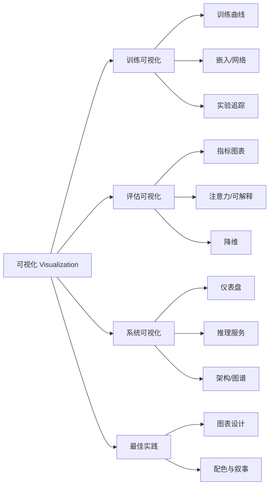

# 可视化（Visualization）

> 中文简称：可视化 ｜ English Name: Visualization

> **一句话理解**: 可视化章节是 AI 知识库的"眼睛"——把训练、评估、系统三类过程与结果，用图表、仪表盘与交互式视图呈现出来，让模型行为可观测、可解释、可决策。

AI 可视化知识体系（Visualization Knowledge Base）涵盖训练监控（training monitoring）、评估结果（evaluation results）、系统架构（system architecture）与最佳实践（best practices）四大方向的可视化方法。本章节面向 ML 工程师、研究员、平台工程师与数据分析师，提供从原理到工具的完整导航。

---

## 一、章节定位与价值

| 维度 | 说明 |
|------|------|
| **解决什么问题** | 训练发散看不见、评估指标读不懂、系统黑盒难排查、图表误导决策 |
| **核心方法** | 训练曲线分析、注意力/降维可视化、架构图与仪表盘、图表设计原则 |
| **与谁协作** | [[07_模型训练/INDEX|模型训练]]、[[08_模型评估/INDEX|模型评估]]、[[12_架构基建/INDEX|架构基建]]、[[11_模型运维/INDEX|模型运维]] |
| **工具栈** | TensorBoard / Weights & Biases / Plotly / D3.js / ECharts / t-SNE / UMAP |

---

## 二、四大子域导航

| 子域 | 关注点 | 典型问题 | 入口 |
|------|--------|----------|------|
| **训练可视化** | 训练过程可观测 | Loss 为何不降？梯度是否爆炸？ | [[94_可视化/INDEX|Training Viz]] |
| **评估可视化** | 模型质量可解读 | 哪些样本错？注意力看哪里？嵌入如何分布？ | [[94_可视化/03_评估可视化/INDEX|Evaluation Viz]] |
| **系统可视化** | 系统运行可观测 | 延迟/P95 多少？知识图谱长啥样？ | [[94_可视化/04_系统可视化/INDEX|System Viz]] |
| **最佳实践** | 图表设计有章法 | 选什么图？怎么配色？如何叙事？ | [[94_可视化/01_最佳实践/INDEX|Best Practices]] |

---

## 三、文件导航（章节总览）

### 入门与概览

| 文件 | 说明 | 适用人群 |
|------|------|----------|
| [[94_可视化/README|README]] | Visualization module overview and knowledge map | all readers |
| [[94_可视化/README|README for dummy]] | Visualization beginner guide and quick start | newcomers / beginners |
| [[94_可视化/README.md|Visualization for dummy]] | 工具选择与常见陷阱 | beginners |

### 训练可视化（Training Viz）

| 文件 | 说明 | 适用人群 |
|------|------|----------|
| [[94_可视化/02_训练可视化/07_训练_监控_可视化|Training Monitoring Visualization]] | Loss/梯度/激活实时跟踪 | ML 工程师 |
| [[94_可视化/02_训练可视化/06_训练_Curves_分析.md|Training Curves Analysis]] | 训练曲线分析（损失/梯度/学习率） | ML 工程师 / 深度学习实践者 |
| [[94_可视化/Training_Viz/Embedding_Visualization_Guide|Embedding Visualization Guide]] | 嵌入空间可视化 | DL 研究员 |
| [[94_可视化/01_最佳实践/04_Visualization_简明指南|Neural Network Visualization Guide]] | 神经网络结构与特征可视化 | DL 研究员 |
| [[94_可视化/02_训练可视化/03_实验追踪_可视化|Experiment Tracking Visualization]] | 实验对比与追踪 | ML 工程师 |
| [[94_可视化/Training_Viz/Data_Pipeline_Feature_Visualization|Data Pipeline & Feature Visualization]] | 数据管道与特征可视化 | 数据工程师 |

### 评估可视化（Evaluation Viz）

| 文件 | 说明 | 适用人群 |
|------|------|----------|
| [[94_可视化/01_最佳实践/04_Visualization_简明指南|Evaluation Visualization Guide]] | 混淆矩阵/ROC/PR/雷达图 | ML 工程师 |
| [[94_可视化/03_评估可视化/02_注意力可视化.md|Attention Visualization]] | 注意力可视化（注意力图/热力图） | NLP/CV 研究员 |
| [[94_可视化/Evaluation_Viz/Model_Interpretability_Visualization|Model Interpretability Visualization]] | SHAP/LIME/可解释性 | 可解释性研究员 |
| [[94_可视化/03_评估可视化/03_降维可视化.md|Dimensionality Reduction Viz]] | t-SNE/UMAP/PCA 降维可视化 | DL 研究员 |

### 系统可视化（System Viz）

| 文件 | 说明 | 适用人群 |
|------|------|----------|
| [[94_可视化/System_Viz/AI_System_Dashboard|AI System Dashboard]] | 监控/告警/运维仪表盘 | 平台工程师 |
| [[94_可视化/System_Viz/Inference_Serving_Visualization|Inference Serving Visualization]] | 推理服务可视化 | 推理工程师 |
| [[94_可视化/System_Viz/Knowledge_Graph_Visualization|Knowledge Graph Visualization]] | 知识图谱布局与交互 | 图谱工程师 |
| [[94_可视化/04_系统可视化/05_模型_架构_Viz|Model Architecture Viz]] | 模型架构可视化 | 架构师 / 研究员 |

### 最佳实践（Best Practices）

| 文件 | 说明 | 适用人群 |
|------|------|----------|
| [[94_可视化/Best_Practices/Data_Visualization_Best_Practices|Data Visualization Best Practices]] | 图表选择/配色/标注 | 全体实践者 |
| [[94_可视化/01_最佳实践/02_数据_Viz_最佳实践.md|Data Viz Best Practices]] | 数据可视化最佳实践（深度版） | 数据分析师 |

---

## 四、可视化分类总览

---

## 五、按角色推荐阅读路径

| 角色 | 推荐顺序 | 目标 |
|------|----------|------|
| ML 工程师 | 训练监控 → 训练曲线分析 → 实验追踪 → 评估指南 | 跑实验、读曲线、对比结果 |
| DL 研究员 | 嵌入可视化 → 降维可视化 → 注意力可视化 → 网络可视化 | 理解模型内部表征 |
| 平台/运维工程师 | AI 系统仪表盘 → 推理服务可视化 → 最佳实践 | 保障系统稳定 |
| 数据分析师 | 数据可视化最佳实践 → 评估指南 → 数据管道可视化 | 讲好数据故事 |
| 初学者 | README for dummy → Visualization for dummy → 数据可视化最佳实践 | 建立直觉 |

---

## 六、工具速查

| 工具 | 强项 | 适用场景 | 关联 |
|------|------|----------|------|
| TensorBoard | 训练日志原生支持 | 训练曲线/嵌入 | [[94_可视化/INDEX|Training Viz]] |
| Weights & Biases | 实验追踪/协作 | 多实验对比 | [[09_测试/02_测试框架/09_Weights_Biases_深入分析|Weights & Biases]] |
| Plotly / Dash | 交互式图表 | 评估图表/仪表盘 | [[94_可视化/03_评估可视化/INDEX|Evaluation Viz]] |
| ECharts / D3.js | Web 可视化 | 系统仪表盘 | [[94_可视化/04_系统可视化/INDEX|System Viz]] |
| t-SNE / UMAP | 降维投影 | 嵌入/特征 | [[94_可视化/03_评估可视化/03_降维可视化.md|降维可视化]] |
| Captum / SHAP | 可解释性 | 归因/注意力 | [[94_可视化/Evaluation_Viz/Model_Interpretability_Visualization|可解释性]] |

---

## 七、可视化常见陷阱速查

| 陷阱 | 表现 | 正确做法 | 关联 |
|------|------|----------|------|
| 截断 y 轴 | 夸大差异 | 柱状图 y 轴从 0 起 | [[94_可视化/01_最佳实践/02_数据_Viz_最佳实践.md|最佳实践]] |
| 用饼图比微小占比 | 难以辨别 | 改用条形图 | [[94_可视化/Best_Practices/Data_Visualization_Best_Practices|图表选择]] |
| 颜色过多/红绿混用 | 色盲不友好 | 限 5 色+色盲安全调色板 | [[94_可视化/01_最佳实践/02_数据_Viz_最佳实践.md|配色]] |
| 训练曲线只看最终值 | 误判收敛 | 看趋势+方差+学习率 | [[94_可视化/02_训练可视化/06_训练_Curves_分析.md|曲线分析]] |
| t-SNE 误解为距离 | 过度解读簇间距 | 结合局部/全局+多随机种子 | [[94_可视化/03_评估可视化/03_降维可视化.md|降维]] |
| 注意力≠因果 | 把权重当解释 | 配合归因方法交叉验证 | [[94_可视化/03_评估可视化/02_注意力可视化.md|注意力]] |

---

## 八、章节维护说明

- 本 index 是可视化章节的总入口，新增文件后请同步更新"文件导航"与子域 index。
- 深度页（Deep Dive）须 ≥ 450 行，含 ≥ 3 表格、≥ 7 wikilink，遵循 [[治理/Document_Templates|文档模板规范]]。
- 图表示例首选 Mermaid，次选 ASCII/表格，避免依赖外链图片。
- 质量验收参见 [[治理/Quality_Metrics|质量度量]] 的深度评分卡。

---

## 九、可视化技术名词速查

| 术语 | 含义 | 所属子域 |
|------|------|----------|
| Training Curve | 训练过程指标随步数/epoch 变化的曲线 | Training |
| Gradient Norm | 梯度范数，用于判断爆炸/消失 | Training |
| Learning Rate Schedule | 学习率随训练进度调整的策略 | Training |
| Confusion Matrix | 分类结果的对错分布矩阵 | Evaluation |
| ROC / PR Curve | 阈值变化下的查全-查准权衡 | Evaluation |
| Attention Map | 注意力权重的热力图 | Evaluation |
| Saliency / Attribution | 输入对输出贡献的归因 | Evaluation |
| t-SNE / UMAP | 高维数据非线性降维投影 | Evaluation |
| Embedding Projector | 嵌入向量空间交互式浏览器 | Training/Evaluation |
| Dashboard | 聚合多指标的运维仪表盘 | System |
| Knowledge Graph | 实体-关系图的可视化 | System |
| Architecture Diagram | 模型/系统结构图 | System |
| Color Palette | 配色方案（含色盲安全） | Best Practices |
| Data Storytelling | 用图表讲数据故事 | Best Practices |

---

## 十、学习路径建议

| 阶段 | 内容 | 时间 | 产出 |
|------|------|------|------|
| 入门 | README for dummy + 最佳实践 | 1 天 | 选对图表+避开陷阱 |
| 基础 | 训练曲线分析 + 评估指南 | 2-3 天 | 能读懂训练与评估结果 |
| 进阶 | 注意力/降维/可解释性 | 3-5 天 | 能解读模型内部表征 |
| 实战 | 仪表盘 + 实验追踪 + 工具链 | 1 周 | 搭建自己的可视化流程 |
| 精通 | 配色/叙事/交互式可视化 | 持续 | 用可视化驱动决策 |

---

## 关联

- [[07_模型训练/index|模型训练]] — 可视化的训练侧来源
- [[08_模型评估/index|模型评估]] — 可视化的评估侧来源
- [[12_架构基建/index|架构基建]] — 系统可视化的架构基础
- [[11_模型运维/index|模型运维]] — 仪表盘与告警的运维上下文
- [[09_测试/02_测试框架/09_Weights_Biases_深入分析|Weights & Biases]] — 实验追踪工具
- [[03_深度学习/index|深度学习]] — 注意力/嵌入/降维的理论基础
- [[94_可视化/README.md|治理最佳实践]] — 跨章节最佳实践参考

---

*Last updated: 2026-07-23*

## 相关文档

- [[94_可视化/README.md|AI 可视化速览 (nutshell)]]

## 统计

| 指标 | 数值 |
|------|------|
| 总文件数 | 18 |
| 最后更新 | 2026-08-05 |
