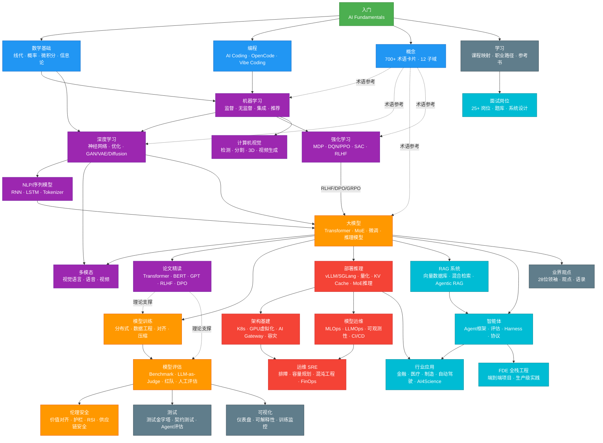
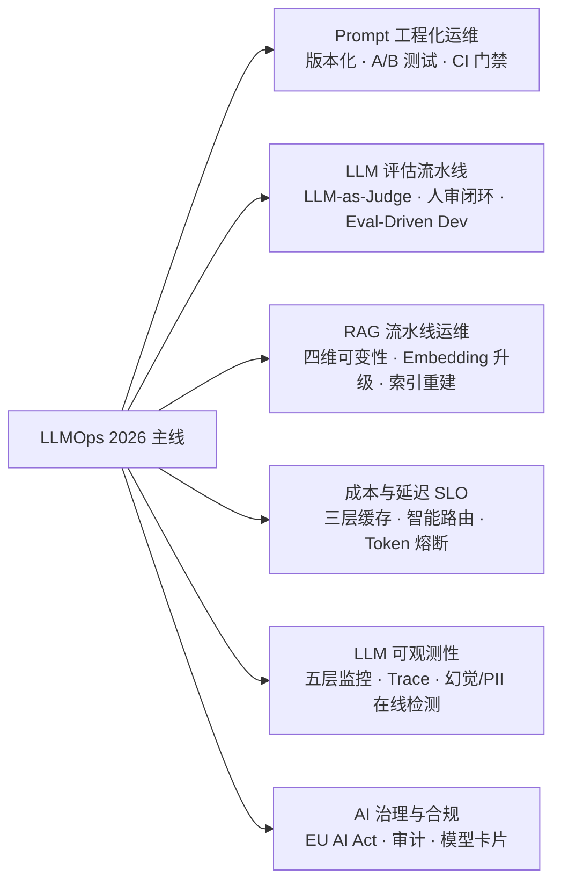

> 中文简称：AI Guru 知识库

<div align="center">

<h1> AI Guru 知识库</h1>

<p><strong>这可能是 GitHub 上最全面的 AI 学习资源</strong></p>

<p>从理论到生产的完整 AI 知识体系 | 2,826 篇核心文档 + 700 概念卡片 | 1,928 万字 | LLMOps 完整主线 | 2026 最新</p>

<p>
 <a href="#-快速开始"> 快速开始</a> •
 <a href="#-为什么选-ai-guru"> 为什么选择</a> •
 <a href="#-内容导航"> 内容导航</a> •
 <a href="#-适用人群"> 适用人群</a> •
 <a href="#-下载到本地工具"> 下载到本地</a>
</p>

<p>
 
 
 
 
 
 
 
 
</p>

<p>
 <a href="./README_EN.md">English Version</a>
</p>

</div>

---

## 为什么选 AI Guru？

> **问题**：AI 领域变化太快，学习者面临信息碎片化、内容过时、理论与实践脱节的困境
>
> **解决方案**：AI Guru 是生产级的知识体系，帮你从 0 到 1 掌握 AI，从理论直达生产部署

### 核心亮点

<table>
<tr>
<td width="50%">

** 内容全面**
- 2,061 篇核心知识文档 + 700+ 概念卡片
- ~1,894 万字符（约 3,000 页 A4）
- 24 大知识章节 + 12 子域概念网络
- 覆盖从数学基础到 AGI 前沿

</td>
<td width="50%">

** 双轨学习**
- **速成路径**：70+ 篇 in-nutshell 指南
- **系统学习**：24 大章节深度剖析
- **入门友好**：48 篇 for_dummy 指南
- **岗位备考**：140 篇面试指南

</td>
</tr>
<tr>
<td width="50%">

** 2026 最新**
- GPT-5.2 / Claude 4.5 / DeepSeek-R1 架构
- 中国六大厂商 (DeepSeek/Qwen/GLM/Kimi/MiniMax/MiMo)
- **LLMOps 完整主线**（Prompt/Eval/RAG/Cost/Observability）
- Agent 生产部署 + MCP/A2A 协议

</td>
<td width="50%">

** 生产就绪**
- K8s + GPU 集群部署方案
- MLOps + LLMOps 全流水线
- 推理成本优化（量化/路由/缓存）
- 企业级安全合规（EU AI Act）

</td>
</tr>
</table>

### 数据说话

```
 2,061 篇核心文档     1,894 万字符（约 3,000 页 A4）
 24 个知识章节         70+ 篇速成指南 (in-nutshell)
 48 篇入门指南 (for_dummy)     700+ 概念卡片（12 子域）
 240 篇 Agent 专题     157 篇业界领袖观点
 140 篇面试指南        87 篇行业应用案例
```

>  **核心文档**（24 章节目录）：2,061 篇 / 1,894 万字 ｜ **概念卡片**（12 子域）：700+ 张

#### 各目录统计

| 目录 | 文件数 | 字符数 | 占比 |
|---------|--------|--------|------|
| **概念** | 700+ | — | — |
| 15_智能体 | 240 | 284.5 万 | 15.0% |
| 19_业界观点 | 157 | 96.0 万 | 5.1% |
| 05_大模型 | 154 | 230.4 万 | 12.2% |
| 21_面试岗位 | 140 | 87.5 万 | 4.6% |
| 12_架构基建 | 140 | 151.3 万 | 8.0% |
| 90_学习 | 123 | 86.2 万 | 4.6% |
| 11_模型运维 | 115 | 113.0 万 | 6.0% |
| 10_部署推理 | 105 | 94.0 万 | 5.0% |
| 16_编程 | 95 | 65.5 万 | 3.5% |
| 18_行业应用 | 87 | 42.0 万 | 2.2% |
| 22-FDE | 71 | 25.4 万 | 1.3% |
| 20_论文精读 | 69 | 58.5 万 | 3.1% |
| 02_机器学习 | 64 | 45.5 万 | 2.4% |
| 治理 | 64 | — | — |
| 17_伦理安全 | 63 | 43.8 万 | 2.3% |
| 07_模型训练 | 62 | 76.3 万 | 4.0% |
| 14_RAG系统 | 62 | 56.7 万 | 3.0% |
| 01_数学基础 | 60 | 49.2 万 | 2.6% |
| 03_深度学习 | 55 | 49.9 万 | 2.6% |
| 13_运维 | 52 | 37.5 万 | 2.0% |
| 08_模型评估 | 48 | 58.5 万 | 3.1% |
| 06_强化学习 | 44 | 53.5 万 | 2.8% |
| 04_计算机视觉 | 41 | 31.3 万 | 1.7% |
| 09_测试 | 30 | 31.8 万 | 1.7% |
| 00_入门 | 27 | 24.2 万 | 1.3% |
| 94_可视化 | 28 | 27.1 万 | 1.4% |
| **总计** | **2,061** | **1,894 万** | **100%** |

>  提示：运行 `python3 工具/count_words.py` 可查看最新的实时统计

---

## 快速开始

### 方式一：直接阅读（推荐）

```bash
# 克隆仓库
git clone https://github.com/your-org/ai-guru-knowledge-base.git

# 进入仓库根目录
cd ai-guru-knowledge-base

# 从 README 开始探索
less README.md
```

### 方式二：Web 端浏览

```bash
cd 前端应用/
npm install
npm run dev
# 访问 http://localhost:5173
```

### 方式三：导入到 AI 工具

支持导入到 NotebookLM、ima、Claude Projects 等：

```bash
# 下载完整知识库
git clone --depth 1 https://github.com/your-org/ai-guru-knowledge-base.git
```

**核心章节架构**：每个章节有 `README.md` 入口 + `for_dummy` 入门 + `in-nutshell` 速查，三层阅读路径。

---

## 适用人群

<table>
<tr>
<td align="center" width="25%">

** 运维/开发工程师**

转型 AI Agent 工程师

 15-20 小时

[速成指南 →](#-速成路径-in-nutshell)

</td>
<td align="center" width="25%">

** 大学生/自学者**

系统学习 AI 全栈

 16-20 周

[大学课程 →](./00_入门/)

</td>
<td align="center" width="25%">

** 产品经理**

理解 AI 能力边界

 8-10 小时

[行业应用 →](./18_行业应用/)

</td>
<td align="center" width="25%">

** 研究人员**

追踪前沿技术

 自主学习

[必读论文 →](./20_论文精读/)

</td>
</tr>
</table>

---

## 内容导航

### 全库知识图谱与学习路径



**学习路径速查**:

| 角色 | 推荐路径 | 预计时间 |
|------|---------|---------|
| **零基础入门** | 入门 → 数学基础 → 机器学习 → 深度学习 | 16-20 周 |
| **LLM 工程师** | 大模型 → 模型训练 → 部署推理 → RAG系统 → 智能体 | 8-12 周 |
| **运维/SRE** | 部署推理 → 架构基建 → 模型运维 → 运维 | 4-8 周 |
| **AI 安全工程师** | 伦理安全 → 模型评估/红队 → 概念/Safety | 4-6 周 |
| **面试备战** | 面试岗位 → 论文精读 → 概念速查 → 学习 | 2-4 周 |
| **全栈工程师** | 入门 → 编程 → 大模型 → FDE 全栈工程 | 4-6 周 |

### 大学通识课程（入门）

完整的 AI 通识教育，支持 16 周学期制：

| 模块 | 内容 | 时长 |
|------|------|------|
| AI 基础概念 | 定义、类型、核心技术 | 2-3h |
| 技术全景 | 技术栈、算法、工具链 | 3-4h |
| 历史时间线 | 1950-2026，4 次 AI 浪潮 | 2-3h |
| 工具实践 | ChatGPT、Claude、Cursor | 3-4h |
| 伦理社会 | 偏见、隐私、治理 | 3-4h |
| 未来趋势 | AGI 路径、RSI、2026-2040 | 2-3h |
| + 概念词典 + 案例 + 实验 | 700+ 术语、6 案例、8 实验 | — |

### 速成路径（70+ 篇 In-Nutshell 指南）

适合工程师快速上手的实战指南：

```
阶段 1: 基础认知
├── ① LLM 基础（Token、上下文、Temperature）
└── ② Prompt Engineering（CoT、Few-shot）

阶段 2: 核心技能
├── ③ 模型训练（损失函数、优化器）
├── ④ 模型推理（部署、量化 INT8/FP8）
└── ⑤ RAG 系统（向量数据库、混合检索）

阶段 3: Agent 工程
├── ⑥ AI 智能体（ReAct、Function Calling）
├── ⑦ AI 技能（技能注册、组合）
└── ⑧ Agent 工作流（LangGraph、错误处理）

阶段 4: 生产保障
├── ⑨ AI 测试与评估（Metrics、LLM-as-Judge）
├── ⑩ MLOps 流水线（CI/CD、模型注册）
└── ⑪ AI 运维（可观测性、事故响应）
```

### LLMOps 完整主线

本知识库独有的 **LLMOps 全栈主线**，覆盖大模型时代 MLOps 的所有关键环节（11_模型运维/ 共 115 篇）：



| 文档 | 内容 |
|------|------|
| [LLMOps 2026](11_模型运维/10_LLMOps_大模型运维/05_LLMOps_2026.md) | 主线：传统 MLOps 失效的 7 大原因、三层架构、成熟度模型 |
| [Prompt 工程化运维](11_模型运维/11_Prompt运维/02_Prompt工程_Ops.md) | Prompt 即代码、版本化、A/B 测试、DSPy 自动优化 |
| [LLM 评估流水线](11_模型运维/README.md) | LLM-as-Judge、人审闭环、评估陷阱 |
| [RAG 流水线运维](11_模型运维/05_流程编排/11_RAG_流水线_Ops.md) | 四维可变性、Embedding 升级迁移、索引重建灰度 |
| [LLM 成本与延迟 SLO](11_模型运维/09_成本管理/03_LLM_成本_延迟_SLO.md) | 三层缓存、智能路由、Token 预算熔断、FinOps |
| [LLM 可观测性](11_模型运维/08_可观测性/09_LLM_可观测性.md) | 五层监控、分布式追踪、幻觉/毒性/PII 在线检测 |

> 加上横切关注点（数据版本/再训练/系统 SLO/成本/合规）与 16 个工具深度解析，LLMOps 共 115 篇文档。

### 24 大系统章节

从数学基础到生产部署的完整路径：

<details>
<summary><b>  展开查看完整目录</b></summary>

| 章节 | 核心内容 | 难度 |
|------|----------|------|
| **L0 基础层** | | |
| **00** [AI 简介与历史](./00_入门/) | 通识导入：基础概念、技术全景、历史、工具、伦理、未来 |  |
| **01** [基础理论](./01_数学基础/) | 数学与计算机：线代、概率、数据结构、分布式、AI 硬件 2026 |  |
| **L1 模型层** | | |
| **02** [经典机器学习](./02_机器学习/) | ML 基础：监督/无监督学习、特征工程、XGBoost |  |
| **03** [深度学习](./03_深度学习/) | 神经网络：MLP、反向传播、优化、世界模型 JEPA |  |
| **04** [计算机视觉](./04_计算机视觉/) | 视觉 AI：CNN、YOLO、Diffusion、视频生成 2026 |  |
| **05** [NLP 与大模型](./05_大模型/) | LLM 技术：Transformer、GPT-5.2/Claude 4.5、DeepSeek-R1、LoRA/RLHF/DPO |  |
| **06** [强化学习与智能体](./06_强化学习/) | RL 与 Agent：DQN/PPO、GRPO、VLA 具身智能 |  |
| **L2 工程层** | | |
| **07** [模型训练](./07_模型训练/) | 训练工程：损失函数、优化器、分布式训练、GRPO 对齐 |  |
| **08** [模型评估](./08_模型评估/) | 评估方法：指标体系、基准测试、LLM-as-Judge、A/B 测试 |  |
| **09** [AI 测试](./09_测试/) | 测试工程：Ragas/DeepEval/Promptfoo、契约测试、Eval-Driven Dev |  |
| **10** [部署与推理](./10_部署推理/) | 推理优化：vLLM/SGLang、量化、KV Cache、推理模型 |  |
| **L3 平台层** | | |
| **11** [MLOps 流水线](./11_模型运维/) | **LLMOps 完整主线** + 传统 MLOps + 工具深度解析（115 篇） |  |
| **12** [架构与基础设施](./12_架构基建/) | 架构设计 + 基础设施：K8s、多租户、高可用、GPU 集群、容量规划 |  |
| **13** [AI 运维](./13_运维/) | AIOps：事故响应、SRE 实践、混沌工程、K8s 排障 |  |
| **L4 应用层** | | |
| **14** [RAG 系统](./14_RAG系统/) | 检索增强：向量数据库、混合检索、Agentic RAG、多模态检索 |  |
| **15** [Agent 生产部署](./15_智能体/) | Agent 工程：框架、MCP/A2A 协议、Harness、技能、工作流、评估（240 篇） |  |
|  [Agent Skills](./15_智能体/05_Agent技能/) | 技能体系：技能注册、组合、生态 |  |
|  [Agent Workflow](./15_智能体/03_Agent工作流/) | 工作流：LangGraph、错误处理、编排 |  |
|  [Agent 评估](./15_智能体/07_Agent评估/) | 评估体系：Benchmark、红队测试、Leaderboard |  |
| **16** [AI 编程](./16_编程/) | 编程工具与方法论：Cursor、Claude Code、Vibe Coding |  |
| **22** [FDE 全栈工程](./22-FDE/) | 端到端全栈项目：系统设计、架构实践、生产部署 |  |
| **L5 治理层** | | |
| **17** [伦理与安全](./17_伦理安全/) | AI 安全：价值对齐、红队测试、RSI、隐私保护、OWASP LLM |  |
| **L6 资源层** | | |
| **18** [行业应用](./18_行业应用/) | 行业融合：医疗/金融/制造/零售/教育/自动驾驶 |  |
| **19** [业界观点](./19_业界观点/) | 领袖洞见：28 位 AI 领袖演讲与观点，含 2026 趋势合集 |  |
| **20** [必读论文](./20_论文精读/) | 经典文献：Transformer、BERT、GPT、RLHF、DPO 等里程碑 |  |
| **21** [面试与岗位](./21_面试岗位/) | 职业发展：25+ AI 岗位面试指南、题库、系统设计 |  |
| **拓展** | | |
| **90** [学习资源](./90_学习/) | 课程映射：微软/Datawhale/HuggingFace 等课程、职业路径 |  |
| **94** [可视化](./94_可视化/) | 知识图谱可视化：仪表盘、训练监控、评估可视化 |  |

</details>

### 概念卡片体系（700+ 张，12 子域）

原子化概念卡，以"一句话理解 + 2026 生态 + 生产最佳实践"三件套为标准：

| 子域 | 卡片数 | 说明 |
|------|--------|------|
| [概念/General](概念/General/index.md) | 151 | 跨域通用概念（基础/ML/DL/工具/云原生等） |
| [概念/LLM](概念/LLM/) | 118 | 大语言模型架构、训练、对齐、推理 |
| [概念/K8s](概念/K8s/) | 106 | Kubernetes 与云原生 AI 基础设施 |
| [概念/Training](概念/Training/) | 61 | 模型训练、分布式训练、优化 |
| [概念/Inference](概念/Inference/) | 43 | 推理引擎、服务化、性能优化 |
| [概念/RAG](概念/RAG/) | 41 | 检索增强生成、向量数据库、可观测性 |
| [概念/Agent](概念/Agent/) | 39 | AI 智能体、工具调用、多智能体 |
| [概念/GPU](概念/GPU/) | 34 | GPU 硬件、CUDA、集群管理 |
| [概念/Vision](概念/Vision/) | 28 | 计算机视觉、多模态 |
| [概念/MLOps](概念/MLOps/) | 28 | ML 运维、CI/CD、监控 |
| [概念/Safety](概念/Safety/README) | 26 | AI 安全、对齐、伦理、治理 |
| [概念/Math](概念/Math/) | 22 | 数学基础、优化理论 |
| **总计** | **700+** | **12 子域，原子化概念网络** |

> 每张概念卡均包含：YAML frontmatter（title/aliases/tags/summary/relationships/sources）、一句话理解、核心概念表、2026 生态表、生产最佳实践、延伸阅读。

---

## 2025-2026 AI 趋势速览

> 以下趋势帮助从业者快速把握方向。

| 趋势 | 关键洞察 | 本库对应章节 |
|------|----------|-------------|
| ** Agentic AI 大规模落地** | Gartner 预测 2026 年近 50% 企业软件将内嵌自主 Agent 工具；McKinsey 估算 Agent 技术年价值 $2.6-4.4 万亿；但 >40% Agentic AI 项目可能因治理不足被砍 | [15_智能体](./15_智能体/) — 240 篇 Agent 全栈文档 |
| ** 推理模型与推理时计算扩展** | DeepSeek-R1 开创"推理时计算扩展"范式；RL 训练计算每数月增长 10 倍；o3/R1/Llama-4 推理模型路线图 | [05_大模型/Reasoning_Models](./05_大模型/12_推理模型/) + [07_模型训练/GRPO](./07_模型训练/06_对齐训练/02_GRPO_and_新型_对齐_Methods.md) |
| ** 小模型与高效推理崛起** | 紧凑型语言模型预计处理 60% 商业 AI 任务，基础设施成本降低 50%；"效率即新的扩展策略" | [10_部署推理/量化](./10_部署推理/04_模型量化/) + [边缘LLM](./05_大模型/10_端侧LLM/) |
| ** 多模态 + 具身智能加速** | 多模态模型融合视觉、语言与动作，58% 企业已使用物理机器人，VLA 成为新方向 | [04_计算机视觉](./04_计算机视觉/) + [06_强化学习/VLA](./06_强化学习/04_具身智能/) |
| ** AI 安全治理与合规常态化** | EU AI Act 进入执行阶段，80% 受监管行业须实施强制合规框架；RSI（递归自我改进）成为对齐研究新焦点 | [17_伦理安全](./17_伦理安全/) + [概念/Safety/RSI](概念/Safety/recursive-self-improvement.md) |
| ** MCP/A2A 协议标准化** | MCP（模型上下文协议）成为 Agent 工具调用事实标准；A2A（Agent-to-Agent）推动多 Agent 协作 | [15_智能体/Agent 协议](15_智能体/01_Agent基础/07_Agent_协议_2026.md) |

>   **综合建议**：2026 年的 AI 从业者应重点关注 **Agent 工程化** + **推理效率优化** + **安全合规** 三大主线——本知识库以 LLMOps + Agent + Safety 三大板块完整覆盖。

---

## 下载到本地工具

AI Guru 知识库可以作为高质量语料导入到各种 AI 工具中：

### NotebookLM (Google)

1. 访问 [notebooklm.google.com](https://notebooklm.google.com)
2. 创建新项目，选择 "GitHub" 或上传 ZIP
3. 粘贴仓库 URL：`https://github.com/your-org/ai-guru-knowledge-base`
4. NotebookLM 会自动分析所有文档，生成摘要和问答

### ima (腾讯)

1. 打开 ima 应用，创建知识库
2. 导入本地文件夹，选择下载的仓库根目录
3. 即可通过对话查询知识库内容

### Claude Projects / ChatGPT GPTs

```bash
# 下载精简版（仅核心内容）
git clone --depth 1 --filter=blob:none --sparse https://github.com/your-org/ai-guru-knowledge-base.git
cd ai-guru-knowledge-base
git sparse-checkout set 00_入门 05_大模型 11_模型运维 15_智能体 概念

# 打包上传
zip -r ai-guru-core.zip 00_入门 05_大模型 11_模型运维 15_智能体 概念
```

### Obsidian

所有文档为 Markdown 格式，可直接作为 Obsidian Vault 打开（本库自带 `.obsidian/` 配置，支持 wiki 链接与图谱）：

```bash
# Obsidian 中直接"打开本地文件夹" → 选择仓库根目录
```

---

## Agent 友好说明

本知识库针对 AI Agent 进行了优化：

-  **结构化元数据**: 每个文档包含 frontmatter（title/category/tags/summary/relationships）
-  **清晰的层级**: 章节-文档-段落结构清晰，编号式目录便于检索
-  **三层入口**: 每章有 README + for_dummy + in-nutshell 三层阅读路径
-  **代码可执行**: 包含可运行的代码示例
-  **中英文对照**: 技术术语保留英文，便于理解原始概念
-  **Wiki 链接**: 6,900+ 内部 wikilink，形成知识图谱
-  **概念词典**: 700+ 张原子化概念卡，12 子域覆盖 AI 全栈
-  **版本控制**: Git 历史记录，可追溯更新

**建议的 Agent 使用方式**:
1. 将整个仓库根目录作为知识库导入
2. 使用文件路径作为上下文引用（如 `05_大模型/04_LLM架构/05_LLM架构.md`）
3. 结合章节 README 快速定位内容
4. 利用 [概念/](概念/) 做概念查询，[治理/](治理/) 做跨域关联
5. 用 [概念/index.md](概念/index.md) 做入口索引表

---

## 前端项目

包含现代化的知识库前端（React + Vite + TypeScript + Tailwind CSS + shadcn/ui）：

```bash
cd 前端应用/
npm install
npm run dev
```

特性：
-   Vite 极速构建
-   Tailwind CSS + shadcn/ui
-   全文搜索 (Fuse.js)
-   暗黑/亮色模式
-   响应式设计
-   Agent 评估仪表盘集成

[查看前端详情 →](./前端应用/README.md)

---

## 贡献指南

我们欢迎各种形式的贡献！

### 如何贡献

-  **内容**: 添加新指南、更新过时信息
-  **翻译**: 翻译成英文/其他语言
-  **前端**: 改进 Web 体验（React/Vite）
-  **Issue**: 报告问题或建议

### 快速开始

```bash
# Fork 并克隆
git clone https://github.com/your-username/ai-guru-knowledge-base.git

# 创建分支
git checkout -b feature/your-feature

# 提交更改
git commit -m "feat: 添加 XX 内容"
git push origin feature/your-feature
```

[查看完整贡献指南 →](治理/CONTRIBUTING.md)

---

## 许可证

本项目采用 **MIT 许可证** - 详见 [LICENSE](./LICENSE) 文件。

引用的论文、书籍和第三方项目遵循其原始许可证。

---

## 致谢

感谢所有为本知识库做出贡献的人。

特别感谢：
- DeepLearning.AI - 课程结构灵感
- Hugging Face - 开源 ML 生态
- 所有贡献者和读者

---

<div align="center">

<p><b>AI Guru</b> — 让 AI 学习更系统、更高效、更 accessible</p>

<p>
  ⭐ <b>Star 本仓库</b> 获取更新通知 •
    <b>Watch</b> 关注新内容 •
    <b>Fork</b> 创建你的版本
</p>

</div>

## Related

- [[治理/ROADMAP.md]] — AI Guru 知识库路线图
- [[治理/KNOWN_ISSUES.md]] — 已知问题追踪
- [[README_EN]] — English Version
- [[CONTRIBUTING]] — 贡献指南
- [[概念/index]] — 概念图谱首页
- [[概念/README]] — 概念卡片索引
- [[治理/README]] — 跨域综合文档索引
- [[治理/hot.md]] — 热门页面
- [[治理/plan]] — 项目规划与评估报告
- [[00_入门/01_基础入门/02_AI基础.md]] — 知识库入门索引