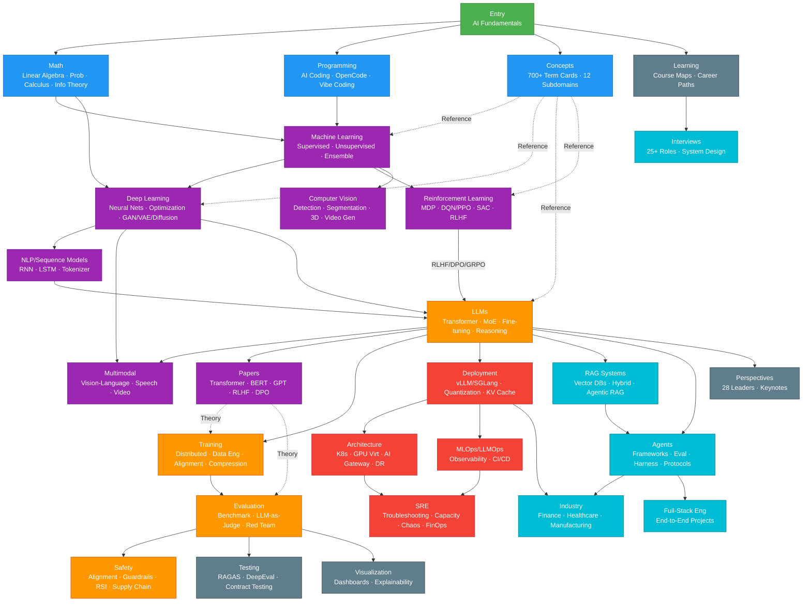
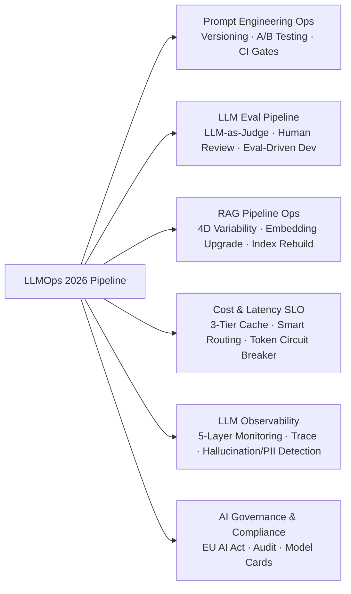

> 中文版：[README.md](./README.md)

<div align="center">

<h1> AI Guru Knowledge Base</h1>

<p><strong>Probably the Most Comprehensive AI Learning Resource on GitHub</strong></p>

<p>Complete AI Knowledge System from Theory to Production | 2,826 Core Docs + 700 Concept Cards | 19.3M Characters | LLMOps End-to-End | 2026 Latest</p>

<p>
 <a href="#-quick-start"> Quick Start</a> •
 <a href="#-why-ai-guru"> Why AI Guru</a> •
 <a href="#-content-navigation"> Content Navigation</a> •
 <a href="#-who-is-it-for"> Who Is It For</a> •
 <a href="#-download-for-local-tools"> Download for Local Tools</a>
</p>

<p>
 
 
 
 
 
 
 
 
</p>

<p>
 <a href="README.md"> 中文版</a>
</p>

</div>

---

## Why AI Guru?

> **The Problem**: AI evolves faster than ever. Learners struggle with fragmented information, outdated content, and the widening gap between theory and production deployment.
>
> **The Solution**: AI Guru is a production-grade knowledge system that bridges theory and practice, taking you from zero to AI mastery with a complete LLMOps pipeline.

### Key Highlights

<table>
<tr>
<td width="50%">

** Comprehensive Content**
- 2,826 core docs + 700 atomic concept cards
- ~18.9M characters (~3,000 A4 pages)
- 24 knowledge chapters + 12 subdomain concept network
- From math foundations to AGI frontiers

</td>
<td width="50%">

** Dual Learning Tracks**
- **Fast Path**: 70+ in-nutshell guides (hands-on)
- **Systematic**: 24 in-depth chapter deep-dives
- **Beginner-Friendly**: 48 for_dummy guides
- **Career Prep**: 140 interview guides

</td>
</tr>
<tr>
<td width="50%">

** 2026 Latest**
- GPT-5.2 / Claude 4.5 / DeepSeek-R1 architectures
- China's top 6 LLM vendors (DeepSeek/Qwen/GLM/Kimi/MiniMax/MiMo)
- **LLMOps end-to-end** (Prompt/Eval/RAG/Cost/Observability)
- Agent production deployment + MCP/A2A protocol

</td>
<td width="50%">

** Production-Ready**
- K8s + GPU cluster deployment blueprints
- MLOps + LLMOps full pipeline
- Inference cost optimization (quant/routing/caching)
- Enterprise security & compliance (EU AI Act)

</td>
</tr>
</table>

### By The Numbers

```
 2,826 Total Docs        19.3M chars (~3,200 A4 pages)
 24 Knowledge Chapters   70+ Quick Guides (in-nutshell)
 48 Beginner Guides (for_dummy)   700 Concept Cards (12 subdomains)
 240 Agent Articles      157 Industry Leader Perspectives
 140 Interview Guides    87 Industry Case Studies
```

> **Core docs** (24 chapter directories): 2,131 files / 19.3M chars · **Concept cards** (12 subdomains): 702 files · **Governance**: 64 files

#### Per-Directory Stats

| Directory | Files | Characters | Share |
|-----------|-------|------------|-------|
| **概念 (Concepts)** | 702 | — | — |
| 15_智能体 (Agents) | 240 | 2.85M | 14.8% |
| 90_学习 (Learning) | 193 | 1.19M | 6.2% |
| 19_业界观点 (Insights) | 157 | 0.96M | 5.0% |
| 05_大模型 (LLMs) | 154 | 2.31M | 12.0% |
| 12_架构基建 (Infrastructure) | 140 | 1.51M | 7.8% |
| 21_面试岗位 (Interviews) | 140 | 0.88M | 4.5% |
| 11_模型运维 (MLOps) | 115 | 1.13M | 5.9% |
| 10_部署推理 (Deployment) | 105 | 0.94M | 4.9% |
| 16_编程 (AI Coding) | 95 | 0.65M | 3.4% |
| 18_行业应用 (Industry) | 87 | 0.42M | 2.2% |
| 20_论文精读 (Papers) | 69 | 0.58M | 3.0% |
| 02_机器学习 (ML) | 64 | 0.45M | 2.4% |
| 17_伦理安全 (Safety) | 63 | 0.44M | 2.3% |
| 07_模型训练 (Training) | 62 | 0.76M | 4.0% |
| 14_RAG系统 (RAG) | 62 | 0.57M | 2.9% |
| 治理 (Governance) | 64 | — | — |
| 01_数学基础 (Math) | 60 | 0.49M | 2.6% |
| 03_深度学习 (DL) | 55 | 0.50M | 2.6% |
| 13_运维 (SRE/Ops) | 52 | 0.38M | 1.9% |
| 08_模型评估 (Evaluation) | 48 | 0.59M | 3.0% |
| 06_强化学习 (RL) | 44 | 0.54M | 2.8% |
| 04_计算机视觉 (CV) | 41 | 0.31M | 1.6% |
| 09_测试 (Testing) | 30 | 0.32M | 1.6% |
| 94_可视化 (Visualization) | 28 | 0.27M | 1.4% |
| 00_入门 (Intro) | 27 | 0.24M | 1.3% |
| **Total (24 chapters)** | **2,131** | **19.3M** | **100%** |

> Incl. 概念/ (702) and 治理/ (64), the repo totals **2,826 Markdown files / 32.7 MB on disk** (eval_scan 2026-09-04).

> Tip: Run `python3 工具/count_words.py` for real-time stats.

---

## Quick Start

### Option 1: Read Directly (Recommended)

```bash
# Clone the repository
git clone https://github.com/your-org/ai-guru-knowledge-base.git

# Navigate to root
cd ai-guru-knowledge-base

# Start from README
less README.md
```

### Option 2: Web Interface

```bash
cd 前端应用/
npm install
npm run dev
# Visit http://localhost:5173
```

### Option 3: Import to AI Tools

Supports NotebookLM, ima, Claude Projects, etc.:

```bash
# Download complete knowledge base
git clone --depth 1 https://github.com/your-org/ai-guru-knowledge-base.git
```

**Core chapter structure**: Each chapter has a `README.md` entry point + `for_dummy` beginner guide + `in-nutshell` quick reference — a three-tier reading path.

---

## Who Is It For?

<table>
<tr>
<td align="center" width="25%">

** Ops/Dev Engineers**

Transition to AI Agent Engineer

 15-20 hours

[Fast Path →](#-fast-path-in-nutshell)

</td>
<td align="center" width="25%">

** Students/Self-Learners**

Master AI full-stack systematically

 16-20 weeks

[University Course →](./00_入门/)

</td>
<td align="center" width="25%">

** Product Managers**

Understand AI capabilities & boundaries

 8-10 hours

[Industry Apps →](./18_行业应用/)

</td>
<td align="center" width="25%">

** Researchers**

Track cutting-edge technology

 Self-paced

[Essential Papers →](./20_论文精读/)

</td>
</tr>
</table>

---

## Content Navigation

### Knowledge Graph & Learning Path



**Learning Path Quick Reference**:

| Role | Recommended Path | Est. Time |
|------|-----------------|-----------|
| **Beginner** | Intro → Math → ML → Deep Learning | 16-20 weeks |
| **LLM Engineer** | LLMs → Training → Deployment → RAG → Agents | 8-12 weeks |
| **Ops/SRE** | Deployment → Architecture → MLOps → SRE | 4-8 weeks |
| **AI Safety Eng** | Ethics/Safety → Eval/Red Team → Concepts/Safety | 4-6 weeks |
| **Interview Prep** | Interviews → Papers → Concepts → Learning | 2-4 weeks |
| **Full-Stack Eng** | Intro → Coding → LLMs → FDE | 4-6 weeks |

### University Curriculum (Entry)

Complete AI general education supporting 16-week semesters:

| Module | Content | Duration |
|--------|---------|----------|
| AI Fundamentals | Definitions, types, core technologies | 2-3h |
| Technology Landscape | Tech stack, algorithms, tools | 3-4h |
| History Timeline | 1950-2026, 4 AI waves | 2-3h |
| Tools Practice | ChatGPT, Claude, Cursor | 3-4h |
| Ethics & Society | Bias, privacy, governance | 3-4h |
| Future Trends | AGI path, RSI, 2026-2040 | 2-3h |
| + Glossary + Cases + Labs | 700+ terms, 6 cases, 8 labs | — |

### Fast Path (70+ In-Nutshell Guides)

Hands-on guides for engineers getting up to speed quickly:

```
Phase 1: Foundation
├── ① LLM Basics (Token, context, Temperature)
└── ② Prompt Engineering (CoT, Few-shot)

Phase 2: Core Skills
├── ③ Model Training (Loss functions, optimizers)
├── ④ Model Inference (Deployment, INT8/FP8)
└── ⑤ RAG Systems (Vector DBs, hybrid search)

Phase 3: Agent Engineering
├── ⑥ AI Agents (ReAct, Function Calling)
├── ⑦ AI Skills (Skill registration, composition)
└── ⑧ Agent Workflows (LangGraph, error handling)

Phase 4: Production
├── ⑨ AI Testing & Evaluation (Metrics, LLM-as-Judge)
├── ⑩ MLOps Pipeline (CI/CD, model registry)
└── ⑪ AI Operations (Observability, incident response)
```

### LLMOps End-to-End Pipeline

This knowledge base's signature **LLMOps end-to-end pipeline** covers every critical aspect of MLOps in the LLM era (11_模型运维/ — 115 docs):



| Doc | Content |
|-----|---------|
| [LLMOps 2026](11_模型运维/10_LLMOps_大模型运维/05_LLMOps_2026.md) | Why traditional MLOps fails (7 reasons), 3-tier architecture, maturity model |
| [Prompt Engineering Ops](11_模型运维/11_Prompt运维/02_Prompt工程_Ops.md) | Prompt-as-code, versioning, A/B testing, DSPy auto-optimization |
| [LLM Eval Pipeline](11_模型运维/README.md) | LLM-as-Judge, human review loop, eval pitfalls |
| [RAG Pipeline Ops](11_模型运维/05_流程编排/11_RAG_流水线_Ops.md) | 4D variability, embedding upgrade migration, index rebuild canary |
| [LLM Cost & Latency SLO](11_模型运维/09_成本管理/03_LLM_成本_延迟_SLO.md) | 3-tier cache, smart routing, token budget circuit breaker, FinOps |
| [LLM Observability](11_模型运维/08_可观测性/09_LLM_可观测性.md) | 5-layer monitoring, distributed tracing, hallucination/toxicity/PII detection |

> Plus cross-cutting concerns (data versioning/retraining/system SLO/cost/compliance) and 16 deep-dive tool analyses — 115 docs total for LLMOps.

### 24 Systematic Chapters

Complete path from math to production:

<details>
<summary><b> Click to View Full Directory</b></summary>

| Chapter | Core Content | Difficulty |
|---------|--------------|------------|
| **L0 Foundation** | | |
| **00** [AI Intro & History](./00_入门/) | General education: concepts, landscape, history, tools, ethics |  |
| **01** [Fundamentals](./01_数学基础/) | Math & CS: Linear algebra, probability, data structures, distributed systems, AI hardware 2026 |  |
| **L1 Models** | | |
| **02** [Classical ML](./02_机器学习/) | ML basics: Supervised/unsupervised learning, feature engineering, XGBoost |  |
| **03** [Deep Learning](./03_深度学习/) | Neural networks: MLP, backprop, optimization, JEPA world models |  |
| **04** [Computer Vision](./04_计算机视觉/) | Vision AI: CNN, YOLO, diffusion, video generation 2026 |  |
| **05** [NLP & LLMs](./05_大模型/) | LLM tech: Transformer, GPT-5.2/Claude 4.5, DeepSeek-R1, LoRA/RLHF/DPO |  |
| **06** [RL & Agents](./06_强化学习/) | RL & Agents: DQN/PPO, GRPO, VLA embodied AI |  |
| **L2 Engineering** | | |
| **07** [Model Training](./07_模型训练/) | Training: Loss functions, optimizers, distributed training, GRPO alignment |  |
| **08** [Model Evaluation](./08_模型评估/) | Evaluation: Metrics, benchmarks, LLM-as-Judge, A/B testing |  |
| **09** [AI Testing](./09_测试/) | Testing: Ragas/DeepEval/Promptfoo, contract testing, Eval-Driven Dev |  |
| **10** [Deployment & Inference](./10_部署推理/) | Inference: vLLM/SGLang, quantization, KV Cache, reasoning models |  |
| **L3 Platform** | | |
| **11** [MLOps Pipeline](./11_模型运维/) | **LLMOps end-to-end** + traditional MLOps + deep-dive tool analysis (115 docs) |  |
| **12** [Architecture & Infra](./12_架构基建/) | System design: K8s, multi-tenant, HA, GPU cluster, capacity planning |  |
| **13** [AI Ops](./13_运维/) | AIOps: Incident response, SRE practices, chaos engineering, K8s troubleshooting |  |
| **L4 Application** | | |
| **14** [RAG Systems](./14_RAG系统/) | Retrieval augmented: Vector DBs, hybrid search, Agentic RAG, multimodal retrieval |  |
| **15** [Agent Production](./15_智能体/) | Agent engineering: Frameworks, MCP/A2A protocol, Harness, skills, workflows, eval (240 docs) |  |
|  [Agent Skills](./15_智能体/05_Agent技能/) | Skill system: Registration, composition, ecosystem |  |
|  [Agent Workflow](./15_智能体/03_Agent工作流/) | Workflows: LangGraph, error handling, orchestration |  |
|  [Agent Eval](./15_智能体/07_Agent评估/) | Evaluation: Benchmark, red team, leaderboard |  |
| **16** [AI Coding](./16_编程/) | Coding tools & methodology: Cursor, Claude Code, Vibe Coding |  |
| **22** [FDE Full-Stack Eng](./22-FDE/) | End-to-end full-stack projects: System design, architecture, production deployment |  |
| **L5 Governance** | | |
| **17** [Ethics & Safety](./17_伦理安全/) | AI safety: Alignment, red team, RSI, privacy protection, OWASP LLM |  |
| **L6 Resources** | | |
| **18** [Industry Applications](./18_行业应用/) | Verticals: Healthcare/Finance/Manufacturing/Retail/Education/Autonomous Driving |  |
| **19** [Industry Perspectives](./19_业界观点/) | Leader insights: 28 AI pioneers, including 2026 trend collections |  |
| **20** [Essential Papers](./20_论文精读/) | Classics: Transformer, BERT, GPT, RLHF, DPO and other milestones |  |
| **21** [Interviews & Careers](./21_面试岗位/) | Career: 25+ AI role interview guides, question banks, system design |  |
| **Extras** | | |
| **90** [Learning Resources](./90_学习/) | Course maps: Microsoft/Datawhale/HuggingFace courses, career paths |  |
| **94** [Visualization](./94_可视化/) | Knowledge graph viz: Dashboards, training monitoring, eval visualization |  |

</details>

### Concept Card System (700+ Cards, 12 Subdomains)

Atomic concept cards with a "one-sentence understanding + 2026 ecosystem + production best practices" standard:

| Subdomain | Cards | Description |
|-----------|-------|-------------|
| [General](概念/General/index.md) | 151 | Cross-domain concepts (basics/ML/DL/tools/cloud-native) |
| [LLM](概念/LLM/) | 118 | LLM architecture, training, alignment, inference |
| [K8s](概念/K8s/) | 106 | Kubernetes & cloud-native AI infrastructure |
| [Training](概念/Training/) | 61 | Model training, distributed training, optimization |
| [Inference](概念/Inference/) | 43 | Inference engines, serving, performance optimization |
| [RAG](概念/RAG/) | 41 | Retrieval-augmented generation, vector databases |
| [Agent](概念/Agent/) | 39 | AI agents, tool calling, multi-agent |
| [GPU](概念/GPU/) | 34 | GPU hardware, CUDA, cluster management |
| [Vision](概念/Vision/) | 28 | Computer vision, multimodal |
| [MLOps](概念/MLOps/) | 28 | ML ops, CI/CD, monitoring |
| [Safety](概念/Safety/README) | 26 | AI safety, alignment, ethics, governance |
| [Math](概念/Math/) | 22 | Math foundations, optimization theory |
| **Total** | **700+** | **12 subdomains, atomic concept network** |

> Each concept card includes: YAML frontmatter (title/aliases/tags/summary/relationships/sources), one-sentence understanding, core concept table, 2026 ecosystem table, production best practices, and further reading.

---

## 2025-2026 AI Trends Overview

> These trends help practitioners quickly grasp the direction of the field.

| Trend | Key Insight | Corresponding Chapter |
|-------|-------------|----------------------|
| ** Agentic AI at Scale** | Gartner predicts ~50% of enterprise software will embed autonomous Agent tools by 2026; McKinsey estimates $2.6-4.4T annual value; but >40% of Agentic AI projects may be cut for governance gaps | [15_智能体](./15_智能体/) — 240 Agent full-stack docs |
| ** Reasoning Models & Test-Time Compute** | DeepSeek-R1 pioneered "test-time compute scaling"; RL training compute grows 10x every few months; o3/R1/Llama-4 reasoning model roadmap | [05_大模型/Reasoning_Models](./05_大模型/12_推理模型/) + [GRPO](./07_模型训练/06_对齐训练/02_GRPO_and_新型_对齐_Methods.md) |
| ** Small Models & Efficient Inference** | Compact LMs projected to handle 60% of business AI tasks, cutting infra costs 50%; "efficiency is the new scaling law" | [Quantization](./10_部署推理/04_模型量化/) + [Edge LLM](./05_大模型/10_端侧LLM/) |
| ** Multimodal + Embodied AI** | Multimodal models fuse vision, language and action; 58% of enterprises already use physical robots; VLA is the new frontier | [Computer Vision](./04_计算机视觉/) + [VLA](./06_强化学习/04_具身智能/) |
| ** AI Safety & Compliance** | EU AI Act enters enforcement; 80% of regulated industries must implement mandatory compliance frameworks; RSI becomes new alignment focus | [Ethics & Safety](./17_伦理安全/) + [RSI Concept](概念/Safety/recursive-self-improvement.md) |
| ** MCP/A2A Protocol Standardization** | MCP (Model Context Protocol) becomes the de facto Agent tool-calling standard; A2A (Agent-to-Agent) drives multi-agent collaboration | [Agent Protocols](15_智能体/01_Agent基础/07_Agent_协议_2026.md) |

> **Recommendation**: 2026 AI practitioners should focus on **Agent engineering** + **Inference efficiency** + **Safety & compliance** — this knowledge base covers all three through LLMOps + Agent + Safety.

---

## Download for Local Tools

AI Guru can be used as high-quality corpus for various AI tools:

### NotebookLM (Google)

1. Visit [notebooklm.google.com](https://notebooklm.google.com)
2. Create new project, select "GitHub" or upload ZIP
3. Paste repo URL: `https://github.com/your-org/ai-guru-knowledge-base`
4. NotebookLM automatically analyzes all documents

### ima (Tencent)

1. Open ima app, create a knowledge base
2. Import local folder, select the downloaded repo root
3. Query via conversational interface

### Claude Projects / ChatGPT GPTs

```bash
# Download lite version (core content only)
git clone --depth 1 --filter=blob:none --sparse https://github.com/your-org/ai-guru-knowledge-base.git
cd ai-guru-knowledge-base
git sparse-checkout set 00_入门 05_大模型 11_模型运维 15_智能体 概念

# Package for upload
zip -r ai-guru-core.zip 00_入门 05_大模型 11_模型运维 15_智能体 概念
```

### Obsidian

All documents are Markdown, directly usable as an Obsidian Vault (the repo includes `.obsidian/` config with wiki-link support and graph view):

```bash
# In Obsidian: "Open local folder" → select the repo root
```

---

## Agent-Friendly Design

This knowledge base is optimized for AI Agent consumption:

-  **Structured Metadata**: Every doc has frontmatter (title/category/tags/summary/relationships)
-  **Clear Hierarchy**: Chapter-doc-paragraph structure with numbered directories for easy retrieval
-  **Three-Tier Entry**: Each chapter has README + for_dummy + in-nutshell
-  **Executable Code**: Runnable code examples throughout
-  **Bilingual**: Technical terms preserved in English for concept clarity
-  **Wiki Links**: 6,900+ internal wikilinks forming a knowledge graph
-  **Concept Dictionary**: 700+ atomic concept cards across 12 subdomains
-  **Version Control**: Git history for traceable updates

**Recommended Agent Usage**:
1. Import the entire repo root as a knowledge base
2. Use file paths as context references (e.g., `05_大模型/04_LLM架构/05_LLM架构.md`)
3. Combine with chapter READMEs for quick content location
4. Use [概念/](概念/) for concept lookup and [治理/](治理/) for cross-domain linking
5. Use [概念/index.md](概念/index.md) as the entry index

---

## Frontend Project

A modern knowledge base frontend (React + Vite + TypeScript + Tailwind CSS + shadcn/ui):

```bash
cd 前端应用/
npm install
npm run dev
```

Features:
-   Vite fast builds
-   Tailwind CSS + shadcn/ui
-   Full-text search (Fuse.js)
-   Dark/light mode
-   Responsive design
-   Agent evaluation dashboard integration

[View Frontend Details →](./前端应用/README.md)

---

## Contributing

We welcome all forms of contributions!

### How to Contribute

-  **Content**: Add new guides, update outdated information
-  **Translation**: Translate to English/other languages
-  **Frontend**: Improve the Web experience (React/Vite)
-  **Issue**: Report problems or suggestions

### Quick Start

```bash
# Fork and clone
git clone https://github.com/your-username/ai-guru-knowledge-base.git

# Create branch
git checkout -b feature/your-feature

# Submit changes
git commit -m "feat: add XX content"
git push origin feature/your-feature
```

[View Full Contributing Guide →](治理/CONTRIBUTING.md)

---

## License

**MIT License** — See [LICENSE](./LICENSE) for details.

Referenced papers, books, and third-party projects follow their original licenses.

---

## Acknowledgments

Thanks to all contributors to this knowledge base.

Special thanks to:
- DeepLearning.AI — Course structure inspiration
- Hugging Face — Open-source ML ecosystem
- All contributors and readers

---

<div align="center">

<p><b>AI Guru</b> — Making AI Learning Systematic, Efficient, and Accessible</p>

<p>
  ⭐ <b>Star this repo</b> for updates •
    <b>Watch</b> for new content •
    <b>Fork</b> to create your version
</p>

</div>

## Related

- [[治理/ROADMAP.md]] — AI Guru Roadmap
- [[治理/KNOWN_ISSUES.md]] — Known Issues
- [[README]] — Chinese Version
- [[概念/index]] — Concept Graph Home
- [[概念/README]] — Concept Cards Index
- [[治理/README]] — Cross-domain Index
- [[治理/hot.md]] — Hot Pages
- [[治理/plan]] — Planning & Evaluation
- [[00_入门/01_基础入门/02_AI基础.md]] — Knowledge Base Entry