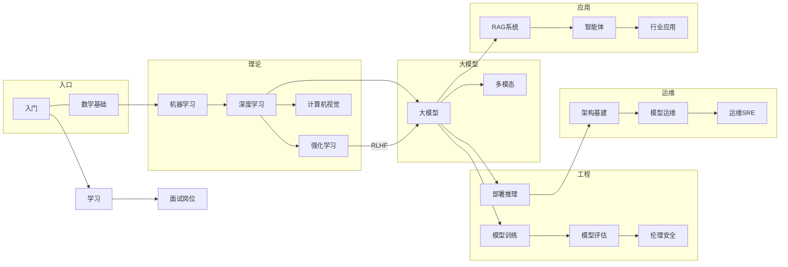

# Wiki Index

> 中文简称：全库总索引

*This index is automatically maintained. Last updated: 2026-08-25*

## 知识图谱 (Knowledge Graph)

---

## Concepts

- [[概念/activation-value]] — 激活值：神经网络神经元的输出响应强度 ( #deep-learning #neural-network #activation-function)
- [[概念/gradient-descent]] — 梯度下降：最小化模型误差的参数优化算法 ( #deep-learning #optimization #gradient-descent)
- [[概念/matryoshka-representation-learning]] — Matryoshka 表示学习：可截断的多尺度嵌入 ( #embeddings #rag #vector-database #matryoshka)
- [[概念/cdi]] — CDI 容器设备接口：GPU/异构加速器统一接入容器的标准 ( #cdi #kubernetes #gpu #containerd)
- [[概念/dra]] — DRA 动态资源分配：K8s 设备分配的现代机制，与 CDI 配对 ( #dra #kubernetes #gpu #scheduling)
- [[概念/hami]] — HAMi：CNCF Sandbox 异构 GPU 虚拟化中间件 ( #hami #gpu-virtualization #cncf #kubernetes #heterogeneous)
- [[概念/gpu-operator]] — NVIDIA GPU Operator：K8s 上 GPU 全栈运维的事实标准 ( #gpu-operator #kubernetes #nvidia)
- [[概念/kserve]] — KServe：CNCF Kubernetes 标准化模型服务平台 ( #kserve #cncf #kubernetes #model-serving)
- [[概念/tgi]] — TGI：HuggingFace 生产级 LLM 推理引擎 ( #tgi #huggingface #inference #llm)
- [[概念/ray]] — Ray / KubeRay：Python 分布式 AI 计算框架 ( #ray #kuberay #distributed #training)
- [[概念/deepspeed]] — DeepSpeed：微软大模型训练与推理优化库 ( #deepspeed #distributed-training #microsoft)
- [[概念/prometheus]] — Prometheus：云原生监控与告警系统 ( #prometheus #monitoring #observability #cncf)
- [[概念/grafana]] — Grafana：可观测可视化与监控平台 ( #grafana #dashboard #observability)
- [[概念/lmdeploy]] — LMDeploy：国产 LLM 推理部署工具（TurboMind/PyTorch 双后端） ( #lmdeploy #inference #chinese-llm #deployment)
- [[概念/tensorrt-llm]] — TensorRT-LLM：NVIDIA LLM 推理优化引擎 ( #tensorrt-llm #nvidia #inference #optimization)
- [[概念/sglang]] — SGLang：高性能 LLM 推理框架（RadixAttention） ( #sglang #inference #radix-attention)
- [[概念/milvus]] — Milvus：分布式向量数据库 ( #milvus #vector-database #rag #distributed)
- [[概念/qdrant]] — Qdrant：Rust 高性能向量数据库 ( #qdrant #vector-database #rag #rust)
- [[概念/weaviate]] — Weaviate：AI 原生向量数据库 ( #weaviate #vector-database #rag #ai-native)
- [[概念/langchain]] — LangChain：LLM 应用开发框架 ( #langchain #agent #rag #framework)
- [[概念/llamaindex]] — LlamaIndex：LLM 数据框架与 RAG ( #llamaindex #rag #data-framework #indexing)
- [[概念/autogen]] — AutoGen：微软多 Agent 对话框架 ( #autogen #agent #multi-agent #microsoft)
- [[概念/kubeflow]] — Kubeflow：K8s MLOps 平台 ( #kubeflow #kubernetes #mlops #cncf)
- [[概念/volcano]] — Volcano：K8s 批处理调度器（CNCF 孵化） ( #volcano #kubernetes #scheduling #batch)
- [[概念/kueue]] — Kueue：K8s 原生作业排队与配额系统 ( #kueue #kubernetes #scheduling #quota)
- [[概念/lm-evaluation-harness]] — LM Evaluation Harness：EleutherAI LLM 评测框架 ( #lm-evaluation-harness #evaluation #benchmark)
- [[概念/opencompass]] — OpenCompass：一站式大模型评测平台 ( #opencompass #evaluation #benchmark #chinese-llm)
- [[概念/containerd]] — containerd：Kubernetes CRI 容器运行时 ( #containerd #kubernetes #cri #cncf)
- [[概念/kubernetes]] — Kubernetes：容器编排平台 ( #kubernetes #k8s #orchestration #cncf)
- [[概念/helm]] — Helm：Kubernetes 包管理器 ( #helm #kubernetes #package-manager #cncf)
- [[概念/etcd]] — etcd：分布式键值存储 ( #etcd #kubernetes #distributed #consensus)
- [[概念/opa]] — OPA：Open Policy Agent 策略引擎 ( #opa #policy #kubernetes #security)
- [[概念/kyverno]] — Kyverno：Kubernetes 原生策略引擎 ( #kyverno #kubernetes #policy #security)
- [[概念/falco]] — Falco：容器运行时安全检测 ( #falco #runtime-security #kubernetes #security)
- [[概念/aws-bedrock]] — AWS Bedrock：亚马逊云托管基础模型服务 ( #aws-bedrock #cloud #foundation-model)
- [[概念/azure-openai]] — Azure OpenAI：微软企业级 GPT 服务 ( #azure-openai #cloud #openai)
- [[概念/vertex-ai]] — Google Vertex AI：GCP 统一 AI 平台 ( #vertex-ai #google-cloud #ai-platform)
- [[概念/megatron-lm]] — Megatron-LM：NVIDIA 大规模 Transformer 训练框架 ( #megatron-lm #distributed-training #nvidia)
- [[概念/fsdp]] — FSDP：PyTorch 全分片数据并行 ( #fsdp #pytorch #distributed-training)
- [[概念/colossal-ai]] — Colossal-AI：统一分布式 AI 系统 ( #colossal-ai #distributed-training #hpc)
- [[概念/triton]] — Triton Inference Server：NVIDIA 多模型推理服务 ( #triton #nvidia #model-serving)
- [[概念/modal]] — Modal：无服务器 GPU 云平台 ( #modal #serverless #gpu #cloud)
- [[概念/replicate]] — Replicate：开源模型托管与 API 市场 ( #replicate #model-hosting #api #cloud)
- [[概念/oci-runtime]] — OCI Runtime Spec：容器运行时标准，CDI 注入的最终落点 ( #oci #container-runtime #runc)
- [[概念/gpustack]] — GPUStack：开源 GPU 集群管理与私有 MaaS 平台 ( #deployment #inference #gpu-cluster #maas)
- [[概念/embeddings-vectors-mrl-plain]] — Embedding、向量与 MRL 大白话 ( #embedding #vector #matryoshka #for-dummy)
- [[概念/mcp]] — MCP 模型上下文协议：AI 系统的标准化外部能力接入 ( #mcp #agent #protocol #anthropic)
- [[概念/agent-loop]] — Agent Loop：智能体核心运行时循环（感知→推理→执行→观察） ( #agent-loop #agent #runtime)
- [[概念/agent-harness]] — Agent Harness：将 LLM 包装为生产级智能体的执行与治理层 ( #agent-harness #agent #production)
- [[概念/context-engineering]] — 上下文工程：从提示词工程进阶的系统化信息环境设计 ( #context-engineering #prompt-engineering #llm)
- [[概念/prompt-injection]] — 提示注入：LLM 系统的核心输入攻击向量与分层防御 ( #prompt-injection #security #jailbreak)
- [[概念/hallucination]] — 幻觉：LLM 生成不实内容的根因、类型与缓解策略 ( #hallucination #reliability #rag)
- [[概念/a2a-protocol]] — A2A 协议：Google 智能体间互操作通信标准 ( #a2a #agent #protocol #google)
- [[概念/guardrails]] — AI 护栏：输入输出过滤、工具策略、沙箱与结构化输出校验 ( #guardrails #security #safety)

## Deep Dives

### 云平台
- [[12_架构基建/06_云厂商/AWS/01_AWS_Bedrock_深入分析]] — AWS Bedrock 深度解析 ( #aws-bedrock #cloud #foundation-model)
- [[12_架构基建/06_云厂商/Azure/01_Azure_OpenAI_深入分析]] — Azure OpenAI 深度解析 ( #azure-openai #cloud #openai)
- [[12_架构基建/06_云厂商/Google_Cloud/01_Google_Vertex_AI_深入分析]] — Google Vertex AI 深度解析 ( #vertex-ai #google-cloud #ai-platform)

### 训练框架
- [[07_模型训练/04_分布式训练/08_Megatron_LM_深入分析]] — Megatron-LM 深度解析 ( #megatron-lm #distributed-training #nvidia)
- [[07_模型训练/04_分布式训练/05_FSDP_深入分析]] — FSDP 深度解析 ( #fsdp #pytorch #distributed-training)
- [[07_模型训练/04_分布式训练/01_Colossal_AI_深入分析]] — Colossal-AI 深度解析 ( #colossal-ai #distributed-training)

### 模型服务
- [[10_部署推理/02_推理引擎/28_Triton_推理_服务端_深入分析]] — Triton Inference Server 深度解析 ( #triton #nvidia #model-serving)
- [[10_部署推理/02_推理引擎/20_Modal_深入分析]] — Modal 深度解析 ( #modal #serverless #gpu)

### 安全策略
- [[17_伦理安全/07_AI安全2026/05_OPA_深入分析]] — OPA / Gatekeeper 深度解析 ( #opa #policy #kubernetes)
- [[17_伦理安全/07_AI安全2026/04_Kyverno_深入分析]] — Kyverno 深度解析 ( #kyverno #kubernetes #policy)
- [[17_伦理安全/07_AI安全2026/02_Falco_深入分析]] — Falco 深度解析 ( #falco #runtime-security #kubernetes)

### RAG 与 Embedding
- [[概念/RAG/matryoshka-representation-learning]] — Matryoshka Representation Learning 深度解析 ( #embeddings #rag #matryoshka)
- [[概念/RAG/matryoshka-representation-learning]] — Matryoshka Representation Learning — 小白版 ( #embeddings #for-dummy #matryoshka)
- [[20_论文精读/04_效率优化/Matryoshka_Representation_Learning_Deep_Dive]] — 论文深度解读: Matryoshka Representation Learning ( #paper #matryoshka)
- [[概念/embeddings-vectors-mrl-plain]] — Embedding、向量与 MRL 大白话 ( #embedding #vector #matryoshka #for-dummy)

## Entities

### 国际公司 (International Companies)
- [[05_大模型/13_全球LLM生态/09_OpenAI_深入分析|OpenAI]] — ChatGPT 开创者，RLHF + MoE + Reasoning RL 技术路线 ( #openai #rlhf #reasoning)
- [[05_大模型/13_全球LLM生态/01_Anthropic_Claude_深入分析|Anthropic]] — Claude 系列，Constitutional AI 与安全对齐信仰者 ( #anthropic #claude #constitutional-ai #safety)
- [[05_大模型/13_全球LLM生态/05_Google_Gemini_深入分析|Google DeepMind]] — Gemini 系列，原生多模态 + 百万 Token 上下文 ( #google #gemini #multimodal)
- [[05_大模型/13_全球LLM生态/07_Meta_LLaMA_深入分析|Meta AI]] — LLaMA 开源生态点燃者，开源权重 + MoE ( #meta #llama #open-source)
- [[05_大模型/13_全球LLM生态/08_Mistral_AI_深入分析|Mistral AI]] — 欧洲之光，SWA + GQA + 开源 MoE 先驱 ( #mistral #moe #european)
- NVIDIA — AI 算力霸主，GPU (H100/B200) + CUDA + TensorRT-LLM + Megatron 全栈 ( #nvidia #gpu #cuda #inference)
- [[概念/aws-bedrock|AWS]] — Amazon Bedrock 托管基础模型服务 ( #aws #cloud #foundation-model)
- [[概念/vertex-ai|Google Cloud]] — Vertex AI 统一 AI 平台 ( #google-cloud #ai-platform)
- [[概念/azure-openai|Microsoft Azure]] — Azure OpenAI 企业级 GPT 服务 ( #azure #microsoft #openai)

### 中国公司 (Chinese Companies)
- [[05_大模型/14_中国LLM生态/25_DeepSeek_架构_2026|DeepSeek]] — 以 $5.6M 训练 GPT-4 级模型，MLA + MoE + FP8 技术先锋 ( #deepseek #moe #chinese-llm)
- [[05_大模型/14_中国LLM生态/19_Qwen_深入分析|阿里云 / 通义千问]] — 最全开源舰队，1M 上下文 + 数学/中文最强 ( #qwen #alibaba #chinese-llm)
- [[05_大模型/14_中国LLM生态/09_GLM_Zhipu_深入分析|智谱 AI (GLM)]] — GLM-5.2，1M 上下文 + MIT 纯开源 + 最强开源编码 ( #glm #zhipu #chinese-llm)
- [[05_大模型/14_中国LLM生态/13_Kimi_Moonshot_深入分析|月之暗面 (Kimi)]] — 256K 长上下文 + 多模态理解，MuonClip + MoE ( #kimi #moonshot #chinese-llm)
- [[05_大模型/14_中国LLM生态/14_MiniMax_深入分析|MiniMax]] — 原生多模态（文/图/视频）+ 1M 上下文 ( #minimax #multimodal #chinese-llm)
- [[05_大模型/14_中国LLM生态/23_Xiaomi_MiMo_深入分析|小米 (MiMo)]] — Agent 大脑 + 极致性价比，MoE + Agent-First ( #xiaomi #mimo #chinese-llm)
- [[05_大模型/14_中国LLM生态/02_Baidu_ERNIE_深入分析|百度 (文心)]] — 依托搜索生态的 ERNIE 大模型 ( #baidu #ernie #chinese-llm)
- [[05_大模型/14_中国LLM生态/22_Tencent_Hunyuan_深入分析|腾讯 (混元)]] — 视频生成 + 全模态能力 ( #tencent #hunyuan #chinese-llm)
- [[05_大模型/14_中国LLM生态/03_ByteDance_Doubao_深入分析|字节跳动 (豆包)]] — 超级 App 分发 + 多模态 ( #bytedance #doubao #chinese-llm)
- [[05_大模型/14_中国LLM生态/10_iFlytek_Spark_深入分析|科大讯飞 (星火)]] — 语音基因 + 教育场景深耕 ( #iflytek #spark #chinese-llm)
- [[05_大模型/14_中国LLM生态/01_Baichuan_深入分析|百川智能]] — 开源中文大模型早期开拓者 ( #baichuan #chinese-llm)
- [[05_大模型/14_中国LLM生态/24_Yi_01AI_深入分析|零一万物 (Yi)]] — 李开复创办，Yi 系列开源模型 ( #yi #01ai #chinese-llm)
- [[05_大模型/14_中国LLM生态/21_StepFun_深入分析|阶跃星辰]] — 多模态 + 长文本路线 ( #stepfun #chinese-llm)
- [[05_大模型/14_中国LLM生态/20_SenseTime_SenseNova_深入分析|商汤 (日日新)]] — 计算机视觉根基 + 大模型 ( #sensetime #chinese-llm)
- [[05_大模型/14_中国LLM生态/12_InternLM_深入分析|上海 AI 实验室 (书生浦语)]] — InternLM 学术开源力量 ( #internlm #chinese-llm)

### 旗舰模型 (Flagship Models)
- [[05_大模型/13_全球LLM生态/09_OpenAI_深入分析|GPT-4o / o3 / GPT-4.1]] — OpenAI 旗舰，o3 推理达 99.8%ile Codeforces ( #gpt #openai #reasoning)
- [[05_大模型/13_全球LLM生态/01_Anthropic_Claude_深入分析|Claude 4 Opus / Sonnet]] — Anthropic 旗舰，安全第一 + Extended Thinking + Computer Use ( #claude #anthropic)
- [[05_大模型/13_全球LLM生态/05_Google_Gemini_深入分析|Gemini 2.5 Pro]] — Google 旗舰，原生多模态 + 1M 上下文 + Thinking Mode ( #gemini #google)
- [[05_大模型/13_全球LLM生态/07_Meta_LLaMA_深入分析|Llama 4 (Maverick/Scout)]] — Meta 旗舰，400B MoE + 10M Token 上下文 ( #llama #meta #open-source)
- [[05_大模型/13_全球LLM生态/08_Mistral_AI_深入分析|Mistral 3 (675B MoE)]] — Mistral 旗舰，开源 MoE + Mamba SSM ( #mistral #moe)
- [[05_大模型/14_中国LLM生态/25_DeepSeek_架构_2026|DeepSeek-V4 Pro]] — 1.6T/49B active MoE，极致性价比推理 ( #deepseek #moe)
- [[05_大模型/14_中国LLM生态/09_GLM_Zhipu_深入分析|GLM-5.2]] — 744B/40B active，256 专家 MoE + DSA ( #glm #zhipu)
- [[05_大模型/14_中国LLM生态/19_Qwen_深入分析|Qwen3.7-Max]] — Hybrid Thinking + MoE，最全开源生态 ( #qwen #alibaba)

### 框架与库 (Frameworks & Libraries)
- [[概念/ray|Ray / KubeRay]] — Python 分布式 AI 计算框架 ( #ray #distributed #training)
- [[概念/deepspeed|DeepSpeed]] — 微软大模型训练与推理优化库 ( #deepspeed #distributed-training)
- [[概念/megatron-lm|Megatron-LM]] — NVIDIA 大规模 Transformer 训练框架 ( #megatron-lm #nvidia)
- [[概念/fsdp|FSDP]] — PyTorch 全分片数据并行 ( #fsdp #pytorch)
- [[概念/colossal-ai|Colossal-AI]] — 统一分布式 AI 系统 ( #colossal-ai #distributed-training)
- [[10_部署推理/02_推理引擎/29_vLLM_深入分析|vLLM]] — UC Berkeley PagedAttention 生产级推理引擎 ( #vllm #inference #paged-attention)
- [[概念/sglang|SGLang]] — RadixAttention 高性能推理框架 ( #sglang #inference)
- [[概念/tensorrt-llm|TensorRT-LLM]] — NVIDIA LLM 推理优化引擎 ( #tensorrt-llm #nvidia #inference)
- [[概念/tgi|TGI]] — HuggingFace 生产级 LLM 推理引擎 ( #tgi #huggingface #inference)
- [[概念/triton|Triton Inference Server]] — NVIDIA 多模型推理服务 ( #triton #nvidia #model-serving)
- [[概念/langchain|LangChain]] — LLM 应用开发框架 ( #langchain #agent #framework)
- [[概念/llamaindex|LlamaIndex]] — LLM 数据框架与 RAG ( #llamaindex #rag)
- [[概念/autogen|AutoGen]] — 微软多 Agent 对话框架 ( #autogen #agent #multi-agent)
- [[概念/lmdeploy|LMDeploy]] — 国产 LLM 推理部署工具（TurboMind/PyTorch 双后端） ( #lmdeploy #inference #chinese-llm)
- [[概念/mcp|MCP]] — Anthropic 模型上下文协议，AI 标准化外部能力接入 ( #mcp #anthropic #protocol)

### 芯片与硬件 (Chips & Hardware)
- [[12_架构基建/07_硬件与算力/11_MIG_深入分析|NVIDIA H100 / H200]] — Hopper 架构，MIG 硬件级切片，训练推理主力 ( #h100 #h200 #nvidia #gpu)
- [[12_架构基建/07_硬件与算力/08_未来_Computing_硬件_2026|NVIDIA B200 / GB200]] — Blackwell 架构，下一代 AI 算力旗舰 ( #b200 #blackwell #nvidia)
- AMD MI300X — AMD Instinct 系列，对标 H100 的推理/训练加速卡 ( #mi300x #amd #gpu)
- [[01_数学基础/10_AI硬件/03_Chinese_AI_Chips_深入分析|华为昇腾 910B/C]] — 国产 AI 芯片旗舰，CANN + MindSpore 生态 ( #ascend #huawei #ai-chip #chinese-llm)
- [[01_数学基础/10_AI硬件/03_Chinese_AI_Chips_深入分析|寒武纪 思元]] — 国产云端 AI 训练/推理芯片 ( #cambricon #ai-chip #chinese-llm)
- [[01_数学基础/10_AI硬件/03_Chinese_AI_Chips_深入分析|壁仞 / 摩尔线程 / 海光]] — 国产 GPU / GPGPU 新势力 ( #biren #ai-chip #chinese-llm)
- Google TPU — Tensor Processing Unit，Gemini 训练推理专属硬件 ( #tpu #google #ai-chip)

### 云平台与 MaaS (Cloud & MaaS)
- [[概念/aws-bedrock|AWS Bedrock]] — 亚马逊云托管基础模型服务 ( #aws-bedrock #cloud)
- [[概念/azure-openai|Azure OpenAI]] — 微软企业级 GPT 服务 ( #azure-openai #cloud)
- [[概念/vertex-ai|Google Vertex AI]] — GCP 统一 AI 平台 ( #vertex-ai #google-cloud)
- [[概念/modal|Modal]] — 无服务器 GPU 云平台 ( #modal #serverless #gpu)
- [[概念/replicate|Replicate]] — 开源模型托管与 API 市场 ( #replicate #model-hosting)
- [[概念/gpustack|GPUStack]] — 开源 GPU 集群管理与私有 MaaS 平台 ( #gpustack #maas #gpu-cluster)
- [[05_大模型/14_中国LLM生态/ModelScope_Model_Catalog|ModelScope]] — 阿里魔搭，1,621 模型的国产模型Hub ( #modelscope #model-hub #chinese-llm)

## Skills

### 数学基础技能 (Mathematical Foundations)
- [[01_数学基础/README|基础理论 (Fundamentals)]] — 数学核心 + 工程基础两层架构总览 ( #fundamentals #math)
- [[01_数学基础/02_线性代数/03_线性代数|线性代数]] — 张量运算、特征值分解、SVD，模型参数表示基础 ( #linear-algebra #math)
- [[01_数学基础/03_概率统计/02_概率统计|概率论与统计]] — 贝叶斯定理、高斯分布、信息论，处理不确定性 ( #probability #statistics #math)
- [[01_数学基础/01_数学基础/Calculus_Optimization|微积分与优化]] — 导数/链式法则/梯度下降/凸优化/KKT 条件 ( #calculus #optimization #math)
- [[01_数学基础/04_信息论/Information_Theory_Fundamentals|信息论]] — 香农熵、交叉熵、KL 散度，损失函数设计的理论基础 ( #information-theory #math)
- [[01_数学基础/07_数据结构与算法/|数据结构与算法]] — 计算机工程基础 ( #algorithms #data-structures)

### 编程技能 (Programming & AI Coding)
- [[16_编程/README|AI 编程 (AI Coding)]] — 从代码补全到结对编程伙伴的完整知识体系 ( #ai-coding #code-generation)
- [[16_编程/05_开发工具/03_Claude_完整_指南|Claude 编程工具]] — Claude 模型家族、XML 提示、MCP、Computer Use ( #claude #ai-coding)
- [[16_编程/05_开发工具/02_Claude_Code_深入分析|Claude Code]] — CLI、SDK、IDE、Routines、Hooks ( #claude-code #ai-coding)
- [[16_编程/05_开发工具/01_AI_编程_Assistants_2026|AI 编程助手全景]] — Cursor/Claude Code/Hermes/Windsurf/Copilot/Devin 选型 ( #ai-coding #tooling)
- [[01_数学基础/08_Python工具包/|Python 工具链]] — AI 开发的 Python 工具与库 ( #python #tooling)
- [[01_数学基础/11_Java生态与AI/|Java 生态 AI]] — Java 在 AI 工程中的应用 ( #java #enterprise)
- [[01_数学基础/10_AI硬件/05_GPU_Programming_CUDA_基础|GPU 编程]] — CUDA / ROCm / Triton GPU 编程技能 ( #cuda #gpu #programming)

### 训练技能 (Model Training)
- [[07_模型训练/README|模型训练 (Model Training)]] — 分布式计算、优化算法、工程技巧的锻造车间 ( #model-training #distributed-training)
- [[07_模型训练/04_分布式训练/|分布式训练]] — Ray / DeepSpeed / Megatron-LM / FSDP / Colossal-AI ( #distributed-training #gpu)
- [[07_模型训练/04_分布式训练/04_分布式训练_Hang_操作手册|分布式训练排障]] — NCCL/RDMA/InfiniBand/NVLink 诊断流程 ( #distributed-training #troubleshooting)
- [[05_大模型/06_微调技术/|微调技术]] — LoRA / QLoRA / PEFT 参数高效微调 ( #fine-tuning #lora)
- [[07_模型训练/03_训练优化/06_扩展定律_and_训练_Dynamics|Scaling Laws]] — Kaplan/Chinchilla/涌现能力/推理时 Scaling ( #scaling-law #training)
- [[07_模型训练/03_训练优化/05_Optimizer_高级_2026|优化器进阶]] — AdamW/Lion/Muon/Sophia/Shampoo + 学习率调度 ( #optimizer #training)
- [[07_模型训练/02_数据工程/04_数据_Curation_and_Mixture_2026|数据策展与配比]] — 数据清洗/去重/配比/合成数据/多语言 ( #data-engineering #pretraining)
- [[07_模型训练/02_数据工程/09_Tokenizer_设计_2026|Tokenizer 设计]] — BPE/SentencePiece/tiktoken/Unigram ( #tokenizer #pretraining)
- [[17_伦理安全/02_价值对齐/Constitutional_AI_Deep_Dive|对齐 (Alignment)]] — RLHF / DPO / Constitutional AI 安全对齐 ( #alignment #rlhf #safety)

### 部署与推理技能 (Deployment & Inference)
- [[10_部署推理/README|模型部署与推理]] — 高效、可靠、可扩展的推理服务最后一公里 ( #deployment #inference #serving)
- [[10_部署推理/02_推理引擎/17_LLM_推理引擎_选型_指南|推理引擎选型]] — 决策树、成本模型、场景速查 ( #inference #selection-guide)
- [[10_部署推理/02_推理引擎/29_vLLM_深入分析|vLLM]] — PagedAttention 显存优化，通用生产首选 ( #vllm #paged-attention)
- [[10_部署推理/02_推理引擎/23_SGLang_深入分析|SGLang]] — RadixAttention 前缀缓存，极致性能 ( #sglang #radix-attention)
- [[10_部署推理/03_推理优化/03_推理_Tuning_Cheat_Sheet|推理调优速查表]] — 关键参数、性能诊断、场景配置 ( #inference #tuning #cheatsheet)
- [[10_部署推理/02_推理引擎/15_LLM推理_基准测试_指南|推理基准测试]] — 指标、工具、方法、报告模板 ( #inference #benchmark)
- [[05_大模型/04_LLM架构/07_LLM_Internals_推理|推理优化技术]] — KV Cache/GQA/MLA、Flash Attention、量化、投机解码、连续批处理 ( #llm-inference #kv-cache #quantization)
- [[12_架构基建/02_架构概览/01_AI_成本优化_2026|推理成本优化]] — 模型量化、缓存策略、批处理优化 ( #cost-optimization #quantization)

### 评估技能 (Model Evaluation)
- [[08_模型评估/README|模型评估 (Model Evaluation)]] — 评估指标、评估方法、过拟合检测 ( #model-evaluation #benchmark)
- [[08_模型评估/02_基准测试/11_Unified_基准测试_对比|统一基准对比]] — 跨领域 AI 基准：LLM/CV/Speech/Multimodal/Agent SOTA ( #benchmark #sota)
- [[概念/opencompass|OpenCompass]] — 一站式大模型评测平台 ( #opencompass #evaluation #chinese-llm)
- [[概念/lm-evaluation-harness|LM Evaluation Harness]] — EleutherAI LLM 评测框架 ( #lm-evaluation-harness #evaluation)
- [[08_模型评估/04_评估工具/03_LLM_as_Judge_深入分析|LLM-as-Judge]] — 单点评分、成对比较、Rubric 评估、偏差缓解 ( #evaluation #llm-as-judge)
- [[概念/General/online-evaluation|在线评估]] — A/B 测试、影子流量、金丝雀发布 ( #evaluation #ab-testing)
- [[17_伦理安全/06_系统安全/06_LLM_安全_Defense_指南|红队与安全评估]] — 红队测试、对抗性评估、攻击模拟 ( #red-teaming #security #evaluation)

### 运维与 MLOps 技能 (Operations & MLOps)
- [[13_运维/README|AI 运维与可观测性]] — 监控、告警、事故响应、SRE、混沌工程 ( #ai-ops #observability #sre)
- [[11_模型运维/README|MLOps 流水线]] — DevOps 的 AI 版，模型全生命周期管理 ( #mlops #llmops #ci-cd)
- [[11_模型运维/10_LLMOps_大模型运维/04_LLM_生产_流水线_2026|LLM 生产流水线]] — 七阶段闭环架构 ( #mlops #llm-pipeline #production)
- [[概念/prometheus|Prometheus]] — 云原生监控与告警系统 ( #prometheus #monitoring)
- [[概念/grafana|Grafana]] — 可观测可视化与监控平台 ( #grafana #dashboard)
- [[13_运维/02_SRE与可靠性/03_AI_SRE_操作手册|AI SRE Runbook]] — SLO/SLI、GPU 容量规划、事故响应、模型回滚 ( #sre #incident-response)
- [[07_模型训练/07_训练监控/Model_Troubleshooting_Guide|模型问题排查]] — 预训练/微调/推理全链路故障诊断 ( #troubleshooting #ops)
- [[10_部署推理/01_部署基础/08_模型_Hot_Reload_and_回滚_操作手册|模型热加载与回滚]] — 权重/tokenizer/LoRA 一致性检查与回滚 ( #ops #deployment #runbook)

### 架构与基础设施技能 (Architecture & Infrastructure)
- [[12_架构基建/README|架构与基础设施]] — AI 系统的骨架与神经系统 ( #architecture #infrastructure)
- [[概念/kubernetes|Kubernetes]] — 容器编排平台，云原生 AI 底座 ( #kubernetes #orchestration)
- [[概念/gpu-operator|GPU Operator]] — K8s 上 GPU 全栈运维事实标准 ( #gpu-operator #kubernetes)
- [[概念/hami|HAMi]] — CNCF 异构 GPU 虚拟化与调度 ( #hami #gpu-virtualization)
- [[12_架构基建/07_硬件与算力/03_CDI_深入分析|CDI]] — 容器设备接口，GPU/异构加速器统一接入 ( #cdi #kubernetes #gpu)
- [[12_架构基建/07_硬件与算力/06_DRA_深入分析|DRA]] — 动态资源分配，K8s 设备分配的未来 ( #dra #kubernetes)
- [[12_架构基建/05_CNCF云原生AI/README|CNCF 云原生 AI]] — 18 个大模型项目五层架构全景与选型 ( #cncf #cloud-native #llm)
- [[概念/kserve|KServe]] — K8s 标准化模型服务平台 ( #kserve #model-serving)
- [[12_架构基建/02_架构概览/05_Capacity_Planning_2026|容量规划]] — QPS/并发模型、GPU 显存估算、成本预测 ( #capacity-planning #sre)

### 智能体与 RAG 技能 (Agents & RAG)
- [[15_智能体/README|Agent 生产部署]] — Harness 工程、框架选型、平台部署、记忆架构 ( #agent #production)
- [[15_智能体/02_Agent框架/|Agent 框架]] — LangChain / AutoGen / LangGraph / AgentScope ( #agent #framework)
- [[15_智能体/04_Agent脚手架/05_脚手架_工程_完整_指南|Harness 工程]] — 五大子系统、设计原则、架构 ( #agent-harness #architecture)
- [[14_RAG系统/README|RAG 系统]] — 检索增强生成，大模型的外接大脑 ( #rag #retrieval #vector-database)
- [[概念/milvus|Milvus]] — 分布式向量数据库 ( #milvus #vector-database)
- [[概念/qdrant|Qdrant]] — Rust 高性能向量数据库 ( #qdrant #vector-database)
- [[05_大模型/07_提示工程/13_Prompt工程_完整_指南|提示词工程]] — 结构、最佳实践、少样本、CoT、ReAct ( #prompt-engineering)
- [[05_大模型/07_提示工程/01_Context_工程_指南|上下文工程]] — 写入/选择/压缩/隔离四大策略 ( #context-engineering)

## References

### 中国大模型生态
- [[05_大模型/14_中国LLM生态/README]] — 中国大模型生态全景 (15家厂商) ( #chinese-llm #ecosystem)
- [[05_大模型/14_中国LLM生态/04_Chinese_LLM_对比_矩阵]] — 全厂商对比矩阵 ( #chinese-llm #comparison)
- [[05_大模型/14_中国LLM生态/05_Chinese_LLM_训练_推理_平台]] — 训练推理平台实战参考 ( #chinese-llm #training #inference)
- [[05_大模型/14_中国LLM生态/25_DeepSeek_架构_2026]] — DeepSeek 深度解析 (MLA+MoE+FP8) ( #chinese-llm #deepseek #moe)
- [[05_大模型/14_中国LLM生态/19_Qwen_深入分析]] — 通义千问深度解析 ( #chinese-llm #qwen)
- [[05_大模型/14_中国LLM生态/09_GLM_Zhipu_深入分析]] — 智谱 GLM 深度解析 (GLM-5.2 · 1M 上下文 · MIT 开源) ( #chinese-llm #glm)
- [[05_大模型/14_中国LLM生态/13_Kimi_Moonshot_深入分析]] — Kimi 月之暗面深度解析 ( #chinese-llm #kimi)
- [[05_大模型/14_中国LLM生态/14_MiniMax_深入分析]] — MiniMax 深度解析 ( #chinese-llm #minimax)
- [[05_大模型/14_中国LLM生态/23_Xiaomi_MiMo_深入分析]] — 小米 MiMo 深度解析 ( #chinese-llm #xiaomi)
- [[05_大模型/14_中国LLM生态/02_Baidu_ERNIE_深入分析]] — 百度文心深度解析 ( #chinese-llm #baidu #ernie)
- [[05_大模型/14_中国LLM生态/01_Baichuan_深入分析]] — 百川智能深度解析 ( #chinese-llm #baichuan)
- [[05_大模型/14_中国LLM生态/24_Yi_01AI_深入分析]] — 零一万物 Yi 深度解析 ( #chinese-llm #yi)
- [[05_大模型/14_中国LLM生态/21_StepFun_深入分析]] — 阶跃星辰深度解析 ( #chinese-llm #stepfun)
- [[05_大模型/14_中国LLM生态/22_Tencent_Hunyuan_深入分析]] — 腾讯混元深度解析 ( #chinese-llm #tencent #hunyuan)
- [[05_大模型/14_中国LLM生态/10_iFlytek_Spark_深入分析]] — 讯飞星火深度解析 ( #chinese-llm #iflytek)
- [[05_大模型/14_中国LLM生态/20_SenseTime_SenseNova_深入分析]] — 商汤日日新深度解析 ( #chinese-llm #sensetime)
- [[05_大模型/14_中国LLM生态/12_InternLM_深入分析]] — 书生浦语深度解析 ( #chinese-llm #internlm)
- [[05_大模型/14_中国LLM生态/03_ByteDance_Doubao_深入分析]] — 字节豆包深度解析 ( #chinese-llm #bytedance #doubao)
- [[05_大模型/14_中国LLM生态/06_Chinese_Open_Source_Top100]] — 中国开源大模型生态 Top 100 项目全景 ( #chinese-llm #open-source #foundation #top100)
- [[05_大模型/14_中国LLM生态/ModelScope_Model_Catalog]] — ModelScope 15 厂商模型目录 (1,621 模型 · Top 精选 + 统计) ( #chinese-llm #modelscope #model-hub)
- [[05_大模型/14_中国LLM生态/ModelScope_Model_Index]] — ModelScope 全量模型索引表 (1,621 模型完整清单) ( #chinese-llm #modelscope #index #reference)

### 国产 AI 芯片
- [[01_数学基础/10_AI硬件/03_Chinese_AI_Chips_深入分析]] — 国产 AI 芯片12家厂商深度解析 ( #ai-chip #ascend #cambricon #biren #chinese-llm)

### 容器与设备接入
- [[12_架构基建/07_硬件与算力/03_CDI_深入分析]] — CDI 容器设备接口标准:GPU/异构加速器统一接入 K8s ( #cdi #kubernetes #gpu #containerd #device-plugin)
- [[12_架构基建/07_硬件与算力/06_DRA_深入分析]] — DRA 动态资源分配:K8s 设备分配的未来,与 CDI 配对 ( #dra #kubernetes #gpu #scheduling)
- [[12_架构基建/07_硬件与算力/11_MIG_深入分析]] — MIG (Multi-Instance GPU):A100/H100/PPU 硬件级切片,多租户强隔离推理 ( #mig #gpu-partitioning #multi-tenant #a100 #h100)
- [[12_架构基建/03_AI技术栈/11_HAMi_深入分析]] — HAMi 深度解析:CNCF Sandbox 异构 GPU 虚拟化与调度 ( #hami #cncf #gpu-virtualization #kubernetes #heterogeneous)
- [[12_架构基建/README.md]] — HAMi 入门:让 Kubernetes GPU 像 CPU 一样共享 ( #hami #for-dummy #gpu-sharing)
- [[12_架构基建/03_AI技术栈/12_HAMi_Operation_指南]] — HAMi 运维指南:安装、配置、升级与监控 ( #hami #operations #kubernetes)
- [[13_运维/02_SRE与可靠性/HAMi_Troubleshooting_Guide]] — HAMi 问题排查与故障解决指南 ( #hami #troubleshooting #ops)
- [[12_架构基建/README.md]] — CDI 规范官方源引用(CNCF/Apache-2.0/运行时支持矩阵) ( #cdi #cncf #references)

### CNCF 云原生大模型 (Cloud Native AI)
- [[12_架构基建/05_CNCF云原生AI/README]] — CNCF 生态 18 个大模型项目五层架构全景与选型决策树 ( #cncf #kubernetes #cloud-native #llm #genai)
- [[12_架构基建/05_CNCF云原生AI/14_KServe_深入分析]] — KServe:K8s 标准化推理平台 (CNCF 孵化) ( #cncf #kserve #inference #kubernetes)
- [[12_架构基建/05_CNCF云原生AI/10_KAITO_深入分析]] — KAITO:一行 preset 部署 LLM 的 Operator (CNCF 沙箱) ( #cncf #kaito #inference #azure)
- [[12_架构基建/05_CNCF云原生AI/17_llm_d_深入分析]] — llm-d:分布式 + 共享 KV Cache 推理框架 ( #cncf #llm-d #distributed #kv-cache)
- [[12_架构基建/05_CNCF云原生AI/18_llmaz_深入分析]] — llmaz:易用优先的多引擎 K8s 推理平台 ( #cncf #llmaz #vllm #sglang)
- [[12_架构基建/05_CNCF云原生AI/02_AIBrix_深入分析]] — AIBrix:模块化 vLLM 推理基础设施组件 ( #cncf #aibrix #vllm #autoscaling)
- [[12_架构基建/05_CNCF云原生AI/19_Volcano_深入分析]] — Volcano:Gang Scheduling 批处理调度器 (CNCF 孵化) ( #cncf #volcano #scheduling #batch)
- [[12_架构基建/05_CNCF云原生AI/09_KAI_Scheduler_深入分析]] — KAI Scheduler:万卡级拓扑感知 GPU 调度器 (CNCF 沙箱) ( #cncf #kai-scheduler #gpu #topology)
- [[12_架构基建/05_CNCF云原生AI/16_Kueue_深入分析]] — Kueue:K8s 原生作业排队/配额系统 (SIGs) ( #cncf #kueue #scheduling #quota)
- [[12_架构基建/05_CNCF云原生AI/15_KubeRay_深入分析]] — KubeRay:Ray on K8s,vLLM 分布式底座 ( #cncf #kuberay #ray #distributed)
- [[12_架构基建/05_CNCF云原生AI/12_KitOps_深入分析]] — KitOps/ModelKit:大模型制品打包标准 (CNCF 沙箱) ( #cncf #kitops #modelkit #oci #packaging)
- [[12_架构基建/05_CNCF云原生AI/03_Dragonfly_深入分析]] — Dragonfly:P2P 加速权重分发 (CNCF 毕业) ( #cncf #dragonfly #p2p #distribution)
- [[12_架构基建/05_CNCF云原生AI/07_K8sGPT_深入分析]] — K8sGPT:给 K8s 装一个 AI SRE (CNCF 沙箱) ( #cncf #k8sgpt #aiops #sre)
- [[12_架构基建/05_CNCF云原生AI/05_HolmesGPT_深入分析]] — HolmesGPT:AI 事故调查员 (CNCF 沙箱) ( #cncf #holmesgpt #aiops #incident-response)
- [[12_架构基建/05_CNCF云原生AI/08_kagent_深入分析]] — kagent:K8s 原生 DevOps Agent 框架 (CNCF 沙箱) ( #cncf #kagent #agent #devops)
- [[12_架构基建/05_CNCF云原生AI/13_Knative_深入分析]] — Knative:LLM 服务 scale-to-zero (CNCF 毕业) ( #cncf #knative #serverless #autoscaling)
- [[12_架构基建/05_CNCF云原生AI/04_Envoy_AI网关_深入分析]] — Envoy AI Gateway:基于 Envoy 的 GenAI 统一入口 ( #cncf #envoy #ai-gateway)
- [[12_架构基建/05_CNCF云原生AI/11_Kgateway_深入分析]] — Kgateway:Envoy 内核 API+AI 双模网关 ( #cncf #kgateway #envoy #gateway-api)
- [[12_架构基建/05_CNCF云原生AI/01_AgentGateway_深入分析]] — AgentGateway:AI Agent 与 MCP 服务器代理网关 ( #cncf #agentgateway #mcp #agent)

### 学习课程
- [[90_学习/03_课程资源/microsoft/02_microsoft_ai_for_beginners]] — Microsoft 官方 12 周 AI 初学者课程映射 ( #learning-paths #microsoft #course)
- [[90_学习/03_课程资源/microsoft/02_microsoft_ai_for_beginners]] — Microsoft AI For Beginners 外部源引用索引 ( #references #microsoft)
- [[90_学习/03_课程资源/microsoft/01_microsoft_genai_for_beginners]] — Microsoft 21 课生成式 AI 初学者课程映射 ( #learning-paths #microsoft #generative-ai #course)
- [[90_学习/03_课程资源/microsoft/01_microsoft_genai_for_beginners]] — Microsoft Generative AI For Beginners 外部源引用索引 ( #references #microsoft #generative-ai)
- [[01_数学基础/08_Python工具包/03_GenAI_L00_课程_配置]] — L00 课程环境设置 ( #microsoft-genai-course #setup)
- [[00_入门/GenAI_L01_Intro_to_GenAI_and_LLMs]] — L01 生成式 AI 与 LLM 简介 ( #microsoft-genai-course #generative-ai)
- [[05_大模型/01_LLM基础/02_GenAI_第2课_Exploring_and_Comparing_LLMs]] — L02 探索与比较不同 LLM ( #microsoft-genai-course #llm)
- [[17_伦理安全/01_伦理基础/09_GenAI_第3课_Using_GenAI_Responsibly]] — L03 负责任地使用生成式 AI ( #microsoft-genai-course #ethics)
- [[05_大模型/07_提示工程/04_GenAI_第4课_Prompt工程_基础]] — L04 提示工程基础 ( #microsoft-genai-course #prompt-engineering)
- [[05_大模型/07_提示工程/05_GenAI_第5课_高级_Prompts]] — L05 创建高级提示 ( #microsoft-genai-course #prompt-engineering)
- [[15_智能体/14_GenAI课程/01_GenAI_第6课_文本_生成_Apps]] — L06 构建文本生成应用 ( #microsoft-genai-course #text-generation)
- [[15_智能体/GenAI_L07_Building_Chat_Applications]] — L07 构建聊天应用 ( #microsoft-genai-course #chat)
- [[14_RAG系统/01_RAG基础/GenAI_L08_Building_Search_Applications]] — L08 构建搜索应用 ( #microsoft-genai-course #search)
- [[05_大模型/09_多模态模型/02_GenAI_第9课_Building_图像_应用]] — L09 构建图像生成应用 ( #microsoft-genai-course #image-generation)
- [[16_编程/05_开发工具/GenAI_L10_Building_Low_Code_AI_Applications]] — L10 构建低代码 AI 应用 ( #microsoft-genai-course #low-code)
- [[15_智能体/14_GenAI课程/03_GenAI_L11_Integrating_with_Function_Calling]] — L11 使用函数调用集成外部应用 ( #microsoft-genai-course #function-calling)
- [[15_智能体/GenAI_L12_Designing_UX_for_AI_Applications]] — L12 设计 AI 应用用户体验 ( #microsoft-genai-course #ux)
- [[17_伦理安全/06_系统安全/03_GenAI_L13_Securing_AI_应用]] — L13 保障生成式 AI 应用安全 ( #microsoft-genai-course #security)
- [[11_模型运维/10_LLMOps_大模型运维/01_GenAI_L14_GenAI_应用_Lifecycle]] — L14 生成式 AI 应用生命周期 ( #microsoft-genai-course #mlops)
- [[14_RAG系统/01_RAG基础/04_GenAI_L15_RAG_and_向量数据库]] — L15 RAG 与向量数据库 ( #microsoft-genai-course #rag)
- [[05_大模型/13_全球LLM生态/GenAI_L16_Open_Source_Models_and_Hugging_Face]] — L16 开源模型与 Hugging Face ( #microsoft-genai-course #open-source)
- [[15_智能体/14_GenAI课程/05_GenAI_L17_AI_Agent]] — L17 AI 代理 ( #microsoft-genai-course #agents)
- [[05_大模型/06_微调技术/04_GenAI_L18_微调_LLMs]] — L18 微调大型语言模型 ( #microsoft-genai-course #fine-tuning)
- [[05_大模型/11_端侧大模型/02_GenAI_L19_Building_with_SLMs]] — L19 使用小型语言模型构建 ( #microsoft-genai-course #slm)
- [[05_大模型/13_全球LLM生态/03_GenAI_L20_Building_with_Mistral]] — L20 使用 Mistral 模型构建 ( #microsoft-genai-course #mistral)
- [[05_大模型/13_全球LLM生态/04_GenAI_L21_Building_with_Meta]] — L21 使用 Meta 模型构建 ( #microsoft-genai-course #meta)

### Agent 课程
- [[90_学习/03_课程资源/other/04_hello_agents]] — Datawhale 中文 Agent 教程：16 章 + 综合项目 ( #learning-paths #ai-agents #datawhale #course)
- [[90_学习/03_课程资源/other/04_hello_agents]] — Hello-Agents 外部源引用索引 ( #references #ai-agents)
- [[90_学习/03_课程资源/microsoft/03_microsoft_ai_agents_for_beginners]] — 微软官方 16 课 AI Agent 入门课程映射 ( #learning-paths #microsoft #ai-agents #course)
- [[90_学习/03_课程资源/microsoft/03_microsoft_ai_agents_for_beginners]] — Microsoft AI Agents for Beginners 外部源引用索引 ( #references #microsoft #ai-agents)

### Microsoft AI Agents for Beginners — 17 课深度页面
- [[15_智能体/15_课程笔记/12_Microsoft_AI_Agent_L00_课程_配置]] — L00 课程环境：Python/.NET/Azure CLI/Foundry 与 keyless 认证 ( #microsoft-ai-agents-course #setup #azure-foundry)
- [[15_智能体/15_课程笔记/Microsoft_AI_Agents_L01_Intro]] — L01 AI Agent 简介与七种类型 ( #microsoft-ai-agents-course #agent-types)
- [[15_智能体/15_课程笔记/Microsoft_AI_Agents_L02_Frameworks]] — L02 MAF 与 Azure AI Agent Service 框架选型 ( #microsoft-ai-agents-course #frameworks)
- [[15_智能体/15_课程笔记/Microsoft_AI_Agents_L03_Design_Principles]] — L03 Agentic 设计三原则：Space/Time/Core ( #microsoft-ai-agents-course #design-principles #hax)
- [[15_智能体/15_课程笔记/27_Microsoft_AI_Agent_L15_浏览器_Use]] — L04 工具使用设计模式与函数调用 ( #microsoft-ai-agents-course #tool-use)
- [[15_智能体/15_课程笔记/Microsoft_AI_Agents_L05_Agentic_RAG]] — L05 Agentic RAG 迭代检索-评估-自纠 ( #microsoft-ai-agents-course #rag)
- [[15_智能体/15_课程笔记/Microsoft_AI_Agents_L06_Trustworthy_Agents]] — L06 系统消息框架+五类威胁+HITL ( #microsoft-ai-agents-course #trust #security)
- [[15_智能体/15_课程笔记/Microsoft_AI_Agents_L07_Planning_Design]] — L07 任务分解+结构化输出+迭代重规划 ( #microsoft-ai-agents-course #planning)
- [[15_智能体/15_课程笔记/Microsoft_AI_Agents_L08_Multi_Agent]] — L08 多 Agent 模式：组聊/Hand-off/协同过滤 ( #microsoft-ai-agents-course #multi-agent)
- [[15_智能体/15_课程笔记/Microsoft_AI_Agents_L09_Metacognition]] — L09 元认知+Corrective RAG+代码生成 ( #microsoft-ai-agents-course #metacognition #corrective-rag)
- [[15_智能体/15_课程笔记/Microsoft_AI_Agents_L10_Production]] — L10 可观测性+离线/在线评估+成本三策略 ( #microsoft-ai-agents-course #production #observability)
- [[15_智能体/15_课程笔记/Microsoft_AI_Agents_L11_Agentic_Protocols]] — L11 MCP/A2A/NLWeb 三大协议对比 ( #microsoft-ai-agents-course #mcp #a2a #nlweb #protocols)
- [[15_智能体/15_课程笔记/24_Microsoft_AI_Agent_L12_上下文_工程]] — L12 上下文工程+四类上下文+四大失败模式 ( #microsoft-ai-agents-course #context-engineering)
- [[15_智能体/15_课程笔记/25_Microsoft_AI_Agent_L13_Agent_Memory]] — L13 七种记忆+Mem0/Cognee/Azure AI Search ( #microsoft-ai-agents-course #memory)
- [[15_智能体/15_课程笔记/Microsoft_AI_Agents_L14_Microsoft_Agent_Framework]] — L14 MAF 深度：Agents/Threads/Middleware/Workflows ( #microsoft-ai-agents-course #maf #workflows)
- [[15_智能体/15_课程笔记/Microsoft_AI_Agents_L15_Browser_Use]] — L15 浏览器 Agent：Browser-Use+Playwright+CDP ( #microsoft-ai-agents-course #cua #browser-use)
- [[15_智能体/15_课程笔记/28_Microsoft_AI_Agent_L18_Securing_AI_Agent]] — L18 加密审计收据：Ed25519+JCS+哈希链 ( #microsoft-ai-agents-course #security #cryptography #audit)
- [[90_学习/03_课程资源/share_ai/01_learn_claude_code]] — 20 课 Claude Code 式 Harness 工程教程映射 ( #learning-paths #claude-code #agent-harness #course)
- [[90_学习/03_课程资源/share_ai/01_learn_claude_code]] — Learn Claude Code 外部源引用索引 ( #references #claude-code)

### LLM 与 AI 基础课程
- [[90_学习/03_课程资源/other/05_hands_on_llms]] — 《Hands-On Large Language Models》12 章课程映射 ( #learning-paths #llm #course)
- [[90_学习/05_参考资料/books/08_hands_on_llms_alammar]] — Hands-On Large Language Models 书籍引用索引 ( #references #book #llm)
- [[90_学习/03_课程资源/apachecn/02_ailearning_指南]] — ApacheCN 中文全栈 AI 学习资料库指南 ( #learning-paths #chinese-ai #course)
- [[90_学习/03_课程资源/apachecn/02_ailearning_指南]] — ApacheCN AILearning 外部源引用索引 ( #references #chinese-ai)

### 项目合集
- [[90_学习/05_参考资料/Projects/03_500_ai_projects]] — 500+ AI/ML/DL/CV/NLP 实战项目合集索引 ( #references #projects)

### 推理与成本优化
- [[10_部署推理/02_推理引擎/01_批处理_API_对比_2026]] — LLM Batch API 全面对比：OpenAI/Anthropic/Google/DeepSeek 批量处理 ( #batch-api #cost-optimization #inference)
- [[10_部署推理/02_推理引擎/11_KServe_深入分析]] — KServe 深度解析：Kubernetes 标准化模型服务平台 ( #kserve #cncf #kubernetes #model-serving)
- [[10_部署推理/02_推理引擎/26_TGI_深入分析]] — TGI 深度解析：HuggingFace 生产级 LLM 推理引擎 ( #tgi #huggingface #inference #llm)
- [[10_部署推理/02_推理引擎/25_TensorRT_LLM_深入分析]] — TensorRT-LLM 深度解析：NVIDIA LLM 推理优化引擎 ( #tensorrt-llm #nvidia #inference)
- [[10_部署推理/02_推理引擎/23_SGLang_深入分析]] — SGLang 深度解析：RadixAttention 高性能推理框架 ( #sglang #inference #radix-attention)
- [[10_部署推理/02_推理引擎/18_LMDeploy_深入分析]] — LMDeploy 深度解析：国产 LLM 推理部署工具 ( #lmdeploy #inference #chinese-llm)

### 训练与分布式计算
- [[07_模型训练/04_分布式训练/13_Ray_深入分析]] — Ray 深度解析：Python 分布式 AI 计算框架 ( #ray #distributed #training #inference)
- [[07_模型训练/04_分布式训练/02_DeepSpeed_深入分析]] — DeepSpeed 深度解析：微软大模型训练与推理优化库 ( #deepspeed #distributed-training #microsoft)
- [[11_模型运维/05_流程编排/07_Kubeflow_深入分析]] — Kubeflow 深度解析：K8s 端到端 MLOps 平台 ( #kubeflow #kubernetes #mlops)
- [[12_架构基建/05_CNCF云原生AI/19_Volcano_深入分析]] — Volcano 深度解析：K8s 批处理调度器 ( #volcano #kubernetes #scheduling)
- [[12_架构基建/05_CNCF云原生AI/16_Kueue_深入分析]] — Kueue 深度解析：K8s 原生作业排队与配额系统 ( #kueue #kubernetes #scheduling)

### RAG 与向量数据库
- [[14_RAG系统/03_向量数据库/03_Milvus_深入分析]] — Milvus 深度解析：分布式向量数据库 ( #milvus #vector-database #rag)
- [[14_RAG系统/03_向量数据库/04_Qdrant_深入分析]] — Qdrant 深度解析：Rust 高性能向量数据库 ( #qdrant #vector-database #rag)
- [[14_RAG系统/03_向量数据库/07_Weaviate_深入分析]] — Weaviate 深度解析：AI 原生向量数据库 ( #weaviate #vector-database #rag)
- [[14_RAG系统/06_RAG框架/06_LlamaIndex_深入分析]] — LlamaIndex 深度解析：LLM 数据框架与 RAG ( #llamaindex #rag #data-framework)

### Agent 框架
- [[15_智能体/02_Agent框架/10_LangChain_深入分析]] — LangChain 深度解析：LLM 应用开发框架 ( #langchain #agent #framework)
- [[15_智能体/02_Agent框架/09_LangChain_Agent_深入分析]] — LangChain Agents 深度解析 ( #langchain #agent #tool-use)
- [[15_智能体/02_Agent框架/05_AutoGen_深入分析]] — AutoGen 深度解析：微软多 Agent 对话框架 ( #autogen #agent #multi-agent)

### 模型评估
- [[08_模型评估/04_评估工具/05_LM_评估_脚手架_深入分析]] — LM Evaluation Harness 深度解析：EleutherAI LLM 评测框架 ( #lm-evaluation-harness #evaluation #benchmark)
- [[08_模型评估/04_评估工具/08_OpenCompass_深入分析]] — OpenCompass 深度解析：一站式大模型评测平台 ( #opencompass #evaluation #benchmark)

### 课题研究
- [[20_论文精读/01_研读指南/Research_README]] — 课题研究主页 ( #research #study)
- [[20_论文精读/01_研读指南/Research_Template]] — 课题研究模板 ( #research #template)
- [[20_论文精读/05_LLM推理研究/03_分析与论证]] — 大模型推理入门：学校类比 19 概念 ( #research #llm-inference #school-analogy #beginner)

### 可观测与监控
- [[11_模型运维/08_可观测性/15_Prometheus_Grafana_深入分析]] — Prometheus + Grafana 深度解析：AI 系统监控与可视化基座 ( #prometheus #grafana #monitoring #observability)

### 安全与对齐
- [[17_伦理安全/02_价值对齐/Constitutional_AI_Deep_Dive]] — Constitutional AI 深度解析：Anthropic 核心安全方法论 ( #constitutional-ai #alignment #anthropic #safety)

### MLOps 流水线
- [[11_模型运维/10_LLMOps_大模型运维/04_LLM_生产_流水线_2026]] — LLM 生产流水线完全指南：七阶段闭环架构 ( #mlops #llm-pipeline #production #ci-cd)
- [[11_模型运维/05_流程编排/07_Kubeflow_深入分析]] — Kubeflow 深度解析：K8s 端到端 MLOps 平台 ( #kubeflow #kubernetes #mlops)

### 大模型技术生态评估
- [[治理/_meta/_llm-ecosystem-analysis-2026-06-15]] — 大模型技术生态内容完整性分析 ( #meta #audit #llm-ecosystem)

### Yeasy AI 知识库系列 — 提示词与上下文工程
- [[05_大模型/07_提示工程/13_Prompt工程_完整_指南]] — 提示词工程核心技术：结构、最佳实践、少样本、CoT、ReAct ( #prompt-engineering #llm)
- [[05_大模型/07_提示工程/12_Prompt工程_高级_Apps]] — 提示词高级应用：RAG、多模态、安全、PromptOps ( #prompt-engineering #rag #multimodal)
- [[05_大模型/07_提示工程/15_Prompt工程_模板_模式]] — 提示词模板库、反模式与决策树 ( #prompt-engineering #templates #anti-patterns)
- [[05_大模型/07_提示工程/01_Context_工程_指南]] — 上下文工程权威指南：写入/选择/压缩/隔离四大策略 ( #context-engineering #llm)
- [[05_大模型/07_提示工程/02_Context_工程_模式]] — 上下文工程模式：记忆架构、Graph RAG、XML 标签、反模式 ( #context-engineering #graph-rag #memory)

### Yeasy AI 知识库系列 — LLM 原理与架构
- [[05_大模型/03_Transformer架构/04_Transformer_架构详解]] — Transformer 深度解析：07_QKV 注意力、位置编码（RoPE/ALiBi）、完整架构 ( #transformer #attention #position-encoding)
- [[07_模型训练/01_训练基础/03_LLM_训练_深入分析]] — LLM 训练深度解析：预训练、分布式训练（ZeRO/3D 并行）、对齐（RLHF/DPO/LoRA） ( #llm-training #distributed #rlhf #lora)
- [[10_部署推理/03_推理优化/02_LLM推理_深入分析]] — LLM 推理深度解析：解码策略、KV Cache、Flash Attention、投机解码、PagedAttention ( #llm-inference #kv-cache #flash-attention)
- [[05_大模型/04_LLM架构/04_LLM_架构_Evolution]] — LLM 架构演进：BERT/GPT/Llama/DeepSeek 家族、MoE、SSM/Mamba ( #llm-architecture #moe #ssm)
- [[05_大模型/04_LLM架构/06_LLM_Internals_架构]] — 大模型架构内幕：序列建模演进、注意力机制详解、Transformer 组件、位置编码设计 ( #transformer #attention #rope #alibi)
- [[05_大模型/04_LLM架构/09_LLM_Internals_训练]] — 大模型训练内幕：预训练范式与 Scaling Law、AdamW/学习率调度、分布式训练、对齐 SFT/RLHF/DPO/LoRA ( #llm-training #scaling-law #distributed #alignment)
- [[05_大模型/04_LLM架构/07_LLM_Internals_推理]] — 大模型推理内幕：解码策略、KV Cache/GQA/MLA、Flash Attention、量化、投机解码、连续批处理 ( #llm-inference #kv-cache #quantization #speculative-decoding)
- [[05_大模型/04_LLM架构/LLM_Internals_Models_Frontiers]] — 大模型家族与前沿：BERT 编码器、GPT/Llama/DeepSeek/Gemini/Claude 解码器、MoE/SSM/测试时计算 ( #llm #moe #mamba #test-time-compute)

### Yeasy AI 知识库系列 — AI 入门
- [[00_入门/02_技术概览/04_AI_推理模型_指南]] — 推理模型指南：System 1/2、推理计算、主流推理模型对比 ( #reasoning-models #inference-compute)
- [[00_入门/AI_New_Architectures]] — 新架构与创新：SSM/Mamba、Jamba、DeepSeek MLA/MoE/R1 ( #new-architectures #ssm #deepseek)
- [[00_入门/02_技术概览/02_AI_多模态_GenAI]] — 多模态与生成式 AI：扩散模型、视频/音频生成、具身智能 ( #multimodal #genai #diffusion)
- [[00_入门/01_基础入门/02_AI基础]] — AI 入门基础：定义/历史/强弱 AI、AI⊃ML⊃DL 套娃、数据算法模型、技术生态与云边端 ( #ai-fundamentals #ai-history #tech-stack)
- [[02_机器学习/01_机器学习基础/07_ML_入门]] — 机器学习入门：归纳法本质、监督/无监督/强化/自监督四大范式、评估指标与选型 ( #machine-learning #supervised #reinforcement-learning)
- [[03_深度学习/Deep_Learning_For_Beginners]] — 深度学习入门：神经网络、梯度下降、CNN/RNN/Transformer/GAN/Diffusion 架构与局限 ( #deep-learning #neural-network #cnn)
- [[05_大模型/01_LLM基础/04_LLM_入门]] — 大语言模型入门：Next Token Prediction、Token/温度、07_QKV 注意力、预训练→微调→RLHF、推理部署 ( #llm #transformer #pretraining)
- [[00_入门/AI_Application_Scenarios]] — AI 应用场景与工具：BROKE 提示词框架、上下文工程三层、职场/90_学习/16_编程/生活五大场景、ReAct 智能体 ( #prompt-engineering #ai-applications #react)
- [[17_伦理安全/01_伦理基础/04_ai_ethics_future]] — AI 伦理与未来：偏见/对齐、Deepfake/隐私/注入、就业影响、AGI/奇点、GPU/TPU/NPU 与量子计算 ( #ai-ethics #agi #ai-hardware)

### Yeasy AI 知识库系列 — Claude 与 AI 编码
- [[16_编程/05_开发工具/03_Claude_完整_指南]] — Claude 完整指南：模型家族、XML 提示、工具使用、MCP、Computer Use ( #claude #anthropic #mcp)
- [[16_编程/05_开发工具/02_Claude_Code_深入分析]] — Claude Code 深度解析：CLI、SDK、IDE、Routines、Hooks ( #claude-code #ai-coding)
- [[16_编程/02_理论基础/02_Claude_Agent_架构]] — Claude Agent 架构：设计模式、扩展思考、多 Agent 协作、Agent SDK ( #claude #agent #multi-agent)

### Yeasy AI 知识库系列 — 智能体与 Harness
- [[15_智能体/01_Agent基础/12_Agentic_AI_完整_指南]] — 智能体 AI 完整指南：认知层级、推理、记忆、工具、MCP ( #agent #reasoning #memory)
- [[概念/Agent/multi-agent]] — 多智能体系统指南：协作架构、SOP、A2A、博弈论、评估 ( #multi-agent #collaboration #a2a)
- [[15_智能体/03_Agent工作流/03_AgentOps_生产_指南]] — AgentOps 生产指南：框架生态、Harness、可观测性、反模式 ( #agentops #production #observability)
- [[15_智能体/04_Agent脚手架/05_脚手架_工程_完整_指南]] — Harness 工程完整指南：五大子系统、设计原则、架构 ( #agent-harness #architecture)
- [[15_智能体/04_Agent脚手架/02_脚手架_核心_Subsystems]] — Harness 核心子系统：运行时引擎、工具层、记忆、输出治理 ( #agent-harness #runtime #tool-layer)
- [[15_智能体/04_Agent脚手架/07_脚手架_生产_安全]] — Harness 生产安全：编排、MCP、可靠性、安全威胁模型 ( #agent-harness #security #mcp)

### Yeasy AI 知识库系列 — OpenClaw
- [[15_智能体/11_OpenClaw生态/04_OpenClaw_完整_指南]] — OpenClaw 完整指南：安装、配置、工具、记忆、多渠道、多 Agent ( #openclaw #agent-framework)
- [[15_智能体/11_OpenClaw生态/06_OpenClaw_Internals]] — OpenClaw 内部实现：Gateway 五平面、Agent Loop、可靠性、插件 ( #openclaw #internals #gateway)

### Yeasy AI 知识库系列 — 安全
- [[17_伦理安全/06_系统安全/05_LLM_安全_完整_指南]] — LLM 安全完整指南：威胁全景、OWASP/NIST/ATLAS、攻击技术 ( #llm-security #owasp #prompt-injection)
- [[17_伦理安全/06_系统安全/06_LLM_安全_Defense_指南]] — LLM 安全防御指南：纵深防御、I/O 防护、安全运营、治理 ( #llm-security #defense #red-teaming)
- [[17_伦理安全/06_系统安全/01_Agent_RAG_安全]] — Agent 与 RAG 安全：攻击面、工具安全、多 Agent 安全、Rule of Two ( #agent-security #rag-security)

### Yeasy 深度蒸馏 — 综合页与速查表
- [[治理/_meta/_synthesis-readme-archive]] — 从提示词工程到上下文工程到 Harness 工程的三阶演进 ( #synthesis #engineering-evolution)
- [[治理/synthesis-llm-security-pipeline]] — 大模型安全全链路：从训练投毒到推理防御 ( #synthesis #security)
- [[治理/synthesis-architecture-selection-guide]] — AI 系统架构选型决策树：从任务类型到技术栈 ( #synthesis #architecture #decision-tree)
- [[治理/synthesis-memory-systems]] — AI 系统记忆体系全景：从 KV Cache 到长期知识图谱 ( #synthesis #memory)
- [[治理/cheatsheets/cheatsheet-llm-inference]] — LLM 推理技术速查表：模型选型、优化技术、解码策略、引擎对比 ( #cheatsheet #inference)
- [[治理/cheatsheets/cheatsheet-agent-design]] — 智能体架构设计速查表：认知层级、推理技术、记忆、框架选型 ( #cheatsheet #agent)
- [[治理/cheatsheets/cheatsheet-security-defense]] — LLM 安全防御速查表：攻击映射、OWASP Top 10、分层检查清单 ( #cheatsheet #security)

## Synthesis

- [[治理/hami-cdi-dra]] — HAMi × CDI × DRA：异构 GPU 共享与设备注入的协作关系 ( #hami #cdi #dra #gpu-virtualization #synthesis)

## Journal

> 知识库更新日志，按时间倒序排列。

### 2026-07-11 — 全面质量评估与内容扩充
- 完成 `01_数学基础/` 全面质量评估与修复，扩充 30+ 文件（线性代数、概率统计、微积分、信息论、GPU 编程、Python/Java 工具链）
- 新增国产 AI 芯片 12 家厂商深度解析（昇腾/寒武纪/壁仞/摩尔线程/海光等）
- 充实 `01_索引.md` 的 Entities、Skills、Journal 三个空白区段
- 修复断链、补充 frontmatter、统一 tag 分类

### 2026-07-10 — 知识库重组
- 目录合并：将分散的工具深度解析（DVC/Feast/MLflow/Kubeflow/LangSmith 等 16 篇）迁入 `11_模型运维/`
- 重新划定 `13_运维/`（Run-time）与 `11_模型运维/`（Build-time）的边界
- 修复 cross-link，合并重复概念页

### 2026-06-19 — 中国大模型生态扩充
- ModelScope 模型目录与全量索引（1,621 模型）入库
- 中国开源大模型 Top 100 项目全景页创建
- InternLM、字节豆包、小米 MiMo 深度解析新增

### 2026-06-16 — CNCF 云原生 AI 全景
- 18 个 CNCF 大模型项目五层架构全景页上线
- KAITO、llm-d、llmaz、AIBrix、KAI Scheduler、KitOps 等深度解析批量创建
- HAMi 运维指南与故障排查指南发布

### 2026-06-15 — Agent 与 Harness 工程体系
- Harness 工程完整指南系列（五大子系统、核心子系统、生产安全）发布
- Yeasy AI 知识库系列大规模蒸馏入库（00_入门/LLM 原理/Claude/15_智能体/安全）
- 综合页与速查表（推理/Agent 设计/安全防御）创建

### 2026-06-02 — 国际大模型生态全景
- OpenAI / Google DeepMind / Anthropic / Meta / Mistral 五大厂商深度解析上线
- 旗舰模型 Benchmark 跨厂商对比矩阵创建

### 2026-06-01 — 中国大模型生态初始化
- 15 家中国大模型厂商深度解析首批入库（第一梯队 + 第二梯队）
- 全厂商对比矩阵与训练推理平台实战参考发布

### 2026-05-31 — 知识库初始化
- 建立顶级目录结构与 README 导航
- 核心概念页（30+）首批创建：K8s 生态、推理引擎、向量数据库、Agent 框架等
